# Лекция 1. Метод Лемке — Хоусона и поиск равновесий

**Видео — основной источник:** [Лекторий ФПМИ, 04.09.2026](https://www.youtube.com/watch?v=pCd1z2JnIF4). [Автоматические субтитры с таймкодами](../subtitles/01_lemke-howson.md) служат указателем к записи; обозначения и формулы сверены с кадрами доски. Не данные на лекции, но нужные для чтения алгоритма определения из [Nisan et al., *Algorithmic Game Theory*](../../materials/sources/Nisan-et-al-AGT-book.pdf) отдельно помечены ниже.

## 1. Задача курса и биматричная игра [17:20](https://www.youtube.com/watch?v=pCd1z2JnIF4&t=1040s)

Чистые равновесия конечной игры можно проверить перебором ячеек. Задача лекции — найти **смешанное** равновесие, не перебирая все возможные носители. Лектор напоминает графический метод для случая, когда у одного игрока две чистые стратегии, а затем строит общую геометрическую схему.

**Определение 1 (биматричная игра).** У Алисы есть $n$ чистых стратегий $1,\ldots,n$, у Боба — $m$ стратегий $n+1,\ldots,n+m$. Матрицы $A,B\in\mathbb R^{n\times m}$ задают выигрыши: в профиле $(i,j)$ Алиса получает $A_{ij}$, Боб — $B_{ij}$. [22:00](https://www.youtube.com/watch?v=pCd1z2JnIF4&t=1320s)

**Соглашение конспекта:** при записи матриц стратегии Боба перенумерованы столбцами $j=1,\ldots,m$; на доске их глобальные номера — $n+1,\ldots,n+m$.

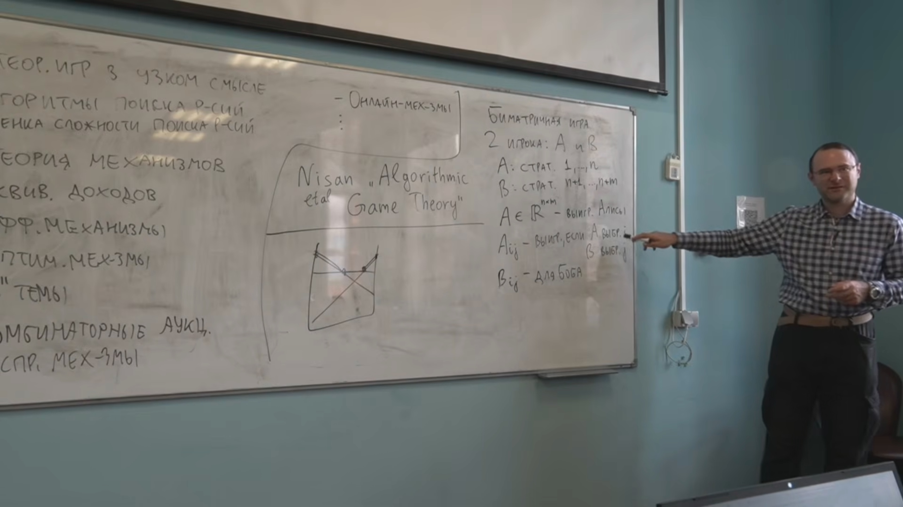

*Кадр [22:00](https://www.youtube.com/watch?v=pCd1z2JnIF4&t=1320s): два набора выигрышей для одной таблицы чистых профилей. [Открыть кадр отдельно](../frames/01_00h22m00s_bimatrix-game.jpg).*

**Определение 2 (смешанная стратегия).** Стратегии игроков — векторы вероятностей [23:30](https://www.youtube.com/watch?v=pCd1z2JnIF4&t=1410s):

$$
\sigma\in\mathbb R^n,\quad\sigma_i\ge0,\quad\sum_i\sigma_i=1;
\qquad
\tau\in\mathbb R^m,\quad\tau_j\ge0,\quad\sum_j\tau_j=1.
$$

**Сокращение конспекта:** множества таких векторов далее обозначены $\Delta_n$ и $\Delta_m$.

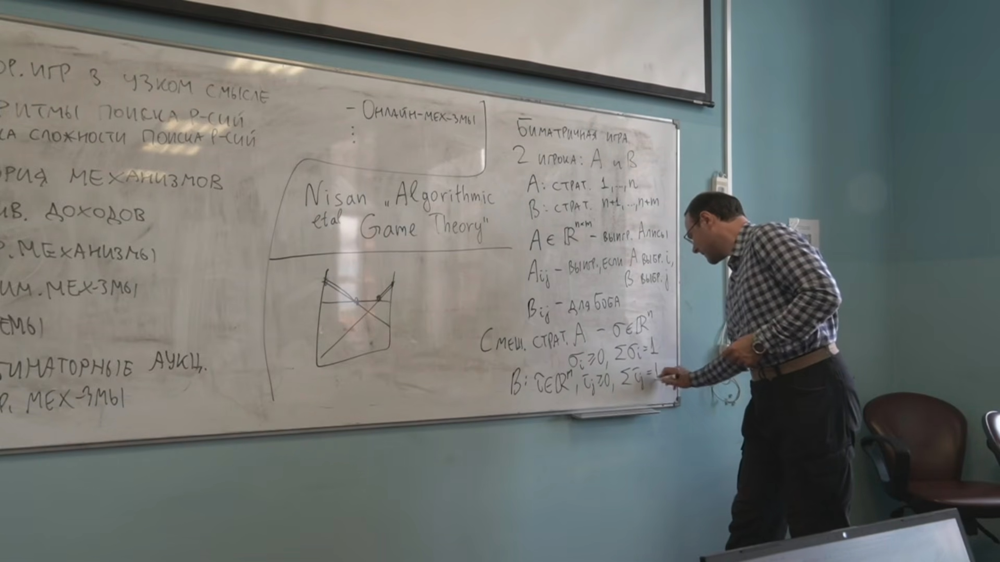

*Кадр [23:30](https://www.youtube.com/watch?v=pCd1z2JnIF4&t=1410s): вероятности чистых действий игроков. [Открыть кадр отдельно](../frames/01_00h23m30s_mixed-strategy.jpg).*

Ожидаемые выигрыши равны

$$
u_A(\sigma,\tau)=\sum_{i,j}\sigma_i A_{ij}\tau_j=\sigma^\top A\tau,
\qquad u_B(\sigma,\tau)=\sigma^\top B\tau.
$$

**Определение 3 (смешанное равновесие Нэша).** Пара $(\sigma^*,\tau^*)$ является равновесием, если при фиксированной стратегии соперника никакое одностороннее отклонение не увеличивает выигрыш [28:35](https://www.youtube.com/watch?v=pCd1z2JnIF4&t=1715s):

$$
(\sigma^*)^\top A\tau^*\ge \sigma^\top A\tau^*\quad(\forall\sigma\in\Delta_n),\qquad
(\sigma^*)^\top B\tau^*\ge(\sigma^*)^\top B\tau\quad(\forall\tau\in\Delta_m).
$$

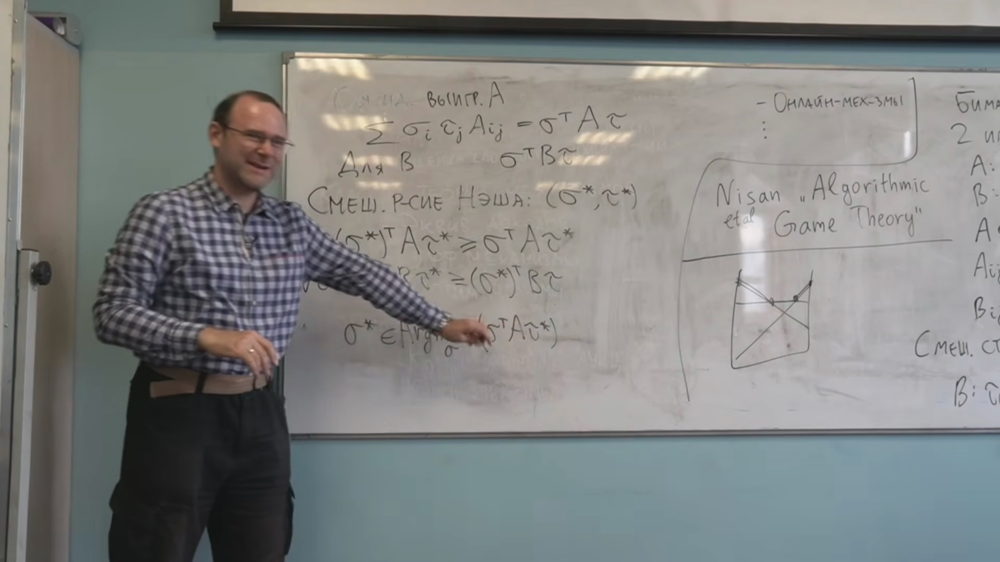

*Кадр [28:35](https://www.youtube.com/watch?v=pCd1z2JnIF4&t=1715s): условие отсутствия выгодного одностороннего отклонения. [Открыть кадр отдельно](../frames/01_00h28m35s_mixed-nash-conditions.jpg).*

## 2. Носители и условия на лучшие ответы [31:35](https://www.youtube.com/watch?v=pCd1z2JnIF4&t=1895s)

**Определение 4 (носитель).** $\operatorname{supp}(\sigma)=\{i:\sigma_i>0\}$, аналогично для $\tau$. [36:49](https://www.youtube.com/watch?v=pCd1z2JnIF4&t=2209s)

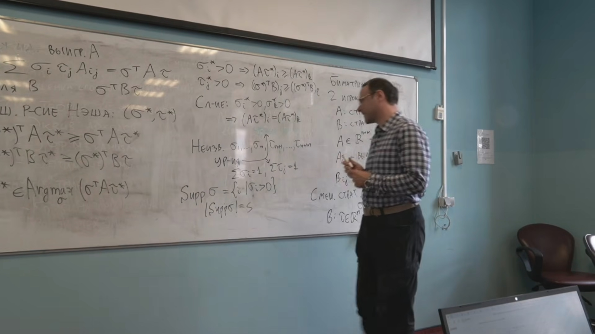

*Кадр [37:20](https://www.youtube.com/watch?v=pCd1z2JnIF4&t=2240s): запись носителя и равенство выигрышей стратегий внутри него. [Открыть кадр отдельно](../frames/01_00h37m20s_support-and-best-responses.jpg).*

**Теорема 1 (условие носителя).** $(\sigma^*,\tau^*)$ — равновесие тогда и только тогда, когда каждая стратегия с положительной вероятностью является чистым лучшим ответом на стратегию соперника:

$$
\sigma_i^*>0\Longrightarrow (A\tau^*)_i=\max_k(A\tau^*)_k,
\qquad
\tau_j^*>0\Longrightarrow ((\sigma^*)^\top B)_j=\max_\ell((\sigma^*)^\top B)_\ell.
$$

**Доказательство.** При фиксированной $\tau^*$ функция $\sigma\mapsto\sigma^\top A\tau^*$ линейна на симплексе. Её максимум равен максимальному значению на чистой стратегии; положительный вес у меньшего значения снизил бы среднее. Обратное: смесь только лучших ответов сама даёт максимум. Для Боба рассуждение такое же. В частности, все стратегии внутри одного носителя дают одинаковый максимальный выигрыш. [27:30–33:45](https://www.youtube.com/watch?v=pCd1z2JnIF4&t=1650s)

**Определение 5 (невырожденность; НЕ БЫЛО НА ЛЕКЦИИ: дополнение из PDF).** Биматричная игра невырождена, если любая смешанная стратегия с носителем размера $k$ имеет **не более $k$** чистых лучших ответов у соперника. Источник: [Nisan et al., определение 3.2, печатная с. 56, PDF с. 77](../../materials/sources/Nisan-et-al-AGT-book.pdf#page=77). Лектор упоминает невырожденный случай [36:43](https://www.youtube.com/watch?v=pCd1z2JnIF4&t=2203s), но не формулирует это определение.

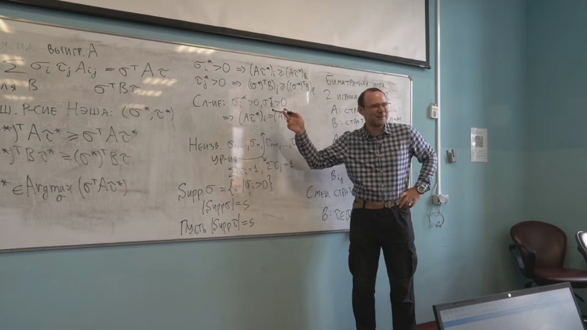

*Кадр [38:40](https://www.youtube.com/watch?v=pCd1z2JnIF4&t=2320s): на доске видно **следствие** невырожденности — равенство размеров носителей в равновесии. Точное определение выше взято из учебника. [Открыть кадр отдельно](../frames/01_00h38m40s_equal-support-sizes.jpg).*

**Равные размеры носителей в рассматриваемом случае.** Лектор пользуется тем, что в невырожденной игре носители двух игроков в равновесии имеют одинаковый размер: $|\operatorname{supp}(\sigma^*)|=|\operatorname{supp}(\tau^*)|$. Формального доказательства этого утверждения на записи нет. [37:54–38:42](https://www.youtube.com/watch?v=pCd1z2JnIF4&t=2274s)

Если носители известны, равенства выигрышей внутри носителей и нормировки дают линейную систему; затем проверяют неотрицательность вероятностей и лучшие ответы вне носителя. Для невырожденной $n\times m$ игры нужно перебрать пары носителей $(I,J)$ одинакового размера; их число $\sum_{k=1}^{\min(n,m)}\binom nk\binom mk$, в общем случае экспоненциально. Вырожденные игры требуют дополнительно разбирать неравные носители и возможную неединственность решения системы. [34:59–42:17](https://www.youtube.com/watch?v=pCd1z2JnIF4&t=2099s)

**Теорема 2 (существование, Нэш).** В любой конечной игре существует хотя бы одно смешанное равновесие. На лекции теорема используется как гарантия завершения перебора носителей; доказательство общей теоремы здесь не приводится. [41:41–42:38](https://www.youtube.com/watch?v=pCd1z2JnIF4&t=2501s)

## 3. Модельная игра $2\times3$ и две картинки [43:50](https://www.youtube.com/watch?v=pCd1z2JnIF4&t=2630s)

Числа из матрицы на доске (пара — выигрыш Алисы, выигрыш Боба):

| Алиса \ Боб | $L$ | $M$ | $R$ |
|---|---:|---:|---:|
| $U$ | $(1,6)$ | $(4,5)$ | $(6,1)$ |
| $D$ | $(3,2)$ | $(7,3)$ | $(4,5)$ |

Пусть Алиса играет $U$ с вероятностью $x$, $D$ — с вероятностью $1-x$.  Выигрыши Боба от его чистых стратегий — три прямые:

$$
v_L(x)=2+4x,\qquad v_M(x)=3+2x,\qquad v_R(x)=5-4x.
$$

Верхняя огибающая даёт лучший ответ Боба: $R$ при $x<1/3$, $M$ при $1/3<x<1/2$, $L$ при $x>1/2$. В точках $1/3$ и $1/2$ соответствующие пары чистых стратегий дают одинаковый максимум. [46:53–50:29](https://www.youtube.com/watch?v=pCd1z2JnIF4&t=2813s)

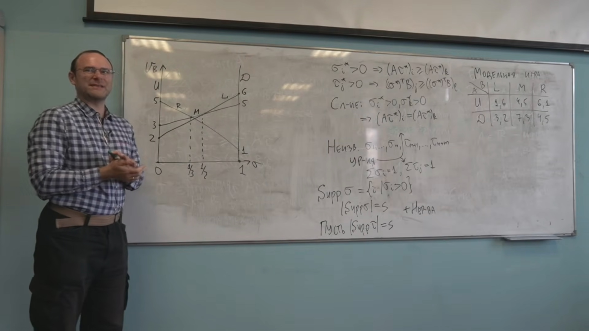

*Кадр [51:40](https://www.youtube.com/watch?v=pCd1z2JnIF4&t=3100s): график выигрышей чистых ответов Боба и матрица модельной игры. [Открыть кадр отдельно](../frames/01_00h51m40s_best-response-graph.jpg).*

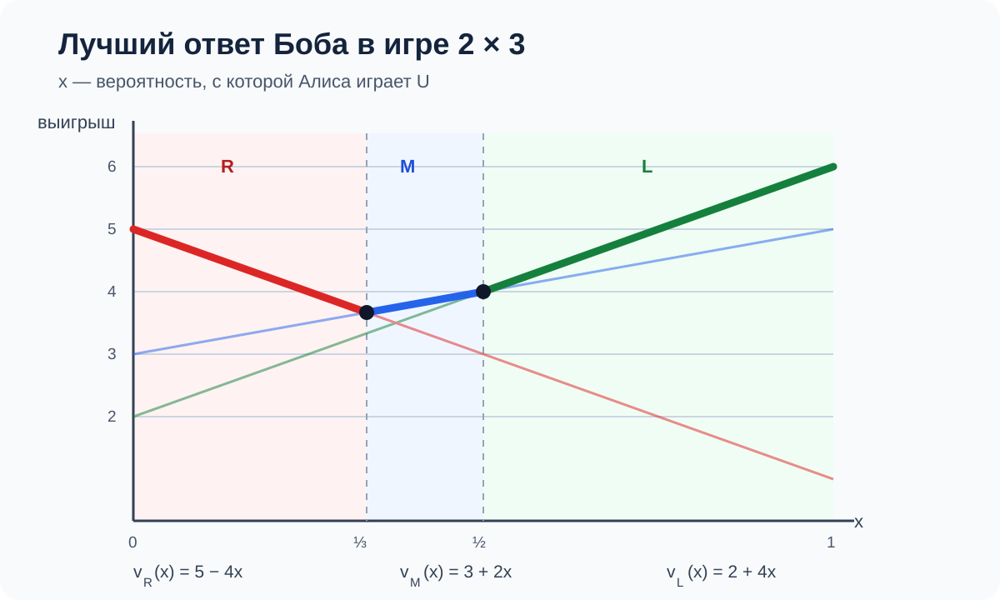

*Пояснительная схема по выписанной матрице: жирные участки показывают максимум трёх прямых и смену лучшего ответа при $x=1/3$ и $x=1/2$. [Открыть схему отдельно](../diagrams/01_best-response-envelope.svg).*

Пусть $\tau=(\ell,q,r)$ на треугольнике $\ell+q+r=1$. Тогда выигрыш Алисы от $U$ и $D$:

$$
a_U(\tau)=\ell+4q+6r,\qquad a_D(\tau)=3\ell+7q+4r.
$$

Над отрезком $x\in[0,1]$ лектор строит **верхний многогранник** $v\ge v_L(x),v_M(x),v_R(x)$. Над треугольником $\tau$ строит аналогичный многогранник $u\ge a_U(\tau),a_D(\tau)$. Плоские участки нижней границы каждого «стакана» отвечают чистым лучшим ответам; боковые грани — нулевым вероятностям чистых стратегий своего игрока. [50:35–58:35](https://www.youtube.com/watch?v=pCd1z2JnIF4&t=3035s)

**Определение 6 (метки и полная размеченность).** Лектор помечает грани именами чистых стратегий: метка на грани означает, что стратегия либо не играется, либо даёт лучший ответ. В рассматриваемом невырожденном случае пара вершин двух построенных фигур полностью размечена, когда каждая метка встретилась **ровно один раз**; такая пара задаёт равновесие. [58:43–1:05:38](https://www.youtube.com/watch?v=pCd1z2JnIF4&t=3523s)

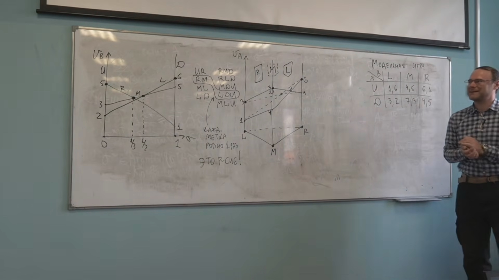

*Кадр [1:01:22](https://www.youtube.com/watch?v=pCd1z2JnIF4&t=3682s): метки лучших ответов и нулевых вероятностей на двух фигурах. [Открыть кадр отдельно](../frames/01_01h01m22s_bimatrix-and-best-responses.jpg).*

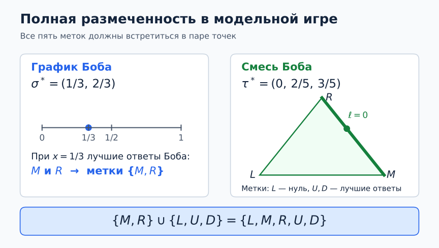

*Схема показывает, как метки двух точек дополняют друг друга до полного набора. [Открыть схему отдельно](../diagrams/01_fully-labeled-pair.svg).*

В примере полностью размеченная пара имеет метки $M,R$ на графике Боба и $L,U,D$ на многограннике Алисы: Боб играет только $M,R$, Алиса — $U,D$. Из равенства $v_M(x)=v_R(x)$ следует $x=1/3$. При $\ell=0$ равенство $a_U=a_D$ даёт $q=2/5,\ r=3/5$. Получаем

$$
\boxed{\sigma^*=(1/3,2/3),\quad\tau^*=(0,2/5,3/5).}
$$

Проверка: у Боба $v_M=v_R=11/3>v_L=10/3$; у Алисы $a_U=a_D=26/5$. На лекции показано, как метки находят **носитель**; численные вероятности здесь довычислены из выписанной на доске матрицы, без добавления нового примера. [1:00:20–1:04:43](https://www.youtube.com/watch?v=pCd1z2JnIF4&t=3620s)

## 4. Алгоритм Лемке — Хоусона [1:08:30](https://www.youtube.com/watch?v=pCd1z2JnIF4&t=4110s)

На лекции путь начинается в особой «бесконечно удалённой» вершине на рисунке верхних многогранников. Она служит технической начальной точкой, а не стратегиями игроков и не настоящим равновесием. [1:09:42–1:12:22](https://www.youtube.com/watch?v=pCd1z2JnIF4&t=4182s)

**Определение 7 ($k$-почти полностью размеченная пара; НЕ БЫЛО НА ЛЕКЦИИ: дополнение из PDF).** Все метки, кроме выбранной $k$, присутствуют хотя бы раз. При невырожденности внутреннее состояние пути имеет одну отсутствующую метку $k$ и одну повторяющуюся метку $\ell$. Лектор описывает именно такие вершины [1:22:25–1:23:29](https://www.youtube.com/watch?v=pCd1z2JnIF4&t=4945s), но не вводит термин; формальное название взято из [Nisan et al., §3.4, печатная с. 62, PDF с. 83](../../materials/sources/Nisan-et-al-AGT-book.pdf#page=83).

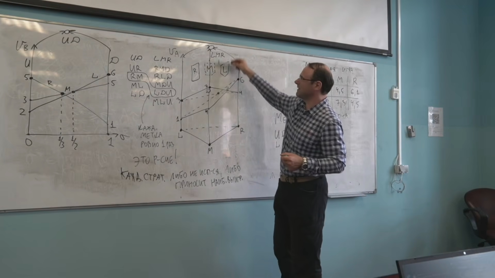

*Кадр [1:14:10](https://www.youtube.com/watch?v=pCd1z2JnIF4&t=4450s): маршрут смены меток при поворотах. [Открыть кадр отдельно](../frames/01_01h14m10s_lemke-howson-label-path.jpg).*

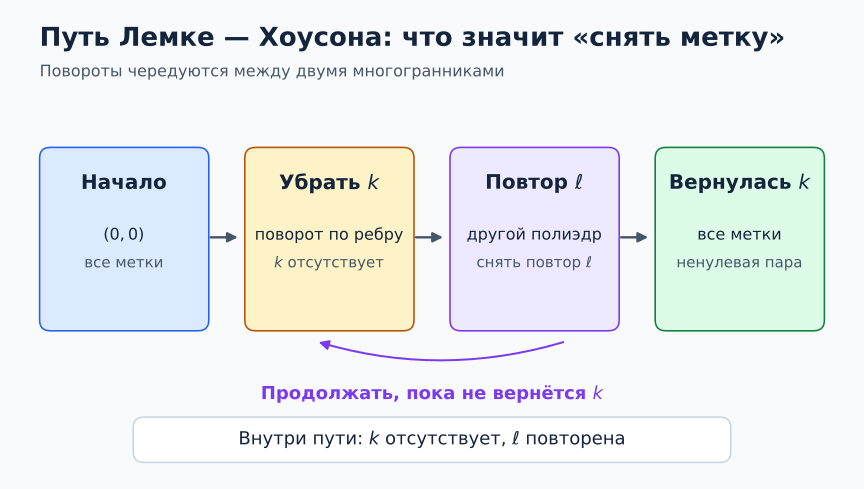

*Схема показывает снятие метки, появление повторной метки и чередование многогранников. [Открыть схему отдельно](../diagrams/01_lemke-pivot.svg).*

Алгоритм: сначала выбрать $k$ и начать в описанной лектором искусственной вершине; затем снять метку $k$, перейдя по допустимому ребру одного многогранника; появившуюся повторную метку снять в **другом** многограннике; чередовать переходы до возвращения $k$. Конец пути — настоящая полностью размеченная пара, то есть равновесие. «Снять метку» означает ослабить одно активное линейное ограничение и идти по ребру до следующего ставшего активным ограничения. [1:12:30–1:19:02](https://www.youtube.com/watch?v=pCd1z2JnIF4&t=4350s)

**Теорема 3 (корректность Лемке — Хоусона).** В рассматриваемом невырожденном случае алгоритм завершится равновесием. **Доказательство по ходу лектора.** В конечном графе пар вершин, у которых есть все метки или все, кроме $k$, полностью размеченные пары имеют степень 1, внутренние пары с повторной меткой — степень 2. Поэтому компоненты графа — пути или циклы. Искусственная вершина есть конец пути; путь из неё не может замкнуться в цикл и должен иметь другой конец. Второй конец соответствует настоящему равновесию. [1:21:20–1:32:50](https://www.youtube.com/watch?v=pCd1z2JnIF4&t=4880s)

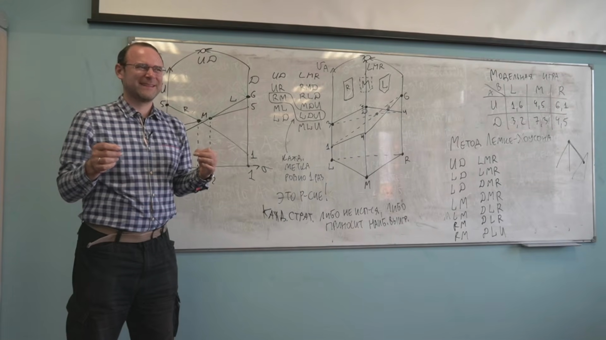

*Кадр [1:25:00](https://www.youtube.com/watch?v=pCd1z2JnIF4&t=5100s): таблица переходов вдоль пути Лемке — Хоусона. [Открыть кадр отдельно](../frames/01_01h25m00s_lemke-howson-pivots-and-parity.jpg).*

*Схема показывает степени вершин и связь концов путей с нечётностью числа равновесий. [Открыть схему отдельно](../diagrams/01_path-parity.svg).*

**Теорема 4 (нечётность).** В невырожденной биматричной игре число равновесий Нэша нечётно. **Доказательство по ходу лектора.** Концы всех путей образуют чётное множество; один конец — искусственная вершина, остальные — реальные равновесия. [1:32:28–1:33:23](https://www.youtube.com/watch?v=pCd1z2JnIF4&t=5548s)

## 5. Сложность [1:06:50](https://www.youtube.com/watch?v=pCd1z2JnIF4&t=4010s), [1:19:05](https://www.youtube.com/watch?v=pCd1z2JnIF4&t=4745s)

Перебор носителей и вершин в худшем случае экспоненциален; путь Лемке — Хоусона тоже может быть экспоненциально длинным. Лектор отмечает, что при рациональных данных ответ можно записать достаточно коротко, но быстрого метода его поиска неизвестно. Если такой метод появится, он ускорит и другие задачи поиска, связанные с этой по сложности. Лектор не называет класс этих задач и не разбирает обработку вырожденности полностью. [1:07:41–1:08:16](https://www.youtube.com/watch?v=pCd1z2JnIF4&t=4061s), [1:19:05–1:20:20](https://www.youtube.com/watch?v=pCd1z2JnIF4&t=4745s)

## Развёрнутые пояснения и ход лекции

### Вступление и место темы в курсе [0:00–17:20](https://www.youtube.com/watch?v=pCd1z2JnIF4)

Лектор называет курс алгоритмической теорией игр. Он выделяет три блока: $1$ алгоритмы поиска равновесий, их верхние и нижние оценки сложности, а также транспортные равновесия; $2$ дизайн механизмов, включая эффективность, эквивалентность доходов и оптимальные механизмы; $3$ темы по оставшемуся времени — комбинаторные аукционы, распределённые и онлайн-механизмы, возможно репутация и аукционы со связанными оценками. Это обзор **будущих** тем, не утверждение, что их доказательства уже содержатся в первой лекции. Пример лектора для комбинаторных аукционов — покупка коллекции картин: в зависимости от цели покупателя полезность набора может быть меньше либо больше суммы отдельных полезностей. В аукционе связанных оценок он приводит право разработки месторождения, где оценки разных компаний сообщают информацию об общей ценности. [8:20–14:30](https://www.youtube.com/watch?v=pCd1z2JnIF4&t=500s)

Лектор указывает учебник под редакцией Nisan et al. как литературу к курсу. В этом конспекте источником хода лекции остаются запись и доска; не данные лектором определения сохранены отдельно с явной пометкой и страницей PDF. [14:50–16:10](https://www.youtube.com/watch?v=pCd1z2JnIF4&t=890s)

### Почему условие носителя превращает задачу в перебор [26:20–43:50](https://www.youtube.com/watch?v=pCd1z2JnIF4&t=1580s)

Вектор $A\tau$ содержит выигрыши каждой чистой стратегии Алисы против смеси Боба. Её задача $\max_{\sigma\in\Delta_n}\sigma^\top A\tau$ — линейная оптимизация на симплексе. Если компонента $i$ меньше максимальной, то положительный вес на $i$ нельзя сохранить в оптимальном $\sigma$: перенос сколь угодно малого веса на компоненту с максимумом строго увеличит выигрыш. Значит, носитель оптимальной смеси расположен в грани симплекса, натянутой на все вершины с максимальным выигрышем. Так же устроен ответ Боба.

**Математическая запись шага лектора** (полная система в таком виде на доске не выписана): для гипотетических носителей $I\subseteq\{1,\ldots,n\}$ и $J\subseteq\{1,\ldots,m\}$ введём неизвестные $\sigma_i\ (i\in I),\tau_j\ (j\in J)$ и уровни выигрышей $u,v$.

$$
\begin{aligned}
&\sigma_i=0\ (i\notin I),\quad \tau_j=0\ (j\notin J),\quad
\sum_{i\in I}\sigma_i=\sum_{j\in J}\tau_j=1,\\
&(A\tau)_i=u\ (i\in I),\qquad (A\tau)_i\le u\ (i\notin I),\\
&(\sigma^\top B)_j=v\ (j\in J),\qquad (\sigma^\top B)_j\le v\ (j\notin J),\\
&\sigma_i>0\ (i\in I),\qquad \tau_j>0\ (j\in J).
\end{aligned}
$$

Если система совместна, это равновесие. При заданных равномощных носителях невырожденной игры равенства дают кандидата; проверка неравенств отсеивает неверные пары. Лектор отдельно замечает, что в вырожденном случае равные размеры носителей нельзя навязывать. [34:59–42:17](https://www.youtube.com/watch?v=pCd1z2JnIF4&t=2099s)

### Подробная геометрия модельной игры [44:00–1:06:50](https://www.youtube.com/watch?v=pCd1z2JnIF4&t=2640s)

Первая картинка — график трёх прямых выплат Боба $2+4x,3+2x,5-4x$. Их попарные пересечения сами по себе ещё не все важны: нужен именно максимум трёх функций. Так, пересечение линий $L$ и $R$ **ниже верхней огибающей**, поэтому смесь Боба, поддерживаемая только $L,R$, не может возникнуть из этой точки как лучший ответ. Граничные точки огибающей $x=1/3$ и $x=1/2$ дают пары $R,M$ и $M,L$. Это объясняет, почему геометрия отсеивает часть перебора носителей, хотя в больших размерностях число вершин остаётся экспоненциальным. [1:06:50–1:08:25](https://www.youtube.com/watch?v=pCd1z2JnIF4&t=4010s)

Вторая картинка — треугольник вероятностей Боба $\tau=(\ell,q,r)$ с $\ell+q+r=1$. Две аффинные поверхности $a_U=\ell+4q+6r$ и $a_D=3\ell+7q+4r$ задают нижнюю границу верхнего многогранника $u\ge\max\{a_U,a_D\}$. Его вертикальные боковые грани соответствуют $\ell=0,q=0,r=0$, а наклонные — равенствам $u=a_U$ либо $u=a_D$. Поэтому у грани $\ell=0$ метка **$L$**, хотя $L$ там как раз *не* играется; у грани $u=a_U$ метка **$U$**, потому что $U$ — лучший ответ. В первом многограннике смысл типов граней зеркален: $x=0$ получает метку $U$ как нулевая вероятность $U$, а грань $v=v_R$ — метку $R$ как лучший ответ Боба.

В точке $x=1/3$ левый многогранник имеет метки $R,M$. На правом многограннике ищем точку с метками $L,U,D$. Метка $L$ требует $\ell=0$, а $U,D$ требуют $4q+6r=7q+4r$. С учётом $q+r=1$: $2r=3q$, откуда $q=2/5,r=3/5$. Для Боба: $v_M(1/3)=v_R(1/3)=11/3$, тогда как $v_L(1/3)=10/3$. Это явная проверка **всех** пяти меток, а не только равенств внутри носителя.

### Маршрут поворотов в примере [1:12:30–1:19:02](https://www.youtube.com/watch?v=pCd1z2JnIF4&t=4350s)

Лектор выбирает отсутствующей метку $U$. Если записывать пару как «метки вершины первого многогранника | метки вершины второго», ход по доске имеет вид

$$
(UD\mid LMR)\to(LD\mid LMR)\to(LD\mid DMR)\to(LM\mid DMR)
\to(LM\mid DLR)\to(RM\mid DLR)\to(RM\mid LDU).
$$

Первое состояние — искусственное, последнее — найденное равновесие. После первого перехода $U$ исчезает, а $L$ дублируется. Далее каждый переход снимает дубликат **в другом** многограннике; на последнем переходе вновь появляется $U$, поэтому все пять меток оказываются представленными. В устной речи порядок букв иногда меняется и автоматическая расшифровка искажает сочетания; здесь наборы приведены по соответствующим вершинам доски и проверены по формулам игры. Числа вероятностей получаются только после нормировки найденной пары, как вычислено выше.

### Что именно доказывает путь [1:21:20–1:33:23](https://www.youtube.com/watch?v=pCd1z2JnIF4&t=4880s)

Полный граф пар вершин двух многогранников огромен. Для фиксированной пропущенной метки $k$ оставляют лишь пары, где все метки, кроме возможно $k$, присутствуют. В невырожденном случае у каждой пары суммарно ровно $n+m$ меток **с учётом кратности**. Если метки представлены все, поворот, остающийся в выбранном подграфе, только один: снять $k$. Если $k$ отсутствует, одна другая метка повторяется; её можно снять в первом либо втором многограннике, поэтому степень вершины равна двум. Конечный граф с такими степенями есть объединение цепочек и циклов. Искусственное равновесие — конец цепочки и не может лежать на цикле. Тем самым доказаны завершение и нечётность числа настоящих равновесий при невырожденности.

Лектор прямо отмечает, что доказательство для вырожденных игр на занятии не дано. Переносить приведённый аргумент без разбора вырожденности нельзя. [1:32:28–1:33:23](https://www.youtube.com/watch?v=pCd1z2JnIF4&t=5548s)
