# Лекция 2. Коррелированное равновесие и сожаление

**Видео — основной источник:** [Лекторий ФПМИ, 11.09.2026](https://www.youtube.com/watch?v=FYTnmca0OOc). [Автоматические субтитры](../subtitles/02_correlated-equilibrium.md) служат указателем к записи; формулы сверены с кадрами доски. Дополнения из [Nisan et al., *Algorithmic Game Theory*](../../materials/sources/Nisan-et-al-AGT-book.pdf) явно отмечены ниже и отделены от материала лектора.

Нумерация определений и теорем продолжает [лекцию 1](01_lemke-howson.md). Ключевой порядок лекции: пример → определение → выпуклость/линейное программирование → динамическое получение равновесия через сожаление.

## 1. Chicken Game: почему нужен общий сигнал [1:20](https://www.youtube.com/watch?v=FYTnmca0OOc&t=80s)

Это **пример лектора**: два автомобиля едут навстречу по одной полосе; он также рассказывает версии про встречных лыжников и узкий мост. У каждого есть $S=\mathrm{Stop}$ и $G=\mathrm{Go}$. Выигрыши:

| Алиса \ Боб | $S$ | $G$ |
|---|---:|---:|
| $S$ | $(4,4)$ | $(1,5)$ |
| $G$ | $(5,1)$ | $(0,0)$ |

Профиль $(S,S)$ максимизирует суммарный выигрыш $8$, но каждый при уверенности, что другой остановится, предпочёл бы $G$: $5>4$. Чистые равновесия — $(S,G)$ и $(G,S)$, каждое с суммой выигрышей $6$. Единственное независимое смешанное равновесие: оба играют $S,G$ с вероятностями $1/2,1/2$. Проверка для Алисы при $P(B=S)=1/2$: выигрыш от $S$ равен $(4+1)/2=5/2$, от $G$ — $(5+0)/2=5/2$. Суммарный ожидаемый выигрыш $\tfrac14\cdot8+\tfrac14\cdot6+\tfrac14\cdot6=5$. [3:03–7:20](https://www.youtube.com/watch?v=FYTnmca0OOc&t=183s)

«Реверсивный светофор» лектор сначала моделирует как общую случайную рекомендацию: с вероятностями $1/2$ выбираются $(S,G)$ и $(G,S)$. Это даёт сумму $6$. Затем добавляет рекомендацию $(S,S)$. Оптимальный для этой игры сигнал выбирает **каждый из трёх профилей** $(S,S),(S,G),(G,S)$ с вероятностью $1/3$. Он даёт каждому игроку $10/3$, вместе $20/3>6$. Важно: каждому сообщается **только собственная** предписанная стратегия, а не весь выбранный профиль. [10:01–16:30](https://www.youtube.com/watch?v=FYTnmca0OOc&t=601s)

## 2. Определение и условия послушания [15:40](https://www.youtube.com/watch?v=FYTnmca0OOc&t=940s)

**Определение 8 (коррелированная стратегия).** Для конечной игры с множествами чистых стратегий $S_i$ это совместное распределение $\mu\in\Delta(\prod_i S_i)$ на **профилях** стратегий. Его компоненты игроков могут быть зависимыми; обычные независимые смешанные стратегии дают частный случай $\mu(s)=\prod_i\sigma_i(s_i)$. [17:42](https://www.youtube.com/watch?v=FYTnmca0OOc&t=1062s)

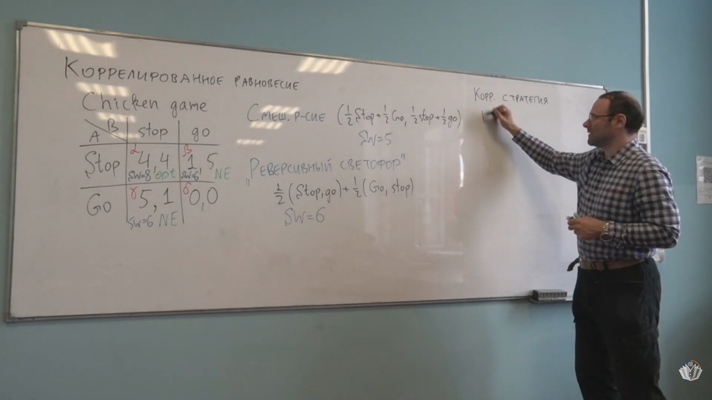

*Кадр [17:40](https://www.youtube.com/watch?v=FYTnmca0OOc&t=1060s): рядом с матрицей Chicken Game лектор переходит от независимых смесей к совместному распределению. [Открыть кадр отдельно](../frames/02_00h17m40s_chicken-correlated-strategy.jpg).*

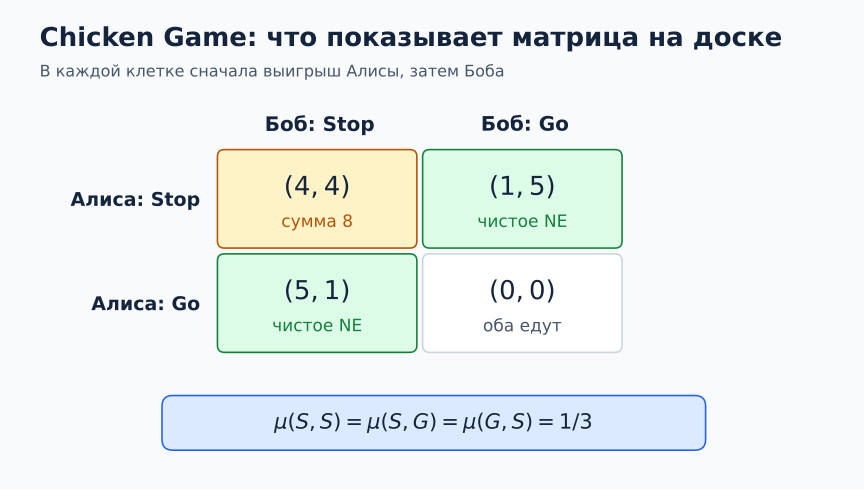

*Пояснение матрицы выигрышей и сигнала $\mu(S,S)=\mu(S,G)=\mu(G,S)=1/3$. [Открыть схему отдельно](../diagrams/02_chicken-payoff-matrix.svg).*

**Определение 9 (коррелированное равновесие, CE).** Посредник выбирает профиль $s\sim\mu$ и приватно рекомендует игроку $i$ действие $s_i$. Если все остальные следуют своим рекомендациям, игроку $i$ невыгодно заменить полученную рекомендацию $a_i$ на любое $a_i'$. Для конечной игры это означает для всех $i,a_i,a_i'$ [18:11–28:02](https://www.youtube.com/watch?v=FYTnmca0OOc&t=1091s):

$$
\boxed{\sum_{s_{-i}}\mu(a_i,s_{-i})
\bigl[u_i(a_i,s_{-i})-u_i(a_i',s_{-i})\bigr]\ge0.}\tag{CE}
$$

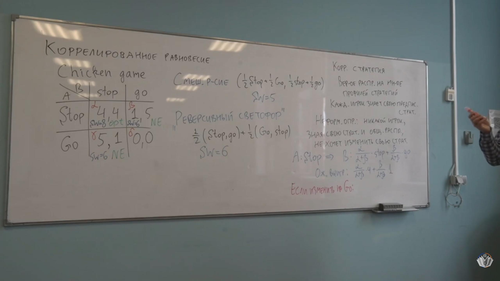

*Кадр [21:21](https://www.youtube.com/watch?v=FYTnmca0OOc&t=1281s): приватная рекомендация и её проверка на выгодность отклонения в примере. [Открыть кадр отдельно](../frames/02_00h21m21s_chicken-and-ce-definition.jpg).*

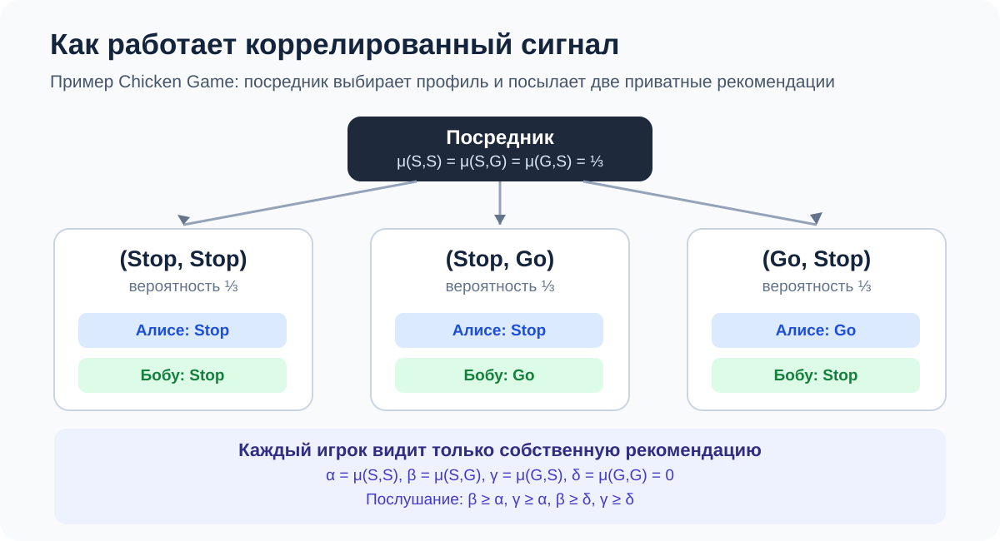

*Пояснительная схема для оптимального сигнала: три профиля с вероятностью $1/3$ каждый, а игрок получает только своё действие. [Открыть схему отдельно](../diagrams/02_correlated-signal.svg).*

Это линейная, **безусловная** запись. Если $\Pr_\mu[s_i=a_i]>0$, её можно поделить на эту вероятность и получить условное сравнение ожидаемых выигрышей. При нулевой вероятности рекомендации левая часть равна нулю, и условие автоматически выполнено; делить на ноль нельзя. [18:11–28:02](https://www.youtube.com/watch?v=FYTnmca0OOc&t=1091s); учебник, печатная с. 46.

Для Chicken Game положим $\alpha=\mu(S,S),\ \beta=\mu(S,G),\ \gamma=\mu(G,S),\ \delta=\mu(G,G)$. Тогда четыре условия $CE$:

$$
\begin{array}{ll}
\text{Алисе рекомендовано }S: & 4\alpha+\beta\ge5\alpha\iff\beta\ge\alpha,\\
\text{Алисе рекомендовано }G: & 5\gamma\ge4\gamma+\delta\iff\gamma\ge\delta,\\
\text{Бобу рекомендовано }S: & 4\alpha+\gamma\ge5\alpha\iff\gamma\ge\alpha,\\
\text{Бобу рекомендовано }G: & 5\beta\ge4\beta+\delta\iff\beta\ge\delta.
\end{array}
$$

Плюс $\alpha,\beta,\gamma,\delta\ge0$ и их сумма равна $1$. Например, если Алисе сказано $S$, Боб играет $S$ с условной вероятностью $\alpha/(\alpha+\beta)$, $G$ — с $\beta/(\alpha+\beta)$. Послушание даёт $(4\alpha+\beta)/(\alpha+\beta)\ge5\alpha/(\alpha+\beta)$, то есть $\beta\ge\alpha$. [19:59–24:59](https://www.youtube.com/watch?v=FYTnmca0OOc&t=1199s)

**Уточнение расшифровки:** около [24:45](https://www.youtube.com/watch?v=FYTnmca0OOc&t=1485s) автоматические субтитры передают одно из условий Боба как $\alpha\ge\gamma$. Из матрицы выигрышей и проверенной формулы учебника (печатная с. 47) следует $\gamma\ge\alpha$; именно оно используется здесь.

**Теорема 6 (Нэш как частный случай CE; НЕ БЫЛО НА ЛЕКЦИИ как общая теорема: дополнение из PDF).** Если $\sigma=(\sigma_i)_i$ — смешанное равновесие Нэша, то $\mu(s)=\prod_i\sigma_i(s_i)$ — коррелированное равновесие. **Доказательство:** при независимости рекомендация $a_i$ не меняет распределение $s_{-i}$; для $\sigma_i(a_i)>0$ действие $a_i$ уже лучший ответ на смеси соперников по условию носителя (теорема 2 для двух игроков). При нулевой вероятности условие $CE$ равно $0\ge0$. Источник: [Nisan et al., §2.7, печатная с. 46, PDF с. 67](../../materials/sources/Nisan-et-al-AGT-book.pdf#page=67). Лектор показывает конкретные равновесия Chicken Game [30:37–31:12](https://www.youtube.com/watch?v=FYTnmca0OOc&t=1837s), но эту общую теорему не формулирует.

Для оптимального светофора $\alpha=\beta=\gamma=1/3,\delta=0$: все четыре условия выполнены, причём рекомендации остановиться даются на границе безразличия. Сумма выигрышей максимизируется как $8\alpha+6\beta+6\gamma$. Из $\beta,\gamma\ge\alpha$ и нормировки следует $\alpha\le1/3$, а $\delta$ даёт нулевую пользу; максимум $20/3$ достигается при указанном распределении. Лектор также указывает «худшее» симметричное CE $\alpha=0,\beta=\gamma=\delta=1/3$, где каждый получает $2$. [30:37–33:16](https://www.youtube.com/watch?v=FYTnmca0OOc&t=1837s)

## 3. Выпуклость и поиск [28:15](https://www.youtube.com/watch?v=FYTnmca0OOc&t=1695s)

**Теорема 7 (выпуклость).** Множество CE — выпуклый многогранник внутри симплекса распределений на профилях. **Доказательство:** условия $CE$ и нормировка линейны по $\mu$, неотрицательность задаёт полупространства. Если $\mu_1,\mu_2$ удовлетворяют всем условиям, то $\lambda\mu_1+(1-\lambda)\mu_2$ при $0\le\lambda\le1$ тоже удовлетворяет каждому. Интуиция лектора: посредник может сначала тайно выбрать один из двух «светофоров», рекомендации которых по отдельности исполняются. [28:15–38:28](https://www.youtube.com/watch?v=FYTnmca0OOc&t=1695s)

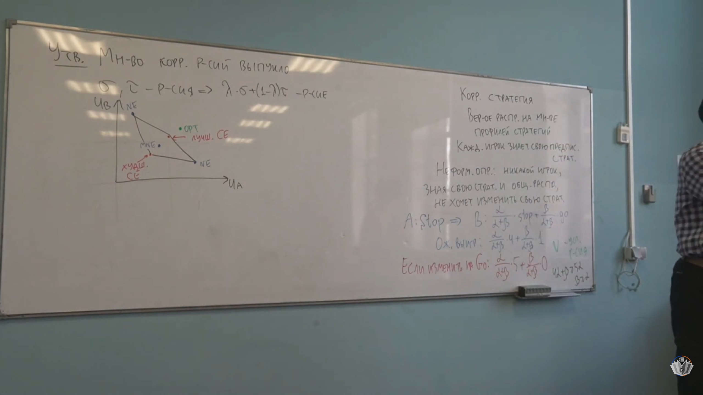

*Кадр [34:10](https://www.youtube.com/watch?v=FYTnmca0OOc&t=2050s): геометрический образ множества CE и положение равновесий Нэша. [Открыть кадр отдельно](../frames/02_00h34m10s_ce-payoff-polytope.jpg).*

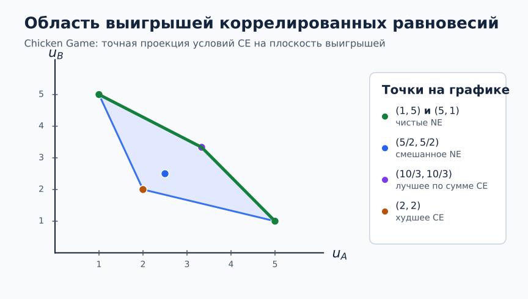

*Точная область выигрышей CE для матрицы Chicken Game: равновесия Нэша и CE с наибольшей и наименьшей суммой выигрышей. [Открыть схему отдельно](../diagrams/02_ce-payoff-region.svg).*

**Теорема 8 (алгоритмический поиск CE для явно заданной игры с рациональными выплатами).** Система $CE$, $\mu\ge0$, $\sum_s\mu(s)=1$ — линейная программа. Поэтому CE и максимум любой линейной функции $\mu$, например суммы ожидаемых выигрышей, находятся полиномиальным алгоритмом линейного программирования относительно **явного размера записи игры**. Существование допустимой точки следует из теоремы 1 и теоремы 6. Это не утверждение о полиномиальности для компактно записанных игр с экспоненциально многими профилями. Лектор отдельно уточняет, что симплекс-метод в худшем случае не даёт такого теоретического ограничения; полиномиальные методы LP существуют. [38:30–41:07](https://www.youtube.com/watch?v=FYTnmca0OOc&t=2310s); учебник, печатные с. 47–48.

## 4. Повторяющийся выбор: модель полной информации [41:00](https://www.youtube.com/watch?v=FYTnmca0OOc&t=2460s)

**Определение 10 (онлайн-модель полной информации).** В период $t=1,\ldots,T$ агент, зная историю, выбирает распределение $\sigma^t=(\sigma_1^t,\ldots,\sigma_N^t)\in\Delta_N$. Среда видит **распределение**, затем назначает вектор потерь $\ell^t=(\ell_1^t,\ldots,\ell_N^t)$, на лекции сначала $\ell_i^t\in\{0,1\}$. После этого реализуется выбор действия $I_t\sim\sigma^t$, агент несёт $\ell_{I_t}^t$ и узнаёт **весь** $\ell^t$. Здесь $I_t$ — наше обозначение реализованного действия, отделяющее его от записанного лектором распределения $\sigma^t$. Реальная накопленная потеря $L^T=\sum_{t=1}^T\ell_{I_t}^t$; потеря фиксированной стратегии $i$ на том же ряду векторов $L_i^T=\sum_t\ell_i^t$. Пример лектора: маршрут на работу с доступной статистикой времени по всем маршрутам. [49:04–53:34](https://www.youtube.com/watch?v=FYTnmca0OOc&t=2944s)

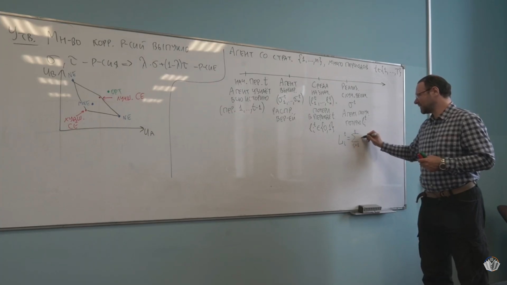

*Кадр [52:00](https://www.youtube.com/watch?v=FYTnmca0OOc&t=3120s): история, выбор распределения, назначение потерь и обратная связь. [Открыть кадр отдельно](../frames/02_00h52m00s_online-timeline.jpg).*

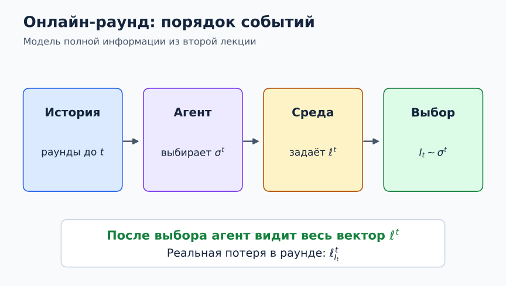

*Последовательность действий и раскрытие всего вектора потерь в модели полной информации. [Открыть схему отдельно](../diagrams/02_online-round.svg).*

**Определение 11 (внешнее сожаление, external regret).**

$$
R_{\mathrm{ext}}^T=L^T-\min_i L_i^T.
$$

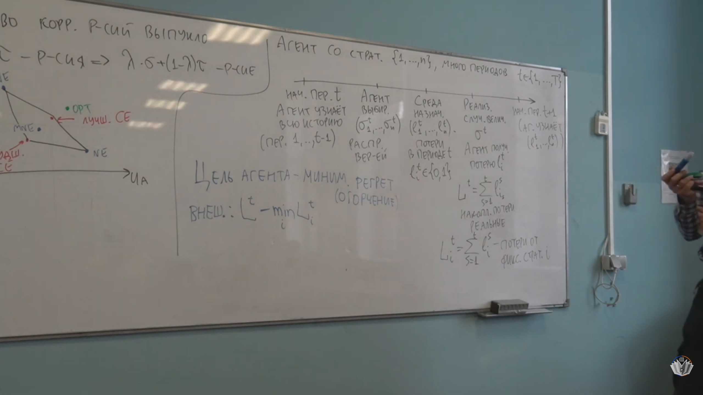

*Кадр [56:10](https://www.youtube.com/watch?v=FYTnmca0OOc&t=3370s): сравнение с одним лучшим фиксированным действием. [Открыть кадр отдельно](../frames/02_00h56m10s_external-regret.jpg).*

Сравнение делается с лучшим **одним и тем же** действием за все периоды на фактически назначенных векторах потерь. Среда могла бы вести себя иначе при иной истории действий — такое контрфактическое изменение в этой модели не рассматривается. Для отдельной реализации $R_{\mathrm{ext}}^T$ может быть отрицательным. [54:07–57:20](https://www.youtube.com/watch?v=FYTnmca0OOc&t=3247s)

**Определение 12 (внутреннее сожаление).** Для пары действий $i,j$ сравнивают фактическую игру с правилом «все случаи выбора $i$ заменить на $j$, остальные действия оставить»:

$$
R_{\mathrm{int}}^T
=L^T-\min_{i,j}\sum_{t=1}^T
\begin{cases}
\ell_j^t,& I_t=i,\\
\ell_{I_t}^t,& I_t\ne i
\end{cases}
=\max_{i,j}\sum_{t:I_t=i}(\ell_i^t-\ell_j^t).
$$

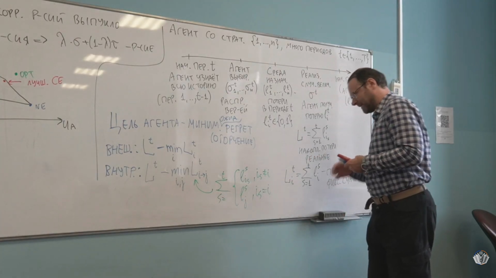

*Кадр [1:01:00](https://www.youtube.com/watch?v=FYTnmca0OOc&t=3660s): замена только одного исходного действия $i$ на $j$. [Открыть кадр отдельно](../frames/02_01h01m00s_internal-regret.jpg).*

В сумме участвуют только периоды, когда реально было выбрано $i$. Минимум по паре $(i,j)$ берут **после** реализации всей последовательности. [57:22–1:01:56](https://www.youtube.com/watch?v=FYTnmca0OOc&t=3442s)

**Определение 13 (сожаление по заменам, swap regret).** Разрешены все функции $f:\{1,\ldots,N\}\to\{1,\ldots,N\}$, не обязательно перестановки:

$$
R_{\mathrm{swap}}^T
=L^T-\min_f L_f^T,\qquad
L_f^T=\sum_{t=1}^T\ell_{f(I_t)}^t,
\qquad
R_{\mathrm{swap}}^T
=\sum_i\max_j\sum_{t:I_t=i}(\ell_i^t-\ell_j^t).
$$

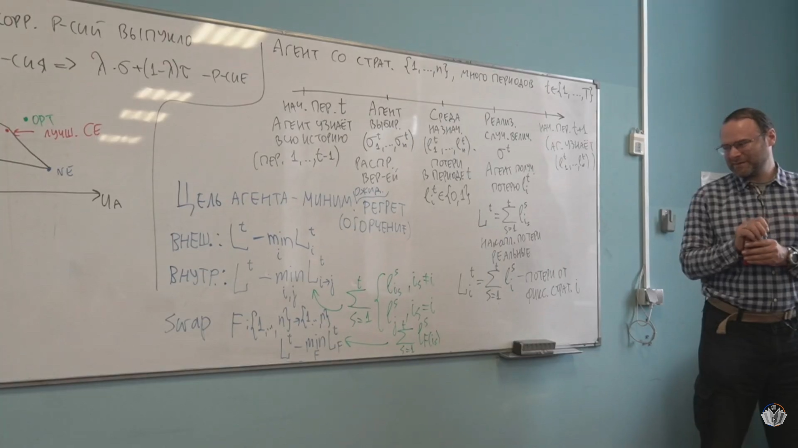

*Кадр [1:03:20](https://www.youtube.com/watch?v=FYTnmca0OOc&t=3800s): отображение $f$ может заменить каждое действие отдельно. [Открыть кадр отдельно](../frames/02_01h03m20s_swap-regret.jpg).*

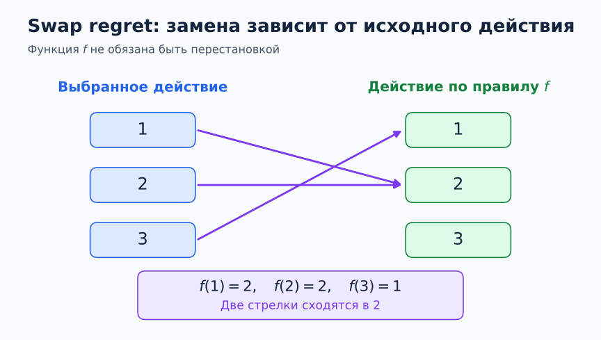

*Пример функции замены: два исходных действия могут переходить в одно. [Открыть схему отдельно](../diagrams/02_swap-map.svg).*

Здесь возможна одновременно отдельная замена для каждого первоначального действия. Класс функций включает постоянные $f(i)=j$ и замены одной пары, поэтому для **каждой реализации** $R_{\mathrm{swap}}^T\ge R_{\mathrm{ext}}^T$ и $R_{\mathrm{swap}}^T\ge R_{\mathrm{int}}^T$. Если нужна оценка работы случайного алгоритма, затем берут $\mathbb E[R_{\mathrm{swap}}^T]$; минимум по $f$ остаётся внутри математического ожидания. [1:01:56–1:03:55](https://www.youtube.com/watch?v=FYTnmca0OOc&t=3716s)

**Определение 14 ($\varepsilon$-CE; НЕ БЫЛО НА ЛЕКЦИИ: дополнение из PDF).** Источник: [Nisan et al., определение 4.11, печатная с. 91, PDF с. 112](../../materials/sources/Nisan-et-al-AGT-book.pdf#page=112). Распределение $\mu$ является $\varepsilon$-коррелированным равновесием, если для любого игрока $i$ и любой функции замены $f_i$

$$
\mathbb E_{s\sim\mu}\bigl[u_i(f_i(s_i),s_{-i})-u_i(s)\bigr]\le\varepsilon.
$$

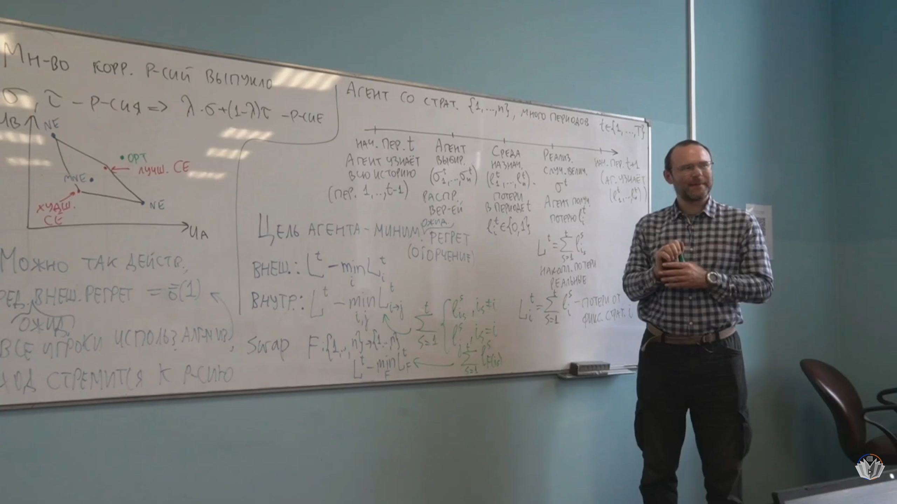

*Кадр [1:11:40](https://www.youtube.com/watch?v=FYTnmca0OOc&t=4300s): на доске лектор связывает малое сожаление по заменам с приближением к CE. Формула $\varepsilon$-CE выше приведена по учебнику; в кадре она не записана буквально. [Открыть кадр отдельно](../frames/02_01h11m40s_regret-to-ce.jpg).*

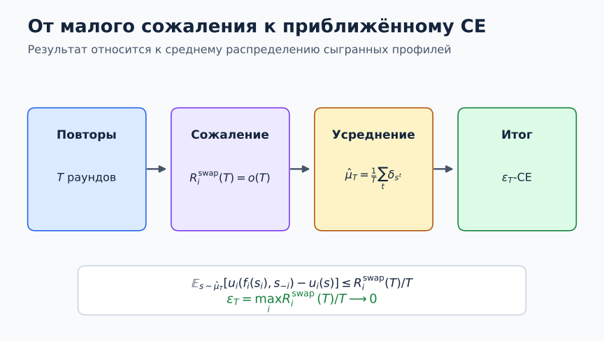

*Эмпирическое распределение сыгранных профилей и граница выгоды от любой замены действий. [Открыть схему отдельно](../diagrams/02_regret-to-ce.svg).*

При $\varepsilon=0$ это обычное CE. Лектор говорит о приближении к CE, но этого определения не записывает.

**Теорема 9 (сублинейное ожидаемое сожаление достижимо — анонс).** Для модели полной информации лектор утверждает, что можно добиться $\mathbb E[R_{\mathrm{ext}}^T]/T\to0$; скорость порядка $\sqrt T$ он упоминает без точной формулы. Способ выбора распределений будет обсуждаться в [лекции 3](03_multi-armed-bandit.md). Здесь математическое ожидание берётся от **всего** случайного сожаления, включая минимум по постоянным действиям. [1:04:02–1:05:58](https://www.youtube.com/watch?v=FYTnmca0OOc&t=3842s)

**Теорема 10 (сожаление по заменам ведёт к CE — анонс).** Лектор утверждает, что при малом сожалении по заменам **средний результат** повторяемой игры приближается к коррелированному равновесию; для произвольной игры нужен именно swap regret [1:06:07–1:13:27](https://www.youtube.com/watch?v=FYTnmca0OOc&t=3967s). Точное математическое пояснение этого анонса: для реализованных профилей $s^1,\ldots,s^T$ возьмём эмпирическое распределение $\widehat\mu_T=T^{-1}\sum_t\delta_{s^t}$. Для фиксированных $i,f_i$

$$
\mathbb E_{s\sim\widehat\mu_T}[u_i(f_i(s_i),s_{-i})-u_i(s)]
=\frac1T\sum_t[u_i(f_i(s_i^t),s_{-i}^t)-u_i(s^t)]
\le\frac{R_{\mathrm{swap},i}^T}{T}.
$$

Это неравенство верно **для каждой реализации**. При $R_{\mathrm{swap},i}^T=o(T)$ для всех игроков эмпирическое распределение приближается к множеству CE; при оценке только $\mathbb E[R_{\mathrm{swap},i}^T]$ следует оценка ожидаемого нарушения условий, но не гарантия для каждой траектории. Сами стратегии каждого периода могут колебаться; лектор подчёркивает именно усреднение. Для игр с нулевой/постоянной суммой уже внешнее сожаление даёт приближение к минимаксному равновесию; для произвольной игры требуется контроль замен (лектор исправляет это около [1:06:55–1:07:53](https://www.youtube.com/watch?v=FYTnmca0OOc&t=4015s)).

## Развёрнутые пояснения и ход лекции

### Почему общий сигнал меняет результат [0:00–18:11](https://www.youtube.com/watch?v=FYTnmca0OOc)

В игре автомобилистов совместный профиль $S,S$ даёт наибольшую сумму выплат, но не устойчив: если другой остановился, односторонний проезд увеличивает собственную выплату с 4 до 5. Два чистых равновесия, напротив, устойчивы, но заранее отдают приоритет конкретному игроку. При независимой рандомизации с вероятностями 1/2 происходит и совместная остановка, и столкновение, из-за чего сумма ожидаемых выигрышей падает до 5.

Реверсивный светофор из рассказа лектора даёт *общую* случайность, поэтому рекомендации могут быть зависимыми. Простое чередование $S,G$ и $G,S$ с одинаковыми вероятностями реализует справедливую смесь двух чистых равновесий, суммарный выигрыш остаётся 6. Добавление $S,S$ с вероятностью 1/3 повышает сумму до 20/3: при рекомендации остановиться игрок знает, что другой остановится с условной вероятностью 1/2, и именно безразличен между S и G. Если бы посредник раскрывал **обе** рекомендации, в состоянии $S,S$ игрок увидел бы остановку другого и предпочёл G; приватность здесь содержательна.

### Вывод четырёх неравенств без деления на вероятность [18:11–30:37](https://www.youtube.com/watch?v=FYTnmca0OOc&t=1091s)

Для Алисы рекомендация S возникает в состояниях $S,S$ и $S,G$ с вероятностями $\alpha$ и $\beta$. При следовании она получает ненормированную ожидаемую выплату $4\alpha+\beta$, при замене S на G — $5\alpha$. Отсюда $\beta\ge\alpha$. При рекомендации G сопоставление $5\gamma$ и $4\gamma+\delta$ даёт $\gamma\ge\delta$. Для Боба симметричное рассуждение даёт $\gamma\ge\alpha$ и $\beta\ge\delta$. Все четыре условия выписаны прямо из **матрицы**, поэтому не зависят от неоднозначного распознавания одной фразы в автоматических субтитрах.

Ненормированная запись удобна потому, что работает также для рекомендации с нулевой вероятностью. Например, если $\alpha+\beta=0$, сообщение S Алисе никогда не посылают; условное распределение при таком сообщении не определено, зато соответствующее линейное неравенство автоматически верно. Для построения CE достаточно записать все подобные неравенства, неотрицательность переменных и нормировку их суммы.

Целевая функция совокупного выигрыша в примере равна $8\alpha+6\beta+6\gamma$. Чтобы проверить оптимальность светофора, можно положить $x=\beta+\gamma$. Из $\beta,\gamma\ge\alpha$ следует $x\ge2\alpha$; из нормировки $x\le1-\alpha$. Поэтому

$$
8\alpha+6x=6(\alpha+x)+2\alpha
\le6(1-\delta)+2\alpha\le6+\frac23=\frac{20}{3}.
$$

Равенство требует $\delta=0$, $\alpha=1/3$ и $\beta=\gamma=1/3$. Это полное решение линейной оптимизации в данной игре. У «худшего» симметричного сигнала из лекции $\alpha=0,\beta=\gamma=\delta=1/3$ вероятность столкновения равна 1/3, а суммарный выигрыш 4.

### Геометрия CE и роль вычислительной постановки [28:15–41:07](https://www.youtube.com/watch?v=FYTnmca0OOc&t=1695s)

Каждому профилю соответствует координата распределения; всё пространство допустимых распределений — симплекс. Условия послушания отсекают его линейными полупространствами. Геометрически это даёт многогранник, вершины которого могут соответствовать разным схемам рекомендаций. Смешивание двух CE остаётся CE, даже когда посредник скрывает, какую из схем он выбрал: для каждого возможного отклонения средний выигрыш от следования рекомендациям остаётся не меньше среднего выигрыша от отклонения.

Когда таблица игры явно дана, число переменных программы равно числу чистых профилей, а число основных ограничений послушания — сумме по игрокам упорядоченных пар их действий. Оптимизировать общественный выигрыш, выплату одного игрока или другую линейную функцию на CE можно той же программой с иной целью. В компактно описанной игре количество профилей само может быть огромным; оценку сложности всегда следует соотносить с размером **явно записанной** таблицы.

### Три вида сожаления и переход к равновесию [41:00–1:15:01](https://www.youtube.com/watch?v=FYTnmca0OOc&t=2460s)

Лектор переходит от однократной игры к онлайн-выбору. В модели полной информации алгоритм после каждого хода узнаёт потери **всех** действий. Это позволяет вычислить потери каждого постоянного конкурента $L_i^T$, хотя в реальности выбран только один маршрут или совет эксперта. Внешнее сожаление измеряет отставание от лучшего фиксированного действия. Внутреннее сожаление спрашивает, помогла бы постоянная замена одного собственного действия другим только в те периоды, когда первое рекомендовалось или выбиралось. Сожаление по заменам одновременно проверяет все такие замены.

Формула для swap regret раскладывается по первоначальным действиям потому, что функция $f$ может независимо назначить цель $f(i)$ каждому $i$. Поэтому максимум по всем функциям равен сумме отдельных максимумов. В частности, постоянная функция $f(i)=j$ восстанавливает сравнение с одним постоянным действием, а функция, меняющая только одно $i$ на $j$, восстанавливает внутреннее сравнение для этой пары.

Для повторяемой игры $\widehat\mu_T$ — **эмпирическое** распределение реализованных совместных профилей, а не произведение средних индивидуальных стратегий. Разница существенна: эмпирическое распределение сохраняет корреляцию действий игроков. Условие для каждого отображения $f_i$ после усреднения дословно становится условием приближённого CE с точностью $R_{\mathrm{swap},i}^T/T$ на данной траектории. Если вместо реализованных профилей усреднять их вероятностные распределения, получается иная случайная величина и требуется отдельное обоснование. Для игры нулевой суммы внешнее сожаление даёт отдельный вывод о минимаксе; он разбирается в лекции 3.
