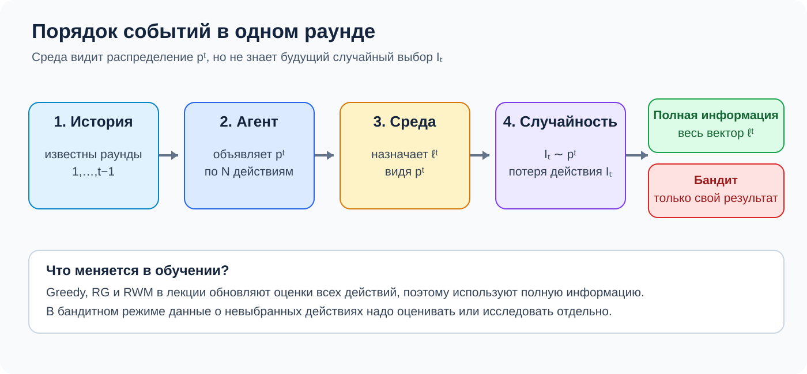
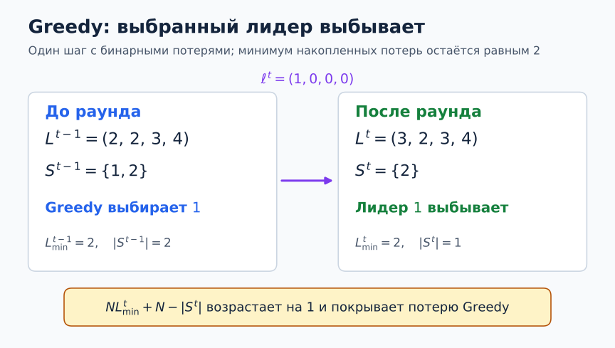
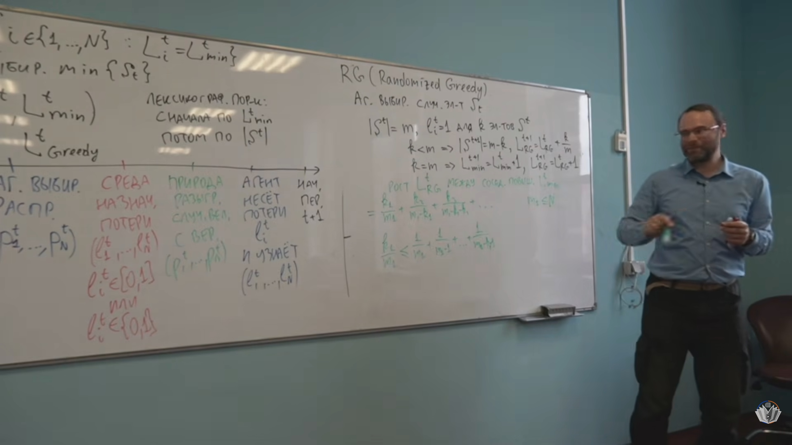
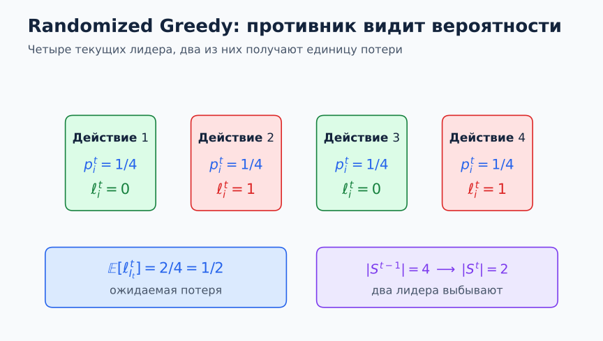
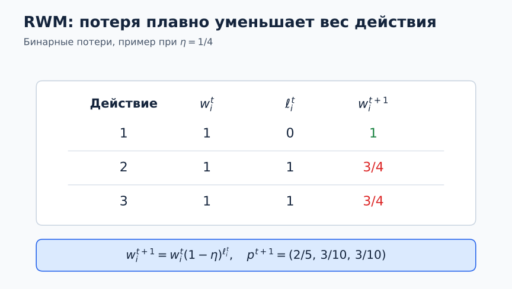
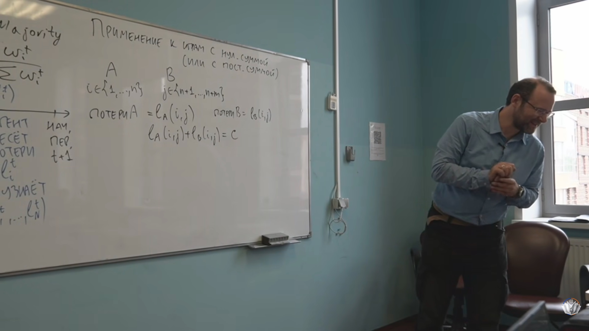
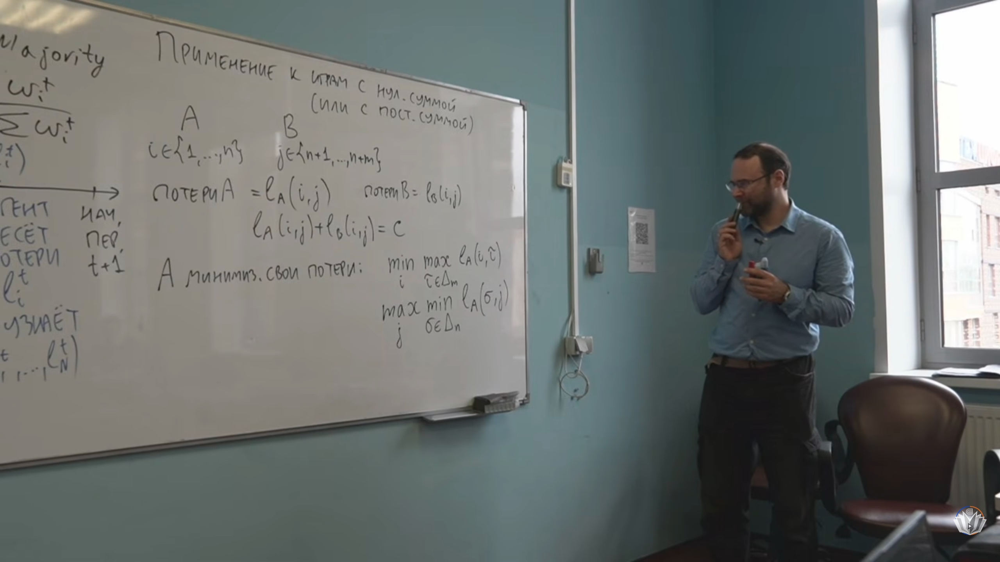

# Лекция 3. Многорукий бандит, жадные алгоритмы и сожаление

**Видео — основной источник:** [Лекторий ФПМИ, 18.09.2026](https://www.youtube.com/watch?v=ueWXtpz-02E). [Автоматические субтитры](../subtitles/03_multi-armed-bandit.md) служат указателем к записи; обозначения сверены с доской. Не данное на лекции необходимое определение из [Nisan et al., *Algorithmic Game Theory*](../../materials/sources/Nisan-et-al-AGT-book.pdf) отдельно помечено ниже. Нумерация продолжает [лекции 1–2](02_correlated-equilibrium.md).

## 1. Полная и частичная информация [0:30](https://www.youtube.com/watch?v=ueWXtpz-02E&t=30s)

**Определение 15 (два режима обратной связи).** В обоих режимах агент выбирает распределение $p^t\in\Delta_N$, затем среда, видя $p^t$, назначает потери $\ell^t\in[0,1]^N$, и лишь после этого реализуется $I_t\sim p^t$. При **полной информации** агент узнаёт весь $\ell^t$; при **многоруком бандите** — только $I_t$ и $\ell^t_{I_t}$. Последовательность: история → распределение → вектор потерь среды → случайный выбор → обратная связь. Примеры лектора: советы экспертов на рынке и выбор маршрута с доступной или недоступной статистикой по невыбранным маршрутам. [0:30–9:16](https://www.youtube.com/watch?v=ueWXtpz-02E&t=30s)

*Кадр [13:00](https://www.youtube.com/watch?v=ueWXtpz-02E&t=780s): лектор противопоставляет полную информацию и многорукого бандита и записывает порядок событий раунда. [Открыть кадр отдельно](../frames/03_00h13m00s_feedback-models.jpg).*

*Пояснительная схема: среда выбирает потери после объявления распределения; при полной информации агент видит весь $\ell^t$, а в бандитном режиме — только $\ell_{I_t}^t$. [Открыть схему отдельно](../diagrams/03_feedback-timeline.svg).*

Название лекции связано с частичной информацией, но доказанные здесь оценки Greedy, Randomized Greedy и RWM относятся **к полной информации**. Физический пример лектора — многорукий игровой автомат: награда видна лишь у выбранного рычага. [2:52–3:15](https://www.youtube.com/watch?v=ueWXtpz-02E&t=172s) Для бандита лектор только обсуждает необходимость сочетать исследование новых действий *exploration* и использование уже удачных *exploitation*, без вывода bandit-алгоритма и его оценки. [46:49–48:12](https://www.youtube.com/watch?v=ueWXtpz-02E&t=2809s)

Напоминание из лекции 2: $L_i^T=\sum_{t=1}^T\ell_i^t$, $L_{\min}^T=\min_iL_i^T$, а **реализованное** внешнее сожаление — $R_{\mathrm{ext}}^T=\sum_t\ell_{I_t}^t-L_{\min}^T$. Внутреннее сожаление заменяет одно своё действие другим, swap regret допускает произвольное правило $f(i)$. В этой лекции лектор записывает распределение как $p^t$, тогда как во второй было $\sigma^t$. Для оценки случайных алгоритмов ниже удобно отдельно обозначить $L_{\mathrm{alg}}^T:=\sum_t\langle p^t,\ell^t\rangle$ — сумму ожидаемых потерь **по выбору действия в каждом раунде после задания $p^t,\ell^t$**. При адаптивной истории сама эта сумма может быть случайной; это не определение регрета со второй лекции. [9:19–15:19](https://www.youtube.com/watch?v=ueWXtpz-02E&t=559s)

**Определение 16 (класс сравнения; НЕ БЫЛО НА ЛЕКЦИИ: дополнение из PDF).** Обычное внешнее сожаление сравнивает с $N$ постоянными действиями. Более сильный класс $\mathcal G_{\mathrm{all}}=\{g:\{1,\ldots,T\}\to\{1,\ldots,N\}\}$ разрешает выбирать лучшее действие **задним числом отдельно в каждый период**; его эталонная потеря $\sum_t\min_i\ell_i^t$. Лектор обсуждает эту возможность [15:26–19:07](https://www.youtube.com/watch?v=ueWXtpz-02E&t=926s), но эту формальную запись и обозначение класса не даёт; они взяты из [Nisan et al., §4.2, печатная с. 82, PDF с. 103](../../materials/sources/Nisan-et-al-AGT-book.pdf#page=103).

*Кадр [17:10](https://www.youtube.com/watch?v=ueWXtpz-02E&t=1030s): обсуждение слишком сильного класса всех меняющихся планов. [Открыть кадр отдельно](../frames/03_00h17m10s_comparison-class.jpg).*

*Числовой пример к замечанию лектора: выбор лучшего действия заново в каждом раунде слишком силён как эталон. [Открыть схему отдельно](../diagrams/03_comparator-grid.svg).*

**Теорема 9 (невозможность конкурировать со всеми планами).** Для любого онлайн-алгоритма среда может добиться

$$
L_{\mathrm{alg}}^T-\sum_{t=1}^T\min_i\ell_i^t\ \ge\ T(1-1/N).
$$

**Доказательство по объяснению лектора.** В каждом периоде среда находит действие $i_t$ с наименьшей $p_{i_t}^t\le1/N$, назначает ему потерю $0$, всем остальным — $1$. Ожидаемая потеря алгоритма не меньше $1-1/N$, а выбор лучшего действия отдельно в каждом раунде дал бы нулевую потерю. Это объясняет, почему сравнение с **одним фиксированным** действием содержательно. [15:26–19:07](https://www.youtube.com/watch?v=ueWXtpz-02E&t=926s)

## 2. Детерминированный Greedy [19:10](https://www.youtube.com/watch?v=ueWXtpz-02E&t=1150s)

**Определение 17 (Greedy).** В начале $t$ вычислить

$$
L_{\min}^{t-1}=\min_i L_i^{t-1},\qquad
S^{t-1}=\{i:L_i^{t-1}=L_{\min}^{t-1}\},
$$

и выбрать $I_t=\min S^{t-1}$, то есть при равенстве накопленных потерь — наименьший номер. На лекции и в доказательстве пока $\ell_i^t\in\{0,1\}$. [19:28–20:39](https://www.youtube.com/watch?v=ueWXtpz-02E&t=1168s)

*Кадр [26:15](https://www.youtube.com/watch?v=ueWXtpz-02E&t=1575s): множество действий с минимальной накопленной потерей и итоговая граница. [Открыть кадр отдельно](../frames/03_00h26m15s_greedy-bound.jpg).*

*Пример шага с бинарными потерями, поясняющий изменение множества лидеров и потенциала. [Открыть схему отдельно](../diagrams/03_greedy-leaders.svg).*

**Теорема 10 (оценка Greedy).** Для любой последовательности бинарных векторов потерь

$$
\boxed{L_{\mathrm{Greedy}}^T\le N L_{\min}^T+(N-1).}
$$

*Кадр [23:10](https://www.youtube.com/watch?v=ueWXtpz-02E&t=1390s): ход доказательства оценки Greedy и адаптивный выбор потерь средой. [Открыть кадр отдельно](../frames/03_00h23m10s_greedy-lower-bound.jpg).*

*Пример шага с бинарными потерями, поясняющий изменение множества лидеров и потенциала. [Открыть схему отдельно](../diagrams/03_greedy-leaders.svg).*

**Доказательство по объяснению лектора.** Следим за парой $(L_{\min}^t,|S^t|)$. Если Greedy понёс потерю $1$, а минимум ещё не вырос, выбранное действие покидает $S^t$; размер множества уменьшается минимум на единицу. До очередного роста $L_{\min}$ таких шагов не более $N-1$, а при росте минимума Greedy может потерять ещё $1$. Точную индуктивную форму $L_{\mathrm{Greedy}}^t\le N L_{\min}^t+N-|S^t|$ мы выписываем как пояснение счёта; на доске она не дана. Лектор показывает и последовательность среды, которая на каждом ходе штрафует выбранное действие и тем самым почти достигает этой границы. [20:42–30:03](https://www.youtube.com/watch?v=ueWXtpz-02E&t=1242s)

**Теорема 11 (нижняя оценка для детерминированных алгоритмов).** Для любого детерминированного правила среда может каждый период назначать потерю $1$ ровно выбранному действию и $0$ всем прочим. Тогда $L_D^T=T$, а некоторое фиксированное действие было выбрано не более $\lfloor T/N\rfloor$ раз, значит $L_{\min}^T\le\lfloor T/N\rfloor$. Поэтому детерминизм сам по себе не даёт $o(T)$ внешнего сожаления против такого противника. [30:13–30:50](https://www.youtube.com/watch?v=ueWXtpz-02E&t=1813s)

## 3. Randomized Greedy [31:05](https://www.youtube.com/watch?v=ueWXtpz-02E&t=1865s)

**Определение 18 (Randomized Greedy, RG).** На ходе $t$ агент равновероятно выбирает одно действие из множества текущих лидеров $S^{t-1}$. [31:05–37:20](https://www.youtube.com/watch?v=ueWXtpz-02E&t=1865s)

**Математическая запись правила** в обозначениях конспекта (на доске в таком виде не выписана):

$$
p_i^t=\begin{cases}1/|S^{t-1}|,&i\in S^{t-1},\\0,&i\notin S^{t-1}.\end{cases}
$$

*Кадр [37:20](https://www.youtube.com/watch?v=ueWXtpz-02E&t=2240s): равномерный выбор среди лидеров и начало гармонической оценки. [Открыть кадр отдельно](../frames/03_00h37m20s_randomized-greedy.jpg).*

*Пример ожидаемой потери Randomized Greedy при штрафе для двух из четырёх лидеров. [Открыть схему отдельно](../diagrams/03_randomized-greedy-leaders.svg).*

**Теорема 12 (гармоническая оценка RG).** При бинарных потерях

$$
L_{\mathrm{RG}}^T\le \ln N+(1+\ln N)L_{\min}^T.
$$

**Доказательство по объяснению лектора.** Пока минимум $L_{\min}$ не растёт, пусть множество лидеров размера $m$ теряет $k<m$ элементов. Ожидаемая потеря RG на таком ходе равна $k/m$, поскольку среда штрафует ровно $k$ из текущих лидеров. Она не больше $1/m+1/(m-1)+\cdots+1/(m-k+1)$. При последующих сокращениях множества эти отрезки гармонической суммы стыкуются. **Математическое уточнение счёта** (потенциал в этой форме на доске не записан): $\Phi_t=(1+\ln N)L_{\min}^t+\sum_{r=|S^t|+1}^{N}1/r$ изначально нулевой. При неизменном минимуме его гармоническая часть растёт не меньше ожидаемой потери RG $k/m$. При росте минимума RG теряет ровно $1$, а потенциал растёт не меньше чем на $(1+\ln N)-\ln N=1$. Поэтому по индукции $L_{\mathrm{RG}}^t\le\Phi_t$; в конце гармонический хвост не больше $\ln N$, что даёт указанную формулу. Это логарифмический, но всё ещё **мультипликативный** коэффициент перед $L_{\min}^T$, поэтому одного RG недостаточно для гарантии $o(T)$ сожаления. [31:05–40:29](https://www.youtube.com/watch?v=ueWXtpz-02E&t=1865s)

## 4. Взвешенное большинство [41:50](https://www.youtube.com/watch?v=ueWXtpz-02E&t=2510s)

Лектор записывает цель как $L_{\mathrm{alg}}^T=L_{\min}^T+o(T)$: алгоритм должен проигрывать лучшему постоянному действию не более чем на сублинейную величину. Строгая гарантия далее имеет вид **верхней оценки** $L_{\mathrm{alg}}^T\le L_{\min}^T+o(T)$. Идея лектора: оставлять положительный вес действиям, почти догоняющим лучший результат, вместо резкого переключения только между текущими лидерами. [40:30–44:10](https://www.youtube.com/watch?v=ueWXtpz-02E&t=2430s)

**Определение 19 (Randomized Weighted Majority, RWM).** Для бинарных потерь лектор задаёт веса и распределение выбора с параметром $\eta$ [44:10–46:39](https://www.youtube.com/watch?v=ueWXtpz-02E&t=2650s):

$$
w_i^1=1,\qquad p_i^t=\frac{w_i^t}{\sum_jw_j^t},\qquad
w_i^{t+1}=\begin{cases}
w_i^t,&\ell_i^t=0,\\
(1-\eta)w_i^t,&\ell_i^t=1.
\end{cases}
$$

*Кадр [46:18](https://www.youtube.com/watch?v=ueWXtpz-02E&t=2778s): лектор записывает веса, их нормировку и обновление после потерь. [Открыть кадр отдельно](../frames/03_00h46m18s_rwm-update.jpg).*

*Числовой пример обновления весов и нормировки вероятностей после бинарных потерь. [Открыть схему отдельно](../diagrams/03_rwm-update.svg).*

**Алгебраическое сокращение конспекта:** для бинарных потерь правило на доске равносильно $w_i^{t+1}=w_i^t(1-\eta)^{\ell_i^t}$ и $w_i^t=(1-\eta)^{L_i^{t-1}}$. При $\ell_i^t\in[0,1]$ лектор отдельно обсуждает линейное обновление $w_i^{t+1}=w_i^t(1-\eta\ell_i^t)$. [44:10–46:39](https://www.youtube.com/watch?v=ueWXtpz-02E&t=2650s), [52:12–53:40](https://www.youtube.com/watch?v=ueWXtpz-02E&t=3132s).

**Цель, сформулированная лектором:** для подходящего выбора параметра RWM получить $L_{\mathrm{alg}}^T=L_{\min}^T+o(T)$, то есть малую разницу в пересчёте на один период. Точную оценку и доказательство лектор оставляет на семинар; в доступных материалах репозитория записи этого семинара нет. [40:30–42:40](https://www.youtube.com/watch?v=ueWXtpz-02E&t=2430s)

## 5. Игры постоянной суммы и теорема минимакса [49:40](https://www.youtube.com/watch?v=ueWXtpz-02E&t=2980s)

**Определение 20 (игра постоянной суммы).** Лектор записывает потери Алисы и Боба в чистом профиле $(i,j)$ как $\ell_A(i,j)$ и $\ell_B(i,j)$ и требует $\ell_A(i,j)+\ell_B(i,j)=C$ при всех $(i,j)$. При $C=0$ это игра нулевой суммы. Алиса минимизирует свои потери, а Боб заинтересован их увеличить. [49:40–55:30](https://www.youtube.com/watch?v=ueWXtpz-02E&t=2980s)

*Кадр [55:30](https://www.youtube.com/watch?v=ueWXtpz-02E&t=3330s): равенство $\ell_A(i,j)+\ell_B(i,j)=C$ для каждой клетки. [Открыть кадр отдельно](../frames/03_00h55m30s_constant-sum.jpg).*

**Определение 21 (две последовательные постановки на доске).** При соглашении «Алиса минимизирует» лектор записывает [55:56–1:00:00](https://www.youtube.com/watch?v=ueWXtpz-02E&t=3356s):

$$
\min_{i\in\{1,\ldots,n\}}\max_{\widehat\sigma\in\Delta_m}\ell_A(i,\widehat\sigma),
\qquad
\max_{j\in\{n+1,\ldots,n+m\}}\min_{\sigma\in\Delta_n}\ell_A(\sigma,j).
$$

*Кадр [1:00:00](https://www.youtube.com/watch?v=ueWXtpz-02E&t=3600s): порядок $\min\max$ и $\max\min$ в формулировке лектора. [Открыть кадр отдельно](../frames/03_01h00m00s_minimax-and-maximin.jpg).*

Здесь **внешние** выборы $i$ и $j$ — чистые. Лектор обсуждает порядок ходов и направление неравенства, но доказательство теоремы минимакса не заканчивает. Эти два выражения вообще говоря **не обязаны совпадать**. [55:56–1:04:56](https://www.youtube.com/watch?v=ueWXtpz-02E&t=3356s)

**Теорема минимакса — упоминание лектора.** Лектор говорит о существовании седловой точки в игре нулевой суммы и о связи со снижением внешнего сожаления, но на этой записи не получает полную формулу и доказательство. [13:21–14:05](https://www.youtube.com/watch?v=ueWXtpz-02E&t=801s), [1:04:56–1:05:46](https://www.youtube.com/watch?v=ueWXtpz-02E&t=3896s)

Лектор также анонсирует, что стратегия, строго доминируемая с положительным зазором, почти перестаёт играться при малом подходящем сожалении; доказательство здесь не приводит. [14:37–14:56](https://www.youtube.com/watch?v=ueWXtpz-02E&t=877s)

Лекция обрывается на обсуждении минимакса; обещанная транспортная модель и детали bandit-алгоритмов здесь не разбираются. [1:05:45–1:06:16](https://www.youtube.com/watch?v=ueWXtpz-02E&t=3945s)

## Развёрнутые пояснения и ход лекции

### Порядок событий и выбор эталона [0:30–19:07](https://www.youtube.com/watch?v=ueWXtpz-02E&t=30s)

В модели лектора среда знает объявленное распределение $p^t$, поэтому может приспосабливать вектор потерь к стратегии алгоритма. Она ещё не знает случайно реализованное действие $I_t$. Это различие делает рандомизацию содержательной: против детерминированного правила среда заранее знает выбранное действие, против случайного — только его вероятности. Сожаление оценивается на последовательности потерь, которую среда действительно назначила при этой игре.

Лектор обсуждает советы финансовых экспертов и маршруты. При полной информации после поездки или торгового периода известны результаты **всех** альтернатив: можно подсчитать, насколько хорош был бы каждый постоянный эксперт или маршрут. В бандитном варианте виден только исход выбранной альтернативы. Поэтому обновления Greedy и RWM, использующие каждую компоненту вектора потерь, нельзя без дополнительных идей сразу перенести на многорукого бандита.

Почему эталон не может каждый раз заново выбирать лучший ход, видно из теоремы 9: среда делает самым дешёвым действие с минимальной объявленной вероятностью. В каждый период существует действие с вероятностью не больше $1/N$, и полный динамический план получает ноль, тогда как алгоритм в среднем платит не меньше $1-1/N$. Лучшее *фиксированное* действие, с которым сравнивает внешнее сожаление, этого преимущества не имеет.

### Детерминированный Greedy: инвариант и противник [19:10–30:50](https://www.youtube.com/watch?v=ueWXtpz-02E&t=1150s)

**Математическое пояснение доказательства лектора:** обозначим $m^t=L_{\min}^t$ и $s^t=|S^t|$. Удобный индукционный инвариант (на доске в этой форме не записан) имеет вид

$$
L_{\mathrm{Greedy}}^t \le N m^t+N-s^t.
$$

В начале $m^0=0,s^0=N$ и обе стороны равны нулю. За один шаг при бинарных потерях минимум либо сохраняется, либо увеличивается на единицу. Если он сохраняется и Greedy потерял единицу, выбранный лидер исчезает из $S^t$, поэтому $s^t\le s^{t-1}-1$; правая сторона инварианта увеличивается не меньше чем на единицу. Если минимум увеличился, все прежние лидеры потеряли единицу, Greedy тоже. Тогда увеличение члена $N m^t$ покрывает потерю Greedy, а изменение $N-s^t$ не нарушает оценку, поскольку $s^t\le N$. Если Greedy не потерял ничего, инвариант также сохраняется. Из $s^T\ge1$ следует заявленная граница $N L_{\min}^T+N-1$.

В приведённом лектором адаптивном ответе среды единицу получает именно выбранное действие. Когда алгоритм детерминирован, среда знает его выбор после объявления истории. Совокупная потеря алгоритма тогда равна числу раундов $T$, но потери по $N$ действиям распределяются между ними, поэтому хотя бы одно действие имеет не больше $\lfloor T/N\rfloor$. Это показывает структурную слабость любого детерминированного онлайн-правила, а не только выбранного способа разрешать ничьи в Greedy.

### Randomized Greedy и гармонический ряд [31:05–41:50](https://www.youtube.com/watch?v=ueWXtpz-02E&t=1865s)

Равномерная рандомизация между текущими лидерами устраняет известный противнику единственный выбранный лидер. Если из $s$ лидеров среда штрафует $k$, ожидаемая потеря RG равна $k/s$. Пока накопленный минимум не вырос, оштрафованные лидеры уходят из множества $S$, а сумма величин вида $k/s$ не превосходит гармонической суммы. Чтобы получить **точную** оценку теоремы 12, удобен потенциал

$$
\Phi_t=(1+\ln N)L_{\min}^t+
\sum_{r=|S^t|+1}^{N}\frac1r.
$$

Изначально $\Phi_0=0$. Если минимум не меняется и $|S|$ уменьшается с $s$ до $s-k$, приращение второй суммы равно $\sum_{r=s-k+1}^{s}1/r\ge k/s$, то есть покрывает ожидаемую потерю RG. Если минимум вырос, все прежние лидеры штрафованы и ожидаемая потеря равна единице. Вторая сумма может уменьшиться максимум на $\sum_{r=2}^{N}1/r\le\ln N$, поэтому прирост первого слагаемого $1+\ln N$ всё равно покрывает единицу. Значит, $L_{\mathrm{RG}}^t\le\Phi_t$. В конце гармонический хвост не больше $\ln N$, что и даёт

$$
L_{\mathrm{RG}}^T\le\ln N+(1+\ln N)L_{\min}^T.
$$

Это серьёзное улучшение множителя $N$ у Greedy до порядка $\ln N$, но при $L_{\min}^T$ порядка $T$ отставание всё ещё может расти линейно с $T$.

### Зачем нужны ненулевые веса у отстающих [41:50–53:40](https://www.youtube.com/watch?v=ueWXtpz-02E&t=2510s)

У RG действие теряет весь вес сразу, как только его накопленная потеря превышает текущий минимум. Оно может быстро стать лучшим снова, но до этого алгоритм его игнорирует. RWM делает переход плавным: после каждой единицы потери вес умножается на $1-\eta$, поэтому отношение весов действий $i,j$ равно $(1-\eta)^{L_i^{t-1}-L_j^{t-1}}$. У чуть худшего по прошлому действию сохраняется положительная вероятность, а у сильно отставшего она мала.

Лектор предлагает использовать веса, чтобы выбирать случайное действие, сохраняя шанс для тех, кто немного отстал от лидера. Точной оценки RWM и её доказательства на записи нет: он оставляет их на семинар. [40:30–46:39](https://www.youtube.com/watch?v=ueWXtpz-02E&t=2430s)

При потерях из $[0,1]$ лектор отдельно предлагает множитель $1-\eta\ell_i^t$. Он совпадает с бинарным правилом на концах отрезка, но между ними отличается от $(1-\eta)^{\ell_i^t}$; перенос оценки с одного правила на другое лектор здесь не доказывает. [52:12–53:40](https://www.youtube.com/watch?v=ueWXtpz-02E&t=3132s)

### Сведение постоянной суммы к нулевой и усреднение [49:40–1:06:16](https://www.youtube.com/watch?v=ueWXtpz-02E&t=2980s)

Если сумма выигрышей в каждой клетке равна константе $C$, максимизация выигрыша одного игрока эквивалентна минимизации выигрыша другого. После вычитания константы из одной функции выплат получается обычная игра нулевой суммы. Удобно выбрать матрицу $A$ как **потери** Алисы: она минимизирует $p^\top A q$, Боб максимизирует ту же величину.

Лектор обсуждает порядок двух выборов и связь теоремы минимакса с малым внешним сожалением, но заканчивает занятие до полной записи доказательства. В двух выписанных на доске постановках внешние выборы чистые; на этом месте равенство этих выражений не следует. [55:56–1:06:16](https://www.youtube.com/watch?v=ueWXtpz-02E&t=3356s)

Различие между лекциями 2 и 3 полезно для чтения результатов: в общей игре для коррелированного равновесия лектор указывает на сожаление от замен, зависящих от собственного действия; в игре нулевой суммы он связывает минимакс с внешним сожалением обеих сторон. Анонс о строго доминируемом действии остаётся без доказательства на этой записи. [13:21–14:56](https://www.youtube.com/watch?v=ueWXtpz-02E&t=801s)
