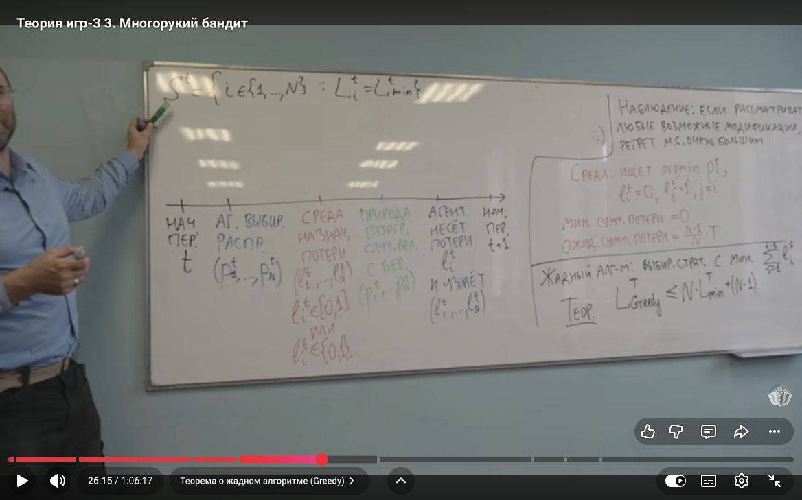
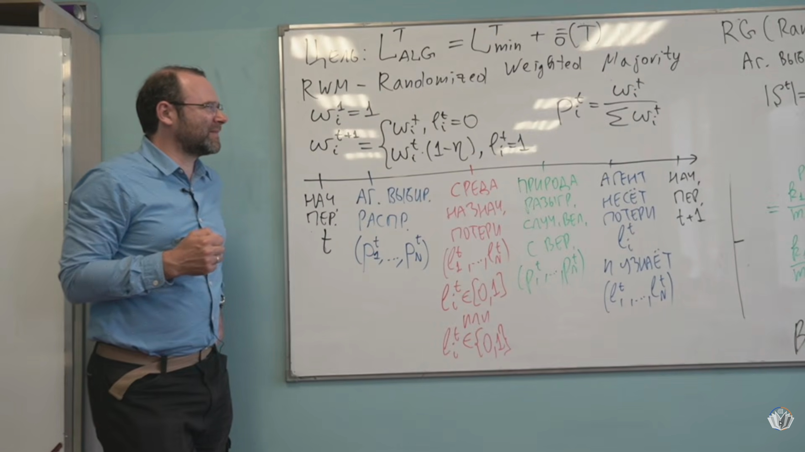

# Лекция 3. Многорукий бандит, жадные алгоритмы и сожаление

**Видео:** [Лекторий ФПМИ, 18.09.2026](https://www.youtube.com/watch?v=ueWXtpz-02E). **Основа:** [полные субтитры](../subtitles/03_multi-armed-bandit.md). **Дополнение:** [Nisan et al., *Algorithmic Game Theory*](../../materials/sources/Nisan-et-al-AGT-book.pdf), гл. 4, §§4.2–4.4, печатные с. 81–91 (PDF с. 102–112). Нумерация продолжает [лекции 1–2](02_correlated-equilibrium.md).

## 1. Полная и частичная информация [0:30](https://www.youtube.com/watch?v=ueWXtpz-02E&t=30s)

**Определение 15 (два режима обратной связи).** В обоих режимах агент выбирает распределение $p^t\in\Delta_N$, затем среда, видя $p^t$, назначает потери $\ell^t\in[0,1]^N$, и лишь после этого реализуется $I_t\sim p^t$. При **полной информации** агент узнаёт весь $\ell^t$; при **многоруком бандите** — только $I_t$ и $\ell^t_{I_t}$. Последовательность: история → распределение → вектор потерь среды → случайный выбор → обратная связь. Примеры лектора: советы экспертов на рынке и выбор маршрута с доступной или недоступной статистикой по невыбранным маршрутам. [0:30–9:16](https://www.youtube.com/watch?v=ueWXtpz-02E&t=30s)

Название лекции связано с частичной информацией, но доказанные здесь оценки Greedy, Randomized Greedy и RWM относятся **к полной информации**. Для бандита лектор только обсуждает необходимость сочетать исследование новых действий *exploration* и использование уже удачных *exploitation*, без вывода bandit-алгоритма и его оценки. [46:49–48:12](https://www.youtube.com/watch?v=ueWXtpz-02E&t=2809s)

Напоминание из лекции 2: $L_i^T=\sum_{t=1}^T\ell_i^t$, $L_{\min}^T=\min_iL_i^T$, $L_{\mathrm{alg}}^T=\sum_t\langle p^t,\ell^t\rangle$ — ожидаемая потеря, $R_{\mathrm{ext}}^T=L_{\mathrm{alg}}^T-L_{\min}^T$. Внутреннее сожаление заменяет одно своё действие другим, swap regret допускает произвольное правило $f(i)$. [9:19–15:19](https://www.youtube.com/watch?v=ueWXtpz-02E&t=559s)

**Определение 16 (класс сравнения).** Обычное внешнее сожаление сравнивает с $N$ постоянными действиями. Более сильный класс $\mathcal G_{\mathrm{all}}=\{g:\{1,\ldots,T\}\to\{1,\ldots,N\}\}$ разрешает выбирать лучшее действие **задним числом отдельно в каждый период**; его эталонная потеря $\sum_t\min_i\ell_i^t$.

**Теорема 11 (невозможность конкурировать со всеми планами).** Для любого онлайн-алгоритма среда может добиться

$$
L_{\mathrm{alg}}^T-\sum_{t=1}^T\min_i\ell_i^t\ \ge\ T(1-1/N).
$$

**Доказательство.** В каждом периоде среда находит действие $i_t$ с наименьшей $p_{i_t}^t\le1/N$, назначает ему потерю $0$, всем остальным — $1$. Ожидаемая потеря алгоритма не меньше $1-1/N$, а план $g(t)=i_t$ имеет нулевую потерю. Это объясняет, почему сравнение с **одним фиксированным** действием содержательно. [15:26–19:07](https://www.youtube.com/watch?v=ueWXtpz-02E&t=926s); учебник, гл. 4, теорема 4.1, печатная с. 83.

## 2. Детерминированный Greedy [19:10](https://www.youtube.com/watch?v=ueWXtpz-02E&t=1150s)

**Определение 17 (Greedy).** В начале $t$ вычислить

$$
L_{\min}^{t-1}=\min_i L_i^{t-1},\qquad
S^{t-1}=\{i:L_i^{t-1}=L_{\min}^{t-1}\},
$$

и выбрать $I_t=\min S^{t-1}$, то есть при равенстве накопленных потерь — наименьший номер. На лекции и в доказательстве пока $\ell_i^t\in\{0,1\}$. [19:28–20:39](https://www.youtube.com/watch?v=ueWXtpz-02E&t=1168s)

**Теорема 12 (оценка Greedy).** Для любой последовательности бинарных векторов потерь

$$
\boxed{L_{\mathrm{Greedy}}^T\le N L_{\min}^T+(N-1).}
$$

**Доказательство.** Следим за парой $(L_{\min}^t,|S^t|)$. Если Greedy понёс потерю $1$, а минимум ещё не вырос, выбранное действие покидает $S^t$; размер множества уменьшается минимум на единицу. До очередного роста $L_{\min}$ таких шагов не более $N-1$, а при росте минимума Greedy может потерять ещё $1$. Точная индуктивная форма: $L_{\mathrm{Greedy}}^t\le N L_{\min}^t+N-|S^t|$, откуда нужная оценка. Лектор показывает и последовательность среды, которая на каждом ходе штрафует выбранное действие и тем самым почти достигает этой границы. [20:42–30:03](https://www.youtube.com/watch?v=ueWXtpz-02E&t=1242s); учебник, гл. 4, теорема 4.2, печатная с. 83.

**Теорема 13 (нижняя оценка для детерминированных алгоритмов).** Для любого детерминированного правила среда может каждый период назначать потерю $1$ ровно выбранному действию и $0$ всем прочим. Тогда $L_D^T=T$, а некоторое фиксированное действие было выбрано не более $\lfloor T/N\rfloor$ раз, значит $L_{\min}^T\le\lfloor T/N\rfloor$. Поэтому детерминизм сам по себе не даёт $o(T)$ внешнего сожаления против такого противника. [30:13–30:50](https://www.youtube.com/watch?v=ueWXtpz-02E&t=1813s); учебник, гл. 4, теорема 4.3, печатные с. 83–84.

## 3. Randomized Greedy [31:05](https://www.youtube.com/watch?v=ueWXtpz-02E&t=1865s)

**Определение 18 (Randomized Greedy, RG).** На ходе $t$ распределение равномерно на текущих лидерах $S^{t-1}$:

$$
p_i^t=\begin{cases}1/|S^{t-1}|,&i\in S^{t-1},\\0,&i\notin S^{t-1}.\end{cases}
$$

**Теорема 14 (гармоническая оценка RG).** При бинарных потерях

$$
L_{\mathrm{RG}}^T\le \ln N+(1+\ln N)L_{\min}^T.
$$

**Доказательство.** Пока минимум $L_{\min}$ не растёт, пусть множество лидеров размера $m$ теряет $k<m$ элементов. Ожидаемая потеря RG на таком ходе равна $k/m$, поскольку среда штрафует ровно $k$ из текущих лидеров. Она не больше $1/m+1/(m-1)+\cdots+1/(m-k+1)$. При последующих сокращениях множества эти отрезки гармонической суммы стыкуются; до следующего роста минимума накопленная потеря ограничена $H_N=\sum_{j=1}^N1/j\le1+\ln N$. В начальном и конечном неполном блоках можно учесть меньший хвост; точная индукция из учебника даёт указанную формулу. Это логарифмический, но всё ещё **мультипликативный** коэффициент перед $L_{\min}^T$, поэтому одного RG недостаточно для гарантии $o(T)$ сожаления. [31:05–40:29](https://www.youtube.com/watch?v=ueWXtpz-02E&t=1865s); учебник, гл. 4, теорема 4.4, печатная с. 84.

## 4. Взвешенное большинство [41:50](https://www.youtube.com/watch?v=ueWXtpz-02E&t=2510s)

Цель — $L_{\mathrm{alg}}^T=L_{\min}^T+o(T)$, то есть среднее внешнее сожаление стремится к нулю. Идея лектора: оставлять положительный вес действиям, почти догоняющим лучший результат, вместо резкого переключения только между текущими лидерами. [40:30–44:10](https://www.youtube.com/watch?v=ueWXtpz-02E&t=2430s)

**Определение 19 (Randomized Weighted Majority, RWM).** При параметре $0<\eta\le1/2$ и бинарных потерях:

$$
w_i^1=1,\qquad p_i^t=\frac{w_i^t}{W^t},\quad W^t=\sum_jw_j^t,\qquad
w_i^{t+1}=w_i^t(1-\eta)^{\ell_i^t}.
$$

То есть при потере $0$ вес сохраняется, при $1$ умножается на $1-\eta$; эквивалентно $w_i^t=(1-\eta)^{L_i^{t-1}}$. При $\ell_i^t\in[0,1]$ лектор обсуждает линейное обновление $w_i^{t+1}=w_i^t(1-\eta\ell_i^t)$, названное в учебнике *Polynomial Weights*. [44:10–46:39](https://www.youtube.com/watch?v=ueWXtpz-02E&t=2650s), [52:12–53:40](https://www.youtube.com/watch?v=ueWXtpz-02E&t=3132s).

**Теорема 15 (сублинейное сожаление RWM).** Для бинарных потерь и $\eta\le1/2$

$$
L_{\mathrm{RWM}}^T\le(1+\eta)L_{\min}^T+\frac{\ln N}{\eta}.
$$

Если $T$ известно, выбор $\eta=\min\{\sqrt{\ln N/T},1/2\}$ даёт $L_{\mathrm{RWM}}^T-L_{\min}^T\le2\sqrt{T\ln N}$. При фиксированном $N$ это $o(T)$. Лектор формулирует достижимость цели и оставляет оценку на семинар; **следующее доказательство добавлено по учебнику**, гл. 4, теорема 4.5, печатные с. 85–86:

$$
W^{t+1}=W^t(1-\eta\langle p^t,\ell^t\rangle),\quad
W^1=N,\quad W^{T+1}\ge(1-\eta)^{L_{\min}^T}.
$$

Логарифмируя произведение и применяя $\ln(1-z)\le-z$, получаем $L_{\mathrm{RWM}}^T\le-\ln(1-\eta)L_{\min}^T/\eta+\ln N/\eta$. При $\eta\le1/2$: $-\ln(1-\eta)\le\eta+\eta^2$, что завершает доказательство. Для линейного обновления и потерь в $[0,1]$ учебник даёт ещё более точную оценку $L_{\mathrm{PW}}^T\le L_i^T+\eta\sum_t(\ell_i^t)^2+\ln N/\eta$ для любого $i$ (теорема 4.6, печатная с. 87).

## 5. Игры постоянной суммы и теорема минимакса [49:40](https://www.youtube.com/watch?v=ueWXtpz-02E&t=2980s)

**Определение 20 (игра постоянной суммы).** Выигрыши двух игроков в каждой клетке дают одну константу; после сдвига можно говорить об игре нулевой суммы. Если $A_{ij}$ — **потеря** Алисы, Боб стремится её увеличить, Алиса — уменьшить. Для смешанных стратегий ожидаемая потеря $p^\top Aq$.

**Определение 21 (минимакс и максимин).** При соглашении «Алиса минимизирует» гарантируемая ею верхняя цена и обеспечиваемая Бобом нижняя цена:

$$
v^+=\min_{p\in\Delta_n}\max_{q\in\Delta_m}p^\top Aq
=\min_{p\in\Delta_n}\max_jp^\top Ae_j,
\quad
v^-=\max_{q\in\Delta_m}\min_{p\in\Delta_n}p^\top Aq
=\max_{q\in\Delta_m}\min_i e_i^\top Aq.
$$

Всегда $v^-\le v^+$: для любых $p,q$, $\min_i e_i^\top Aq\le p^\top Aq\le\max_jp^\top Ae_j$. Лектор выводит постановки и обсуждает направление неравенства на доске. [55:56–1:04:56](https://www.youtube.com/watch?v=ueWXtpz-02E&t=3356s)

**Теорема 16 (минимакс фон Неймана).** Для конечной игры нулевой суммы $v^-=v^+$. Лектор в конце объясняет связь с внешним сожалением, но полное доказательство не успевает провести. **Дополнение из учебника**, гл. 4, §4.4.2, печатные с. 89–90: пусть обе стороны $T$ раундов имеют внешнее сожаление $R_A(T),R_B(T)$. При средних стратегиях $\bar p,\bar q$ и средней потере Алисы $c_T$ условия сожаления дают

$$
\min_i e_i^\top A\bar q\ge c_T-\frac{R_A(T)}T,
\qquad
\max_j\bar p^\top Ae_j\le c_T+\frac{R_B(T)}T.
$$

Следовательно, минимаксный разрыв для $\bar p,\bar q$ не больше $(R_A+R_B)/T\to0$; совместно со слабым неравенством $v^-\le v^+$ это даёт равенство. Средние смешанные стратегии становятся приближённой седловой точкой; **не требуется**, чтобы распределение каждого отдельного раунда сходилось. [1:05:00–1:05:46](https://www.youtube.com/watch?v=ueWXtpz-02E&t=3900s)

**Теорема 17 (гарантия одного игрока в игре постоянной суммы).** Если значение игры для потерь игрока $i$ равно $v_i$, а его внешнее сожаление за $T$ раундов не больше $R_i(T)$, то его средняя ожидаемая потеря $L_{\mathrm{alg},i}^T/T\le v_i+R_i(T)/T$. **Доказательство:** против среднего распределения действий соперника существует чистый лучший ответ с суммарной потерей не больше $Tv_i$. По определению сожаления суммарная ожидаемая потеря алгоритма не превосходит эту величину плюс $R_i(T)$. Учебник, гл. 4, теорема 4.9, печатная с. 89.

**Теорема 18 (редкость строго доминируемой стратегии).** Если действие $j$ проигрывает действию $k$ по потерям не менее $\varepsilon>0$ при каждом профиле остальных игроков, а внутреннее/swap-сожаление не больше $R(T)$, то средняя вероятность игры $j$ не превосходит $R(T)/(\varepsilon T)$. **Доказательство:** замена $j\mapsto k$ улучшила бы ожидаемую суммарную потерю не меньше чем на $\varepsilon\sum_t p_j^t$; эта величина ограничена сожалением. Лектор анонсирует результат [14:37–14:56](https://www.youtube.com/watch?v=ueWXtpz-02E&t=877s); доказательство — учебник, гл. 4, §4.4.4, печатные с. 91–92.

Лекция обрывается на обсуждении минимакса; обещанная транспортная модель и детали bandit-алгоритмов здесь не разбираются. [1:05:45–1:06:16](https://www.youtube.com/watch?v=ueWXtpz-02E&t=3945s)
