# Глава 4. Learning, Regret Minimization, and Equilibria

**PDF-страницы:** 100–123. Изображения передают исходную страницу; извлечённый текст ниже нужен для поиска.

### Разделы

- [4.1 Introduction](#pdf-page-0100) — PDF стр. 100
- [4.2 Model and Preliminaries](#pdf-page-0102) — PDF стр. 102
- [4.3 External Regret Minimization](#pdf-page-0103) — PDF стр. 103
- [4.3.1 Warmup: Greedy and Randomized-Greedy Algorithms](#pdf-page-0104) — PDF стр. 104
- [4.3.2 Randomized Weighted Majority Algorithm](#pdf-page-0106) — PDF стр. 106
- [4.3.3 Polynomial Weights Algorithm](#pdf-page-0107) — PDF стр. 107
- [4.3.4 Lower Bounds](#pdf-page-0108) — PDF стр. 108
- [4.4 Regret Minimization and Game Theory](#pdf-page-0109) — PDF стр. 109
- [4.4.1 Game Theoretic Model](#pdf-page-0109) — PDF стр. 109
- [4.4.2 Constant Sum Games and External Regret Minimization](#pdf-page-0110) — PDF стр. 110
- [4.4.3 Correlated Equilibrium and Swap Regret Minimization](#pdf-page-0111) — PDF стр. 111
- [4.4.4 Dominated Strategies](#pdf-page-0112) — PDF стр. 112
- [4.5 Generic Reduction from External to Swap Regret](#pdf-page-0113) — PDF стр. 113
- [4.6 The Partial Information Model](#pdf-page-0115) — PDF стр. 115
- [4.7 On Convergence of Regret-Minimizing Strategies to Nash](#pdf-page-0117) — PDF стр. 117
- [4.7.1 Current Research Directions](#pdf-page-0119) — PDF стр. 119
- [4.8 Notes](#pdf-page-0120) — PDF стр. 120
[К содержанию](../README.md) · [К полному файлу](../00_full_book.md)

### PDF стр. 100 · книжная стр. 79

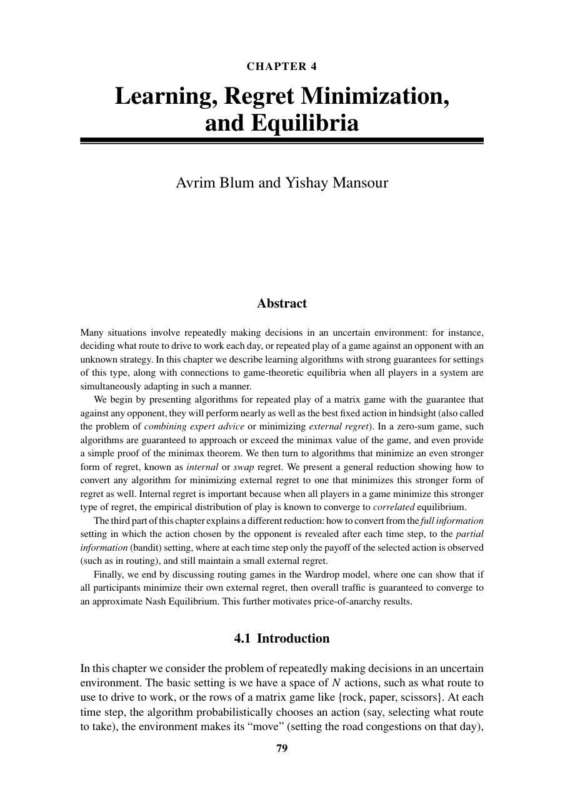

[Открыть страницу отдельно](../images/pages/p0100.jpg) · [Открыть страницу в PDF](../../materials/sources/Nisan-et-al-AGT-book.pdf#page=100)

Поисковый текст страницы (формулы сверяйте с изображением)

~~~~text
CHAPTER 4
Learning, Regret Minimization,
and Equilibria
Avrim Blum and Yishay Mansour
Abstract
Many situations involve repeatedly making decisions in an uncertain environment: for instance,
deciding what route to drive to work each day, or repeated play of a game against an opponent with an
unknown strategy. In this chapter we describe learning algorithms with strong guarantees for settings
of this type, along with connections to game-theoretic equilibria when all players in a system are
simultaneously adapting in such a manner.
We begin by presenting algorithms for repeated play of a matrix game with the guarantee that
against any opponent, they will perform nearly as well as the best fixed action in hindsight (also called
the problem of combining expert advice or minimizing external regret). In a zero-sum game, such
algorithms are guaranteed to approach or exceed the minimax value of the game, and even provide
a simple proof of the minimax theorem. We then turn to algorithms that minimize an even stronger
form of regret, known as internal or swap regret. We present a general reduction showing how to
convert any algorithm for minimizing external regret to one that minimizes this stronger form of
regret as well. Internal regret is important because when all players in a game minimize this stronger
type of regret, the empirical distribution of play is known to converge to correlated equilibrium.
The third part of this chapter explains a different reduction: how to convert from the full information
setting in which the action chosen by the opponent is revealed after each time step, to the partial
information (bandit) setting, where at each time step only the payoff of the selected action is observed
(such as in routing), and still maintain a small external regret.
Finally, we end by discussing routing games in the Wardrop model, where one can show that if
all participants minimize their own external regret, then overall traffic is guaranteed to converge to
an approximate Nash Equilibrium. This further motivates price-of-anarchy results.
4.1 Introduction
In this chapter we consider the problem of repeatedly making decisions in an uncertain
environment. The basic setting is we have a space of N actions, such as what route to
use to drive to work, or the rows of a matrix game like {rock, paper, scissors}. At each
time step, the algorithm probabilistically chooses an action (say, selecting what route
to take), the environment makes its “move” (setting the road congestions on that day),
79
~~~~

### PDF стр. 101 · книжная стр. 80

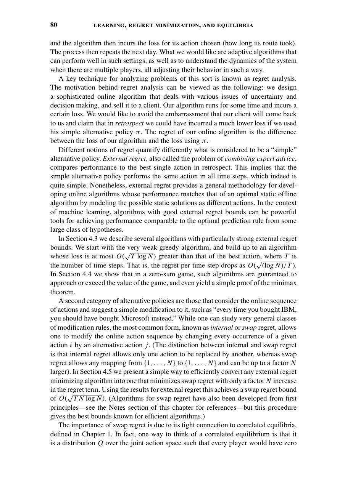

[Открыть страницу отдельно](../images/pages/p0101.jpg) · [Открыть страницу в PDF](../../materials/sources/Nisan-et-al-AGT-book.pdf#page=101)

Поисковый текст страницы (формулы сверяйте с изображением)

~~~~text
80
learning, regret minimization, and equilibria
and the algorithm then incurs the loss for its action chosen (how long its route took).
The process then repeats the next day. What we would like are adaptive algorithms that
can perform well in such settings, as well as to understand the dynamics of the system
when there are multiple players, all adjusting their behavior in such a way.
A key technique for analyzing problems of this sort is known as regret analysis.
The motivation behind regret analysis can be viewed as the following: we design
a sophisticated online algorithm that deals with various issues of uncertainty and
decision making, and sell it to a client. Our algorithm runs for some time and incurs a
certain loss. We would like to avoid the embarrassment that our client will come back
to us and claim that in retrospect we could have incurred a much lower loss if we used
his simple alternative policy π. The regret of our online algorithm is the difference
between the loss of our algorithm and the loss using π.
Different notions of regret quantify differently what is considered to be a “simple”
alternative policy. External regret, also called the problem of combining expert advice,
compares performance to the best single action in retrospect. This implies that the
simple alternative policy performs the same action in all time steps, which indeed is
quite simple. Nonetheless, external regret provides a general methodology for devel-
oping online algorithms whose performance matches that of an optimal static offline
algorithm by modeling the possible static solutions as different actions. In the context
of machine learning, algorithms with good external regret bounds can be powerful
tools for achieving performance comparable to the optimal prediction rule from some
large class of hypotheses.
In Section 4.3 we describe several algorithms with particularly strong external regret
bounds. We start with the very weak greedy algorithm, and build up to an algorithm
whose loss is at most O(√T log N) greater than that of the best action, where T is
the number of time steps. That is, the regret per time step drops as O(√(log N)/T ).
In Section 4.4 we show that in a zero-sum game, such algorithms are guaranteed to
approach or exceed the value of the game, and even yield a simple proof of the minimax
theorem.
A second category of alternative policies are those that consider the online sequence
of actions and suggest a simple modification to it, such as “every time you bought IBM,
you should have bought Microsoft instead.” While one can study very general classes
of modification rules, the most common form, known as internal or swap regret, allows
one to modify the online action sequence by changing every occurrence of a given
action i by an alternative action j. (The distinction between internal and swap regret
is that internal regret allows only one action to be replaced by another, whereas swap
regret allows any mapping from {1, . . . , N} to {1, . . . , N} and can be up to a factor N
larger). In Section 4.5 we present a simple way to efficiently convert any external regret
minimizing algorithm into one that minimizes swap regret with only a factor N increase
in the regret term. Using the results for external regret this achieves a swap regret bound
of O(√T N log N). (Algorithms for swap regret have also been developed from first
principles—see the Notes section of this chapter for references—but this procedure
gives the best bounds known for efficient algorithms.)
The importance of swap regret is due to its tight connection to correlated equilibria,
defined in Chapter 1. In fact, one way to think of a correlated equilibrium is that it
is a distribution Q over the joint action space such that every player would have zero
~~~~

### PDF стр. 102 · книжная стр. 81

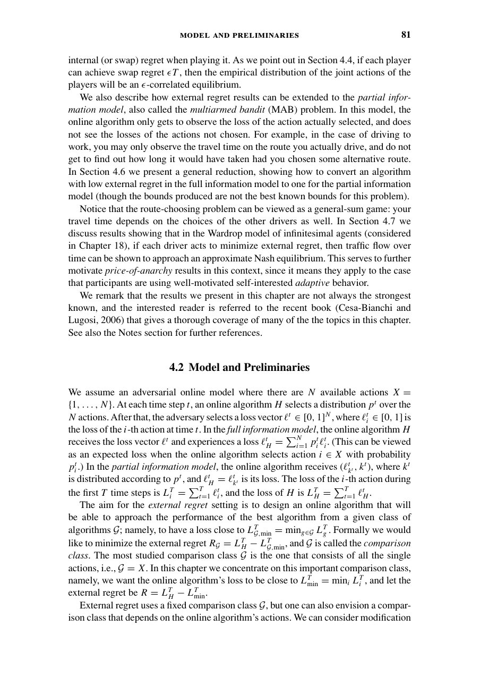

[Открыть страницу отдельно](../images/pages/p0102.jpg) · [Открыть страницу в PDF](../../materials/sources/Nisan-et-al-AGT-book.pdf#page=102)

Поисковый текст страницы (формулы сверяйте с изображением)

~~~~text
model and preliminaries
81
internal (or swap) regret when playing it. As we point out in Section 4.4, if each player
can achieve swap regret ϵT , then the empirical distribution of the joint actions of the
players will be an ϵ-correlated equilibrium.
We also describe how external regret results can be extended to the partial infor-
mation model, also called the multiarmed bandit (MAB) problem. In this model, the
online algorithm only gets to observe the loss of the action actually selected, and does
not see the losses of the actions not chosen. For example, in the case of driving to
work, you may only observe the travel time on the route you actually drive, and do not
get to find out how long it would have taken had you chosen some alternative route.
In Section 4.6 we present a general reduction, showing how to convert an algorithm
with low external regret in the full information model to one for the partial information
model (though the bounds produced are not the best known bounds for this problem).
Notice that the route-choosing problem can be viewed as a general-sum game: your
travel time depends on the choices of the other drivers as well. In Section 4.7 we
discuss results showing that in the Wardrop model of infinitesimal agents (considered
in Chapter 18), if each driver acts to minimize external regret, then traffic flow over
time can be shown to approach an approximate Nash equilibrium. This serves to further
motivate price-of-anarchy results in this context, since it means they apply to the case
that participants are using well-motivated self-interested adaptive behavior.
We remark that the results we present in this chapter are not always the strongest
known, and the interested reader is referred to the recent book (Cesa-Bianchi and
Lugosi, 2006) that gives a thorough coverage of many of the the topics in this chapter.
See also the Notes section for further references.
4.2 Model and Preliminaries
We assume an adversarial online model where there are N available actions X =
{1, . . . , N}. At each time step t, an online algorithm H selects a distribution pt over the
N actions. After that, the adversary selects a loss vector ℓt ∈[0, 1]N, where ℓt
i ∈[0, 1] is
the loss of the i-th action at time t. In the full information model, the online algorithm H
receives the loss vector ℓt and experiences a loss ℓt
H = ⟦U+0001; см. снимок страницы⟧N
i=1 pt
iℓt
i. (This can be viewed
as an expected loss when the online algorithm selects action i ∈X with probability
pt
i.) In the partial information model, the online algorithm receives (ℓt
kt, kt), where kt
is distributed according to pt, and ℓt
H = ℓt
kt is its loss. The loss of the i-th action during
the first T time steps is LT
i = ⟦U+0001; см. снимок страницы⟧T
t=1 ℓt
i, and the loss of H is LT
H = ⟦U+0001; см. снимок страницы⟧T
t=1 ℓt
H.
The aim for the external regret setting is to design an online algorithm that will
be able to approach the performance of the best algorithm from a given class of
algorithms G; namely, to have a loss close to LT
G,min = ming∈G LT
g . Formally we would
like to minimize the external regret RG = LT
H −LT
G,min, and G is called the comparison
class. The most studied comparison class G is the one that consists of all the single
actions, i.e., G = X. In this chapter we concentrate on this important comparison class,
namely, we want the online algorithm’s loss to be close to LT
min = mini LT
i , and let the
external regret be R = LT
H −LT
min.
External regret uses a fixed comparison class G, but one can also envision a compar-
ison class that depends on the online algorithm’s actions. We can consider modification
~~~~

### PDF стр. 103 · книжная стр. 82

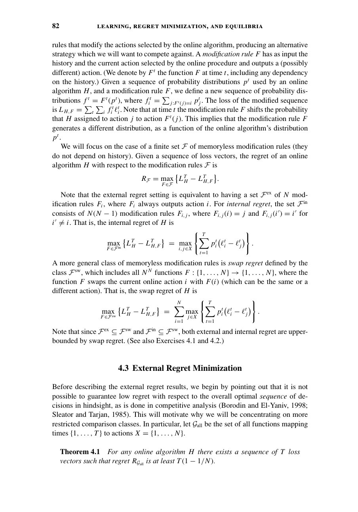

[Открыть страницу отдельно](../images/pages/p0103.jpg) · [Открыть страницу в PDF](../../materials/sources/Nisan-et-al-AGT-book.pdf#page=103)

**Theorem 4.1** — фрагмент оригинальной страницы:

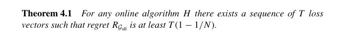

[Открыть фрагмент отдельно](../images/statements/p0103_theorem_4-1_01.png)

Начало следующей страницы для проверки продолжения: 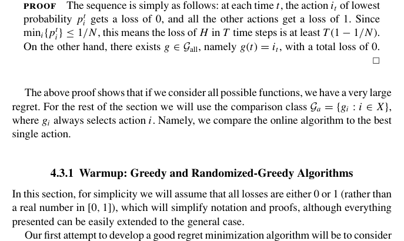

Поисковый текст страницы (формулы сверяйте с изображением)

~~~~text
82
learning, regret minimization, and equilibria
rules that modify the actions selected by the online algorithm, producing an alternative
strategy which we will want to compete against. A modification rule F has as input the
history and the current action selected by the online procedure and outputs a (possibly
different) action. (We denote by F t the function F at time t, including any dependency
on the history.) Given a sequence of probability distributions pt used by an online
algorithm H, and a modification rule F, we define a new sequence of probability dis-
tributions f t = F t(pt), where f t
i = ⟦U+0001; см. снимок страницы⟧
j:F t(j)=i pt
j. The loss of the modified sequence
is LH,F = ⟦U+0001; см. снимок страницы⟧
t
⟦U+0001; см. снимок страницы⟧
i f t
i ℓt
i. Note that at time t the modification rule F shifts the probability
that H assigned to action j to action F t(j). This implies that the modification rule F
generates a different distribution, as a function of the online algorithm’s distribution
pt.
We will focus on the case of a finite set F of memoryless modification rules (they
do not depend on history). Given a sequence of loss vectors, the regret of an online
algorithm H with respect to the modification rules F is
RF = max
F∈F
⟦U+0002; см. снимок страницы⟧
LT
H −LT
H,F
⟦U+0003; см. снимок страницы⟧
.
Note that the external regret setting is equivalent to having a set Fex of N mod-
ification rules Fi, where Fi always outputs action i. For internal regret, the set Fin
consists of N(N −1) modification rules Fi,j, where Fi,j(i) = j and Fi,j(i′) = i′ for
i′̸ = i. That is, the internal regret of H is
max
F∈Fin
⟦U+0002; см. снимок страницы⟧
LT
H −LT
H,F
⟦U+0003; см. снимок страницы⟧
= max
i,j∈X
⟦U+0004; см. снимок страницы⟧ T
⟦U+0005; см. снимок страницы⟧
t=1
pt
i
⟦U+0006; см. снимок страницы⟧
ℓt
i −ℓt
j
⟦U+0007; см. снимок страницы⟧
⟦U+0008; см. снимок страницы⟧
.
A more general class of memoryless modification rules is swap regret defined by the
class Fsw, which includes all NN functions F : {1, . . . , N} →{1, . . . , N}, where the
function F swaps the current online action i with F(i) (which can be the same or a
different action). That is, the swap regret of H is
max
F∈Fsw
⟦U+0002; см. снимок страницы⟧
LT
H −LT
H,F
⟦U+0003; см. снимок страницы⟧
=
N
⟦U+0005; см. снимок страницы⟧
i=1
max
j∈X
⟦U+0004; см. снимок страницы⟧ T
⟦U+0005; см. снимок страницы⟧
t=1
pt
i
⟦U+0006; см. снимок страницы⟧
ℓt
i −ℓt
j
⟦U+0007; см. снимок страницы⟧
⟦U+0008; см. снимок страницы⟧
.
Note that since Fex ⊆Fsw and Fin ⊆Fsw, both external and internal regret are upper-
bounded by swap regret. (See also Exercises 4.1 and 4.2.)
4.3 External Regret Minimization
Before describing the external regret results, we begin by pointing out that it is not
possible to guarantee low regret with respect to the overall optimal sequence of de-
cisions in hindsight, as is done in competitive analysis (Borodin and El-Yaniv, 1998;
Sleator and Tarjan, 1985). This will motivate why we will be concentrating on more
restricted comparison classes. In particular, let Gall be the set of all functions mapping
times {1, . . . , T } to actions X = {1, . . . , N}.
Theorem 4.1
For any online algorithm H there exists a sequence of T loss
vectors such that regret RGall is at least T (1 −1/N).
~~~~

### PDF стр. 104 · книжная стр. 83

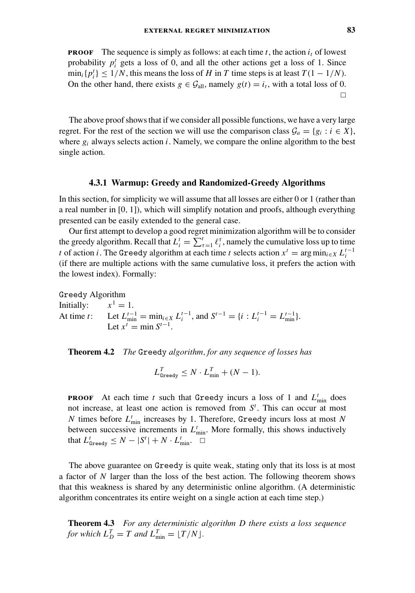

[Открыть страницу отдельно](../images/pages/p0104.jpg) · [Открыть страницу в PDF](../../materials/sources/Nisan-et-al-AGT-book.pdf#page=104)

**Theorem 4.2** — фрагмент оригинальной страницы:

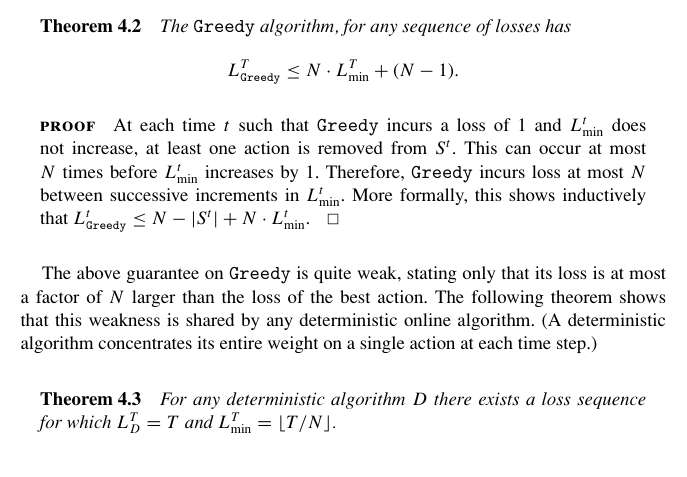

[Открыть фрагмент отдельно](../images/statements/p0104_theorem_4-2_01.png)

**Theorem 4.3** — фрагмент оригинальной страницы:

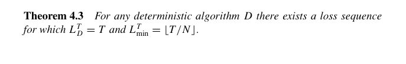

[Открыть фрагмент отдельно](../images/statements/p0104_theorem_4-3_02.png)

Начало следующей страницы для проверки продолжения: 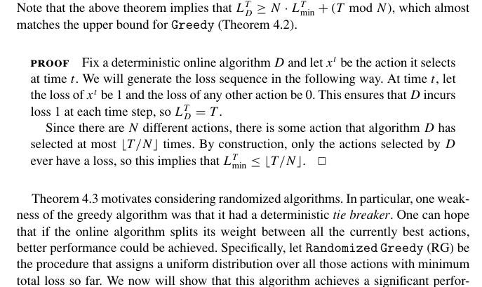

Поисковый текст страницы (формулы сверяйте с изображением)

~~~~text
external regret minimization
83
proof
The sequence is simply as follows: at each time t, the action it of lowest
probability pt
i gets a loss of 0, and all the other actions get a loss of 1. Since
mini{pt
i} ≤1/N, this means the loss of H in T time steps is at least T (1 −1/N).
On the other hand, there exists g ∈Gall, namely g(t) = it, with a total loss of 0.
The above proof shows that if we consider all possible functions, we have a very large
regret. For the rest of the section we will use the comparison class Ga = {gi : i ∈X},
where gi always selects action i. Namely, we compare the online algorithm to the best
single action.
4.3.1 Warmup: Greedy and Randomized-Greedy Algorithms
In this section, for simplicity we will assume that all losses are either 0 or 1 (rather than
a real number in [0, 1]), which will simplify notation and proofs, although everything
presented can be easily extended to the general case.
Our first attempt to develop a good regret minimization algorithm will be to consider
the greedy algorithm. Recall that Lt
i = ⟦U+0001; см. снимок страницы⟧t
τ=1 ℓτ
i , namely the cumulative loss up to time
t of action i. The Greedy algorithm at each time t selects action xt = arg mini∈X Lt−1
i
(if there are multiple actions with the same cumulative loss, it prefers the action with
the lowest index). Formally:
Greedy Algorithm
Initially:
x1 = 1.
At time t:
Let Lt−1
min = mini∈X Lt−1
i
, and St−1 = {i : Lt−1
i
= Lt−1
min}.
Let xt = min St−1.
Theorem 4.2
The Greedy algorithm, for any sequence of losses has
LT
Greedy ≤N · LT
min + (N −1).
proof
At each time t such that Greedy incurs a loss of 1 and Lt
min does
not increase, at least one action is removed from St. This can occur at most
N times before Lt
min increases by 1. Therefore, Greedy incurs loss at most N
between successive increments in Lt
min. More formally, this shows inductively
that Lt
Greedy ≤N −|St| + N · Lt
min.
The above guarantee on Greedy is quite weak, stating only that its loss is at most
a factor of N larger than the loss of the best action. The following theorem shows
that this weakness is shared by any deterministic online algorithm. (A deterministic
algorithm concentrates its entire weight on a single action at each time step.)
Theorem 4.3
For any deterministic algorithm D there exists a loss sequence
for which LT
D = T and LT
min = ⌊T /N⌋.
~~~~

### PDF стр. 105 · книжная стр. 84

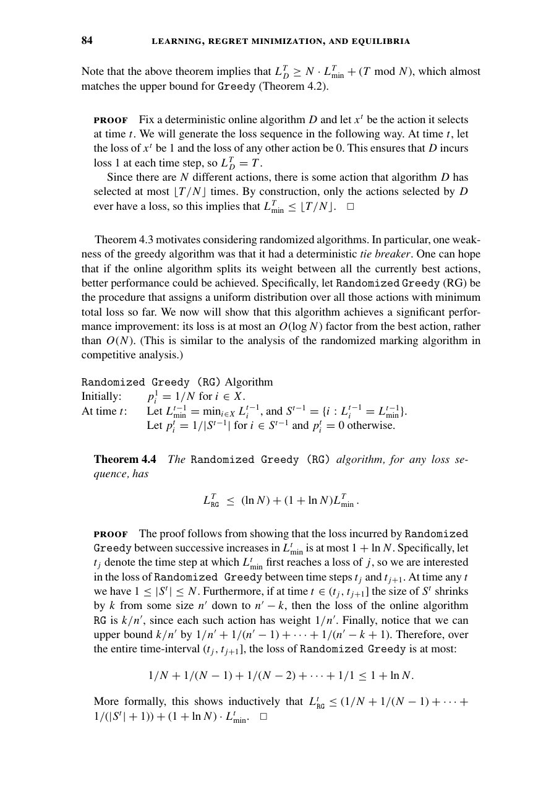

[Открыть страницу отдельно](../images/pages/p0105.jpg) · [Открыть страницу в PDF](../../materials/sources/Nisan-et-al-AGT-book.pdf#page=105)

**Theorem 4.4** — фрагмент оригинальной страницы:

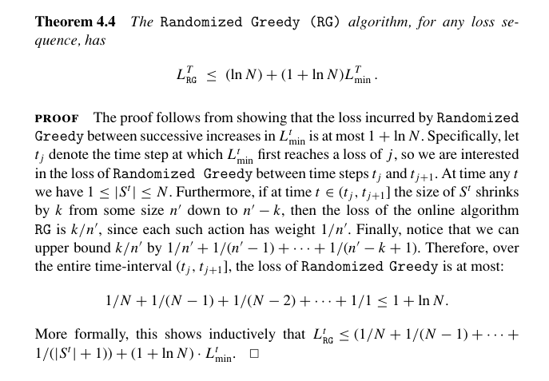

[Открыть фрагмент отдельно](../images/statements/p0105_theorem_4-4_01.png)

Поисковый текст страницы (формулы сверяйте с изображением)

~~~~text
84
learning, regret minimization, and equilibria
Note that the above theorem implies that LT
D ≥N · LT
min + (T mod N), which almost
matches the upper bound for Greedy (Theorem 4.2).
proof
Fix a deterministic online algorithm D and let xt be the action it selects
at time t. We will generate the loss sequence in the following way. At time t, let
the loss of xt be 1 and the loss of any other action be 0. This ensures that D incurs
loss 1 at each time step, so LT
D = T .
Since there are N different actions, there is some action that algorithm D has
selected at most ⌊T /N⌋times. By construction, only the actions selected by D
ever have a loss, so this implies that LT
min ≤⌊T /N⌋.
Theorem 4.3 motivates considering randomized algorithms. In particular, one weak-
ness of the greedy algorithm was that it had a deterministic tie breaker. One can hope
that if the online algorithm splits its weight between all the currently best actions,
better performance could be achieved. Specifically, let Randomized Greedy (RG) be
the procedure that assigns a uniform distribution over all those actions with minimum
total loss so far. We now will show that this algorithm achieves a significant perfor-
mance improvement: its loss is at most an O(log N) factor from the best action, rather
than O(N). (This is similar to the analysis of the randomized marking algorithm in
competitive analysis.)
Randomized Greedy (RG) Algorithm
Initially:
p1
i = 1/N for i ∈X.
At time t:
Let Lt−1
min = mini∈X Lt−1
i
, and St−1 = {i : Lt−1
i
= Lt−1
min}.
Let pt
i = 1/|St−1| for i ∈St−1 and pt
i = 0 otherwise.
Theorem 4.4
The Randomized Greedy (RG) algorithm, for any loss se-
quence, has
LT
RG ≤(ln N) + (1 + ln N)LT
min .
proof
The proof follows from showing that the loss incurred by Randomized
Greedy between successive increases in Lt
min is at most 1 + ln N. Specifically, let
tj denote the time step at which Lt
min first reaches a loss of j, so we are interested
in the loss of Randomized Greedy between time steps tj and tj+1. At time any t
we have 1 ≤|St| ≤N. Furthermore, if at time t ∈(tj, tj+1] the size of St shrinks
by k from some size n′ down to n′ −k, then the loss of the online algorithm
RG is k/n′, since each such action has weight 1/n′. Finally, notice that we can
upper bound k/n′ by 1/n′ + 1/(n′ −1) + · · · + 1/(n′ −k + 1). Therefore, over
the entire time-interval (tj, tj+1], the loss of Randomized Greedy is at most:
1/N + 1/(N −1) + 1/(N −2) + · · · + 1/1 ≤1 + ln N.
More formally, this shows inductively that Lt
RG ≤(1/N + 1/(N −1) + · · · +
1/(|St| + 1)) + (1 + ln N) · Lt
min.
~~~~

### PDF стр. 106 · книжная стр. 85

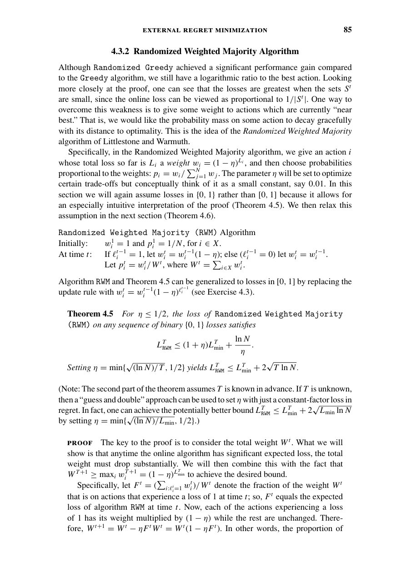

[Открыть страницу отдельно](../images/pages/p0106.jpg) · [Открыть страницу в PDF](../../materials/sources/Nisan-et-al-AGT-book.pdf#page=106)

**Theorem 4.5** — фрагмент оригинальной страницы:

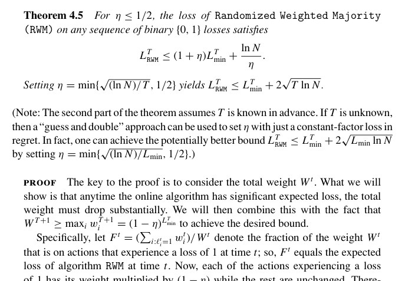

[Открыть фрагмент отдельно](../images/statements/p0106_theorem_4-5_01.png)

Поисковый текст страницы (формулы сверяйте с изображением)

~~~~text
external regret minimization
85
4.3.2 Randomized Weighted Majority Algorithm
Although Randomized Greedy achieved a significant performance gain compared
to the Greedy algorithm, we still have a logarithmic ratio to the best action. Looking
more closely at the proof, one can see that the losses are greatest when the sets St
are small, since the online loss can be viewed as proportional to 1/|St|. One way to
overcome this weakness is to give some weight to actions which are currently “near
best.” That is, we would like the probability mass on some action to decay gracefully
with its distance to optimality. This is the idea of the Randomized Weighted Majority
algorithm of Littlestone and Warmuth.
Specifically, in the Randomized Weighted Majority algorithm, we give an action i
whose total loss so far is Li a weight wi = (1 −η)Li, and then choose probabilities
proportional to the weights: pi = wi/ ⟦U+0001; см. снимок страницы⟧N
j=1 wj. The parameter η will be set to optimize
certain trade-offs but conceptually think of it as a small constant, say 0.01. In this
section we will again assume losses in {0, 1} rather than [0, 1] because it allows for
an especially intuitive interpretation of the proof (Theorem 4.5). We then relax this
assumption in the next section (Theorem 4.6).
Randomized Weighted Majority (RWM) Algorithm
Initially:
w1
i = 1 and p1
i = 1/N, for i ∈X.
At time t:
If ℓt−1
i
= 1, let wt
i = wt−1
i
(1 −η); else (ℓt−1
i
= 0) let wt
i = wt−1
i
.
Let pt
i = wt
i/W t, where W t = ⟦U+0001; см. снимок страницы⟧
i∈X wt
i.
Algorithm RWM and Theorem 4.5 can be generalized to losses in [0, 1] by replacing the
update rule with wt
i = wt−1
i
(1 −η)ℓt−1
i
(see Exercise 4.3).
Theorem 4.5
For η ≤1/2, the loss of Randomized Weighted Majority
(RWM) on any sequence of binary {0, 1} losses satisfies
LT
RWM ≤(1 + η)LT
min + ln N
η .
Setting η = min{√(ln N)/T , 1/2} yields LT
RWM ≤LT
min + 2
√
T ln N.
(Note: The second part of the theorem assumes T is known in advance. If T is unknown,
then a “guess and double” approach can be used to set η with just a constant-factor loss in
regret. In fact, one can achieve the potentially better bound LT
RWM ≤LT
min + 2√Lmin ln N
by setting η = min{√(ln N)/Lmin, 1/2}.)
proof
The key to the proof is to consider the total weight W t. What we will
show is that anytime the online algorithm has significant expected loss, the total
weight must drop substantially. We will then combine this with the fact that
W T +1 ≥maxi wT +1
i
= (1 −η)LT
min to achieve the desired bound.
Specifically, let F t = (⟦U+0001; см. снимок страницы⟧
i:ℓt
i=1 wt
i)/W t denote the fraction of the weight W t
that is on actions that experience a loss of 1 at time t; so, F t equals the expected
loss of algorithm RWM at time t. Now, each of the actions experiencing a loss
of 1 has its weight multiplied by (1 −η) while the rest are unchanged. There-
fore, W t+1 = W t −ηF tW t = W t(1 −ηF t). In other words, the proportion of
~~~~

### PDF стр. 107 · книжная стр. 86

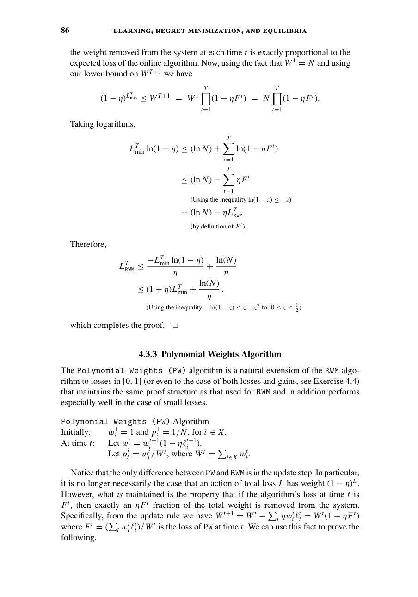

[Открыть страницу отдельно](../images/pages/p0107.jpg) · [Открыть страницу в PDF](../../materials/sources/Nisan-et-al-AGT-book.pdf#page=107)

Поисковый текст страницы (формулы сверяйте с изображением)

~~~~text
86
learning, regret minimization, and equilibria
the weight removed from the system at each time t is exactly proportional to the
expected loss of the online algorithm. Now, using the fact that W 1 = N and using
our lower bound on W T +1 we have
(1 −η)LT
min ≤W T +1 = W 1
T
t=1
(1 −ηF t) = N
T
t=1
(1 −ηF t).
Taking logarithms,
LT
min ln(1 −η) ≤(ln N) +
T
⟦U+0005; см. снимок страницы⟧
t=1
ln(1 −ηF t)
≤(ln N) −
T
⟦U+0005; см. снимок страницы⟧
t=1
ηF t
(Using the inequality ln(1 −z) ≤−z)
= (ln N) −ηLT
RWM
(by definition of F t)
Therefore,
LT
RWM ≤−LT
min ln(1 −η)
η
+ ln(N)
η
≤(1 + η)LT
min + ln(N)
η
,
(Using the inequality −ln(1 −z) ≤z + z2 for 0 ≤z ≤1
2 )
which completes the proof.
4.3.3 Polynomial Weights Algorithm
The Polynomial Weights (PW) algorithm is a natural extension of the RWM algo-
rithm to losses in [0, 1] (or even to the case of both losses and gains, see Exercise 4.4)
that maintains the same proof structure as that used for RWM and in addition performs
especially well in the case of small losses.
Polynomial Weights (PW) Algorithm
Initially:
w1
i = 1 and p1
i = 1/N, for i ∈X.
At time t:
Let wt
i = wt−1
i
(1 −ηℓt−1
i
).
Let pt
i = wt
i/W t, where W t = ⟦U+0001; см. снимок страницы⟧
i∈X wt
i.
Notice that the only difference between PW and RWM is in the update step. In particular,
it is no longer necessarily the case that an action of total loss L has weight (1 −η)L.
However, what is maintained is the property that if the algorithm’s loss at time t is
F t, then exactly an ηF t fraction of the total weight is removed from the system.
Specifically, from the update rule we have W t+1 = W t −⟦U+0001; см. снимок страницы⟧
i ηwt
iℓt
i = W t(1 −ηF t)
where F t = (⟦U+0001; см. снимок страницы⟧
i wt
iℓt
i)/W t is the loss of PW at time t. We can use this fact to prove the
following.
~~~~

### PDF стр. 108 · книжная стр. 87

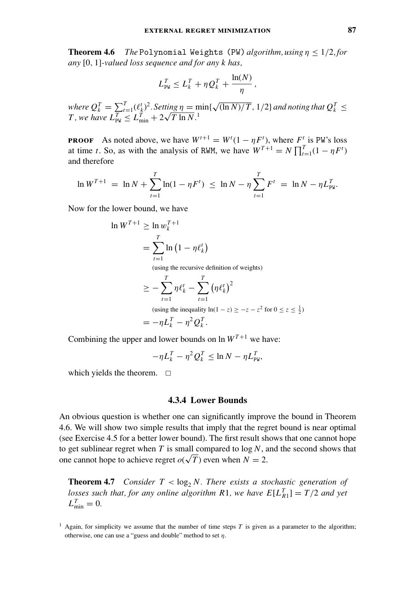

[Открыть страницу отдельно](../images/pages/p0108.jpg) · [Открыть страницу в PDF](../../materials/sources/Nisan-et-al-AGT-book.pdf#page=108)

**Theorem 4.6** — фрагмент оригинальной страницы:

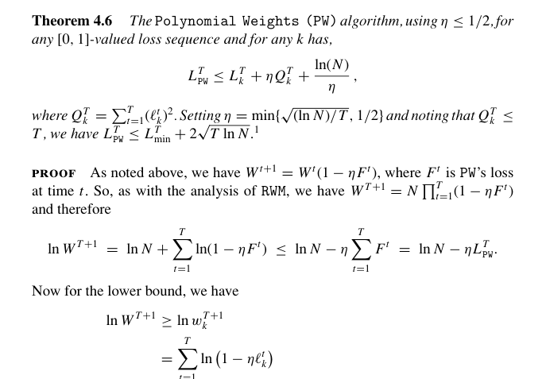

[Открыть фрагмент отдельно](../images/statements/p0108_theorem_4-6_01.png)

**Theorem 4.7** — фрагмент оригинальной страницы:

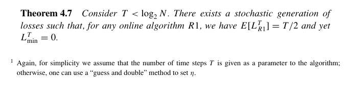

[Открыть фрагмент отдельно](../images/statements/p0108_theorem_4-7_02.png)

Поисковый текст страницы (формулы сверяйте с изображением)

~~~~text
external regret minimization
87
Theorem 4.6
The Polynomial Weights (PW) algorithm, using η ≤1/2, for
any [0, 1]-valued loss sequence and for any k has,
LT
PW ≤LT
k + ηQT
k + ln(N)
η
,
where QT
k = ⟦U+0001; см. снимок страницы⟧T
t=1(ℓt
k)2. Setting η = min{√(ln N)/T , 1/2} and noting that QT
k ≤
T , we have LT
PW ≤LT
min + 2
√
T ln N.1
proof
As noted above, we have W t+1 = W t(1 −ηF t), where F t is PW’s loss
at time t. So, as with the analysis of RWM, we have W T +1 = N
T
t=1(1 −ηF t)
and therefore
ln W T +1 = ln N +
T
⟦U+0005; см. снимок страницы⟧
t=1
ln(1 −ηF t) ≤ln N −η
T
⟦U+0005; см. снимок страницы⟧
t=1
F t = ln N −ηLT
PW.
Now for the lower bound, we have
ln W T +1 ≥ln wT +1
k
=
T
⟦U+0005; см. снимок страницы⟧
t=1
ln
⟦U+0006; см. снимок страницы⟧
1 −ηℓt
k
⟦U+0007; см. снимок страницы⟧
(using the recursive definition of weights)
≥−
T
⟦U+0005; см. снимок страницы⟧
t=1
ηℓt
k −
T
⟦U+0005; см. снимок страницы⟧
t=1
⟦U+0006; см. снимок страницы⟧
ηℓt
k
⟦U+0007; см. снимок страницы⟧2
(using the inequality ln(1 −z) ≥−z −z2 for 0 ≤z ≤1
2 )
= −ηLT
k −η2QT
k .
Combining the upper and lower bounds on ln W T +1 we have:
−ηLT
k −η2QT
k ≤ln N −ηLT
PW,
which yields the theorem.
4.3.4 Lower Bounds
An obvious question is whether one can significantly improve the bound in Theorem
4.6. We will show two simple results that imply that the regret bound is near optimal
(see Exercise 4.5 for a better lower bound). The first result shows that one cannot hope
to get sublinear regret when T is small compared to log N, and the second shows that
one cannot hope to achieve regret o(
√
T ) even when N = 2.
Theorem 4.7
Consider T < log2 N. There exists a stochastic generation of
losses such that, for any online algorithm R1, we have E[LT
R1] = T /2 and yet
LT
min = 0.
1 Again, for simplicity we assume that the number of time steps T is given as a parameter to the algorithm;
otherwise, one can use a “guess and double” method to set η.
~~~~

### PDF стр. 109 · книжная стр. 88

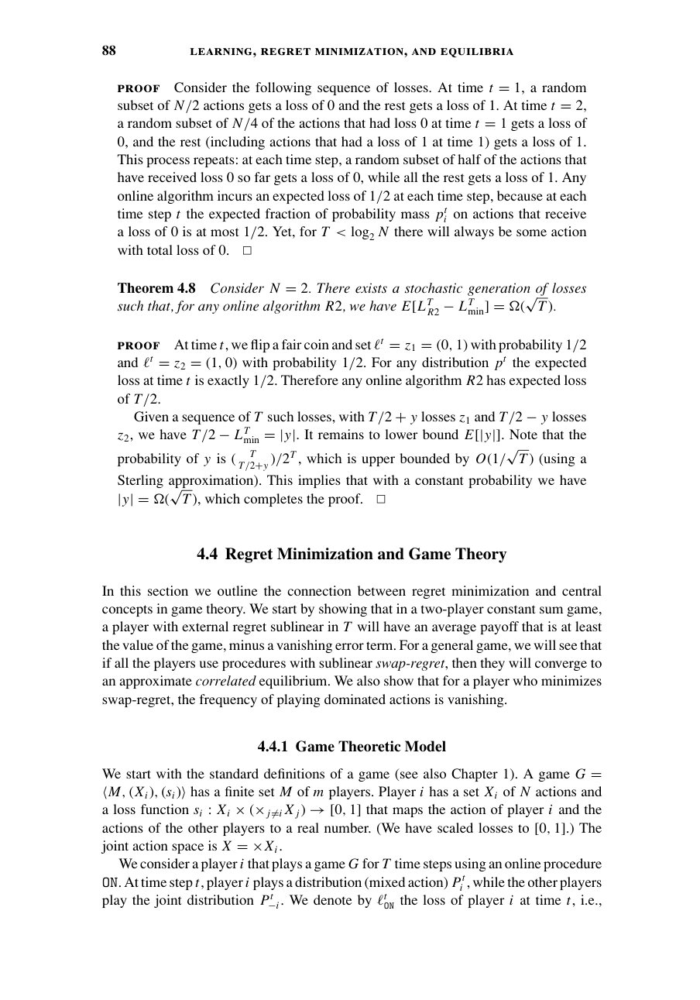

[Открыть страницу отдельно](../images/pages/p0109.jpg) · [Открыть страницу в PDF](../../materials/sources/Nisan-et-al-AGT-book.pdf#page=109)

**Theorem 4.8** — фрагмент оригинальной страницы:

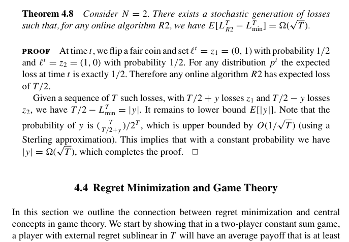

[Открыть фрагмент отдельно](../images/statements/p0109_theorem_4-8_01.png)

Поисковый текст страницы (формулы сверяйте с изображением)

~~~~text
88
learning, regret minimization, and equilibria
proof
Consider the following sequence of losses. At time t = 1, a random
subset of N/2 actions gets a loss of 0 and the rest gets a loss of 1. At time t = 2,
a random subset of N/4 of the actions that had loss 0 at time t = 1 gets a loss of
0, and the rest (including actions that had a loss of 1 at time 1) gets a loss of 1.
This process repeats: at each time step, a random subset of half of the actions that
have received loss 0 so far gets a loss of 0, while all the rest gets a loss of 1. Any
online algorithm incurs an expected loss of 1/2 at each time step, because at each
time step t the expected fraction of probability mass pt
i on actions that receive
a loss of 0 is at most 1/2. Yet, for T < log2 N there will always be some action
with total loss of 0.
Theorem 4.8
Consider N = 2. There exists a stochastic generation of losses
such that, for any online algorithm R2, we have E[LT
R2 −LT
min] = ⟦U+0006; см. снимок страницы⟧(
√
T ).
proof
At time t, we flip a fair coin and set ℓt = z1 = (0, 1) with probability 1/2
and ℓt = z2 = (1, 0) with probability 1/2. For any distribution pt the expected
loss at time t is exactly 1/2. Therefore any online algorithm R2 has expected loss
of T /2.
Given a sequence of T such losses, with T /2 + y losses z1 and T /2 −y losses
z2, we have T /2 −LT
min = |y|. It remains to lower bound E[|y|]. Note that the
probability of y is (
T
T/2+y )/2T , which is upper bounded by O(1/
√
T ) (using a
Sterling approximation). This implies that with a constant probability we have
|y| = ⟦U+0006; см. снимок страницы⟧(
√
T ), which completes the proof.
4.4 Regret Minimization and Game Theory
In this section we outline the connection between regret minimization and central
concepts in game theory. We start by showing that in a two-player constant sum game,
a player with external regret sublinear in T will have an average payoff that is at least
the value of the game, minus a vanishing error term. For a general game, we will see that
if all the players use procedures with sublinear swap-regret, then they will converge to
an approximate correlated equilibrium. We also show that for a player who minimizes
swap-regret, the frequency of playing dominated actions is vanishing.
4.4.1 Game Theoretic Model
We start with the standard definitions of a game (see also Chapter 1). A game G =
⟨M, (Xi), (si)⟩has a finite set M of m players. Player i has a set Xi of N actions and
a loss function si : Xi × (×j̸=iXj) →[0, 1] that maps the action of player i and the
actions of the other players to a real number. (We have scaled losses to [0, 1].) The
joint action space is X = ×Xi.
We consider a player i that plays a game G for T time steps using an online procedure
ON. At time step t, player i plays a distribution (mixed action) P t
i , while the other players
play the joint distribution P t
−i. We denote by ℓt
ON the loss of player i at time t, i.e.,
~~~~

### PDF стр. 110 · книжная стр. 89

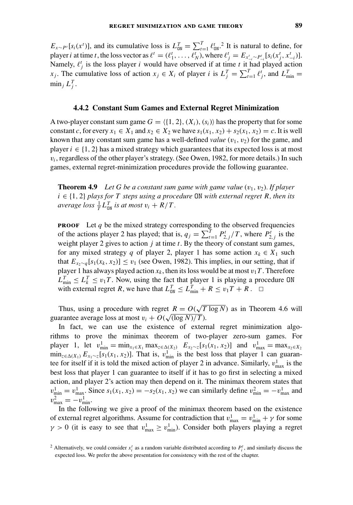

[Открыть страницу отдельно](../images/pages/p0110.jpg) · [Открыть страницу в PDF](../../materials/sources/Nisan-et-al-AGT-book.pdf#page=110)

**Theorem 4.9** — фрагмент оригинальной страницы:

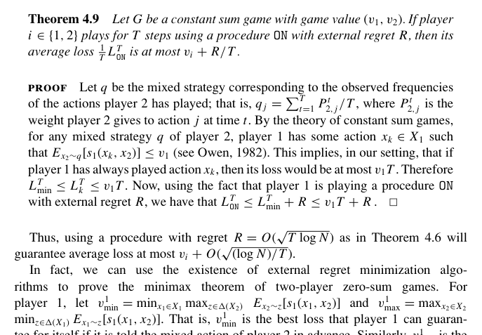

[Открыть фрагмент отдельно](../images/statements/p0110_theorem_4-9_01.png)

Поисковый текст страницы (формулы сверяйте с изображением)

~~~~text
regret minimization and game theory
89
Ex∼P t[si(xt)], and its cumulative loss is LT
ON = ⟦U+0001; см. снимок страницы⟧T
t=1 ℓt
ON.2 It is natural to define, for
player i at time t, the loss vector as ℓt = (ℓt
1, . . . , ℓt
N), where ℓt
j = Ext
−i∼P t
−i[si(xt
j, xt
−i)].
Namely, ℓt
j is the loss player i would have observed if at time t it had played action
xj. The cumulative loss of action xj ∈Xi of player i is LT
j = ⟦U+0001; см. снимок страницы⟧T
t=1 ℓt
j, and LT
min =
minj LT
j .
4.4.2 Constant Sum Games and External Regret Minimization
A two-player constant sum game G = ⟨{1, 2}, (Xi), (si)⟩has the property that for some
constant c, for every x1 ∈X1 and x2 ∈X2 we have s1(x1, x2) + s2(x1, x2) = c. It is well
known that any constant sum game has a well-defined value (v1, v2) for the game, and
player i ∈{1, 2} has a mixed strategy which guarantees that its expected loss is at most
vi, regardless of the other player’s strategy. (See Owen, 1982, for more details.) In such
games, external regret-minimization procedures provide the following guarantee.
Theorem 4.9
Let G be a constant sum game with game value (v1, v2). If player
i ∈{1, 2} plays for T steps using a procedure ON with external regret R, then its
average loss 1
T LT
ON is at most vi + R/T .
proof
Let q be the mixed strategy corresponding to the observed frequencies
of the actions player 2 has played; that is, qj = ⟦U+0001; см. снимок страницы⟧T
t=1 P t
2,j/T , where P t
2,j is the
weight player 2 gives to action j at time t. By the theory of constant sum games,
for any mixed strategy q of player 2, player 1 has some action xk ∈X1 such
that Ex2∼q[s1(xk, x2)] ≤v1 (see Owen, 1982). This implies, in our setting, that if
player 1 has always played action xk, then its loss would be at most v1T . Therefore
LT
min ≤LT
k ≤v1T . Now, using the fact that player 1 is playing a procedure ON
with external regret R, we have that LT
ON ≤LT
min + R ≤v1T + R .
Thus, using a procedure with regret R = O(√T log N) as in Theorem 4.6 will
guarantee average loss at most vi + O(√(log N)/T ).
In fact, we can use the existence of external regret minimization algo-
rithms to prove the minimax theorem of two-player zero-sum games. For
player 1, let v1
min = minx1∈X1 maxz∈⟦U+0007; см. снимок страницы⟧(X2) Ex2∼z[s1(x1, x2)] and v1
max = maxx2∈X2
minz∈⟦U+0007; см. снимок страницы⟧(X1) Ex1∼z[s1(x1, x2)]. That is, v1
min is the best loss that player 1 can guaran-
tee for itself if it is told the mixed action of player 2 in advance. Similarly, v1
max is the
best loss that player 1 can guarantee to itself if it has to go first in selecting a mixed
action, and player 2’s action may then depend on it. The minimax theorem states that
v1
min = v1
max. Since s1(x1, x2) = −s2(x1, x2) we can similarly define v2
min = −v1
max and
v2
max = −v1
min.
In the following we give a proof of the minimax theorem based on the existence
of external regret algorithms. Assume for contradiction that v1
max = v1
min + γ for some
γ > 0 (it is easy to see that v1
max ≥v1
min). Consider both players playing a regret
2 Alternatively, we could consider xt
i as a random variable distributed according to P t
i , and similarly discuss the
expected loss. We prefer the above presentation for consistency with the rest of the chapter.
~~~~

### PDF стр. 111 · книжная стр. 90

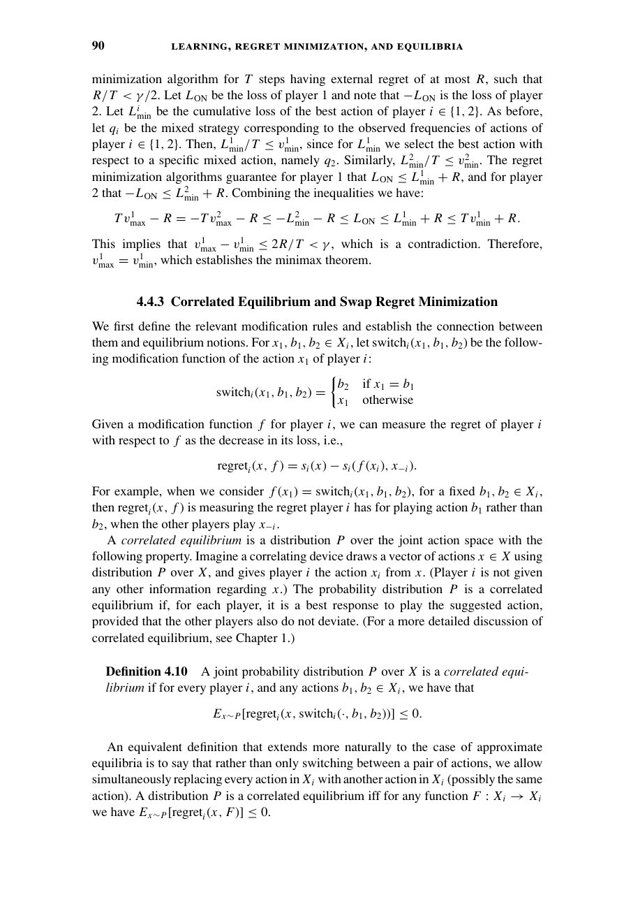

[Открыть страницу отдельно](../images/pages/p0111.jpg) · [Открыть страницу в PDF](../../materials/sources/Nisan-et-al-AGT-book.pdf#page=111)

**Definition 4.10** — фрагмент оригинальной страницы:

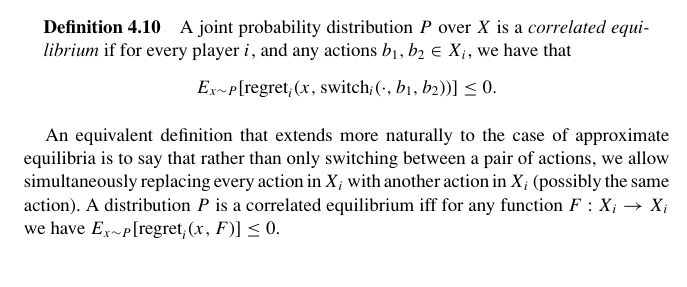

[Открыть фрагмент отдельно](../images/statements/p0111_definition_4-10_01.png)

Поисковый текст страницы (формулы сверяйте с изображением)

~~~~text
90
learning, regret minimization, and equilibria
minimization algorithm for T steps having external regret of at most R, such that
R/T < γ/2. Let LON be the loss of player 1 and note that −LON is the loss of player
2. Let Li
min be the cumulative loss of the best action of player i ∈{1, 2}. As before,
let qi be the mixed strategy corresponding to the observed frequencies of actions of
player i ∈{1, 2}. Then, L1
min/T ≤v1
min, since for L1
min we select the best action with
respect to a specific mixed action, namely q2. Similarly, L2
min/T ≤v2
min. The regret
minimization algorithms guarantee for player 1 that LON ≤L1
min + R, and for player
2 that −LON ≤L2
min + R. Combining the inequalities we have:
T v1
max −R = −T v2
max −R ≤−L2
min −R ≤LON ≤L1
min + R ≤T v1
min + R.
This implies that v1
max −v1
min ≤2R/T < γ , which is a contradiction. Therefore,
v1
max = v1
min, which establishes the minimax theorem.
4.4.3 Correlated Equilibrium and Swap Regret Minimization
We first define the relevant modification rules and establish the connection between
them and equilibrium notions. For x1, b1, b2 ∈Xi, let switchi(x1, b1, b2) be the follow-
ing modification function of the action x1 of player i:
switchi(x1, b1, b2) =
⟦U+000B; см. снимок страницы⟧b2
if x1 = b1
x1
otherwise
Given a modification function f for player i, we can measure the regret of player i
with respect to f as the decrease in its loss, i.e.,
regreti(x, f ) = si(x) −si(f (xi), x−i).
For example, when we consider f (x1) = switchi(x1, b1, b2), for a fixed b1, b2 ∈Xi,
then regreti(x, f ) is measuring the regret player i has for playing action b1 rather than
b2, when the other players play x−i.
A correlated equilibrium is a distribution P over the joint action space with the
following property. Imagine a correlating device draws a vector of actions x ∈X using
distribution P over X, and gives player i the action xi from x. (Player i is not given
any other information regarding x.) The probability distribution P is a correlated
equilibrium if, for each player, it is a best response to play the suggested action,
provided that the other players also do not deviate. (For a more detailed discussion of
correlated equilibrium, see Chapter 1.)
Definition 4.10
A joint probability distribution P over X is a correlated equi-
librium if for every player i, and any actions b1, b2 ∈Xi, we have that
Ex∼P [regreti(x, switchi(·, b1, b2))] ≤0.
An equivalent definition that extends more naturally to the case of approximate
equilibria is to say that rather than only switching between a pair of actions, we allow
simultaneously replacing every action in Xi with another action in Xi (possibly the same
action). A distribution P is a correlated equilibrium iff for any function F : Xi →Xi
we have Ex∼P [regreti(x, F)] ≤0.
~~~~

### PDF стр. 112 · книжная стр. 91

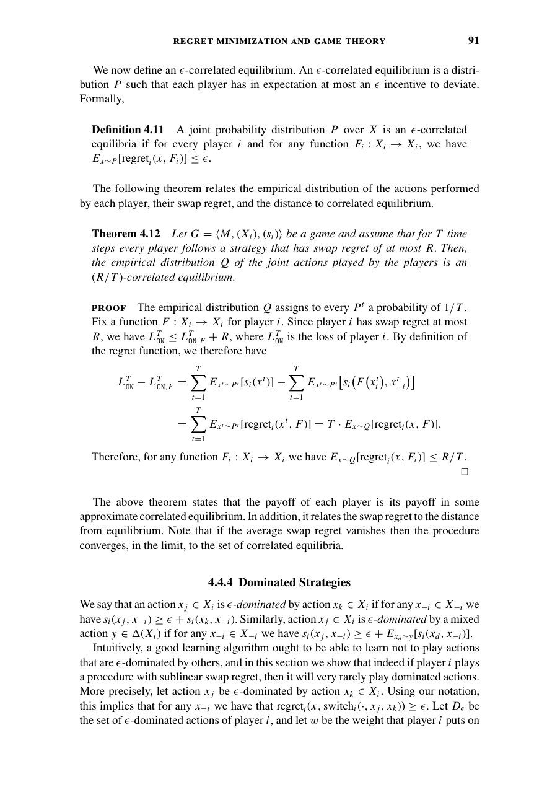

[Открыть страницу отдельно](../images/pages/p0112.jpg) · [Открыть страницу в PDF](../../materials/sources/Nisan-et-al-AGT-book.pdf#page=112)

**Definition 4.11** — фрагмент оригинальной страницы:

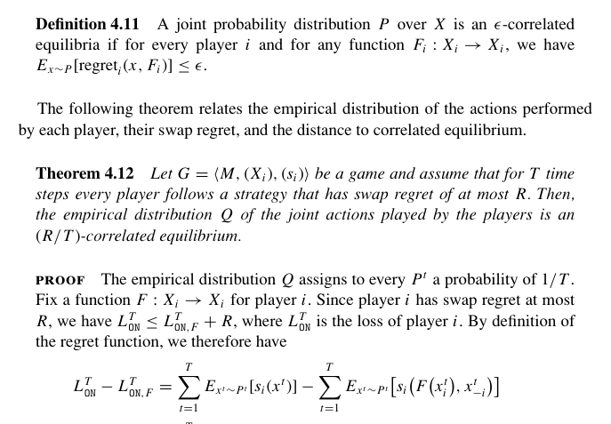

[Открыть фрагмент отдельно](../images/statements/p0112_definition_4-11_01.png)

**Theorem 4.12** — фрагмент оригинальной страницы:

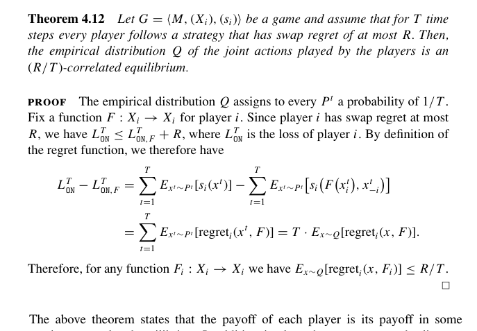

[Открыть фрагмент отдельно](../images/statements/p0112_theorem_4-12_02.png)

Поисковый текст страницы (формулы сверяйте с изображением)

~~~~text
regret minimization and game theory
91
We now define an ϵ-correlated equilibrium. An ϵ-correlated equilibrium is a distri-
bution P such that each player has in expectation at most an ϵ incentive to deviate.
Formally,
Definition 4.11
A joint probability distribution P over X is an ϵ-correlated
equilibria if for every player i and for any function Fi : Xi →Xi, we have
Ex∼P [regreti(x, Fi)] ≤ϵ.
The following theorem relates the empirical distribution of the actions performed
by each player, their swap regret, and the distance to correlated equilibrium.
Theorem 4.12
Let G = ⟨M, (Xi), (si)⟩be a game and assume that for T time
steps every player follows a strategy that has swap regret of at most R. Then,
the empirical distribution Q of the joint actions played by the players is an
(R/T )-correlated equilibrium.
proof
The empirical distribution Q assigns to every P t a probability of 1/T .
Fix a function F : Xi →Xi for player i. Since player i has swap regret at most
R, we have LT
ON ≤LT
ON,F + R, where LT
ON is the loss of player i. By definition of
the regret function, we therefore have
LT
ON −LT
ON,F =
T
⟦U+0005; см. снимок страницы⟧
t=1
Ext∼P t[si(xt)] −
T
⟦U+0005; см. снимок страницы⟧
t=1
Ext∼P t⟦U+000C; см. снимок страницы⟧
si
⟦U+0006; см. снимок страницы⟧
F
⟦U+0006; см. снимок страницы⟧
xt
i
⟦U+0007; см. снимок страницы⟧
, xt
−i
⟦U+0007; см. снимок страницы⟧⟦U+000D; см. снимок страницы⟧
=
T
⟦U+0005; см. снимок страницы⟧
t=1
Ext∼P t[regreti(xt, F)] = T · Ex∼Q[regreti(x, F)].
Therefore, for any function Fi : Xi →Xi we have Ex∼Q[regreti(x, Fi)] ≤R/T .
The above theorem states that the payoff of each player is its payoff in some
approximate correlated equilibrium. In addition, it relates the swap regret to the distance
from equilibrium. Note that if the average swap regret vanishes then the procedure
converges, in the limit, to the set of correlated equilibria.
4.4.4 Dominated Strategies
We say that an action xj ∈Xi is ϵ-dominated by action xk ∈Xi if for any x−i ∈X−i we
have si(xj, x−i) ≥ϵ + si(xk, x−i). Similarly, action xj ∈Xi is ϵ-dominated by a mixed
action y ∈⟦U+0007; см. снимок страницы⟧(Xi) if for any x−i ∈X−i we have si(xj, x−i) ≥ϵ + Exd∼y[si(xd, x−i)].
Intuitively, a good learning algorithm ought to be able to learn not to play actions
that are ϵ-dominated by others, and in this section we show that indeed if player i plays
a procedure with sublinear swap regret, then it will very rarely play dominated actions.
More precisely, let action xj be ϵ-dominated by action xk ∈Xi. Using our notation,
this implies that for any x−i we have that regreti(x, switchi(·, xj, xk)) ≥ϵ. Let Dϵ be
the set of ϵ-dominated actions of player i, and let w be the weight that player i puts on
~~~~

### PDF стр. 113 · книжная стр. 92

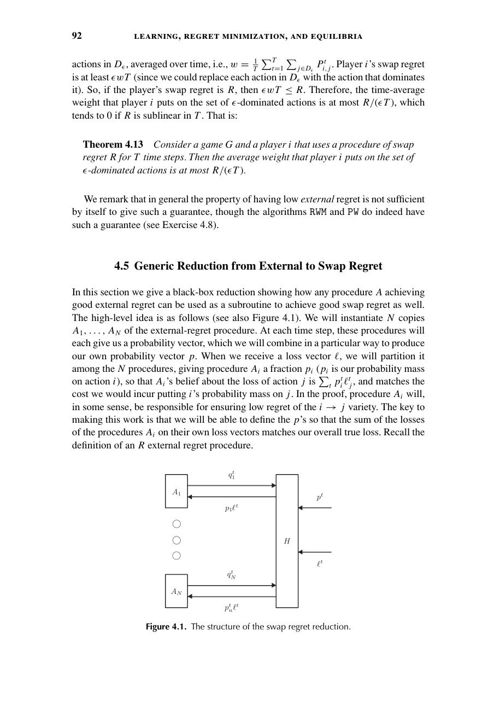

[Открыть страницу отдельно](../images/pages/p0113.jpg) · [Открыть страницу в PDF](../../materials/sources/Nisan-et-al-AGT-book.pdf#page=113)

**Theorem 4.13** — фрагмент оригинальной страницы:

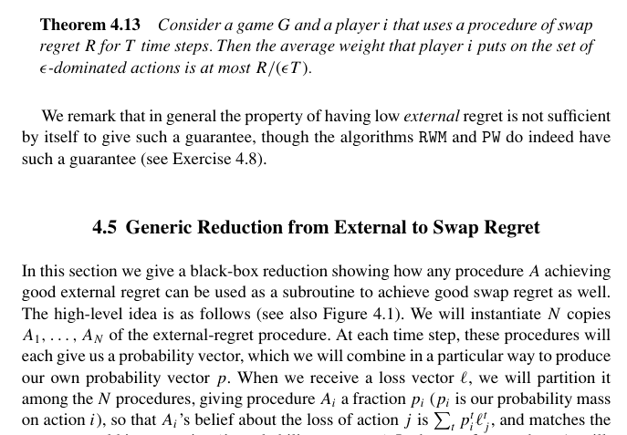

[Открыть фрагмент отдельно](../images/statements/p0113_theorem_4-13_01.png)

**Figure 4.1. The structure of the swap regret reduction.** — область рисунка или таблицы:

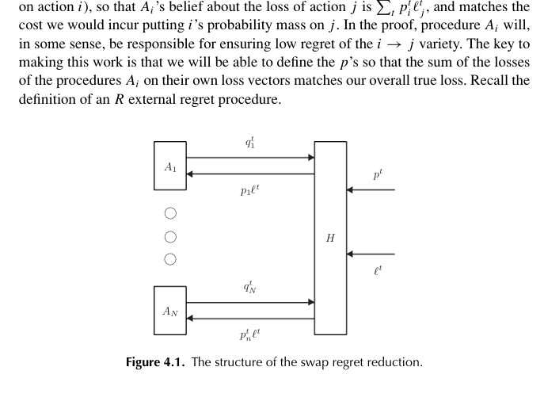

[Открыть фрагмент отдельно](../images/figures/p0113_figure_4-1_01.png)

Поисковый текст страницы (формулы сверяйте с изображением)

~~~~text
92
learning, regret minimization, and equilibria
actions in Dϵ, averaged over time, i.e., w = 1
T
⟦U+0001; см. снимок страницы⟧T
t=1
⟦U+0001; см. снимок страницы⟧
j∈Dϵ P t
i,j. Player i’s swap regret
is at least ϵwT (since we could replace each action in Dϵ with the action that dominates
it). So, if the player’s swap regret is R, then ϵwT ≤R. Therefore, the time-average
weight that player i puts on the set of ϵ-dominated actions is at most R/(ϵT ), which
tends to 0 if R is sublinear in T . That is:
Theorem 4.13
Consider a game G and a player i that uses a procedure of swap
regret R for T time steps. Then the average weight that player i puts on the set of
ϵ-dominated actions is at most R/(ϵT ).
We remark that in general the property of having low external regret is not sufficient
by itself to give such a guarantee, though the algorithms RWM and PW do indeed have
such a guarantee (see Exercise 4.8).
4.5 Generic Reduction from External to Swap Regret
In this section we give a black-box reduction showing how any procedure A achieving
good external regret can be used as a subroutine to achieve good swap regret as well.
The high-level idea is as follows (see also Figure 4.1). We will instantiate N copies
A1, . . . , AN of the external-regret procedure. At each time step, these procedures will
each give us a probability vector, which we will combine in a particular way to produce
our own probability vector p. When we receive a loss vector ℓ, we will partition it
among the N procedures, giving procedure Ai a fraction pi (pi is our probability mass
on action i), so that Ai’s belief about the loss of action j is ⟦U+0001; см. снимок страницы⟧
t pt
iℓt
j, and matches the
cost we would incur putting i’s probability mass on j. In the proof, procedure Ai will,
in some sense, be responsible for ensuring low regret of the i →j variety. The key to
making this work is that we will be able to define the p’s so that the sum of the losses
of the procedures Ai on their own loss vectors matches our overall true loss. Recall the
definition of an R external regret procedure.
AN
A1
H
qt
1
p ℓ
1 t
pt
nℓt
pt
t
qt
N
i
i
i
ℓ
Figure 4.1. The structure of the swap regret reduction.
~~~~

### PDF стр. 114 · книжная стр. 93

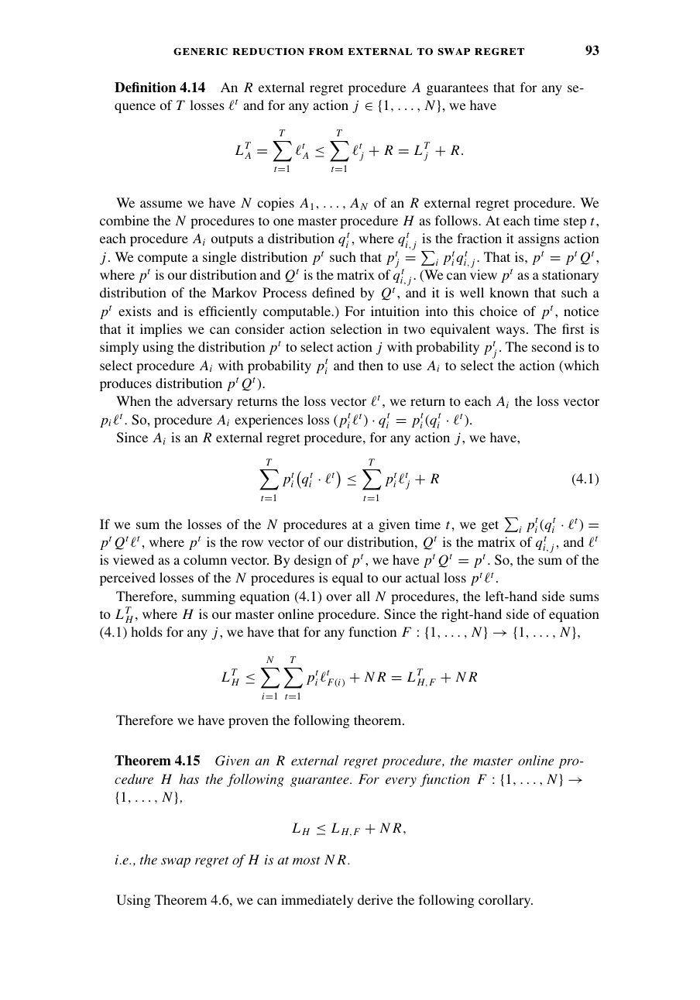

[Открыть страницу отдельно](../images/pages/p0114.jpg) · [Открыть страницу в PDF](../../materials/sources/Nisan-et-al-AGT-book.pdf#page=114)

**Definition 4.14** — фрагмент оригинальной страницы:

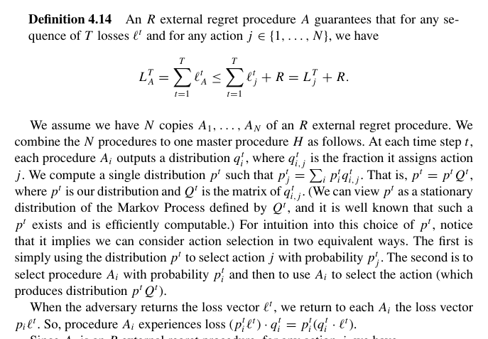

[Открыть фрагмент отдельно](../images/statements/p0114_definition_4-14_01.png)

**Theorem 4.15** — фрагмент оригинальной страницы:

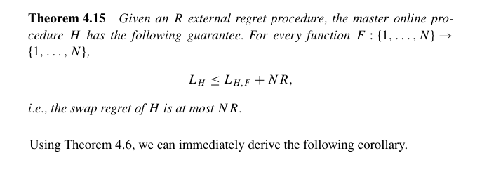

[Открыть фрагмент отдельно](../images/statements/p0114_theorem_4-15_02.png)

Поисковый текст страницы (формулы сверяйте с изображением)

~~~~text
generic reduction from external to swap regret
93
Definition 4.14
An R external regret procedure A guarantees that for any se-
quence of T losses ℓt and for any action j ∈{1, . . . , N}, we have
LT
A =
T
⟦U+0005; см. снимок страницы⟧
t=1
ℓt
A ≤
T
⟦U+0005; см. снимок страницы⟧
t=1
ℓt
j + R = LT
j + R.
We assume we have N copies A1, . . . , AN of an R external regret procedure. We
combine the N procedures to one master procedure H as follows. At each time step t,
each procedure Ai outputs a distribution qt
i , where qt
i,j is the fraction it assigns action
j. We compute a single distribution pt such that pt
j = ⟦U+0001; см. снимок страницы⟧
i pt
iqt
i,j. That is, pt = ptQt,
where pt is our distribution and Qt is the matrix of qt
i,j. (We can view pt as a stationary
distribution of the Markov Process defined by Qt, and it is well known that such a
pt exists and is efficiently computable.) For intuition into this choice of pt, notice
that it implies we can consider action selection in two equivalent ways. The first is
simply using the distribution pt to select action j with probability pt
j. The second is to
select procedure Ai with probability pt
i and then to use Ai to select the action (which
produces distribution ptQt).
When the adversary returns the loss vector ℓt, we return to each Ai the loss vector
piℓt. So, procedure Ai experiences loss (pt
iℓt) · qt
i = pt
i(qt
i · ℓt).
Since Ai is an R external regret procedure, for any action j, we have,
T
⟦U+0005; см. снимок страницы⟧
t=1
pt
i
⟦U+0006; см. снимок страницы⟧
qt
i · ℓt⟦U+0007; см. снимок страницы⟧
≤
T
⟦U+0005; см. снимок страницы⟧
t=1
pt
iℓt
j + R
(4.1)
If we sum the losses of the N procedures at a given time t, we get ⟦U+0001; см. снимок страницы⟧
i pt
i(qt
i · ℓt) =
ptQtℓt, where pt is the row vector of our distribution, Qt is the matrix of qt
i,j, and ℓt
is viewed as a column vector. By design of pt, we have ptQt = pt. So, the sum of the
perceived losses of the N procedures is equal to our actual loss ptℓt.
Therefore, summing equation (4.1) over all N procedures, the left-hand side sums
to LT
H, where H is our master online procedure. Since the right-hand side of equation
(4.1) holds for any j, we have that for any function F : {1, . . . , N} →{1, . . . , N},
LT
H ≤
N
⟦U+0005; см. снимок страницы⟧
i=1
T
⟦U+0005; см. снимок страницы⟧
t=1
pt
iℓt
F(i) + NR = LT
H,F + NR
Therefore we have proven the following theorem.
Theorem 4.15
Given an R external regret procedure, the master online pro-
cedure H has the following guarantee. For every function F : {1, . . . , N} →
{1, . . . , N},
LH ≤LH,F + NR,
i.e., the swap regret of H is at most NR.
Using Theorem 4.6, we can immediately derive the following corollary.
~~~~

### PDF стр. 115 · книжная стр. 94

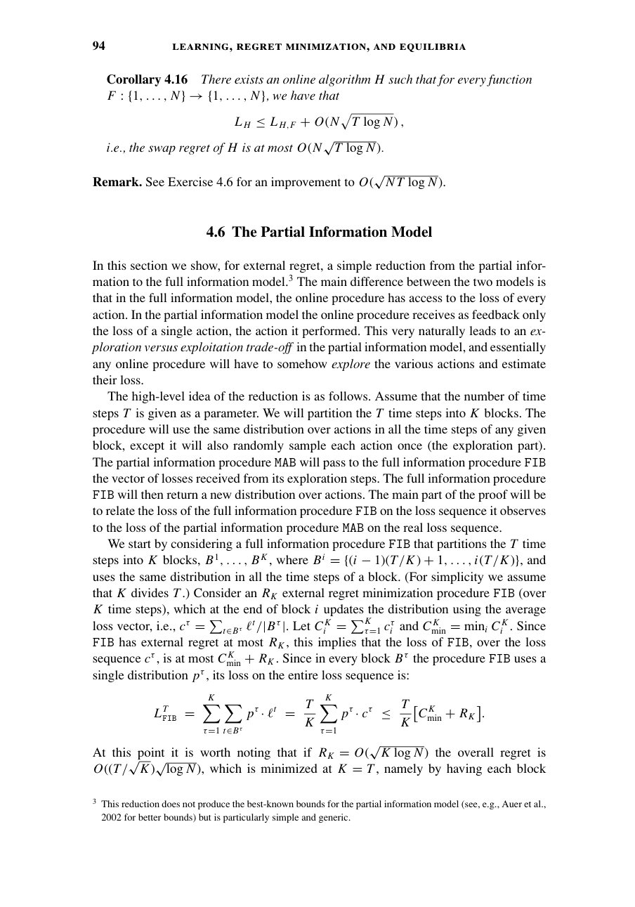

[Открыть страницу отдельно](../images/pages/p0115.jpg) · [Открыть страницу в PDF](../../materials/sources/Nisan-et-al-AGT-book.pdf#page=115)

**Corollary 4.16** — фрагмент оригинальной страницы:

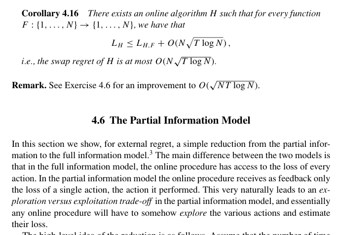

[Открыть фрагмент отдельно](../images/statements/p0115_corollary_4-16_01.png)

Поисковый текст страницы (формулы сверяйте с изображением)

~~~~text
94
learning, regret minimization, and equilibria
Corollary 4.16
There exists an online algorithm H such that for every function
F : {1, . . . , N} →{1, . . . , N}, we have that
LH ≤LH,F + O(N
⟦U+000E; см. снимок страницы⟧
T log N) ,
i.e., the swap regret of H is at most O(N√T log N).
Remark. See Exercise 4.6 for an improvement to O(√NT log N).
4.6 The Partial Information Model
In this section we show, for external regret, a simple reduction from the partial infor-
mation to the full information model.3 The main difference between the two models is
that in the full information model, the online procedure has access to the loss of every
action. In the partial information model the online procedure receives as feedback only
the loss of a single action, the action it performed. This very naturally leads to an ex-
ploration versus exploitation trade-off in the partial information model, and essentially
any online procedure will have to somehow explore the various actions and estimate
their loss.
The high-level idea of the reduction is as follows. Assume that the number of time
steps T is given as a parameter. We will partition the T time steps into K blocks. The
procedure will use the same distribution over actions in all the time steps of any given
block, except it will also randomly sample each action once (the exploration part).
The partial information procedure MAB will pass to the full information procedure FIB
the vector of losses received from its exploration steps. The full information procedure
FIB will then return a new distribution over actions. The main part of the proof will be
to relate the loss of the full information procedure FIB on the loss sequence it observes
to the loss of the partial information procedure MAB on the real loss sequence.
We start by considering a full information procedure FIB that partitions the T time
steps into K blocks, B1, . . . , BK, where Bi = {(i −1)(T /K) + 1, . . . , i(T /K)}, and
uses the same distribution in all the time steps of a block. (For simplicity we assume
that K divides T .) Consider an RK external regret minimization procedure FIB (over
K time steps), which at the end of block i updates the distribution using the average
loss vector, i.e., cτ = ⟦U+0001; см. снимок страницы⟧
t∈Bτ ℓt/|Bτ|. Let CK
i = ⟦U+0001; см. снимок страницы⟧K
τ=1 cτ
i and CK
min = mini CK
i . Since
FIB has external regret at most RK, this implies that the loss of FIB, over the loss
sequence cτ, is at most CK
min + RK. Since in every block Bτ the procedure FIB uses a
single distribution pτ, its loss on the entire loss sequence is:
LT
FIB =
K
⟦U+0005; см. снимок страницы⟧
τ=1
⟦U+0005; см. снимок страницы⟧
t∈Bτ
pτ · ℓt = T
K
K
⟦U+0005; см. снимок страницы⟧
τ=1
pτ · cτ ≤T
K
⟦U+000C; см. снимок страницы⟧
CK
min + RK
⟦U+000D; см. снимок страницы⟧
.
At this point it is worth noting that if RK = O(√K log N) the overall regret is
O((T /
√
K)√log N), which is minimized at K = T , namely by having each block
3 This reduction does not produce the best-known bounds for the partial information model (see, e.g., Auer et al.,
2002 for better bounds) but is particularly simple and generic.
~~~~

### PDF стр. 116 · книжная стр. 95

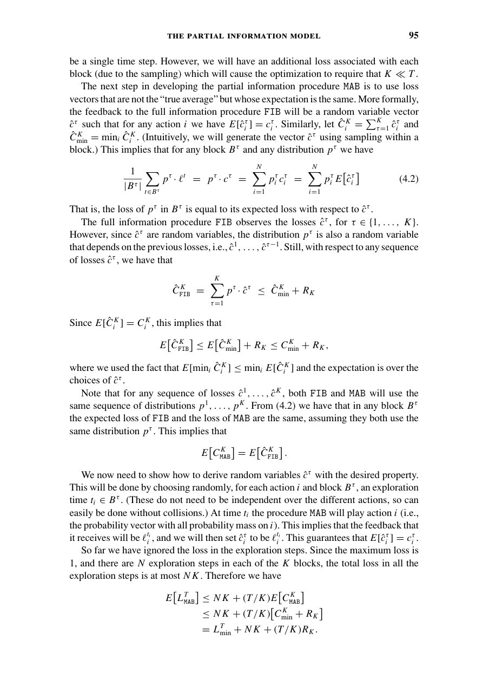

[Открыть страницу отдельно](../images/pages/p0116.jpg) · [Открыть страницу в PDF](../../materials/sources/Nisan-et-al-AGT-book.pdf#page=116)

Поисковый текст страницы (формулы сверяйте с изображением)

~~~~text
the partial information model
95
be a single time step. However, we will have an additional loss associated with each
block (due to the sampling) which will cause the optimization to require that K ≪T .
The next step in developing the partial information procedure MAB is to use loss
vectors that are not the “true average” but whose expectation is the same. More formally,
the feedback to the full information procedure FIB will be a random variable vector
ˆcτ such that for any action i we have E[ˆcτ
i ] = cτ
i . Similarly, let ˆCK
i = ⟦U+0001; см. снимок страницы⟧K
τ=1 ˆcτ
i and
ˆCK
min = mini ˆCK
i . (Intuitively, we will generate the vector ˆcτ using sampling within a
block.) This implies that for any block Bτ and any distribution pτ we have
1
|Bτ|
⟦U+0005; см. снимок страницы⟧
t∈Bτ
pτ · ℓt = pτ · cτ =
N
⟦U+0005; см. снимок страницы⟧
i=1
pτ
i cτ
i =
N
⟦U+0005; см. снимок страницы⟧
i=1
pτ
i E
⟦U+000C; см. снимок страницы⟧ˆcτ
i
⟦U+000D; см. снимок страницы⟧
(4.2)
That is, the loss of pτ in Bτ is equal to its expected loss with respect to ˆcτ.
The full information procedure FIB observes the losses ˆcτ, for τ ∈{1, . . . , K}.
However, since ˆcτ are random variables, the distribution pτ is also a random variable
that depends on the previous losses, i.e., ˆc1, . . . , ˆcτ−1. Still, with respect to any sequence
of losses ˆcτ, we have that
ˆCK
FIB =
K
⟦U+0005; см. снимок страницы⟧
τ=1
pτ · ˆcτ ≤ˆCK
min + RK
Since E[ ˆCK
i ] = CK
i , this implies that
E
⟦U+000C; см. снимок страницы⟧ ˆCK
FIB
⟦U+000D; см. снимок страницы⟧
≤E
⟦U+000C; см. снимок страницы⟧ ˆCK
min
⟦U+000D; см. снимок страницы⟧
+ RK ≤CK
min + RK,
where we used the fact that E[mini ˆCK
i ] ≤mini E[ ˆCK
i ] and the expectation is over the
choices of ˆcτ.
Note that for any sequence of losses ˆc1, . . . , ˆcK, both FIB and MAB will use the
same sequence of distributions p1, . . . , pK. From (4.2) we have that in any block Bτ
the expected loss of FIB and the loss of MAB are the same, assuming they both use the
same distribution pτ. This implies that
E
⟦U+000C; см. снимок страницы⟧
CK
MAB
⟦U+000D; см. снимок страницы⟧
= E
⟦U+000C; см. снимок страницы⟧ ˆCK
FIB
⟦U+000D; см. снимок страницы⟧
.
We now need to show how to derive random variables ˆcτ with the desired property.
This will be done by choosing randomly, for each action i and block Bτ, an exploration
time ti ∈Bτ. (These do not need to be independent over the different actions, so can
easily be done without collisions.) At time ti the procedure MAB will play action i (i.e.,
the probability vector with all probability mass on i). This implies that the feedback that
it receives will be ℓti
i , and we will then set ˆcτ
i to be ℓti
i . This guarantees that E[ˆcτ
i ] = cτ
i .
So far we have ignored the loss in the exploration steps. Since the maximum loss is
1, and there are N exploration steps in each of the K blocks, the total loss in all the
exploration steps is at most NK. Therefore we have
E
⟦U+000C; см. снимок страницы⟧
LT
MAB
⟦U+000D; см. снимок страницы⟧
≤NK + (T /K)E
⟦U+000C; см. снимок страницы⟧
CK
MAB
⟦U+000D; см. снимок страницы⟧
≤NK + (T /K)
⟦U+000C; см. снимок страницы⟧
CK
min + RK
⟦U+000D; см. снимок страницы⟧
= LT
min + NK + (T /K)RK.
~~~~

### PDF стр. 117 · книжная стр. 96

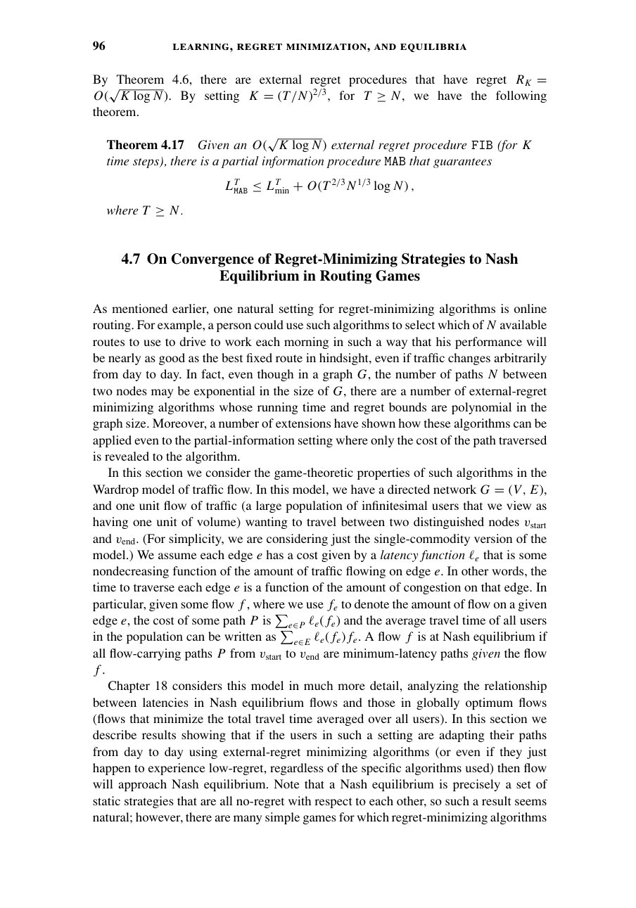

[Открыть страницу отдельно](../images/pages/p0117.jpg) · [Открыть страницу в PDF](../../materials/sources/Nisan-et-al-AGT-book.pdf#page=117)

**Theorem 4.17** — фрагмент оригинальной страницы:

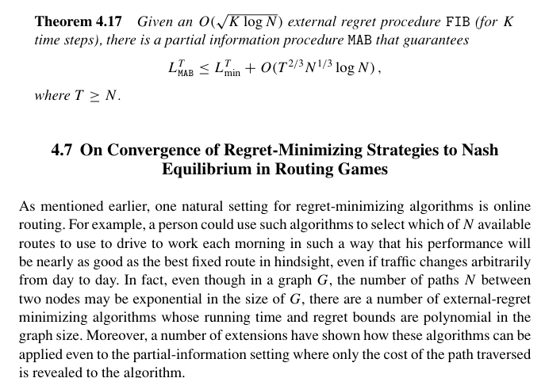

[Открыть фрагмент отдельно](../images/statements/p0117_theorem_4-17_01.png)

Поисковый текст страницы (формулы сверяйте с изображением)

~~~~text
96
learning, regret minimization, and equilibria
By Theorem 4.6, there are external regret procedures that have regret RK =
O(√K log N). By setting K = (T /N)2/3, for T ≥N, we have the following
theorem.
Theorem 4.17
Given an O(√K log N) external regret procedure FIB (for K
time steps), there is a partial information procedure MAB that guarantees
LT
MAB ≤LT
min + O(T 2/3N1/3 log N) ,
where T ≥N.
4.7 On Convergence of Regret-Minimizing Strategies to Nash
Equilibrium in Routing Games
As mentioned earlier, one natural setting for regret-minimizing algorithms is online
routing. For example, a person could use such algorithms to select which of N available
routes to use to drive to work each morning in such a way that his performance will
be nearly as good as the best fixed route in hindsight, even if traffic changes arbitrarily
from day to day. In fact, even though in a graph G, the number of paths N between
two nodes may be exponential in the size of G, there are a number of external-regret
minimizing algorithms whose running time and regret bounds are polynomial in the
graph size. Moreover, a number of extensions have shown how these algorithms can be
applied even to the partial-information setting where only the cost of the path traversed
is revealed to the algorithm.
In this section we consider the game-theoretic properties of such algorithms in the
Wardrop model of traffic flow. In this model, we have a directed network G = (V, E),
and one unit flow of traffic (a large population of infinitesimal users that we view as
having one unit of volume) wanting to travel between two distinguished nodes vstart
and vend. (For simplicity, we are considering just the single-commodity version of the
model.) We assume each edge e has a cost given by a latency function ℓe that is some
nondecreasing function of the amount of traffic flowing on edge e. In other words, the
time to traverse each edge e is a function of the amount of congestion on that edge. In
particular, given some flow f , where we use fe to denote the amount of flow on a given
edge e, the cost of some path P is ⟦U+0001; см. снимок страницы⟧
e∈P ℓe(fe) and the average travel time of all users
in the population can be written as ⟦U+0001; см. снимок страницы⟧
e∈E ℓe(fe)fe. A flow f is at Nash equilibrium if
all flow-carrying paths P from vstart to vend are minimum-latency paths given the flow
f .
Chapter 18 considers this model in much more detail, analyzing the relationship
between latencies in Nash equilibrium flows and those in globally optimum flows
(flows that minimize the total travel time averaged over all users). In this section we
describe results showing that if the users in such a setting are adapting their paths
from day to day using external-regret minimizing algorithms (or even if they just
happen to experience low-regret, regardless of the specific algorithms used) then flow
will approach Nash equilibrium. Note that a Nash equilibrium is precisely a set of
static strategies that are all no-regret with respect to each other, so such a result seems
natural; however, there are many simple games for which regret-minimizing algorithms
~~~~

### PDF стр. 118 · книжная стр. 97

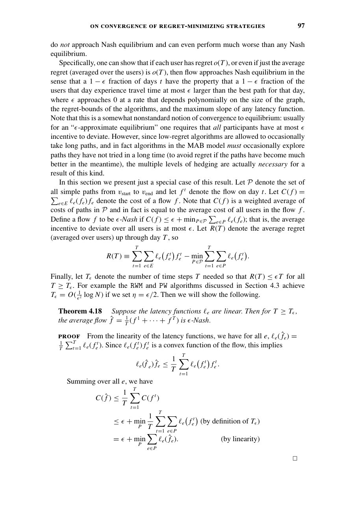

[Открыть страницу отдельно](../images/pages/p0118.jpg) · [Открыть страницу в PDF](../../materials/sources/Nisan-et-al-AGT-book.pdf#page=118)

**Theorem 4.18** — фрагмент оригинальной страницы:

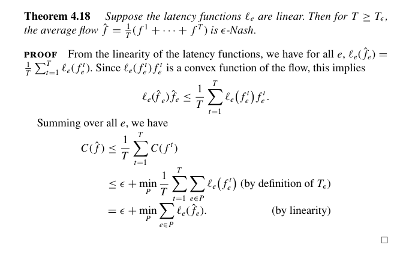

[Открыть фрагмент отдельно](../images/statements/p0118_theorem_4-18_01.png)

Поисковый текст страницы (формулы сверяйте с изображением)

~~~~text
on convergence of regret-minimizing strategies
97
do not approach Nash equilibrium and can even perform much worse than any Nash
equilibrium.
Specifically, one can show that if each user has regret o(T ), or even if just the average
regret (averaged over the users) is o(T ), then flow approaches Nash equilibrium in the
sense that a 1 −ϵ fraction of days t have the property that a 1 −ϵ fraction of the
users that day experience travel time at most ϵ larger than the best path for that day,
where ϵ approaches 0 at a rate that depends polynomially on the size of the graph,
the regret-bounds of the algorithms, and the maximum slope of any latency function.
Note that this is a somewhat nonstandard notion of convergence to equilibrium: usually
for an “ϵ-approximate equilibrium” one requires that all participants have at most ϵ
incentive to deviate. However, since low-regret algorithms are allowed to occasionally
take long paths, and in fact algorithms in the MAB model must occasionally explore
paths they have not tried in a long time (to avoid regret if the paths have become much
better in the meantime), the multiple levels of hedging are actually necessary for a
result of this kind.
In this section we present just a special case of this result. Let P denote the set of
all simple paths from vstart to vend and let f t denote the flow on day t. Let C(f ) =
⟦U+0001; см. снимок страницы⟧
e∈E ℓe(fe)fe denote the cost of a flow f . Note that C(f ) is a weighted average of
costs of paths in P and in fact is equal to the average cost of all users in the flow f .
Define a flow f to be ϵ-Nash if C(f ) ≤ϵ + minP∈P
⟦U+0001; см. снимок страницы⟧
e∈P ℓe(fe); that is, the average
incentive to deviate over all users is at most ϵ. Let R(T ) denote the average regret
(averaged over users) up through day T , so
R(T ) ≡
T
⟦U+0005; см. снимок страницы⟧
t=1
⟦U+0005; см. снимок страницы⟧
e∈E
ℓe
⟦U+0006; см. снимок страницы⟧
f t
e
⟦U+0007; см. снимок страницы⟧
f t
e −min
P∈P
T
⟦U+0005; см. снимок страницы⟧
t=1
⟦U+0005; см. снимок страницы⟧
e∈P
ℓe
⟦U+0006; см. снимок страницы⟧
f t
e
⟦U+0007; см. снимок страницы⟧
.
Finally, let Tϵ denote the number of time steps T needed so that R(T ) ≤ϵT for all
T ≥Tϵ. For example the RWM and PW algorithms discussed in Section 4.3 achieve
Tϵ = O( 1
ϵ2 log N) if we set η = ϵ/2. Then we will show the following.
Theorem 4.18
Suppose the latency functions ℓe are linear. Then for T ≥Tϵ,
the average flow ˆf = 1
T (f 1 + · · · + f T ) is ϵ-Nash.
proof
From the linearity of the latency functions, we have for all e, ℓe( ˆfe) =
1
T
⟦U+0001; см. снимок страницы⟧T
t=1 ℓe(f t
e ). Since ℓe(f t
e )f t
e is a convex function of the flow, this implies
ℓe(ˆf e) ˆfe ≤1
T
T
⟦U+0005; см. снимок страницы⟧
t=1
ℓe
⟦U+0006; см. снимок страницы⟧
f t
e
⟦U+0007; см. снимок страницы⟧
f t
e .
Summing over all e, we have
C( ˆf ) ≤1
T
T
⟦U+0005; см. снимок страницы⟧
t=1
C(f t)
≤ϵ + min
P
1
T
T
⟦U+0005; см. снимок страницы⟧
t=1
⟦U+0005; см. снимок страницы⟧
e∈P
ℓe
⟦U+0006; см. снимок страницы⟧
f t
e
⟦U+0007; см. снимок страницы⟧
(by definition of Tϵ)
= ϵ + min
P
⟦U+0005; см. снимок страницы⟧
e∈P
ℓe( ˆfe).
(by linearity)
~~~~

### PDF стр. 119 · книжная стр. 98

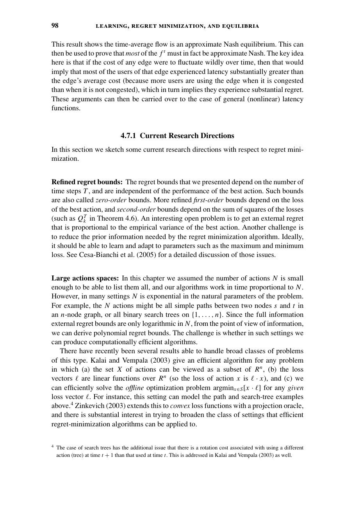

[Открыть страницу отдельно](../images/pages/p0119.jpg) · [Открыть страницу в PDF](../../materials/sources/Nisan-et-al-AGT-book.pdf#page=119)

Поисковый текст страницы (формулы сверяйте с изображением)

~~~~text
98
learning, regret minimization, and equilibria
This result shows the time-average flow is an approximate Nash equilibrium. This can
then be used to prove that most of the f t must in fact be approximate Nash. The key idea
here is that if the cost of any edge were to fluctuate wildly over time, then that would
imply that most of the users of that edge experienced latency substantially greater than
the edge’s average cost (because more users are using the edge when it is congested
than when it is not congested), which in turn implies they experience substantial regret.
These arguments can then be carried over to the case of general (nonlinear) latency
functions.
4.7.1 Current Research Directions
In this section we sketch some current research directions with respect to regret mini-
mization.
Refined regret bounds: The regret bounds that we presented depend on the number of
time steps T , and are independent of the performance of the best action. Such bounds
are also called zero-order bounds. More refined first-order bounds depend on the loss
of the best action, and second-order bounds depend on the sum of squares of the losses
(such as QT
k in Theorem 4.6). An interesting open problem is to get an external regret
that is proportional to the empirical variance of the best action. Another challenge is
to reduce the prior information needed by the regret minimization algorithm. Ideally,
it should be able to learn and adapt to parameters such as the maximum and minimum
loss. See Cesa-Bianchi et al. (2005) for a detailed discussion of those issues.
Large actions spaces: In this chapter we assumed the number of actions N is small
enough to be able to list them all, and our algorithms work in time proportional to N.
However, in many settings N is exponential in the natural parameters of the problem.
For example, the N actions might be all simple paths between two nodes s and t in
an n-node graph, or all binary search trees on {1, . . . , n}. Since the full information
external regret bounds are only logarithmic in N, from the point of view of information,
we can derive polynomial regret bounds. The challenge is whether in such settings we
can produce computationally efficient algorithms.
There have recently been several results able to handle broad classes of problems
of this type. Kalai and Vempala (2003) give an efficient algorithm for any problem
in which (a) the set X of actions can be viewed as a subset of Rn, (b) the loss
vectors ℓare linear functions over Rn (so the loss of action x is ℓ· x), and (c) we
can efficiently solve the offline optimization problem argminx∈S[x · ℓ] for any given
loss vector ℓ. For instance, this setting can model the path and search-tree examples
above.4 Zinkevich (2003) extends this to convex loss functions with a projection oracle,
and there is substantial interest in trying to broaden the class of settings that efficient
regret-minimization algorithms can be applied to.
4 The case of search trees has the additional issue that there is a rotation cost associated with using a different
action (tree) at time t + 1 than that used at time t. This is addressed in Kalai and Vempala (2003) as well.
~~~~

### PDF стр. 120 · книжная стр. 99

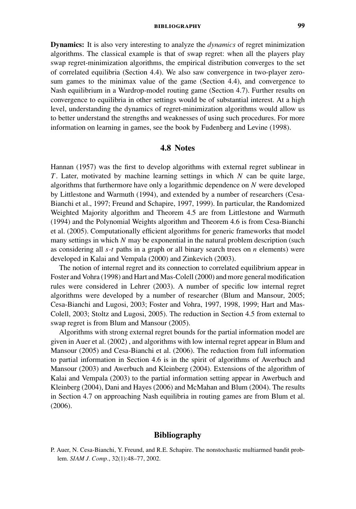

[Открыть страницу отдельно](../images/pages/p0120.jpg) · [Открыть страницу в PDF](../../materials/sources/Nisan-et-al-AGT-book.pdf#page=120)

Поисковый текст страницы (формулы сверяйте с изображением)

~~~~text
bibliography
99
Dynamics: It is also very interesting to analyze the dynamics of regret minimization
algorithms. The classical example is that of swap regret: when all the players play
swap regret-minimization algorithms, the empirical distribution converges to the set
of correlated equilibria (Section 4.4). We also saw convergence in two-player zero-
sum games to the minimax value of the game (Section 4.4), and convergence to
Nash equilibrium in a Wardrop-model routing game (Section 4.7). Further results on
convergence to equilibria in other settings would be of substantial interest. At a high
level, understanding the dynamics of regret-minimization algorithms would allow us
to better understand the strengths and weaknesses of using such procedures. For more
information on learning in games, see the book by Fudenberg and Levine (1998).
4.8 Notes
Hannan (1957) was the first to develop algorithms with external regret sublinear in
T . Later, motivated by machine learning settings in which N can be quite large,
algorithms that furthermore have only a logarithmic dependence on N were developed
by Littlestone and Warmuth (1994), and extended by a number of researchers (Cesa-
Bianchi et al., 1997; Freund and Schapire, 1997, 1999). In particular, the Randomized
Weighted Majority algorithm and Theorem 4.5 are from Littlestone and Warmuth
(1994) and the Polynomial Weights algorithm and Theorem 4.6 is from Cesa-Bianchi
et al. (2005). Computationally efficient algorithms for generic frameworks that model
many settings in which N may be exponential in the natural problem description (such
as considering all s-t paths in a graph or all binary search trees on n elements) were
developed in Kalai and Vempala (2000) and Zinkevich (2003).
The notion of internal regret and its connection to correlated equilibrium appear in
Foster and Vohra (1998) and Hart and Mas-Colell (2000) and more general modification
rules were considered in Lehrer (2003). A number of specific low internal regret
algorithms were developed by a number of researcher (Blum and Mansour, 2005;
Cesa-Bianchi and Lugosi, 2003; Foster and Vohra, 1997, 1998, 1999; Hart and Mas-
Colell, 2003; Stoltz and Lugosi, 2005). The reduction in Section 4.5 from external to
swap regret is from Blum and Mansour (2005).
Algorithms with strong external regret bounds for the partial information model are
given in Auer et al. (2002) , and algorithms with low internal regret appear in Blum and
Mansour (2005) and Cesa-Bianchi et al. (2006). The reduction from full information
to partial information in Section 4.6 is in the spirit of algorithms of Awerbuch and
Mansour (2003) and Awerbuch and Kleinberg (2004). Extensions of the algorithm of
Kalai and Vempala (2003) to the partial information setting appear in Awerbuch and
Kleinberg (2004), Dani and Hayes (2006) and McMahan and Blum (2004). The results
in Section 4.7 on approaching Nash equilibria in routing games are from Blum et al.
(2006).
Bibliography
P. Auer, N. Cesa-Bianchi, Y. Freund, and R.E. Schapire. The nonstochastic multiarmed bandit prob-
lem. SIAM J. Comp., 32(1):48–77, 2002.
~~~~

### PDF стр. 121 · книжная стр. 100

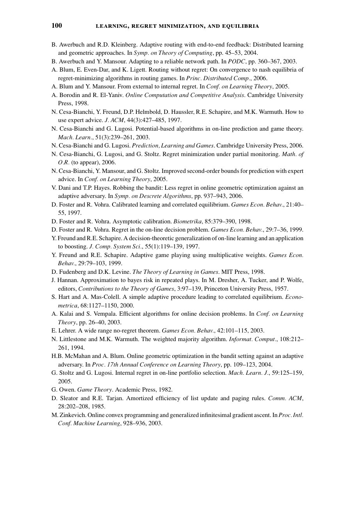

[Открыть страницу отдельно](../images/pages/p0121.jpg) · [Открыть страницу в PDF](../../materials/sources/Nisan-et-al-AGT-book.pdf#page=121)

Поисковый текст страницы (формулы сверяйте с изображением)

~~~~text
100
learning, regret minimization, and equilibria
B. Awerbuch and R.D. Kleinberg. Adaptive routing with end-to-end feedback: Distributed learning
and geometric approaches. In Symp. on Theory of Computing, pp. 45–53, 2004.
B. Awerbuch and Y. Mansour. Adapting to a reliable network path. In PODC, pp. 360–367, 2003.
A. Blum, E. Even-Dar, and K. Ligett. Routing without regret: On convergence to nash equilibria of
regret-minimizing algorithms in routing games. In Princ. Distributed Comp., 2006.
A. Blum and Y. Mansour. From external to internal regret. In Conf. on Learning Theory, 2005.
A. Borodin and R. El-Yaniv. Online Computation and Competitive Analysis. Cambridge University
Press, 1998.
N. Cesa-Bianchi, Y. Freund, D.P. Helmbold, D. Haussler, R.E. Schapire, and M.K. Warmuth. How to
use expert advice. J. ACM, 44(3):427–485, 1997.
N. Cesa-Bianchi and G. Lugosi. Potential-based algorithms in on-line prediction and game theory.
Mach. Learn., 51(3):239–261, 2003.
N. Cesa-Bianchi and G. Lugosi. Prediction, Learning and Games. Cambridge University Press, 2006.
N. Cesa-Bianchi, G. Lugosi, and G. Stoltz. Regret minimization under partial monitoring. Math. of
O.R. (to appear), 2006.
N. Cesa-Bianchi, Y. Mansour, and G. Stoltz. Improved second-order bounds for prediction with expert
advice. In Conf. on Learning Theory, 2005.
V. Dani and T.P. Hayes. Robbing the bandit: Less regret in online geometric optimization against an
adaptive adversary. In Symp. on Descrete Algorithms, pp. 937–943, 2006.
D. Foster and R. Vohra. Calibrated learning and correlated equilibrium. Games Econ. Behav., 21:40–
55, 1997.
D. Foster and R. Vohra. Asymptotic calibration. Biometrika, 85:379–390, 1998.
D. Foster and R. Vohra. Regret in the on-line decision problem. Games Econ. Behav., 29:7–36, 1999.
Y. Freund and R.E. Schapire. A decision-theoretic generalization of on-line learning and an application
to boosting. J. Comp. System Sci., 55(1):119–139, 1997.
Y. Freund and R.E. Schapire. Adaptive game playing using multiplicative weights. Games Econ.
Behav., 29:79–103, 1999.
D. Fudenberg and D.K. Levine. The Theory of Learning in Games. MIT Press, 1998.
J. Hannan. Approximation to bayes risk in repeated plays. In M. Dresher, A. Tucker, and P. Wolfe,
editors, Contributions to the Theory of Games, 3:97–139, Princeton University Press, 1957.
S. Hart and A. Mas-Colell. A simple adaptive procedure leading to correlated equilibrium. Econo-
metrica, 68:1127–1150, 2000.
A. Kalai and S. Vempala. Efficient algorithms for online decision problems. In Conf. on Learning
Theory, pp. 26–40, 2003.
E. Lehrer. A wide range no-regret theorem. Games Econ. Behav., 42:101–115, 2003.
N. Littlestone and M.K. Warmuth. The weighted majority algorithm. Informat. Comput., 108:212–
261, 1994.
H.B. McMahan and A. Blum. Online geometric optimization in the bandit setting against an adaptive
adversary. In Proc. 17th Annual Conference on Learning Theory, pp. 109–123, 2004.
G. Stoltz and G. Lugosi. Internal regret in on-line portfolio selection. Mach. Learn. J., 59:125–159,
2005.
G. Owen. Game Theory. Academic Press, 1982.
D. Sleator and R.E. Tarjan. Amortized efficiency of list update and paging rules. Comm. ACM,
28:202–208, 1985.
M. Zinkevich. Online convex programming and generalized infinitesimal gradient ascent. In Proc. Intl.
Conf. Machine Learning, 928–936, 2003.
~~~~

### PDF стр. 122 · книжная стр. 101

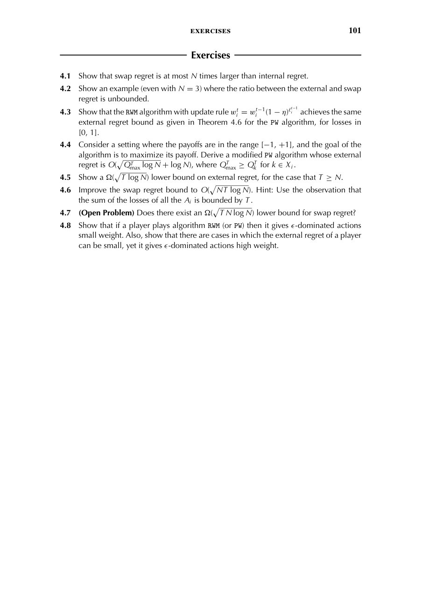

[Открыть страницу отдельно](../images/pages/p0122.jpg) · [Открыть страницу в PDF](../../materials/sources/Nisan-et-al-AGT-book.pdf#page=122)

Поисковый текст страницы (формулы сверяйте с изображением)

~~~~text
exercises
101
Exercises
4.1
Show that swap regret is at most N times larger than internal regret.
4.2
Show an example (even with N = 3) where the ratio between the external and swap
regret is unbounded.
4.3
Show that the RWM algorithm with update rule wt
i = wt−1
i
(1 −η)ℓt−1
i
achieves the same
external regret bound as given in Theorem 4.6 for the PW algorithm, for losses in
[0, 1].
4.4
Consider a setting where the payoffs are in the range [−1, +1], and the goal of the
algorithm is to maximize its payoff. Derive a modified PW algorithm whose external
regret is O(
⟦U+000E; см. снимок страницы⟧
QTmax log N + log N), where QT
max ≥QT
k for k ∈X i.
4.5
Show a ⟦U+0003; см. снимок страницы⟧(
⟦U+000E; см. снимок страницы⟧
T log N) lower bound on external regret, for the case that T ≥N.
4.6
Improve the swap regret bound to O(
⟦U+000E; см. снимок страницы⟧
NT log N). Hint: Use the observation that
the sum of the losses of all the Ai is bounded by T .
4.7
(Open Problem) Does there exist an ⟦U+0003; см. снимок страницы⟧(
⟦U+000E; см. снимок страницы⟧
T N log N) lower bound for swap regret?
4.8
Show that if a player plays algorithm RWM (or PW) then it gives ϵ-dominated actions
small weight. Also, show that there are cases in which the external regret of a player
can be small, yet it gives ϵ-dominated actions high weight.
~~~~

### PDF стр. 123 · книжная стр. 102

[Открыть страницу отдельно](../images/pages/p0123.jpg) · [Открыть страницу в PDF](../../materials/sources/Nisan-et-al-AGT-book.pdf#page=123)

Поисковый текст страницы (формулы сверяйте с изображением)

~~~~text
[На этой странице нет извлекаемого текстового слоя.]
~~~~

