# Глава 6. Computation of Market Equilibria by Convex Programming

**PDF-страницы:** 156–179. Изображения передают исходную страницу; извлечённый текст ниже нужен для поиска.

### Разделы

- [6.1 Introduction](#pdf-page-0156) — PDF стр. 156
- [6.1.1 Definitions: Models and Equilibrium](#pdf-page-0157) — PDF стр. 157
- [6.1.2 The Tˆatonnement Process](#pdf-page-0158) — PDF стр. 158
- [6.1.3 Approximate Equilibria](#pdf-page-0159) — PDF стр. 159
- [6.1.4 Gross Substitutability](#pdf-page-0159) — PDF стр. 159
- [6.1.5 Special Forms of the Utility Functions](#pdf-page-0160) — PDF стр. 160
- [6.1.6 Equilibrium vs Optimization](#pdf-page-0160) — PDF стр. 160
- [6.1.7 The Fisher Model](#pdf-page-0161) — PDF стр. 161
- [6.1.8 Overview](#pdf-page-0161) — PDF стр. 161
- [6.2 Fisher Model with Homogeneous Consumers](#pdf-page-0162) — PDF стр. 162
- [6.3 Exchange Economies Satisfying WGS](#pdf-page-0163) — PDF стр. 163
- [6.3.1 Computational Results](#pdf-page-0164) — PDF стр. 164
- [6.4 Specific Utility Functions](#pdf-page-0169) — PDF стр. 169
- [6.4.1 Convex Programs for Linear Exchange Economies](#pdf-page-0170) — PDF стр. 170
- [6.4.2 Convex Programs for CES Exchange Economies](#pdf-page-0170) — PDF стр. 170
- [6.5 Limitations](#pdf-page-0171) — PDF стр. 171
- [6.5.1 Multiple Disconnected Equilibria](#pdf-page-0172) — PDF стр. 172
- [6.5.2 Hardness for the Class PPAD](#pdf-page-0172) — PDF стр. 172
- [6.6 Models with Production](#pdf-page-0173) — PDF стр. 173
- [6.6.1 Inequalities Characterizing Equilibrium](#pdf-page-0175) — PDF стр. 175
- [6.6.2 Convex Programs for Specific Functions](#pdf-page-0176) — PDF стр. 176
- [6.7 Bibliographic Notes](#pdf-page-0176) — PDF стр. 176
[К содержанию](../README.md) · [К полному файлу](../00_full_book.md)

### PDF стр. 156 · книжная стр. 135

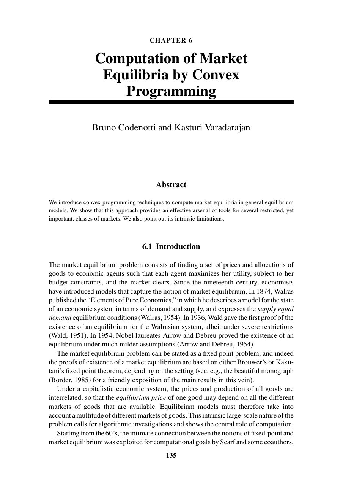

[Открыть страницу отдельно](../images/pages/p0156.jpg) · [Открыть страницу в PDF](../../materials/sources/Nisan-et-al-AGT-book.pdf#page=156)

Поисковый текст страницы (формулы сверяйте с изображением)

~~~~text
CHAPTER 6
Computation of Market
Equilibria by Convex
Programming
Bruno Codenotti and Kasturi Varadarajan
Abstract
We introduce convex programming techniques to compute market equilibria in general equilibrium
models. We show that this approach provides an effective arsenal of tools for several restricted, yet
important, classes of markets. We also point out its intrinsic limitations.
6.1 Introduction
The market equilibrium problem consists of finding a set of prices and allocations of
goods to economic agents such that each agent maximizes her utility, subject to her
budget constraints, and the market clears. Since the nineteenth century, economists
have introduced models that capture the notion of market equilibrium. In 1874, Walras
published the “Elements of Pure Economics,” in which he describes a model for the state
of an economic system in terms of demand and supply, and expresses the supply equal
demand equilibrium conditions (Walras, 1954). In 1936, Wald gave the first proof of the
existence of an equilibrium for the Walrasian system, albeit under severe restrictions
(Wald, 1951). In 1954, Nobel laureates Arrow and Debreu proved the existence of an
equilibrium under much milder assumptions (Arrow and Debreu, 1954).
The market equilibrium problem can be stated as a fixed point problem, and indeed
the proofs of existence of a market equilibrium are based on either Brouwer’s or Kaku-
tani’s fixed point theorem, depending on the setting (see, e.g., the beautiful monograph
(Border, 1985) for a friendly exposition of the main results in this vein).
Under a capitalistic economic system, the prices and production of all goods are
interrelated, so that the equilibrium price of one good may depend on all the different
markets of goods that are available. Equilibrium models must therefore take into
account a multitude of different markets of goods. This intrinsic large-scale nature of the
problem calls for algorithmic investigations and shows the central role of computation.
Starting from the 60’s, the intimate connection between the notions of fixed-point and
market equilibrium was exploited for computational goals by Scarf and some coauthors,
135
~~~~

### PDF стр. 157 · книжная стр. 136

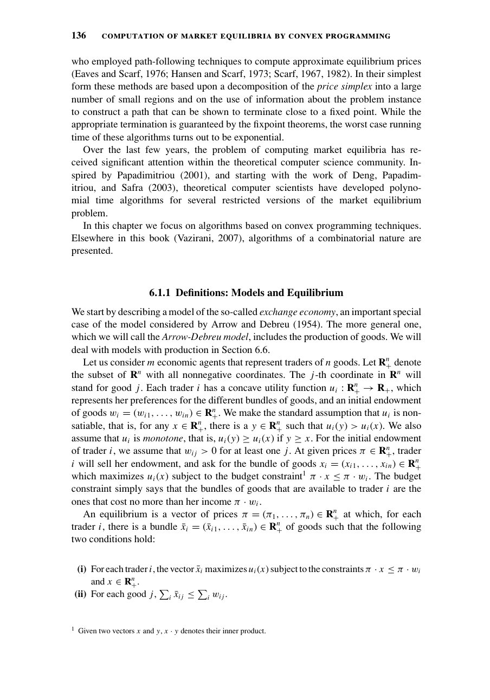

[Открыть страницу отдельно](../images/pages/p0157.jpg) · [Открыть страницу в PDF](../../materials/sources/Nisan-et-al-AGT-book.pdf#page=157)

Поисковый текст страницы (формулы сверяйте с изображением)

~~~~text
136
computation of market equilibria by convex programming
who employed path-following techniques to compute approximate equilibrium prices
(Eaves and Scarf, 1976; Hansen and Scarf, 1973; Scarf, 1967, 1982). In their simplest
form these methods are based upon a decomposition of the price simplex into a large
number of small regions and on the use of information about the problem instance
to construct a path that can be shown to terminate close to a fixed point. While the
appropriate termination is guaranteed by the fixpoint theorems, the worst case running
time of these algorithms turns out to be exponential.
Over the last few years, the problem of computing market equilibria has re-
ceived significant attention within the theoretical computer science community. In-
spired by Papadimitriou (2001), and starting with the work of Deng, Papadim-
itriou, and Safra (2003), theoretical computer scientists have developed polyno-
mial time algorithms for several restricted versions of the market equilibrium
problem.
In this chapter we focus on algorithms based on convex programming techniques.
Elsewhere in this book (Vazirani, 2007), algorithms of a combinatorial nature are
presented.
6.1.1 Definitions: Models and Equilibrium
We start by describing a model of the so-called exchange economy, an important special
case of the model considered by Arrow and Debreu (1954). The more general one,
which we will call the Arrow-Debreu model, includes the production of goods. We will
deal with models with production in Section 6.6.
Let us consider m economic agents that represent traders of n goods. Let Rn
+ denote
the subset of Rn with all nonnegative coordinates. The j-th coordinate in Rn will
stand for good j. Each trader i has a concave utility function ui : Rn
+ →R+, which
represents her preferences for the different bundles of goods, and an initial endowment
of goods wi = (wi1, . . . , win) ∈Rn
+. We make the standard assumption that ui is non-
satiable, that is, for any x ∈Rn
+, there is a y ∈Rn
+ such that ui(y) > ui(x). We also
assume that ui is monotone, that is, ui(y) ≥ui(x) if y ≥x. For the initial endowment
of trader i, we assume that wij > 0 for at least one j. At given prices π ∈Rn
+, trader
i will sell her endowment, and ask for the bundle of goods xi = (xi1, . . . , xin) ∈Rn
+
which maximizes ui(x) subject to the budget constraint1 π · x ≤π · wi. The budget
constraint simply says that the bundles of goods that are available to trader i are the
ones that cost no more than her income π · wi.
An equilibrium is a vector of prices π = (π1, . . . , πn) ∈Rn
+ at which, for each
trader i, there is a bundle ¯xi = (¯xi1, . . . , ¯xin) ∈Rn
+ of goods such that the following
two conditions hold:
(i) For each trader i, the vector ¯xi maximizes ui(x) subject to the constraints π · x ≤π · wi
and x ∈Rn
+.
(ii) For each good j, ⟦U+0001; см. снимок страницы⟧
i ¯xij ≤⟦U+0001; см. снимок страницы⟧
i wij.
1 Given two vectors x and y, x · y denotes their inner product.
~~~~

### PDF стр. 158 · книжная стр. 137

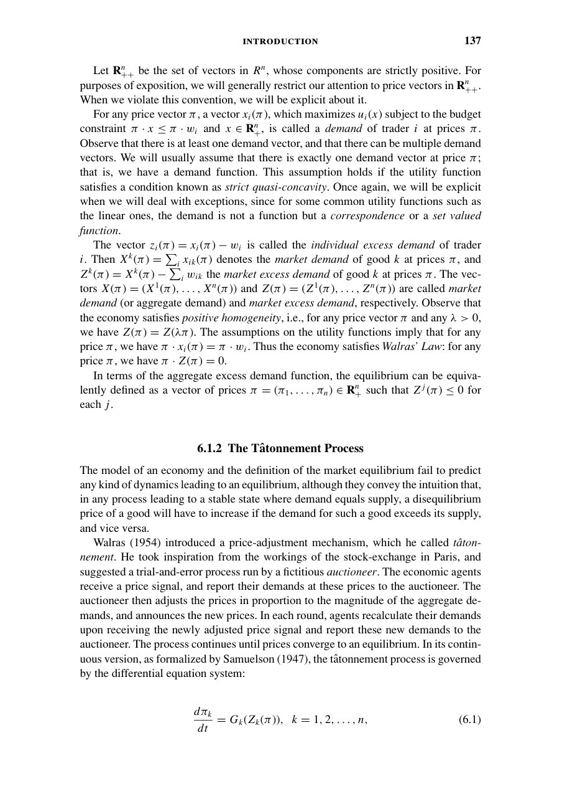

[Открыть страницу отдельно](../images/pages/p0158.jpg) · [Открыть страницу в PDF](../../materials/sources/Nisan-et-al-AGT-book.pdf#page=158)

Поисковый текст страницы (формулы сверяйте с изображением)

~~~~text
introduction
137
Let Rn
++ be the set of vectors in Rn, whose components are strictly positive. For
purposes of exposition, we will generally restrict our attention to price vectors in Rn
++.
When we violate this convention, we will be explicit about it.
For any price vector π, a vector xi(π), which maximizes ui(x) subject to the budget
constraint π · x ≤π · wi and x ∈Rn
+, is called a demand of trader i at prices π.
Observe that there is at least one demand vector, and that there can be multiple demand
vectors. We will usually assume that there is exactly one demand vector at price π;
that is, we have a demand function. This assumption holds if the utility function
satisfies a condition known as strict quasi-concavity. Once again, we will be explicit
when we will deal with exceptions, since for some common utility functions such as
the linear ones, the demand is not a function but a correspondence or a set valued
function.
The vector zi(π) = xi(π) −wi is called the individual excess demand of trader
i. Then Xk(π) = ⟦U+0001; см. снимок страницы⟧
i xik(π) denotes the market demand of good k at prices π, and
Zk(π) = Xk(π) −⟦U+0001; см. снимок страницы⟧
i wik the market excess demand of good k at prices π. The vec-
tors X(π) = (X1(π), . . . , Xn(π)) and Z(π) = (Z1(π), . . . , Zn(π)) are called market
demand (or aggregate demand) and market excess demand, respectively. Observe that
the economy satisfies positive homogeneity, i.e., for any price vector π and any λ > 0,
we have Z(π) = Z(λπ). The assumptions on the utility functions imply that for any
price π, we have π · xi(π) = π · wi. Thus the economy satisfies Walras’ Law: for any
price π, we have π · Z(π) = 0.
In terms of the aggregate excess demand function, the equilibrium can be equiva-
lently defined as a vector of prices π = (π1, . . . , πn) ∈Rn
+ such that Zj(π) ≤0 for
each j.
6.1.2 The Tˆatonnement Process
The model of an economy and the definition of the market equilibrium fail to predict
any kind of dynamics leading to an equilibrium, although they convey the intuition that,
in any process leading to a stable state where demand equals supply, a disequilibrium
price of a good will have to increase if the demand for such a good exceeds its supply,
and vice versa.
Walras (1954) introduced a price-adjustment mechanism, which he called tˆaton-
nement. He took inspiration from the workings of the stock-exchange in Paris, and
suggested a trial-and-error process run by a fictitious auctioneer. The economic agents
receive a price signal, and report their demands at these prices to the auctioneer. The
auctioneer then adjusts the prices in proportion to the magnitude of the aggregate de-
mands, and announces the new prices. In each round, agents recalculate their demands
upon receiving the newly adjusted price signal and report these new demands to the
auctioneer. The process continues until prices converge to an equilibrium. In its contin-
uous version, as formalized by Samuelson (1947), the tˆatonnement process is governed
by the differential equation system:
dπk
dt = Gk(Zk(π)), k = 1, 2, . . . , n,
(6.1)
~~~~

### PDF стр. 159 · книжная стр. 138

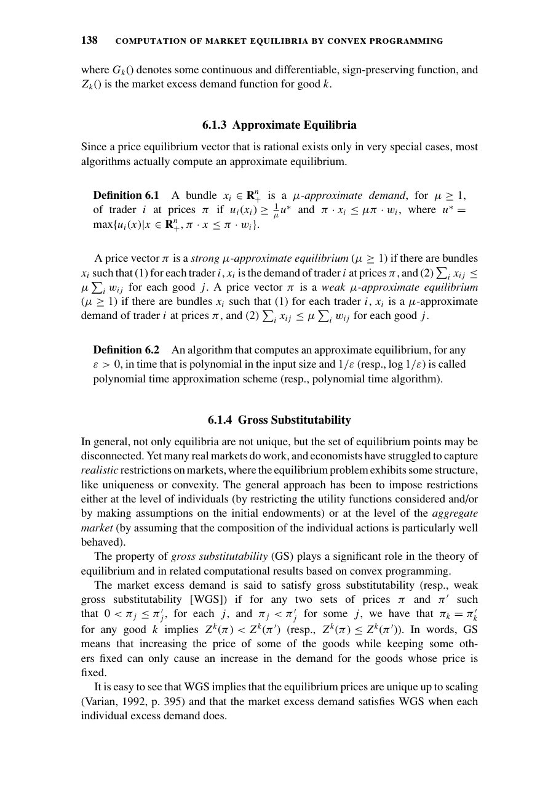

[Открыть страницу отдельно](../images/pages/p0159.jpg) · [Открыть страницу в PDF](../../materials/sources/Nisan-et-al-AGT-book.pdf#page=159)

**Definition 6.1** — фрагмент оригинальной страницы:

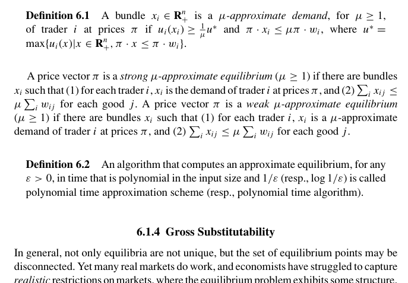

[Открыть фрагмент отдельно](../images/statements/p0159_definition_6-1_01.png)

**Definition 6.2** — фрагмент оригинальной страницы:

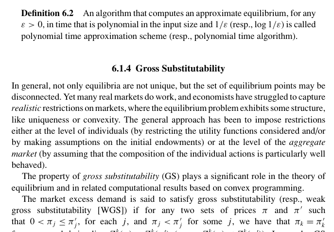

[Открыть фрагмент отдельно](../images/statements/p0159_definition_6-2_02.png)

Поисковый текст страницы (формулы сверяйте с изображением)

~~~~text
138
computation of market equilibria by convex programming
where Gk() denotes some continuous and differentiable, sign-preserving function, and
Zk() is the market excess demand function for good k.
6.1.3 Approximate Equilibria
Since a price equilibrium vector that is rational exists only in very special cases, most
algorithms actually compute an approximate equilibrium.
Definition 6.1
A bundle xi ∈Rn
+ is a µ-approximate demand, for µ ≥1,
of trader i at prices π if ui(xi) ≥1
µu∗and π · xi ≤µπ · wi, where u∗=
max{ui(x)|x ∈Rn
+, π · x ≤π · wi}.
A price vector π is a strong µ-approximate equilibrium (µ ≥1) if there are bundles
xi such that (1) for each trader i, xi is the demand of trader i at prices π, and (2) ⟦U+0001; см. снимок страницы⟧
i xij ≤
µ ⟦U+0001; см. снимок страницы⟧
i wij for each good j. A price vector π is a weak µ-approximate equilibrium
(µ ≥1) if there are bundles xi such that (1) for each trader i, xi is a µ-approximate
demand of trader i at prices π, and (2) ⟦U+0001; см. снимок страницы⟧
i xij ≤µ ⟦U+0001; см. снимок страницы⟧
i wij for each good j.
Definition 6.2
An algorithm that computes an approximate equilibrium, for any
ε > 0, in time that is polynomial in the input size and 1/ε (resp., log 1/ε) is called
polynomial time approximation scheme (resp., polynomial time algorithm).
6.1.4 Gross Substitutability
In general, not only equilibria are not unique, but the set of equilibrium points may be
disconnected. Yet many real markets do work, and economists have struggled to capture
realistic restrictions on markets, where the equilibrium problem exhibits some structure,
like uniqueness or convexity. The general approach has been to impose restrictions
either at the level of individuals (by restricting the utility functions considered and/or
by making assumptions on the initial endowments) or at the level of the aggregate
market (by assuming that the composition of the individual actions is particularly well
behaved).
The property of gross substitutability (GS) plays a significant role in the theory of
equilibrium and in related computational results based on convex programming.
The market excess demand is said to satisfy gross substitutability (resp., weak
gross substitutability [WGS]) if for any two sets of prices π and π′ such
that 0 < πj ≤π′
j, for each j, and πj < π′
j for some j, we have that πk = π′
k
for any good k implies Zk(π) < Zk(π′) (resp., Zk(π) ≤Zk(π′)). In words, GS
means that increasing the price of some of the goods while keeping some oth-
ers fixed can only cause an increase in the demand for the goods whose price is
fixed.
It is easy to see that WGS implies that the equilibrium prices are unique up to scaling
(Varian, 1992, p. 395) and that the market excess demand satisfies WGS when each
individual excess demand does.
~~~~

### PDF стр. 160 · книжная стр. 139

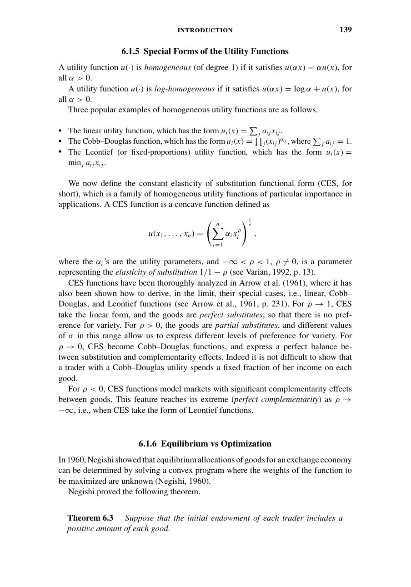

[Открыть страницу отдельно](../images/pages/p0160.jpg) · [Открыть страницу в PDF](../../materials/sources/Nisan-et-al-AGT-book.pdf#page=160)

**Theorem 6.3** — фрагмент оригинальной страницы:

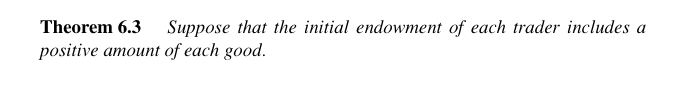

[Открыть фрагмент отдельно](../images/statements/p0160_theorem_6-3_01.png)

Начало следующей страницы для проверки продолжения: 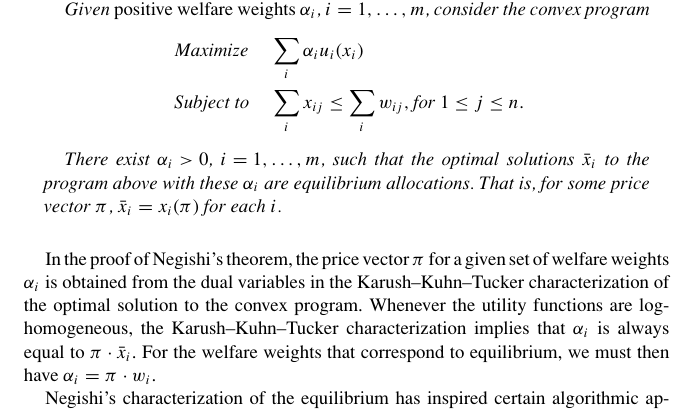

Поисковый текст страницы (формулы сверяйте с изображением)

~~~~text
introduction
139
6.1.5 Special Forms of the Utility Functions
A utility function u(·) is homogeneous (of degree 1) if it satisfies u(αx) = αu(x), for
all α > 0.
A utility function u(·) is log-homogeneous if it satisfies u(αx) = log α + u(x), for
all α > 0.
Three popular examples of homogeneous utility functions are as follows.
r The linear utility function, which has the form ui(x) = ⟦U+0001; см. снимок страницы⟧
j aijxij.
r The Cobb–Douglas function, which has the form ui(x) = ⟦U+0002; см. снимок страницы⟧
j(xij)aij , where ⟦U+0001; см. снимок страницы⟧
j aij = 1.
r The Leontief (or fixed-proportions) utility function, which has the form ui(x) =
minj aijxij.
We now define the constant elasticity of substitution functional form (CES, for
short), which is a family of homogeneous utility functions of particular importance in
applications. A CES function is a concave function defined as
u(x1, . . . , xn) =
⟦U+0003; см. снимок страницы⟧ n
⟦U+0004; см. снимок страницы⟧
i=1
αixρ
i
⟦U+0005; см. снимок страницы⟧ 1
ρ
,
where the αi’s are the utility parameters, and −∞< ρ < 1, ρ̸ = 0, is a parameter
representing the elasticity of substitution 1/1 −ρ (see Varian, 1992, p. 13).
CES functions have been thoroughly analyzed in Arrow et al. (1961), where it has
also been shown how to derive, in the limit, their special cases, i.e., linear, Cobb–
Douglas, and Leontief functions (see Arrow et al., 1961, p. 231). For ρ →1, CES
take the linear form, and the goods are perfect substitutes, so that there is no pref-
erence for variety. For ρ > 0, the goods are partial substitutes, and different values
of σ in this range allow us to express different levels of preference for variety. For
ρ →0, CES become Cobb–Douglas functions, and express a perfect balance be-
tween substitution and complementarity effects. Indeed it is not difficult to show that
a trader with a Cobb–Douglas utility spends a fixed fraction of her income on each
good.
For ρ < 0, CES functions model markets with significant complementarity effects
between goods. This feature reaches its extreme (perfect complementarity) as ρ →
−∞, i.e., when CES take the form of Leontief functions.
6.1.6 Equilibrium vs Optimization
In 1960, Negishi showed that equilibrium allocations of goods for an exchange economy
can be determined by solving a convex program where the weights of the function to
be maximized are unknown (Negishi, 1960).
Negishi proved the following theorem.
Theorem 6.3
Suppose that the initial endowment of each trader includes a
positive amount of each good.
~~~~

### PDF стр. 161 · книжная стр. 140

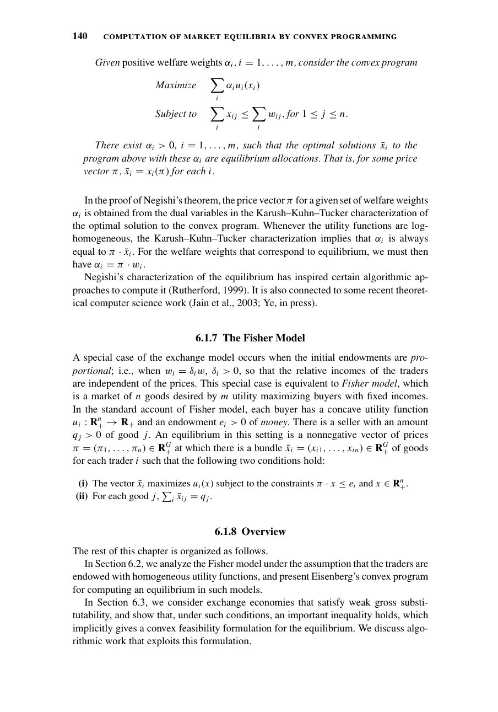

[Открыть страницу отдельно](../images/pages/p0161.jpg) · [Открыть страницу в PDF](../../materials/sources/Nisan-et-al-AGT-book.pdf#page=161)

Поисковый текст страницы (формулы сверяйте с изображением)

~~~~text
140
computation of market equilibria by convex programming
Given positive welfare weights αi, i = 1, . . . , m, consider the convex program
Maximize
⟦U+0004; см. снимок страницы⟧
i
αiui(xi)
Subject to
⟦U+0004; см. снимок страницы⟧
i
xij ≤
⟦U+0004; см. снимок страницы⟧
i
wij, for 1 ≤j ≤n.
There exist αi > 0, i = 1, . . . , m, such that the optimal solutions ¯xi to the
program above with these αi are equilibrium allocations. That is, for some price
vector π, ¯xi = xi(π) for each i.
In the proof of Negishi’s theorem, the price vector π for a given set of welfare weights
αi is obtained from the dual variables in the Karush–Kuhn–Tucker characterization of
the optimal solution to the convex program. Whenever the utility functions are log-
homogeneous, the Karush–Kuhn–Tucker characterization implies that αi is always
equal to π · ¯xi. For the welfare weights that correspond to equilibrium, we must then
have αi = π · wi.
Negishi’s characterization of the equilibrium has inspired certain algorithmic ap-
proaches to compute it (Rutherford, 1999). It is also connected to some recent theoret-
ical computer science work (Jain et al., 2003; Ye, in press).
6.1.7 The Fisher Model
A special case of the exchange model occurs when the initial endowments are pro-
portional; i.e., when wi = δiw, δi > 0, so that the relative incomes of the traders
are independent of the prices. This special case is equivalent to Fisher model, which
is a market of n goods desired by m utility maximizing buyers with fixed incomes.
In the standard account of Fisher model, each buyer has a concave utility function
ui : Rn
+ →R+ and an endowment ei > 0 of money. There is a seller with an amount
qj > 0 of good j. An equilibrium in this setting is a nonnegative vector of prices
π = (π1, . . . , πn) ∈RG
+ at which there is a bundle ¯xi = (xi1, . . . , xin) ∈RG
+ of goods
for each trader i such that the following two conditions hold:
(i) The vector ¯xi maximizes ui(x) subject to the constraints π · x ≤ei and x ∈Rn
+.
(ii) For each good j, ⟦U+0001; см. снимок страницы⟧
i ¯xij = qj.
6.1.8 Overview
The rest of this chapter is organized as follows.
In Section 6.2, we analyze the Fisher model under the assumption that the traders are
endowed with homogeneous utility functions, and present Eisenberg’s convex program
for computing an equilibrium in such models.
In Section 6.3, we consider exchange economies that satisfy weak gross substi-
tutability, and show that, under such conditions, an important inequality holds, which
implicitly gives a convex feasibility formulation for the equilibrium. We discuss algo-
rithmic work that exploits this formulation.
~~~~

### PDF стр. 162 · книжная стр. 141

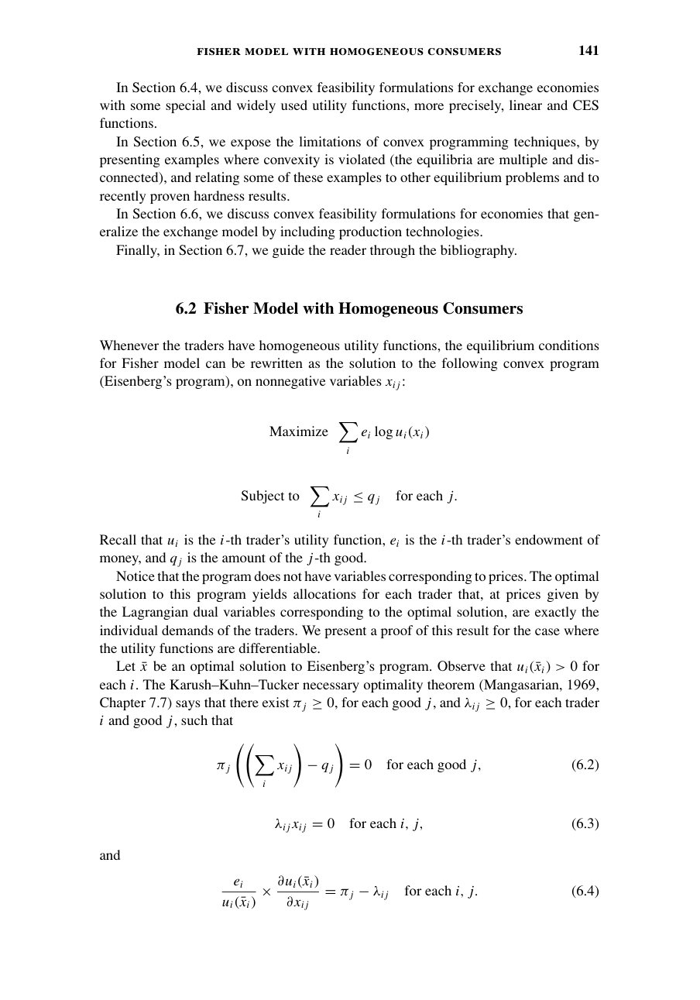

[Открыть страницу отдельно](../images/pages/p0162.jpg) · [Открыть страницу в PDF](../../materials/sources/Nisan-et-al-AGT-book.pdf#page=162)

Поисковый текст страницы (формулы сверяйте с изображением)

~~~~text
fisher model with homogeneous consumers
141
In Section 6.4, we discuss convex feasibility formulations for exchange economies
with some special and widely used utility functions, more precisely, linear and CES
functions.
In Section 6.5, we expose the limitations of convex programming techniques, by
presenting examples where convexity is violated (the equilibria are multiple and dis-
connected), and relating some of these examples to other equilibrium problems and to
recently proven hardness results.
In Section 6.6, we discuss convex feasibility formulations for economies that gen-
eralize the exchange model by including production technologies.
Finally, in Section 6.7, we guide the reader through the bibliography.
6.2 Fisher Model with Homogeneous Consumers
Whenever the traders have homogeneous utility functions, the equilibrium conditions
for Fisher model can be rewritten as the solution to the following convex program
(Eisenberg’s program), on nonnegative variables xij:
Maximize
⟦U+0004; см. снимок страницы⟧
i
ei log ui(xi)
Subject to
⟦U+0004; см. снимок страницы⟧
i
xij ≤qj
for each j.
Recall that ui is the i-th trader’s utility function, ei is the i-th trader’s endowment of
money, and qj is the amount of the j-th good.
Notice that the program does not have variables corresponding to prices. The optimal
solution to this program yields allocations for each trader that, at prices given by
the Lagrangian dual variables corresponding to the optimal solution, are exactly the
individual demands of the traders. We present a proof of this result for the case where
the utility functions are differentiable.
Let ¯x be an optimal solution to Eisenberg’s program. Observe that ui(¯xi) > 0 for
each i. The Karush–Kuhn–Tucker necessary optimality theorem (Mangasarian, 1969,
Chapter 7.7) says that there exist πj ≥0, for each good j, and λij ≥0, for each trader
i and good j, such that
πj
⟦U+0003; см. снимок страницы⟧⟦U+0003; см. снимок страницы⟧⟦U+0004; см. снимок страницы⟧
i
xij
⟦U+0005; см. снимок страницы⟧
−qj
⟦U+0005; см. снимок страницы⟧
= 0
for each good j,
(6.2)
λijxij = 0
for each i, j,
(6.3)
and
ei
ui(¯xi) × ∂ui(¯xi)
∂xij
= πj −λij
for each i, j.
(6.4)
~~~~

### PDF стр. 163 · книжная стр. 142

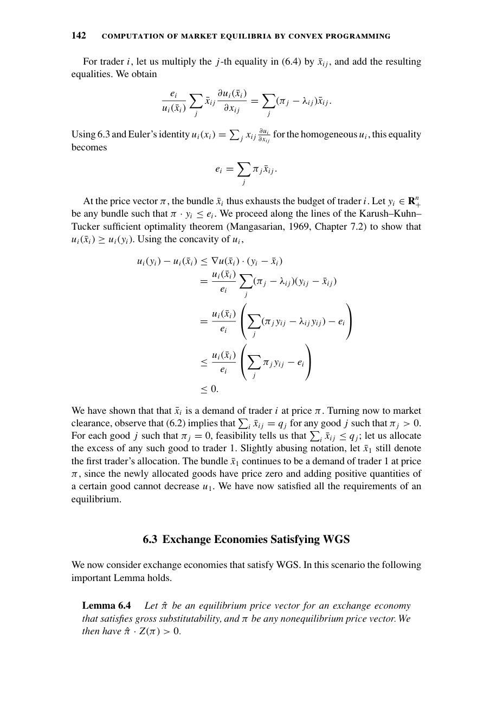

[Открыть страницу отдельно](../images/pages/p0163.jpg) · [Открыть страницу в PDF](../../materials/sources/Nisan-et-al-AGT-book.pdf#page=163)

**Lemma 6.4** — фрагмент оригинальной страницы:

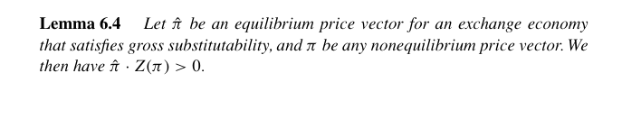

[Открыть фрагмент отдельно](../images/statements/p0163_lemma_6-4_01.png)

Начало следующей страницы для проверки продолжения: 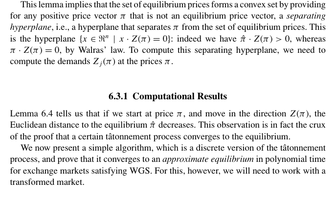

Поисковый текст страницы (формулы сверяйте с изображением)

~~~~text
142
computation of market equilibria by convex programming
For trader i, let us multiply the j-th equality in (6.4) by ¯xij, and add the resulting
equalities. We obtain
ei
ui(¯xi)
⟦U+0004; см. снимок страницы⟧
j
¯xij
∂ui(¯xi)
∂xij
=
⟦U+0004; см. снимок страницы⟧
j
(πj −λij)¯xij.
Using 6.3 and Euler’s identity ui(xi) = ⟦U+0001; см. снимок страницы⟧
j xij
∂ui
∂xij for the homogeneous ui, this equality
becomes
ei =
⟦U+0004; см. снимок страницы⟧
j
πj ¯xij.
At the price vector π, the bundle ¯xi thus exhausts the budget of trader i. Let yi ∈Rn
+
be any bundle such that π · yi ≤ei. We proceed along the lines of the Karush–Kuhn–
Tucker sufficient optimality theorem (Mangasarian, 1969, Chapter 7.2) to show that
ui(¯xi) ≥ui(yi). Using the concavity of ui,
ui(yi) −ui(¯xi) ≤∇u(¯xi) · (yi −¯xi)
= ui(¯xi)
ei
⟦U+0004; см. снимок страницы⟧
j
(πj −λij)(yij −¯xij)
= ui(¯xi)
ei
⎛
⎝⟦U+0004; см. снимок страницы⟧
j
(πjyij −λijyij) −ei
⎞
⎠
≤ui(¯xi)
ei
⎛
⎝⟦U+0004; см. снимок страницы⟧
j
πjyij −ei
⎞
⎠
≤0.
We have shown that that ¯xi is a demand of trader i at price π. Turning now to market
clearance, observe that (6.2) implies that ⟦U+0001; см. снимок страницы⟧
i ¯xij = qj for any good j such that πj > 0.
For each good j such that πj = 0, feasibility tells us that ⟦U+0001; см. снимок страницы⟧
i ¯xij ≤qj; let us allocate
the excess of any such good to trader 1. Slightly abusing notation, let ¯x1 still denote
the first trader’s allocation. The bundle ¯x1 continues to be a demand of trader 1 at price
π, since the newly allocated goods have price zero and adding positive quantities of
a certain good cannot decrease u1. We have now satisfied all the requirements of an
equilibrium.
6.3 Exchange Economies Satisfying WGS
We now consider exchange economies that satisfy WGS. In this scenario the following
important Lemma holds.
Lemma 6.4
Let ˆπ be an equilibrium price vector for an exchange economy
that satisfies gross substitutability, and π be any nonequilibrium price vector. We
then have ˆπ · Z(π) > 0.
~~~~

### PDF стр. 164 · книжная стр. 143

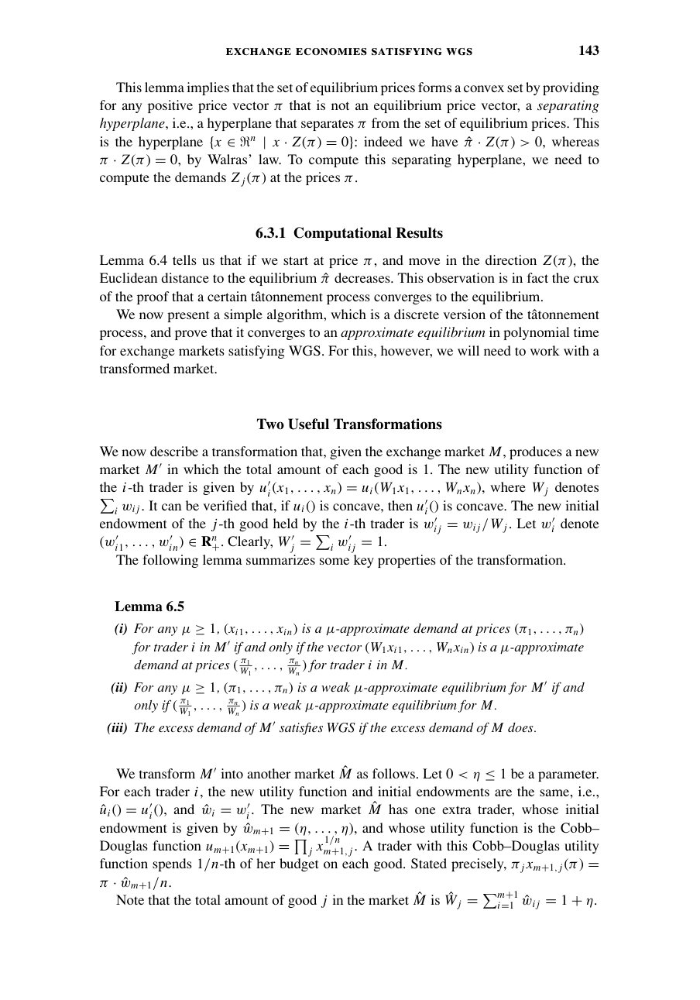

[Открыть страницу отдельно](../images/pages/p0164.jpg) · [Открыть страницу в PDF](../../materials/sources/Nisan-et-al-AGT-book.pdf#page=164)

**Lemma 6.5** — фрагмент оригинальной страницы:

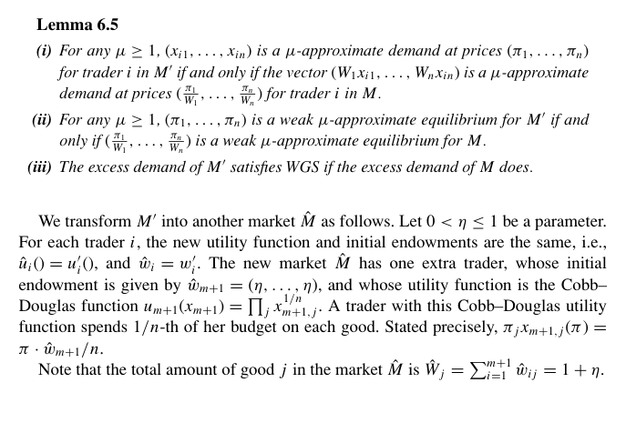

[Открыть фрагмент отдельно](../images/statements/p0164_lemma_6-5_01.png)

Поисковый текст страницы (формулы сверяйте с изображением)

~~~~text
exchange economies satisfying wgs
143
This lemma implies that the set of equilibrium prices forms a convex set by providing
for any positive price vector π that is not an equilibrium price vector, a separating
hyperplane, i.e., a hyperplane that separates π from the set of equilibrium prices. This
is the hyperplane {x ∈ℜn | x · Z(π) = 0}: indeed we have ˆπ · Z(π) > 0, whereas
π · Z(π) = 0, by Walras’ law. To compute this separating hyperplane, we need to
compute the demands Zj(π) at the prices π.
6.3.1 Computational Results
Lemma 6.4 tells us that if we start at price π, and move in the direction Z(π), the
Euclidean distance to the equilibrium ˆπ decreases. This observation is in fact the crux
of the proof that a certain tˆatonnement process converges to the equilibrium.
We now present a simple algorithm, which is a discrete version of the tˆatonnement
process, and prove that it converges to an approximate equilibrium in polynomial time
for exchange markets satisfying WGS. For this, however, we will need to work with a
transformed market.
Two Useful Transformations
We now describe a transformation that, given the exchange market M, produces a new
market M′ in which the total amount of each good is 1. The new utility function of
the i-th trader is given by u′
i(x1, . . . , xn) = ui(W1x1, . . . , Wnxn), where Wj denotes
⟦U+0001; см. снимок страницы⟧
i wij. It can be verified that, if ui() is concave, then u′
i() is concave. The new initial
endowment of the j-th good held by the i-th trader is w′
ij = wij/Wj. Let w′
i denote
(w′
i1, . . . , w′
in) ∈Rn
+. Clearly, W ′
j = ⟦U+0001; см. снимок страницы⟧
i w′
ij = 1.
The following lemma summarizes some key properties of the transformation.
Lemma 6.5
(i) For any µ ≥1, (xi1, . . . , xin) is a µ-approximate demand at prices (π1, . . . , πn)
for trader i in M′ if and only if the vector (W1xi1, . . . , Wnxin) is a µ-approximate
demand at prices ( π1
W1 , . . . , πn
Wn ) for trader i in M.
(ii) For any µ ≥1, (π1, . . . , πn) is a weak µ-approximate equilibrium for M′ if and
only if ( π1
W1 , . . . , πn
Wn ) is a weak µ-approximate equilibrium for M.
(iii) The excess demand of M′ satisfies WGS if the excess demand of M does.
We transform M′ into another market ˆM as follows. Let 0 < η ≤1 be a parameter.
For each trader i, the new utility function and initial endowments are the same, i.e.,
ˆui() = u′
i(), and ˆwi = w′
i. The new market ˆM has one extra trader, whose initial
endowment is given by ˆwm+1 = (η, . . . , η), and whose utility function is the Cobb–
Douglas function um+1(xm+1) = ⟦U+0002; см. снимок страницы⟧
j x1/n
m+1,j. A trader with this Cobb–Douglas utility
function spends 1/n-th of her budget on each good. Stated precisely, πjxm+1,j(π) =
π · ˆwm+1/n.
Note that the total amount of good j in the market ˆM is ˆWj = ⟦U+0001; см. снимок страницы⟧m+1
i=1 ˆwij = 1 + η.
~~~~

### PDF стр. 165 · книжная стр. 144

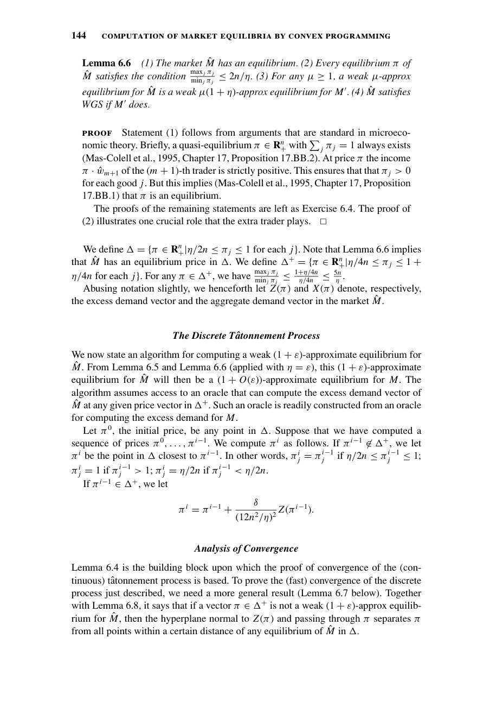

[Открыть страницу отдельно](../images/pages/p0165.jpg) · [Открыть страницу в PDF](../../materials/sources/Nisan-et-al-AGT-book.pdf#page=165)

**Lemma 6.6** — фрагмент оригинальной страницы:

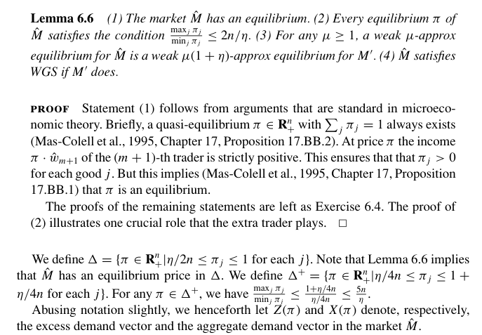

[Открыть фрагмент отдельно](../images/statements/p0165_lemma_6-6_01.png)

Поисковый текст страницы (формулы сверяйте с изображением)

~~~~text
144
computation of market equilibria by convex programming
Lemma 6.6
(1) The market ˆM has an equilibrium. (2) Every equilibrium π of
ˆM satisfies the condition maxj πj
minj πj ≤2n/η. (3) For any µ ≥1, a weak µ-approx
equilibrium for ˆM is a weak µ(1 + η)-approx equilibrium for M′. (4) ˆM satisfies
WGS if M′ does.
proof
Statement (1) follows from arguments that are standard in microeco-
nomic theory. Briefly, a quasi-equilibrium π ∈Rn
+ with ⟦U+0001; см. снимок страницы⟧
j πj = 1 always exists
(Mas-Colell et al., 1995, Chapter 17, Proposition 17.BB.2). At price π the income
π · ˆwm+1 of the (m + 1)-th trader is strictly positive. This ensures that that πj > 0
for each good j. But this implies (Mas-Colell et al., 1995, Chapter 17, Proposition
17.BB.1) that π is an equilibrium.
The proofs of the remaining statements are left as Exercise 6.4. The proof of
(2) illustrates one crucial role that the extra trader plays.
We define
 = {π ∈Rn
+|η/2n ≤πj ≤1 for each j}. Note that Lemma 6.6 implies
that ˆM has an equilibrium price in
. We define
+ = {π ∈Rn
+|η/4n ≤πj ≤1 +
η/4n for each j}. For any π ∈
+, we have maxj πj
minj πj ≤1+η/4n
η/4n
≤5n
η .
Abusing notation slightly, we henceforth let Z(π) and X(π) denote, respectively,
the excess demand vector and the aggregate demand vector in the market ˆM.
The Discrete Tˆatonnement Process
We now state an algorithm for computing a weak (1 + ε)-approximate equilibrium for
ˆM. From Lemma 6.5 and Lemma 6.6 (applied with η = ε), this (1 + ε)-approximate
equilibrium for ˆM will then be a (1 + O(ε))-approximate equilibrium for M. The
algorithm assumes access to an oracle that can compute the excess demand vector of
ˆM at any given price vector in
+. Such an oracle is readily constructed from an oracle
for computing the excess demand for M.
Let π0, the initial price, be any point in
. Suppose that we have computed a
sequence of prices π0, . . . , πi−1. We compute πi as follows. If πi−1̸ ∈
+, we let
πi be the point in
 closest to πi−1. In other words, πi
j = πi−1
j
if η/2n ≤πi−1
j
≤1;
πi
j = 1 if πi−1
j
> 1; πi
j = η/2n if πi−1
j
< η/2n.
If πi−1 ∈
+, we let
πi = πi−1 +
δ
(12n2/η)2 Z(πi−1).
Analysis of Convergence
Lemma 6.4 is the building block upon which the proof of convergence of the (con-
tinuous) tˆatonnement process is based. To prove the (fast) convergence of the discrete
process just described, we need a more general result (Lemma 6.7 below). Together
with Lemma 6.8, it says that if a vector π ∈
+ is not a weak (1 + ε)-approx equilib-
rium for ˆM, then the hyperplane normal to Z(π) and passing through π separates π
from all points within a certain distance of any equilibrium of ˆM in
.
~~~~

### PDF стр. 166 · книжная стр. 145

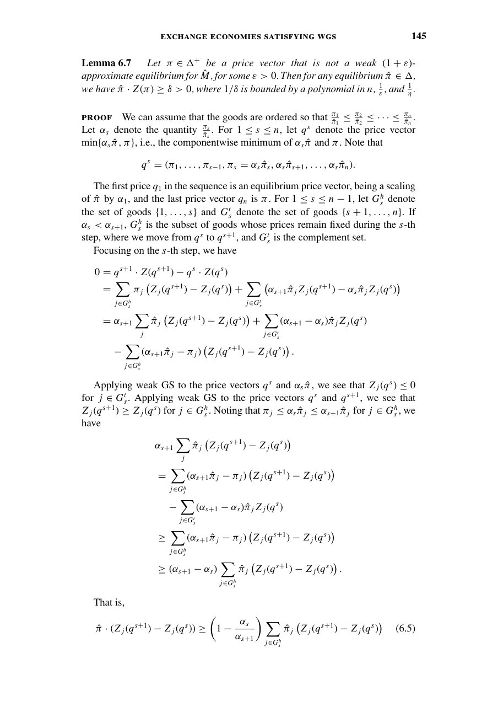

[Открыть страницу отдельно](../images/pages/p0166.jpg) · [Открыть страницу в PDF](../../materials/sources/Nisan-et-al-AGT-book.pdf#page=166)

**Lemma 6.7** — фрагмент оригинальной страницы:

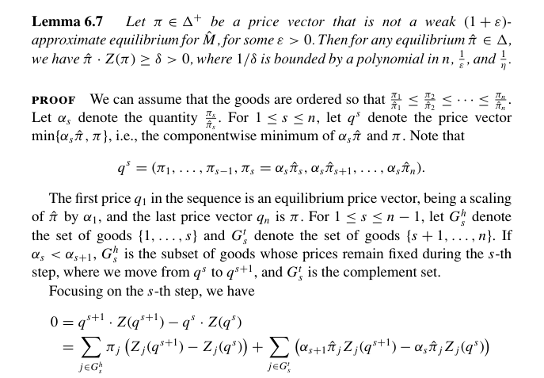

[Открыть фрагмент отдельно](../images/statements/p0166_lemma_6-7_01.png)

Поисковый текст страницы (формулы сверяйте с изображением)

~~~~text
exchange economies satisfying wgs
145
Lemma 6.7
Let π ∈
+ be a price vector that is not a weak (1 + ε)-
approximate equilibrium for ˆM, for some ε > 0. Then for any equilibrium ˆπ ∈
,
we have ˆπ · Z(π) ≥δ > 0, where 1/δ is bounded by a polynomial in n, 1
ε, and 1
η.
proof
We can assume that the goods are ordered so that π1
ˆπ1 ≤π2
ˆπ2 ≤· · · ≤πn
ˆπn .
Let αs denote the quantity πs
ˆπs . For 1 ≤s ≤n, let qs denote the price vector
min{αs ˆπ, π}, i.e., the componentwise minimum of αs ˆπ and π. Note that
qs = (π1, . . . , πs−1, πs = αs ˆπs, αs ˆπs+1, . . . , αs ˆπn).
The first price q1 in the sequence is an equilibrium price vector, being a scaling
of ˆπ by α1, and the last price vector qn is π. For 1 ≤s ≤n −1, let Gh
s denote
the set of goods {1, . . . , s} and Gt
s denote the set of goods {s + 1, . . . , n}. If
αs < αs+1, Gh
s is the subset of goods whose prices remain fixed during the s-th
step, where we move from qs to qs+1, and Gt
s is the complement set.
Focusing on the s-th step, we have
0 = qs+1 · Z(qs+1) −qs · Z(qs)
=
⟦U+0004; см. снимок страницы⟧
j∈Ghs
πj

Zj(qs+1) −Zj(qs)
⟦U+000B; см. снимок страницы⟧
+
⟦U+0004; см. снимок страницы⟧
j∈Gts

αs+1 ˆπjZj(qs+1) −αs ˆπjZj(qs)
⟦U+000B; см. снимок страницы⟧
= αs+1
⟦U+0004; см. снимок страницы⟧
j
ˆπj

Zj(qs+1) −Zj(qs)
⟦U+000B; см. снимок страницы⟧
+
⟦U+0004; см. снимок страницы⟧
j∈Gts
(αs+1 −αs) ˆπjZj(qs)
−
⟦U+0004; см. снимок страницы⟧
j∈Ghs
(αs+1 ˆπj −πj)

Zj(qs+1) −Zj(qs)
⟦U+000B; см. снимок страницы⟧
.
Applying weak GS to the price vectors qs and αs ˆπ, we see that Zj(qs) ≤0
for j ∈Gt
s. Applying weak GS to the price vectors qs and qs+1, we see that
Zj(qs+1) ≥Zj(qs) for j ∈Gh
s . Noting that πj ≤αs ˆπj ≤αs+1 ˆπj for j ∈Gh
s , we
have
αs+1
⟦U+0004; см. снимок страницы⟧
j
ˆπj

Zj(qs+1) −Zj(qs)
⟦U+000B; см. снимок страницы⟧
=
⟦U+0004; см. снимок страницы⟧
j∈Ghs
(αs+1 ˆπj −πj)

Zj(qs+1) −Zj(qs)
⟦U+000B; см. снимок страницы⟧
−
⟦U+0004; см. снимок страницы⟧
j∈Gts
(αs+1 −αs) ˆπjZj(qs)
≥
⟦U+0004; см. снимок страницы⟧
j∈Ghs
(αs+1 ˆπj −πj)

Zj(qs+1) −Zj(qs)
⟦U+000B; см. снимок страницы⟧
≥(αs+1 −αs)
⟦U+0004; см. снимок страницы⟧
j∈Ghs
ˆπj

Zj(qs+1) −Zj(qs)
⟦U+000B; см. снимок страницы⟧
.
That is,
ˆπ · (Zj(qs+1) −Zj(qs)) ≥
⟦U+000C; см. снимок страницы⟧
1 −αs
αs+1
⟦U+000D; см. снимок страницы⟧ ⟦U+0004; см. снимок страницы⟧
j∈Ghs
ˆπj

Zj(qs+1) −Zj(qs)
⟦U+000B; см. снимок страницы⟧
(6.5)
~~~~

### PDF стр. 167 · книжная стр. 146

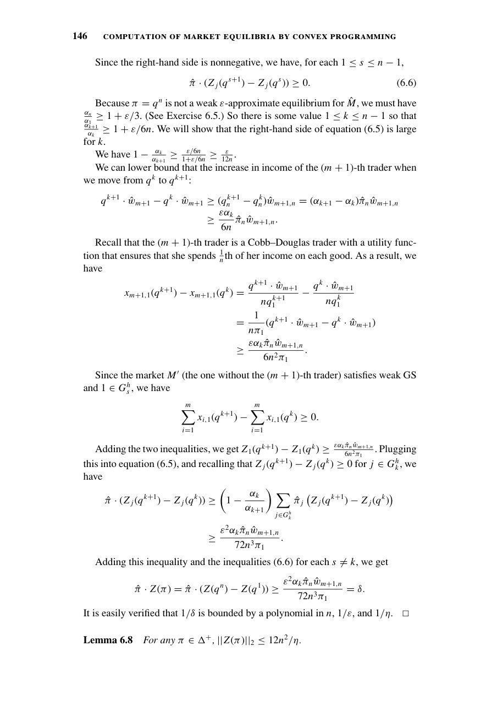

[Открыть страницу отдельно](../images/pages/p0167.jpg) · [Открыть страницу в PDF](../../materials/sources/Nisan-et-al-AGT-book.pdf#page=167)

**Lemma 6.8** — фрагмент оригинальной страницы:

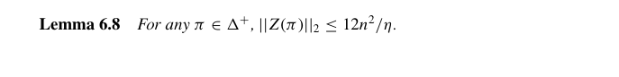

[Открыть фрагмент отдельно](../images/statements/p0167_lemma_6-8_01.png)

Начало следующей страницы для проверки продолжения: 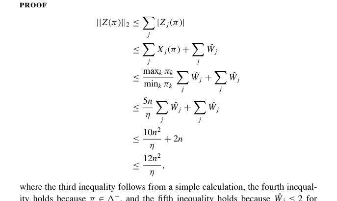

Поисковый текст страницы (формулы сверяйте с изображением)

~~~~text
146
computation of market equilibria by convex programming
Since the right-hand side is nonnegative, we have, for each 1 ≤s ≤n −1,
ˆπ · (Zj(qs+1) −Zj(qs)) ≥0.
(6.6)
Because π = qn is not a weak ε-approximate equilibrium for ˆM, we must have
αn
α1 ≥1 + ε/3. (See Exercise 6.5.) So there is some value 1 ≤k ≤n −1 so that
αk+1
αk ≥1 + ε/6n. We will show that the right-hand side of equation (6.5) is large
for k.
We have 1 −
αk
αk+1 ≥
ε/6n
1+ε/6n ≥
ε
12n.
We can lower bound that the increase in income of the (m + 1)-th trader when
we move from qk to qk+1:
qk+1 · ˆwm+1 −qk · ˆwm+1 ≥(qk+1
n
−qk
n) ˆwm+1,n = (αk+1 −αk) ˆπn ˆwm+1,n
≥εαk
6n ˆπn ˆwm+1,n.
Recall that the (m + 1)-th trader is a Cobb–Douglas trader with a utility func-
tion that ensures that she spends 1
nth of her income on each good. As a result, we
have
xm+1,1(qk+1) −xm+1,1(qk) = qk+1 · ˆwm+1
nqk+1
1
−qk · ˆwm+1
nqk
1
=
1
nπ1
(qk+1 · ˆwm+1 −qk · ˆwm+1)
≥εαk ˆπn ˆwm+1,n
6n2π1
.
Since the market M′ (the one without the (m + 1)-th trader) satisfies weak GS
and 1 ∈Gh
s , we have
m
⟦U+0004; см. снимок страницы⟧
i=1
xi,1(qk+1) −
m
⟦U+0004; см. снимок страницы⟧
i=1
xi,1(qk) ≥0.
Adding the two inequalities, we get Z1(qk+1) −Z1(qk) ≥εαk ˆπn ˆwm+1,n
6n2π1
. Plugging
this into equation (6.5), and recalling that Zj(qk+1) −Zj(qk) ≥0 for j ∈Gh
k, we
have
ˆπ · (Zj(qk+1) −Zj(qk)) ≥
⟦U+000C; см. снимок страницы⟧
1 −αk
αk+1
⟦U+000D; см. снимок страницы⟧ ⟦U+0004; см. снимок страницы⟧
j∈Gh
k
ˆπj

Zj(qk+1) −Zj(qk)
⟦U+000B; см. снимок страницы⟧
≥ε2αk ˆπn ˆwm+1,n
72n3π1
.
Adding this inequality and the inequalities (6.6) for each s̸ = k, we get
ˆπ · Z(π) = ˆπ · (Z(qn) −Z(q1)) ≥ε2αk ˆπn ˆwm+1,n
72n3π1
= δ.
It is easily verified that 1/δ is bounded by a polynomial in n, 1/ε, and 1/η.
Lemma 6.8
For any π ∈
+, ||Z(π)||2 ≤12n2/η.
~~~~

### PDF стр. 168 · книжная стр. 147

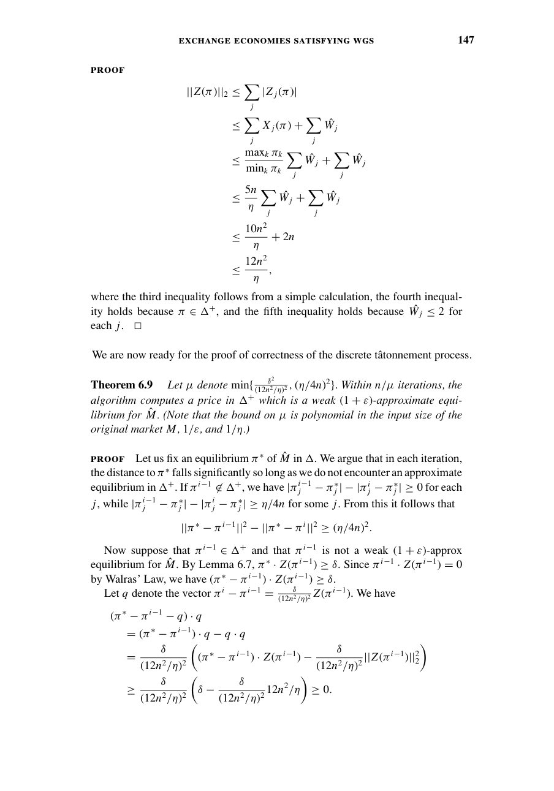

[Открыть страницу отдельно](../images/pages/p0168.jpg) · [Открыть страницу в PDF](../../materials/sources/Nisan-et-al-AGT-book.pdf#page=168)

**Theorem 6.9** — фрагмент оригинальной страницы:

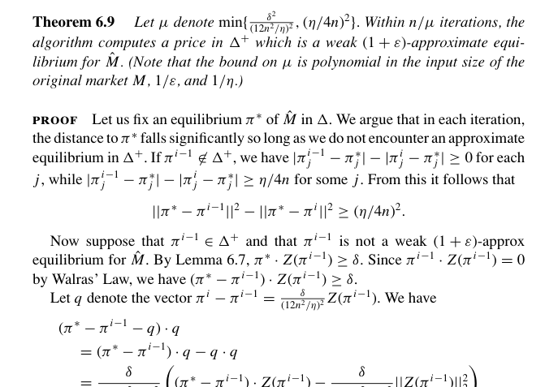

[Открыть фрагмент отдельно](../images/statements/p0168_theorem_6-9_01.png)

Поисковый текст страницы (формулы сверяйте с изображением)

~~~~text
exchange economies satisfying wgs
147
proof
||Z(π)||2 ≤
⟦U+0004; см. снимок страницы⟧
j
|Zj(π)|
≤
⟦U+0004; см. снимок страницы⟧
j
Xj(π) +
⟦U+0004; см. снимок страницы⟧
j
ˆ
Wj
≤maxk πk
mink πk
⟦U+0004; см. снимок страницы⟧
j
ˆ
Wj +
⟦U+0004; см. снимок страницы⟧
j
ˆ
Wj
≤5n
η
⟦U+0004; см. снимок страницы⟧
j
ˆ
Wj +
⟦U+0004; см. снимок страницы⟧
j
ˆ
Wj
≤10n2
η
+ 2n
≤12n2
η
,
where the third inequality follows from a simple calculation, the fourth inequal-
ity holds because π ∈
+, and the fifth inequality holds because
ˆ
Wj ≤2 for
each j.
We are now ready for the proof of correctness of the discrete tˆatonnement process.
Theorem 6.9
Let µ denote min{
δ2
(12n2/η)2 , (η/4n)2}. Within n/µ iterations, the
algorithm computes a price in
+ which is a weak (1 + ε)-approximate equi-
librium for ˆM. (Note that the bound on µ is polynomial in the input size of the
original market M, 1/ε, and 1/η.)
proof
Let us fix an equilibrium π∗of ˆM in
. We argue that in each iteration,
the distance to π∗falls significantly so long as we do not encounter an approximate
equilibrium in
+. If πi−1̸ ∈
+, we have |πi−1
j
−π∗
j | −|πi
j −π∗
j | ≥0 for each
j, while |πi−1
j
−π∗
j | −|πi
j −π∗
j | ≥η/4n for some j. From this it follows that
||π∗−πi−1||2 −||π∗−πi||2 ≥(η/4n)2.
Now suppose that πi−1 ∈
+ and that πi−1 is not a weak (1 + ε)-approx
equilibrium for ˆM. By Lemma 6.7, π∗· Z(πi−1) ≥δ. Since πi−1 · Z(πi−1) = 0
by Walras’ Law, we have (π∗−πi−1) · Z(πi−1) ≥δ.
Let q denote the vector πi −πi−1 =
δ
(12n2/η)2 Z(πi−1). We have
(π∗−πi−1 −q) · q
= (π∗−πi−1) · q −q · q
=
δ
(12n2/η)2
⟦U+000C; см. снимок страницы⟧
(π∗−πi−1) · Z(πi−1) −
δ
(12n2/η)2 ||Z(πi−1)||2
2
⟦U+000D; см. снимок страницы⟧
≥
δ
(12n2/η)2
⟦U+000C; см. снимок страницы⟧
δ −
δ
(12n2/η)2 12n2/η
⟦U+000D; см. снимок страницы⟧
≥0.
~~~~

### PDF стр. 169 · книжная стр. 148

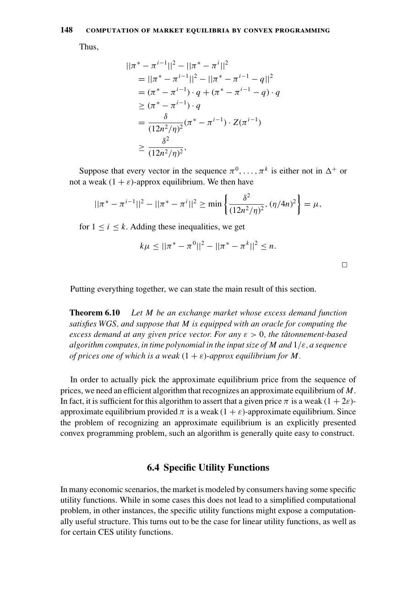

[Открыть страницу отдельно](../images/pages/p0169.jpg) · [Открыть страницу в PDF](../../materials/sources/Nisan-et-al-AGT-book.pdf#page=169)

**Theorem 6.10** — фрагмент оригинальной страницы:

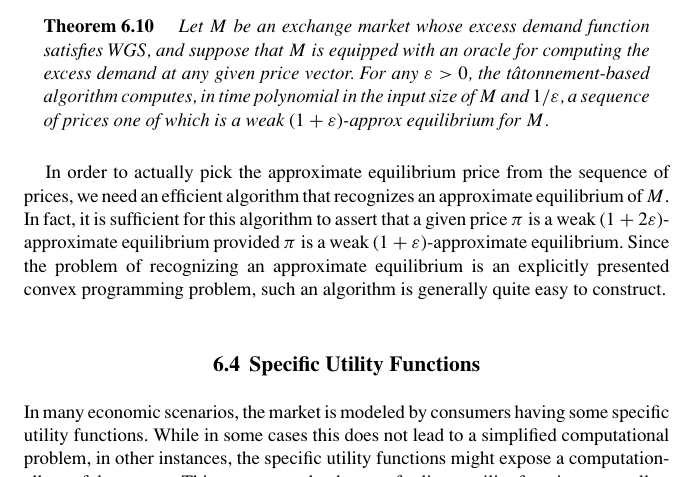

[Открыть фрагмент отдельно](../images/statements/p0169_theorem_6-10_01.png)

Поисковый текст страницы (формулы сверяйте с изображением)

~~~~text
148
computation of market equilibria by convex programming
Thus,
||π∗−πi−1||2 −||π∗−πi||2
= ||π∗−πi−1||2 −||π∗−πi−1 −q||2
= (π∗−πi−1) · q + (π∗−πi−1 −q) · q
≥(π∗−πi−1) · q
=
δ
(12n2/η)2 (π∗−πi−1) · Z(πi−1)
≥
δ2
(12n2/η)2 ,
Suppose that every vector in the sequence π0, . . . , πk is either not in
+ or
not a weak (1 + ε)-approx equilibrium. We then have
||π∗−πi−1||2 −||π∗−πi||2 ≥min
⟦U+000E; см. снимок страницы⟧
δ2
(12n2/η)2 , (η/4n)2
⟦U+000F; см. снимок страницы⟧
= µ,
for 1 ≤i ≤k. Adding these inequalities, we get
kµ ≤||π∗−π0||2 −||π∗−πk||2 ≤n.
Putting everything together, we can state the main result of this section.
Theorem 6.10
Let M be an exchange market whose excess demand function
satisfies WGS, and suppose that M is equipped with an oracle for computing the
excess demand at any given price vector. For any ε > 0, the tˆatonnement-based
algorithm computes, in time polynomial in the input size of M and 1/ε, a sequence
of prices one of which is a weak (1 + ε)-approx equilibrium for M.
In order to actually pick the approximate equilibrium price from the sequence of
prices, we need an efficient algorithm that recognizes an approximate equilibrium of M.
In fact, it is sufficient for this algorithm to assert that a given price π is a weak (1 + 2ε)-
approximate equilibrium provided π is a weak (1 + ε)-approximate equilibrium. Since
the problem of recognizing an approximate equilibrium is an explicitly presented
convex programming problem, such an algorithm is generally quite easy to construct.
6.4 Specific Utility Functions
In many economic scenarios, the market is modeled by consumers having some specific
utility functions. While in some cases this does not lead to a simplified computational
problem, in other instances, the specific utility functions might expose a computation-
ally useful structure. This turns out to be the case for linear utility functions, as well as
for certain CES utility functions.
~~~~

### PDF стр. 170 · книжная стр. 149

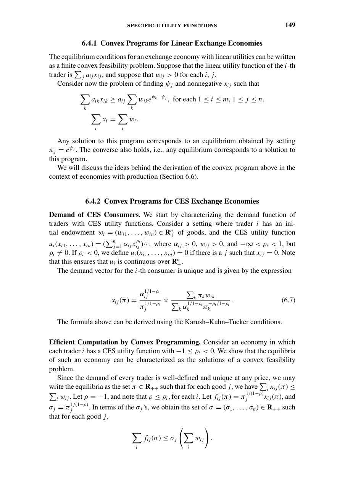

[Открыть страницу отдельно](../images/pages/p0170.jpg) · [Открыть страницу в PDF](../../materials/sources/Nisan-et-al-AGT-book.pdf#page=170)

Поисковый текст страницы (формулы сверяйте с изображением)

~~~~text
specific utility functions
149
6.4.1 Convex Programs for Linear Exchange Economies
The equilibrium conditions for an exchange economy with linear utilities can be written
as a finite convex feasibility problem. Suppose that the linear utility function of the i-th
trader is ⟦U+0001; см. снимок страницы⟧
j aijxij, and suppose that wij > 0 for each i, j.
Consider now the problem of finding ψj and nonnegative xij such that
⟦U+0004; см. снимок страницы⟧
k
aikxik ≥aij
⟦U+0004; см. снимок страницы⟧
k
wikeψk−ψj, for each 1 ≤i ≤m, 1 ≤j ≤n.
⟦U+0004; см. снимок страницы⟧
i
xi =
⟦U+0004; см. снимок страницы⟧
i
wi.
Any solution to this program corresponds to an equilibrium obtained by setting
πj = eψj . The converse also holds, i.e., any equilibrium corresponds to a solution to
this program.
We will discuss the ideas behind the derivation of the convex program above in the
context of economies with production (Section 6.6).
6.4.2 Convex Programs for CES Exchange Economies
Demand of CES Consumers. We start by characterizing the demand function of
traders with CES utility functions. Consider a setting where trader i has an ini-
tial endowment wi = (wi1, . . . , win) ∈Rn
+ of goods, and the CES utility function
ui(xi1, . . . , xin) = (⟦U+0001; см. снимок страницы⟧n
j=1 αijxρi
ij )
1
ρi , where αij > 0, wij > 0, and −∞< ρi < 1, but
ρi̸ = 0. If ρi < 0, we define ui(xi1, . . . , xin) = 0 if there is a j such that xij = 0. Note
that this ensures that ui is continuous over Rn
+.
The demand vector for the i-th consumer is unique and is given by the expression
xij(π) =
α1/1−ρi
ij
π1/1−ρi
j
×
⟦U+0001; см. снимок страницы⟧
k πkwik
⟦U+0001; см. снимок страницы⟧
k α1/1−ρi
k
π−ρi/1−ρi
k
.
(6.7)
The formula above can be derived using the Karush–Kuhn–Tucker conditions.
Efficient Computation by Convex Programming. Consider an economy in which
each trader i has a CES utility function with −1 ≤ρi < 0. We show that the equilibria
of such an economy can be characterized as the solutions of a convex feasibility
problem.
Since the demand of every trader is well-defined and unique at any price, we may
write the equilibria as the set π ∈R++ such that for each good j, we have ⟦U+0001; см. снимок страницы⟧
i xij(π) ≤
⟦U+0001; см. снимок страницы⟧
i wij. Let ρ = −1, and note that ρ ≤ρi, for each i. Let fij(π) = π1/(1−ρ)
j
xij(π), and
σj = π1/(1−ρ)
j
. In terms of the σj’s, we obtain the set of σ = (σ1, . . . , σn) ∈R++ such
that for each good j,
⟦U+0004; см. снимок страницы⟧
i
fij(σ) ≤σj
⟦U+0003; см. снимок страницы⟧⟦U+0004; см. снимок страницы⟧
i
wij
⟦U+0005; см. снимок страницы⟧
.
~~~~

### PDF стр. 171 · книжная стр. 150

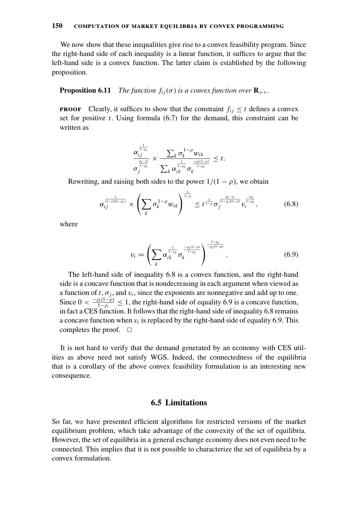

[Открыть страницу отдельно](../images/pages/p0171.jpg) · [Открыть страницу в PDF](../../materials/sources/Nisan-et-al-AGT-book.pdf#page=171)

**Proposition 6.11** — фрагмент оригинальной страницы:

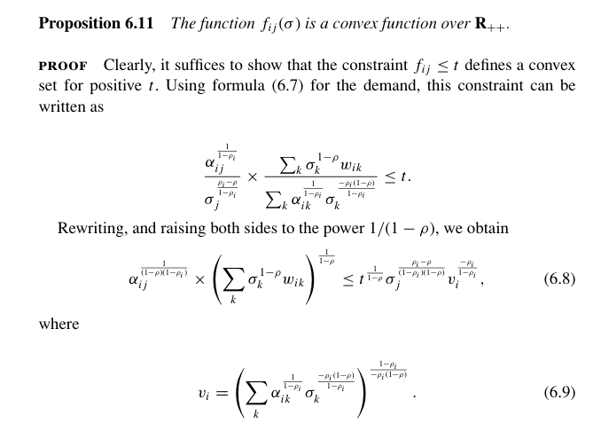

[Открыть фрагмент отдельно](../images/statements/p0171_proposition_6-11_01.png)

Поисковый текст страницы (формулы сверяйте с изображением)

~~~~text
150
computation of market equilibria by convex programming
We now show that these inequalities give rise to a convex feasibility program. Since
the right-hand side of each inequality is a linear function, it suffices to argue that the
left-hand side is a convex function. The latter claim is established by the following
proposition.
Proposition 6.11
The function fij(σ) is a convex function over R++.
proof
Clearly, it suffices to show that the constraint fij ≤t defines a convex
set for positive t. Using formula (6.7) for the demand, this constraint can be
written as
α
1
1−ρi
ij
σ
ρi −ρ
1−ρi
j
×
⟦U+0001; см. снимок страницы⟧
k σ 1−ρ
k
wik
⟦U+0001; см. снимок страницы⟧
k α
1
1−ρi
ik
σ
−ρi (1−ρ)
1−ρi
k
≤t.
Rewriting, and raising both sides to the power 1/(1 −ρ), we obtain
α
1
(1−ρ)(1−ρi )
ij
×
⟦U+0003; см. снимок страницы⟧⟦U+0004; см. снимок страницы⟧
k
σ 1−ρ
k
wik
⟦U+0005; см. снимок страницы⟧
1
1−ρ
≤t
1
1−ρ σ
ρi −ρ
(1−ρi )(1−ρ)
j
v
−ρi
1−ρi
i
,
(6.8)
where
vi =
⟦U+0003; см. снимок страницы⟧⟦U+0004; см. снимок страницы⟧
k
α
1
1−ρi
ik
σ
−ρi (1−ρ)
1−ρi
k
⟦U+0005; см. снимок страницы⟧
1−ρi
−ρi (1−ρ)
.
(6.9)
The left-hand side of inequality 6.8 is a convex function, and the right-hand
side is a concave function that is nondecreasing in each argument when viewed as
a function of t, σj, and vi, since the exponents are nonnegative and add up to one.
Since 0 < −ρi(1−ρ)
1−ρi
≤1, the right-hand side of equality 6.9 is a concave function,
in fact a CES function. It follows that the right-hand side of inequality 6.8 remains
a concave function when vi is replaced by the right-hand side of equality 6.9. This
completes the proof.
It is not hard to verify that the demand generated by an economy with CES util-
ities as above need not satisfy WGS. Indeed, the connectedness of the equilibria
that is a corollary of the above convex feasibility formulation is an interesting new
consequence.
6.5 Limitations
So far, we have presented efficient algorithms for restricted versions of the market
equilibrium problem, which take advantage of the convexity of the set of equilibria.
However, the set of equilibria in a general exchange economy does not even need to be
connected. This implies that it is not possible to characterize the set of equilibria by a
convex formulation.
~~~~

### PDF стр. 172 · книжная стр. 151

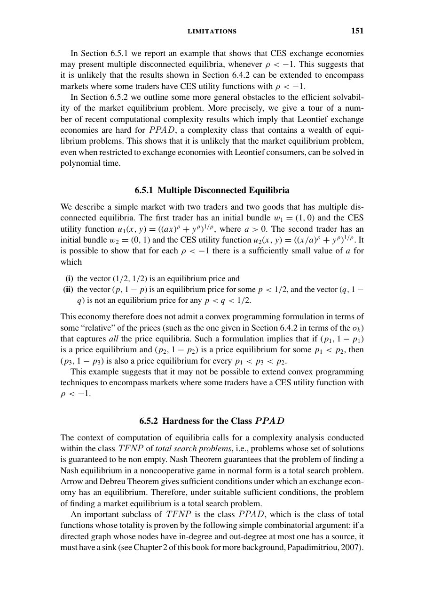

[Открыть страницу отдельно](../images/pages/p0172.jpg) · [Открыть страницу в PDF](../../materials/sources/Nisan-et-al-AGT-book.pdf#page=172)

Поисковый текст страницы (формулы сверяйте с изображением)

~~~~text
limitations
151
In Section 6.5.1 we report an example that shows that CES exchange economies
may present multiple disconnected equilibria, whenever ρ < −1. This suggests that
it is unlikely that the results shown in Section 6.4.2 can be extended to encompass
markets where some traders have CES utility functions with ρ < −1.
In Section 6.5.2 we outline some more general obstacles to the efficient solvabil-
ity of the market equilibrium problem. More precisely, we give a tour of a num-
ber of recent computational complexity results which imply that Leontief exchange
economies are hard for PPAD, a complexity class that contains a wealth of equi-
librium problems. This shows that it is unlikely that the market equilibrium problem,
even when restricted to exchange economies with Leontief consumers, can be solved in
polynomial time.
6.5.1 Multiple Disconnected Equilibria
We describe a simple market with two traders and two goods that has multiple dis-
connected equilibria. The first trader has an initial bundle w1 = (1, 0) and the CES
utility function u1(x, y) = ((ax)ρ + yρ)1/ρ, where a > 0. The second trader has an
initial bundle w2 = (0, 1) and the CES utility function u2(x, y) = ((x/a)ρ + yρ)1/ρ. It
is possible to show that for each ρ < −1 there is a sufficiently small value of a for
which
(i) the vector (1/2, 1/2) is an equilibrium price and
(ii) the vector (p, 1 −p) is an equilibrium price for some p < 1/2, and the vector (q, 1 −
q) is not an equilibrium price for any p < q < 1/2.
This economy therefore does not admit a convex programming formulation in terms of
some “relative” of the prices (such as the one given in Section 6.4.2 in terms of the σk)
that captures all the price equilibria. Such a formulation implies that if (p1, 1 −p1)
is a price equilibrium and (p2, 1 −p2) is a price equilibrium for some p1 < p2, then
(p3, 1 −p3) is also a price equilibrium for every p1 < p3 < p2.
This example suggests that it may not be possible to extend convex programming
techniques to encompass markets where some traders have a CES utility function with
ρ < −1.
6.5.2 Hardness for the Class PPAD
The context of computation of equilibria calls for a complexity analysis conducted
within the class TFNP of total search problems, i.e., problems whose set of solutions
is guaranteed to be non empty. Nash Theorem guarantees that the problem of finding a
Nash equilibrium in a noncooperative game in normal form is a total search problem.
Arrow and Debreu Theorem gives sufficient conditions under which an exchange econ-
omy has an equilibrium. Therefore, under suitable sufficient conditions, the problem
of finding a market equilibrium is a total search problem.
An important subclass of TFNP is the class PPAD, which is the class of total
functions whose totality is proven by the following simple combinatorial argument: if a
directed graph whose nodes have in-degree and out-degree at most one has a source, it
must have a sink (see Chapter 2 of this book for more background, Papadimitriou, 2007).
~~~~

### PDF стр. 173 · книжная стр. 152

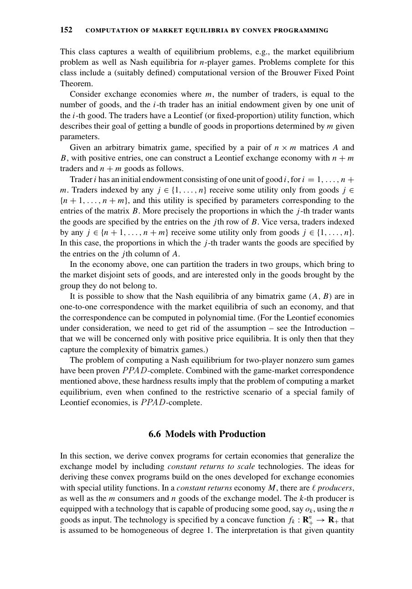

[Открыть страницу отдельно](../images/pages/p0173.jpg) · [Открыть страницу в PDF](../../materials/sources/Nisan-et-al-AGT-book.pdf#page=173)

Поисковый текст страницы (формулы сверяйте с изображением)

~~~~text
152
computation of market equilibria by convex programming
This class captures a wealth of equilibrium problems, e.g., the market equilibrium
problem as well as Nash equilibria for n-player games. Problems complete for this
class include a (suitably defined) computational version of the Brouwer Fixed Point
Theorem.
Consider exchange economies where m, the number of traders, is equal to the
number of goods, and the i-th trader has an initial endowment given by one unit of
the i-th good. The traders have a Leontief (or fixed-proportion) utility function, which
describes their goal of getting a bundle of goods in proportions determined by m given
parameters.
Given an arbitrary bimatrix game, specified by a pair of n × m matrices A and
B, with positive entries, one can construct a Leontief exchange economy with n + m
traders and n + m goods as follows.
Trader i has an initial endowment consisting of one unit of good i, for i = 1, . . . , n +
m. Traders indexed by any j ∈{1, . . . , n} receive some utility only from goods j ∈
{n + 1, . . . , n + m}, and this utility is specified by parameters corresponding to the
entries of the matrix B. More precisely the proportions in which the j-th trader wants
the goods are specified by the entries on the jth row of B. Vice versa, traders indexed
by any j ∈{n + 1, . . . , n + m} receive some utility only from goods j ∈{1, . . . , n}.
In this case, the proportions in which the j-th trader wants the goods are specified by
the entries on the jth column of A.
In the economy above, one can partition the traders in two groups, which bring to
the market disjoint sets of goods, and are interested only in the goods brought by the
group they do not belong to.
It is possible to show that the Nash equilibria of any bimatrix game (A, B) are in
one-to-one correspondence with the market equilibria of such an economy, and that
the correspondence can be computed in polynomial time. (For the Leontief economies
under consideration, we need to get rid of the assumption – see the Introduction –
that we will be concerned only with positive price equilibria. It is only then that they
capture the complexity of bimatrix games.)
The problem of computing a Nash equilibrium for two-player nonzero sum games
have been proven PPAD-complete. Combined with the game-market correspondence
mentioned above, these hardness results imply that the problem of computing a market
equilibrium, even when confined to the restrictive scenario of a special family of
Leontief economies, is PPAD-complete.
6.6 Models with Production
In this section, we derive convex programs for certain economies that generalize the
exchange model by including constant returns to scale technologies. The ideas for
deriving these convex programs build on the ones developed for exchange economies
with special utility functions. In a constant returns economy M, there are ℓproducers,
as well as the m consumers and n goods of the exchange model. The k-th producer is
equipped with a technology that is capable of producing some good, say ok, using the n
goods as input. The technology is specified by a concave function fk : Rn
+ →R+ that
is assumed to be homogeneous of degree 1. The interpretation is that given quantity
~~~~

### PDF стр. 174 · книжная стр. 153

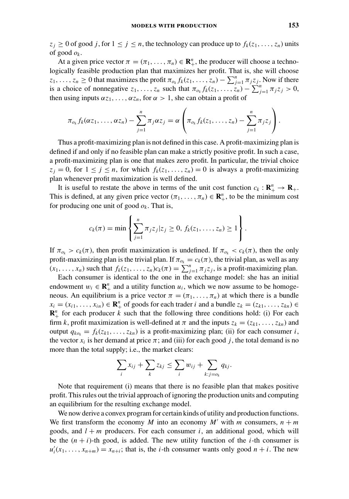

[Открыть страницу отдельно](../images/pages/p0174.jpg) · [Открыть страницу в PDF](../../materials/sources/Nisan-et-al-AGT-book.pdf#page=174)

Поисковый текст страницы (формулы сверяйте с изображением)

~~~~text
models with production
153
zj ≥0 of good j, for 1 ≤j ≤n, the technology can produce up to fk(z1, . . . , zn) units
of good ok.
At a given price vector π = (π1, . . . , πn) ∈Rn
+, the producer will choose a techno-
logically feasible production plan that maximizes her profit. That is, she will choose
z1, . . . , zn ≥0 that maximizes the profit πokfk(z1, . . . , zn) −⟦U+0001; см. снимок страницы⟧n
j=1 πjzj. Now if there
is a choice of nonnegative z1, . . . , zn such that πokfk(z1, . . . , zn) −⟦U+0001; см. снимок страницы⟧n
j=1 πjzj > 0,
then using inputs αz1, . . . , αzn, for α > 1, she can obtain a profit of
πokfk(αz1, . . . , αzn) −
n
⟦U+0004; см. снимок страницы⟧
j=1
πjαzj = α
⎛
⎝πokfk(z1, . . . , zn) −
n
⟦U+0004; см. снимок страницы⟧
j=1
πjzj
⎞
⎠.
Thus a profit-maximizing plan is not defined in this case. A profit-maximizing plan is
defined if and only if no feasible plan can make a strictly positive profit. In such a case,
a profit-maximizing plan is one that makes zero profit. In particular, the trivial choice
zj = 0, for 1 ≤j ≤n, for which fk(z1, . . . , zn) = 0 is always a profit-maximizing
plan whenever profit maximization is well defined.
It is useful to restate the above in terms of the unit cost function ck : Rn
+ →R+.
This is defined, at any given price vector (π1, . . . , πn) ∈Rn
+, to be the minimum cost
for producing one unit of good ok. That is,
ck(π) = min
⎧
⎨
⎩
n
⟦U+0004; см. снимок страницы⟧
j=1
πjzj|zj ≥0, fk(z1, . . . , zn) ≥1
⎫
⎬
⎭.
If πok > ck(π), then profit maximization is undefined. If πok < ck(π), then the only
profit-maximizing plan is the trivial plan. If πok = ck(π), the trivial plan, as well as any
(x1, . . . , xn) such that fk(z1, . . . , zn)ck(π) = ⟦U+0001; см. снимок страницы⟧n
j=1 πjzj, is a profit-maximizing plan.
Each consumer is identical to the one in the exchange model: she has an initial
endowment wi ∈Rn
+ and a utility function ui, which we now assume to be homoge-
neous. An equilibrium is a price vector π = (π1, . . . , πn) at which there is a bundle
xi = (xi1, . . . , xin) ∈Rn
+ of goods for each trader i and a bundle zk = (zk1, . . . , zkn) ∈
Rn
+ for each producer k such that the following three conditions hold: (i) For each
firm k, profit maximization is well-defined at π and the inputs zk = (zk1, . . . , zkn) and
output qkok = fk(zk1, . . . , zkn) is a profit-maximizing plan; (ii) for each consumer i,
the vector xi is her demand at price π; and (iii) for each good j, the total demand is no
more than the total supply; i.e., the market clears:
⟦U+0004; см. снимок страницы⟧
i
xij +
⟦U+0004; см. снимок страницы⟧
k
zkj ≤
⟦U+0004; см. снимок страницы⟧
i
wij +
⟦U+0004; см. снимок страницы⟧
k:j=ok
qkj.
Note that requirement (i) means that there is no feasible plan that makes positive
profit. This rules out the trivial approach of ignoring the production units and computing
an equilibrium for the resulting exchange model.
We now derive a convex program for certain kinds of utility and production functions.
We first transform the economy M into an economy M′ with m consumers, n + m
goods, and l + m producers. For each consumer i, an additional good, which will
be the (n + i)-th good, is added. The new utility function of the i-th consumer is
u′
i(x1, . . . , xn+m) = xn+i; that is, the i-th consumer wants only good n + i. The new
~~~~

### PDF стр. 175 · книжная стр. 154

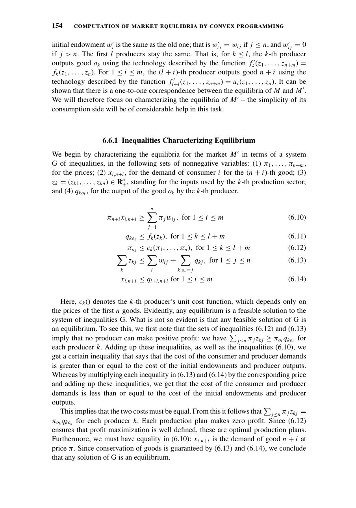

[Открыть страницу отдельно](../images/pages/p0175.jpg) · [Открыть страницу в PDF](../../materials/sources/Nisan-et-al-AGT-book.pdf#page=175)

Поисковый текст страницы (формулы сверяйте с изображением)

~~~~text
154
computation of market equilibria by convex programming
initial endowment w′
i is the same as the old one; that is w′
ij = wij if j ≤n, and w′
ij = 0
if j > n. The first l producers stay the same. That is, for k ≤l, the k-th producer
outputs good ok using the technology described by the function f ′
k(z1, . . . , zn+m) =
fk(z1, . . . , zn). For 1 ≤i ≤m, the (l + i)-th producer outputs good n + i using the
technology described by the function f ′
l+i(z1, . . . , zn+m) = ui(z1, . . . , zn). It can be
shown that there is a one-to-one correspondence between the equilibria of M and M′.
We will therefore focus on characterizing the equilibria of M′ – the simplicity of its
consumption side will be of considerable help in this task.
6.6.1 Inequalities Characterizing Equilibrium
We begin by characterizing the equilibria for the market M′ in terms of a system
G of inequalities, in the following sets of nonnegative variables: (1) π1, . . . , πn+m,
for the prices; (2) xi,n+i, for the demand of consumer i for the (n + i)-th good; (3)
zk = (zk1, . . . , zkn) ∈Rn
+, standing for the inputs used by the k-th production sector;
and (4) qkok, for the output of the good ok by the k-th producer.
πn+ixi,n+i ≥
n
⟦U+0004; см. снимок страницы⟧
j=1
πjwij, for 1 ≤i ≤m
(6.10)
qkok ≤fk(zk), for 1 ≤k ≤l + m
(6.11)
πok ≤ck(π1, . . . , πn), for 1 ≤k ≤l + m
(6.12)
⟦U+0004; см. снимок страницы⟧
k
zkj ≤
⟦U+0004; см. снимок страницы⟧
i
wij +
⟦U+0004; см. снимок страницы⟧
k:ok=j
qkj, for 1 ≤j ≤n
(6.13)
xi,n+i ≤ql+i,n+i for 1 ≤i ≤m
(6.14)
Here, ck() denotes the k-th producer’s unit cost function, which depends only on
the prices of the first n goods. Evidently, any equilibrium is a feasible solution to the
system of inequalities G. What is not so evident is that any feasible solution of G is
an equilibrium. To see this, we first note that the sets of inequalities (6.12) and (6.13)
imply that no producer can make positive profit: we have ⟦U+0001; см. снимок страницы⟧
j≤n πjzkj ≥πokqkok for
each producer k. Adding up these inequalities, as well as the inequalities (6.10), we
get a certain inequality that says that the cost of the consumer and producer demands
is greater than or equal to the cost of the initial endowments and producer outputs.
Whereas by multiplying each inequality in (6.13) and (6.14) by the corresponding price
and adding up these inequalities, we get that the cost of the consumer and producer
demands is less than or equal to the cost of the initial endowments and producer
outputs.
This implies that the two costs must be equal. From this it follows that ⟦U+0001; см. снимок страницы⟧
j≤n πjzkj =
πokqkok for each producer k. Each production plan makes zero profit. Since (6.12)
ensures that profit maximization is well defined, these are optimal production plans.
Furthermore, we must have equality in (6.10): xi,n+i is the demand of good n + i at
price π. Since conservation of goods is guaranteed by (6.13) and (6.14), we conclude
that any solution of G is an equilibrium.
~~~~

### PDF стр. 176 · книжная стр. 155

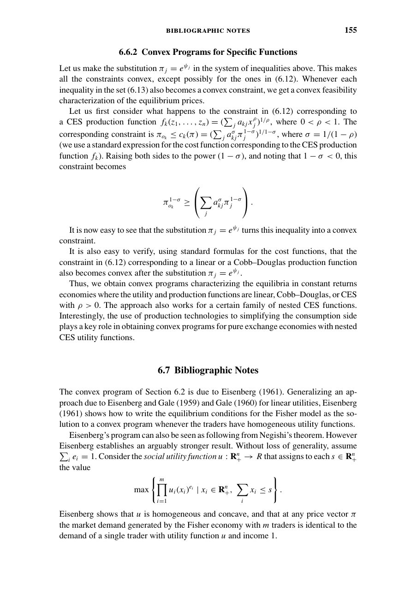

[Открыть страницу отдельно](../images/pages/p0176.jpg) · [Открыть страницу в PDF](../../materials/sources/Nisan-et-al-AGT-book.pdf#page=176)

Поисковый текст страницы (формулы сверяйте с изображением)

~~~~text
bibliographic notes
155
6.6.2 Convex Programs for Specific Functions
Let us make the substitution πj = eψj in the system of inequalities above. This makes
all the constraints convex, except possibly for the ones in (6.12). Whenever each
inequality in the set (6.13) also becomes a convex constraint, we get a convex feasibility
characterization of the equilibrium prices.
Let us first consider what happens to the constraint in (6.12) corresponding to
a CES production function fk(z1, . . . , zn) = (⟦U+0001; см. снимок страницы⟧
j akjxρ
j )1/ρ, where 0 < ρ < 1. The
corresponding constraint is πok ≤ck(π) = (⟦U+0001; см. снимок страницы⟧
j aσ
kjπ1−σ
j
)1/1−σ, where σ = 1/(1 −ρ)
(we use a standard expression for the cost function corresponding to the CES production
function fk). Raising both sides to the power (1 −σ), and noting that 1 −σ < 0, this
constraint becomes
π1−σ
ok
≥
⎛
⎝⟦U+0004; см. снимок страницы⟧
j
aσ
kjπ1−σ
j
⎞
⎠.
It is now easy to see that the substitution πj = eψj turns this inequality into a convex
constraint.
It is also easy to verify, using standard formulas for the cost functions, that the
constraint in (6.12) corresponding to a linear or a Cobb–Douglas production function
also becomes convex after the substitution πj = eψj.
Thus, we obtain convex programs characterizing the equilibria in constant returns
economies where the utility and production functions are linear, Cobb–Douglas, or CES
with ρ > 0. The approach also works for a certain family of nested CES functions.
Interestingly, the use of production technologies to simplifying the consumption side
plays a key role in obtaining convex programs for pure exchange economies with nested
CES utility functions.
6.7 Bibliographic Notes
The convex program of Section 6.2 is due to Eisenberg (1961). Generalizing an ap-
proach due to Eisenberg and Gale (1959) and Gale (1960) for linear utilities, Eisenberg
(1961) shows how to write the equilibrium conditions for the Fisher model as the so-
lution to a convex program whenever the traders have homogeneous utility functions.
Eisenberg’s program can also be seen as following from Negishi’s theorem. However
Eisenberg establishes an arguably stronger result. Without loss of generality, assume
⟦U+0001; см. снимок страницы⟧
i ei = 1. Consider the social utility function u : Rn
+ →R that assigns to each s ∈Rn
+
the value
max
⟦U+0016; см. снимок страницы⟧ m
⟦U+0017; см. снимок страницы⟧
i=1
ui(xi)ei | xi ∈Rn
+,
⟦U+0004; см. снимок страницы⟧
i
xi ≤s
⟦U+0018; см. снимок страницы⟧
.
Eisenberg shows that u is homogeneous and concave, and that at any price vector π
the market demand generated by the Fisher economy with m traders is identical to the
demand of a single trader with utility function u and income 1.
~~~~

### PDF стр. 177 · книжная стр. 156

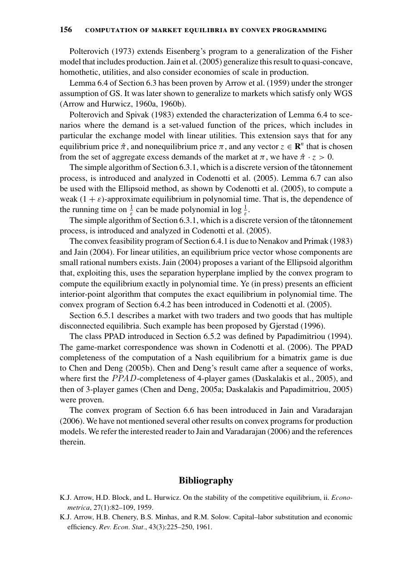

[Открыть страницу отдельно](../images/pages/p0177.jpg) · [Открыть страницу в PDF](../../materials/sources/Nisan-et-al-AGT-book.pdf#page=177)

Поисковый текст страницы (формулы сверяйте с изображением)

~~~~text
156
computation of market equilibria by convex programming
Polterovich (1973) extends Eisenberg’s program to a generalization of the Fisher
model that includes production. Jain et al. (2005) generalize this result to quasi-concave,
homothetic, utilities, and also consider economies of scale in production.
Lemma 6.4 of Section 6.3 has been proven by Arrow et al. (1959) under the stronger
assumption of GS. It was later shown to generalize to markets which satisfy only WGS
(Arrow and Hurwicz, 1960a, 1960b).
Polterovich and Spivak (1983) extended the characterization of Lemma 6.4 to sce-
narios where the demand is a set-valued function of the prices, which includes in
particular the exchange model with linear utilities. This extension says that for any
equilibrium price ˆπ, and nonequilibrium price π, and any vector z ∈Rn that is chosen
from the set of aggregate excess demands of the market at π, we have ˆπ · z > 0.
The simple algorithm of Section 6.3.1, which is a discrete version of the tˆatonnement
process, is introduced and analyzed in Codenotti et al. (2005). Lemma 6.7 can also
be used with the Ellipsoid method, as shown by Codenotti et al. (2005), to compute a
weak (1 + ε)-approximate equilibrium in polynomial time. That is, the dependence of
the running time on 1
ε can be made polynomial in log 1
ε.
The simple algorithm of Section 6.3.1, which is a discrete version of the tˆatonnement
process, is introduced and analyzed in Codenotti et al. (2005).
The convex feasibility program of Section 6.4.1 is due to Nenakov and Primak (1983)
and Jain (2004). For linear utilities, an equilibrium price vector whose components are
small rational numbers exists. Jain (2004) proposes a variant of the Ellipsoid algorithm
that, exploiting this, uses the separation hyperplane implied by the convex program to
compute the equilibrium exactly in polynomial time. Ye (in press) presents an efficient
interior-point algorithm that computes the exact equilibrium in polynomial time. The
convex program of Section 6.4.2 has been introduced in Codenotti et al. (2005).
Section 6.5.1 describes a market with two traders and two goods that has multiple
disconnected equilibria. Such example has been proposed by Gjerstad (1996).
The class PPAD introduced in Section 6.5.2 was defined by Papadimitriou (1994).
The game-market correspondence was shown in Codenotti et al. (2006). The PPAD
completeness of the computation of a Nash equilibrium for a bimatrix game is due
to Chen and Deng (2005b). Chen and Deng’s result came after a sequence of works,
where first the PPAD-completeness of 4-player games (Daskalakis et al., 2005), and
then of 3-player games (Chen and Deng, 2005a; Daskalakis and Papadimitriou, 2005)
were proven.
The convex program of Section 6.6 has been introduced in Jain and Varadarajan
(2006). We have not mentioned several other results on convex programs for production
models. We refer the interested reader to Jain and Varadarajan (2006) and the references
therein.
Bibliography
K.J. Arrow, H.D. Block, and L. Hurwicz. On the stability of the competitive equilibrium, ii. Econo-
metrica, 27(1):82–109, 1959.
K.J. Arrow, H.B. Chenery, B.S. Minhas, and R.M. Solow. Capital–labor substitution and economic
efficiency. Rev. Econ. Stat., 43(3):225–250, 1961.
~~~~

### PDF стр. 178 · книжная стр. 157

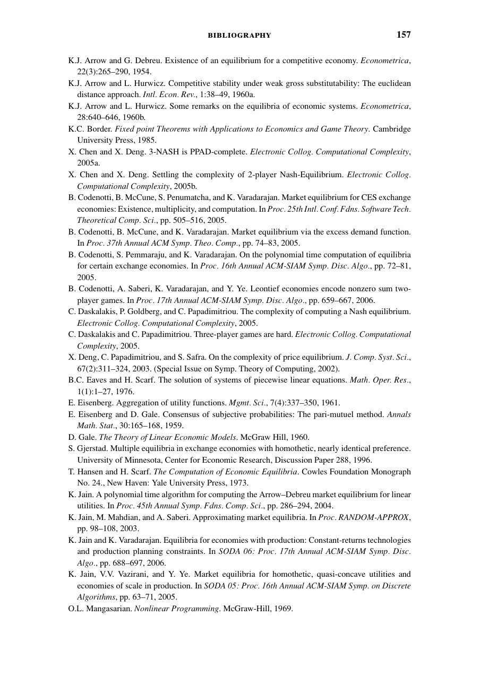

[Открыть страницу отдельно](../images/pages/p0178.jpg) · [Открыть страницу в PDF](../../materials/sources/Nisan-et-al-AGT-book.pdf#page=178)

Поисковый текст страницы (формулы сверяйте с изображением)

~~~~text
bibliography
157
K.J. Arrow and G. Debreu. Existence of an equilibrium for a competitive economy. Econometrica,
22(3):265–290, 1954.
K.J. Arrow and L. Hurwicz. Competitive stability under weak gross substitutability: The euclidean
distance approach. Intl. Econ. Rev., 1:38–49, 1960a.
K.J. Arrow and L. Hurwicz. Some remarks on the equilibria of economic systems. Econometrica,
28:640–646, 1960b.
K.C. Border. Fixed point Theorems with Applications to Economics and Game Theory. Cambridge
University Press, 1985.
X. Chen and X. Deng. 3-NASH is PPAD-complete. Electronic Collog. Computational Complexity,
2005a.
X. Chen and X. Deng. Settling the complexity of 2-player Nash-Equilibrium. Electronic Collog.
Computational Complexity, 2005b.
B. Codenotti, B. McCune, S. Penumatcha, and K. Varadarajan. Market equilibrium for CES exchange
economies: Existence, multiplicity, and computation. In Proc. 25th Intl. Conf. Fdns. Software Tech.
Theoretical Comp. Sci., pp. 505–516, 2005.
B. Codenotti, B. McCune, and K. Varadarajan. Market equilibrium via the excess demand function.
In Proc. 37th Annual ACM Symp. Theo. Comp., pp. 74–83, 2005.
B. Codenotti, S. Pemmaraju, and K. Varadarajan. On the polynomial time computation of equilibria
for certain exchange economies. In Proc. 16th Annual ACM-SIAM Symp. Disc. Algo., pp. 72–81,
2005.
B. Codenotti, A. Saberi, K. Varadarajan, and Y. Ye. Leontief economies encode nonzero sum two-
player games. In Proc. 17th Annual ACM-SIAM Symp. Disc. Algo., pp. 659–667, 2006.
C. Daskalakis, P. Goldberg, and C. Papadimitriou. The complexity of computing a Nash equilibrium.
Electronic Collog. Computational Complexity, 2005.
C. Daskalakis and C. Papadimitriou. Three-player games are hard. Electronic Collog. Computational
Complexity, 2005.
X. Deng, C. Papadimitriou, and S. Safra. On the complexity of price equilibrium. J. Comp. Syst. Sci.,
67(2):311–324, 2003. (Special Issue on Symp. Theory of Computing, 2002).
B.C. Eaves and H. Scarf. The solution of systems of piecewise linear equations. Math. Oper. Res.,
1(1):1–27, 1976.
E. Eisenberg. Aggregation of utility functions. Mgmt. Sci., 7(4):337–350, 1961.
E. Eisenberg and D. Gale. Consensus of subjective probabilities: The pari-mutuel method. Annals
Math. Stat., 30:165–168, 1959.
D. Gale. The Theory of Linear Economic Models. McGraw Hill, 1960.
S. Gjerstad. Multiple equilibria in exchange economies with homothetic, nearly identical preference.
University of Minnesota, Center for Economic Research, Discussion Paper 288, 1996.
T. Hansen and H. Scarf. The Computation of Economic Equilibria. Cowles Foundation Monograph
No. 24., New Haven: Yale University Press, 1973.
K. Jain. A polynomial time algorithm for computing the Arrow–Debreu market equilibrium for linear
utilities. In Proc. 45th Annual Symp. Fdns. Comp. Sci., pp. 286–294, 2004.
K. Jain, M. Mahdian, and A. Saberi. Approximating market equilibria. In Proc. RANDOM-APPROX,
pp. 98–108, 2003.
K. Jain and K. Varadarajan. Equilibria for economies with production: Constant-returns technologies
and production planning constraints. In SODA 06: Proc. 17th Annual ACM-SIAM Symp. Disc.
Algo., pp. 688–697, 2006.
K. Jain, V.V. Vazirani, and Y. Ye. Market equilibria for homothetic, quasi-concave utilities and
economies of scale in production. In SODA 05: Proc. 16th Annual ACM-SIAM Symp. on Discrete
Algorithms, pp. 63–71, 2005.
O.L. Mangasarian. Nonlinear Programming. McGraw-Hill, 1969.
~~~~

### PDF стр. 179 · книжная стр. 158

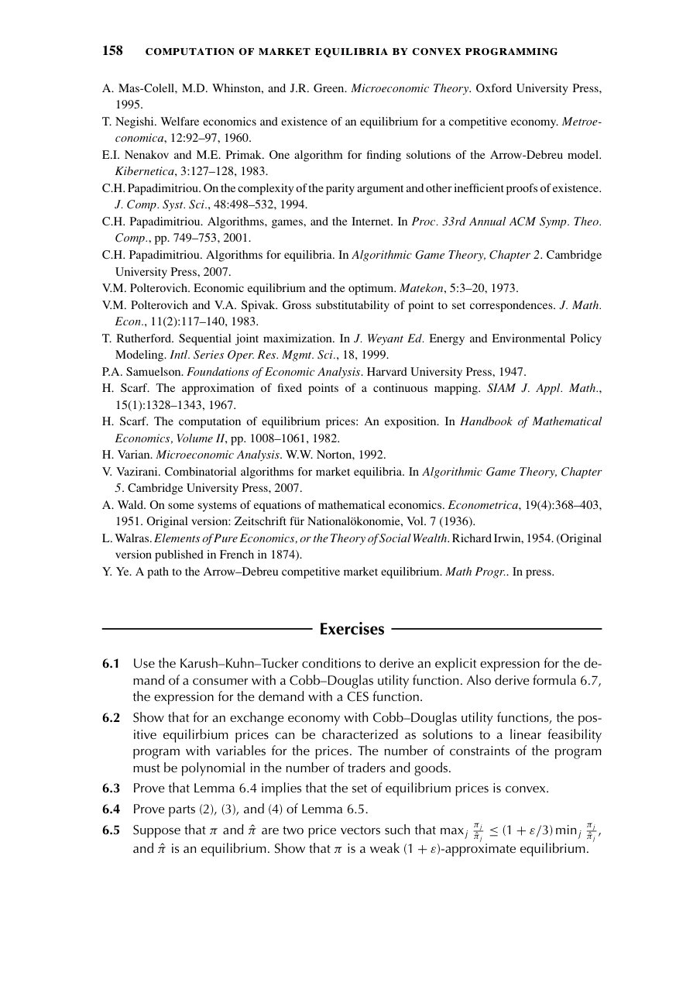

[Открыть страницу отдельно](../images/pages/p0179.jpg) · [Открыть страницу в PDF](../../materials/sources/Nisan-et-al-AGT-book.pdf#page=179)

Поисковый текст страницы (формулы сверяйте с изображением)

~~~~text
158
computation of market equilibria by convex programming
A. Mas-Colell, M.D. Whinston, and J.R. Green. Microeconomic Theory. Oxford University Press,
1995.
T. Negishi. Welfare economics and existence of an equilibrium for a competitive economy. Metroe-
conomica, 12:92–97, 1960.
E.I. Nenakov and M.E. Primak. One algorithm for finding solutions of the Arrow-Debreu model.
Kibernetica, 3:127–128, 1983.
C.H. Papadimitriou. On the complexity of the parity argument and other inefficient proofs of existence.
J. Comp. Syst. Sci., 48:498–532, 1994.
C.H. Papadimitriou. Algorithms, games, and the Internet. In Proc. 33rd Annual ACM Symp. Theo.
Comp., pp. 749–753, 2001.
C.H. Papadimitriou. Algorithms for equilibria. In Algorithmic Game Theory, Chapter 2. Cambridge
University Press, 2007.
V.M. Polterovich. Economic equilibrium and the optimum. Matekon, 5:3–20, 1973.
V.M. Polterovich and V.A. Spivak. Gross substitutability of point to set correspondences. J. Math.
Econ., 11(2):117–140, 1983.
T. Rutherford. Sequential joint maximization. In J. Weyant Ed. Energy and Environmental Policy
Modeling. Intl. Series Oper. Res. Mgmt. Sci., 18, 1999.
P.A. Samuelson. Foundations of Economic Analysis. Harvard University Press, 1947.
H. Scarf. The approximation of fixed points of a continuous mapping. SIAM J. Appl. Math.,
15(1):1328–1343, 1967.
H. Scarf. The computation of equilibrium prices: An exposition. In Handbook of Mathematical
Economics, Volume II, pp. 1008–1061, 1982.
H. Varian. Microeconomic Analysis. W.W. Norton, 1992.
V. Vazirani. Combinatorial algorithms for market equilibria. In Algorithmic Game Theory, Chapter
5. Cambridge University Press, 2007.
A. Wald. On some systems of equations of mathematical economics. Econometrica, 19(4):368–403,
1951. Original version: Zeitschrift f¨ur National¨okonomie, Vol. 7 (1936).
L. Walras. Elements of Pure Economics, or the Theory of Social Wealth. Richard Irwin, 1954. (Original
version published in French in 1874).
Y. Ye. A path to the Arrow–Debreu competitive market equilibrium. Math Progr.. In press.
Exercises
6.1
Use the Karush–Kuhn–Tucker conditions to derive an explicit expression for the de-
mand of a consumer with a Cobb–Douglas utility function. Also derive formula 6.7,
the expression for the demand with a CES function.
6.2
Show that for an exchange economy with Cobb–Douglas utility functions, the pos-
itive equilirbium prices can be characterized as solutions to a linear feasibility
program with variables for the prices. The number of constraints of the program
must be polynomial in the number of traders and goods.
6.3
Prove that Lemma 6.4 implies that the set of equilibrium prices is convex.
6.4
Prove parts (2), (3), and (4) of Lemma 6.5.
6.5
Suppose that π and ˆπ are two price vectors such that max j
π j
ˆπ j ≤(1 + ε/3) min j
π j
ˆπ j ,
and ˆπ is an equilibrium. Show that π is a weak (1 + ε)-approximate equilibrium.
~~~~

