# Глава 12. Computationally Efficient Approximation Mechanisms

**PDF-страницы:** 322–351. Изображения передают исходную страницу; извлечённый текст ниже нужен для поиска.

### Разделы

- [12.1 Introduction](#pdf-page-0322) — PDF стр. 322
- [12.2 Single-Dimensional Domains: Job Scheduling](#pdf-page-0324) — PDF стр. 324
- [12.2.1 A Monotone Algorithm for the Job Scheduling Problem](#pdf-page-0326) — PDF стр. 326
- [12.3 Multidimensional Domains: Combinatorial Auctions](#pdf-page-0331) — PDF стр. 331
- [12.3.1 A General Overview of Truthful Combinatorial Auctions](#pdf-page-0337) — PDF стр. 337
- [12.4 Impossibilities of Dominant Strategy Implementability](#pdf-page-0338) — PDF стр. 338
- [12.5 Alternative Solution Concepts](#pdf-page-0342) — PDF стр. 342
- [12.6 Bibliographic Notes](#pdf-page-0348) — PDF стр. 348
[К содержанию](../README.md) · [К полному файлу](../00_full_book.md)

### PDF стр. 322 · книжная стр. 301

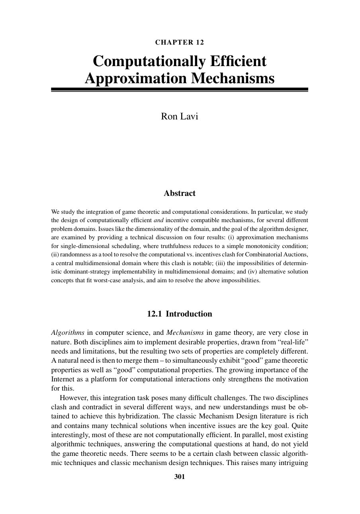

[Открыть страницу отдельно](../images/pages/p0322.jpg) · [Открыть страницу в PDF](../../materials/sources/Nisan-et-al-AGT-book.pdf#page=322)

Поисковый текст страницы (формулы сверяйте с изображением)

~~~~text
CHAPTER 12
Computationally Efficient
Approximation Mechanisms
Ron Lavi
Abstract
We study the integration of game theoretic and computational considerations. In particular, we study
the design of computationally efficient and incentive compatible mechanisms, for several different
problem domains. Issues like the dimensionality of the domain, and the goal of the algorithm designer,
are examined by providing a technical discussion on four results: (i) approximation mechanisms
for single-dimensional scheduling, where truthfulness reduces to a simple monotonicity condition;
(ii) randomness as a tool to resolve the computational vs. incentives clash for Combinatorial Auctions,
a central multidimensional domain where this clash is notable; (iii) the impossibilities of determin-
istic dominant-strategy implementability in multidimensional domains; and (iv) alternative solution
concepts that fit worst-case analysis, and aim to resolve the above impossibilities.
12.1 Introduction
Algorithms in computer science, and Mechanisms in game theory, are very close in
nature. Both disciplines aim to implement desirable properties, drawn from “real-life”
needs and limitations, but the resulting two sets of properties are completely different.
A natural need is then to merge them – to simultaneously exhibit “good” game theoretic
properties as well as “good” computational properties. The growing importance of the
Internet as a platform for computational interactions only strengthens the motivation
for this.
However, this integration task poses many difficult challenges. The two disciplines
clash and contradict in several different ways, and new understandings must be ob-
tained to achieve this hybridization. The classic Mechanism Design literature is rich
and contains many technical solutions when incentive issues are the key goal. Quite
interestingly, most of these are not computationally efficient. In parallel, most existing
algorithmic techniques, answering the computational questions at hand, do not yield
the game theoretic needs. There seems to be a certain clash between classic algorith-
mic techniques and classic mechanism design techniques. This raises many intriguing
301
~~~~

### PDF стр. 323 · книжная стр. 302

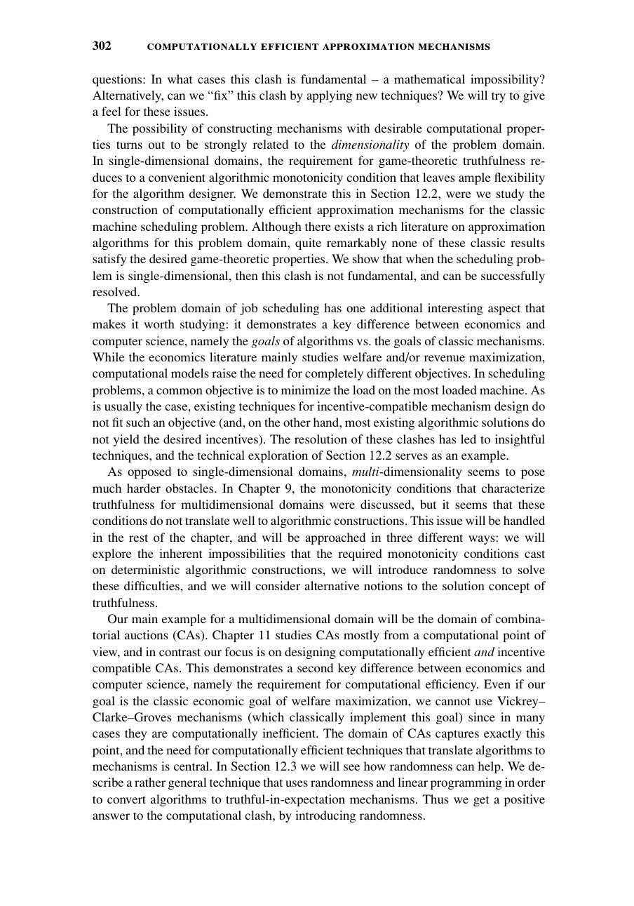

[Открыть страницу отдельно](../images/pages/p0323.jpg) · [Открыть страницу в PDF](../../materials/sources/Nisan-et-al-AGT-book.pdf#page=323)

Поисковый текст страницы (формулы сверяйте с изображением)

~~~~text
302
computationally efficient approximation mechanisms
questions: In what cases this clash is fundamental – a mathematical impossibility?
Alternatively, can we “fix” this clash by applying new techniques? We will try to give
a feel for these issues.
The possibility of constructing mechanisms with desirable computational proper-
ties turns out to be strongly related to the dimensionality of the problem domain.
In single-dimensional domains, the requirement for game-theoretic truthfulness re-
duces to a convenient algorithmic monotonicity condition that leaves ample flexibility
for the algorithm designer. We demonstrate this in Section 12.2, were we study the
construction of computationally efficient approximation mechanisms for the classic
machine scheduling problem. Although there exists a rich literature on approximation
algorithms for this problem domain, quite remarkably none of these classic results
satisfy the desired game-theoretic properties. We show that when the scheduling prob-
lem is single-dimensional, then this clash is not fundamental, and can be successfully
resolved.
The problem domain of job scheduling has one additional interesting aspect that
makes it worth studying: it demonstrates a key difference between economics and
computer science, namely the goals of algorithms vs. the goals of classic mechanisms.
While the economics literature mainly studies welfare and/or revenue maximization,
computational models raise the need for completely different objectives. In scheduling
problems, a common objective is to minimize the load on the most loaded machine. As
is usually the case, existing techniques for incentive-compatible mechanism design do
not fit such an objective (and, on the other hand, most existing algorithmic solutions do
not yield the desired incentives). The resolution of these clashes has led to insightful
techniques, and the technical exploration of Section 12.2 serves as an example.
As opposed to single-dimensional domains, multi-dimensionality seems to pose
much harder obstacles. In Chapter 9, the monotonicity conditions that characterize
truthfulness for multidimensional domains were discussed, but it seems that these
conditions do not translate well to algorithmic constructions. This issue will be handled
in the rest of the chapter, and will be approached in three different ways: we will
explore the inherent impossibilities that the required monotonicity conditions cast
on deterministic algorithmic constructions, we will introduce randomness to solve
these difficulties, and we will consider alternative notions to the solution concept of
truthfulness.
Our main example for a multidimensional domain will be the domain of combina-
torial auctions (CAs). Chapter 11 studies CAs mostly from a computational point of
view, and in contrast our focus is on designing computationally efficient and incentive
compatible CAs. This demonstrates a second key difference between economics and
computer science, namely the requirement for computational efficiency. Even if our
goal is the classic economic goal of welfare maximization, we cannot use Vickrey–
Clarke–Groves mechanisms (which classically implement this goal) since in many
cases they are computationally inefficient. The domain of CAs captures exactly this
point, and the need for computationally efficient techniques that translate algorithms to
mechanisms is central. In Section 12.3 we will see how randomness can help. We de-
scribe a rather general technique that uses randomness and linear programming in order
to convert algorithms to truthful-in-expectation mechanisms. Thus we get a positive
answer to the computational clash, by introducing randomness.
~~~~

### PDF стр. 324 · книжная стр. 303

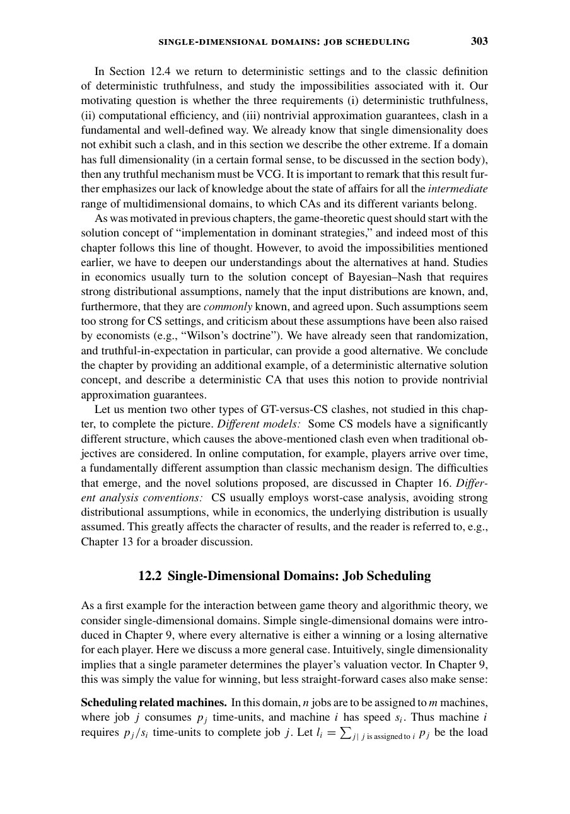

[Открыть страницу отдельно](../images/pages/p0324.jpg) · [Открыть страницу в PDF](../../materials/sources/Nisan-et-al-AGT-book.pdf#page=324)

Поисковый текст страницы (формулы сверяйте с изображением)

~~~~text
single-dimensional domains: job scheduling
303
In Section 12.4 we return to deterministic settings and to the classic definition
of deterministic truthfulness, and study the impossibilities associated with it. Our
motivating question is whether the three requirements (i) deterministic truthfulness,
(ii) computational efficiency, and (iii) nontrivial approximation guarantees, clash in a
fundamental and well-defined way. We already know that single dimensionality does
not exhibit such a clash, and in this section we describe the other extreme. If a domain
has full dimensionality (in a certain formal sense, to be discussed in the section body),
then any truthful mechanism must be VCG. It is important to remark that this result fur-
ther emphasizes our lack of knowledge about the state of affairs for all the intermediate
range of multidimensional domains, to which CAs and its different variants belong.
As was motivated in previous chapters, the game-theoretic quest should start with the
solution concept of “implementation in dominant strategies,” and indeed most of this
chapter follows this line of thought. However, to avoid the impossibilities mentioned
earlier, we have to deepen our understandings about the alternatives at hand. Studies
in economics usually turn to the solution concept of Bayesian–Nash that requires
strong distributional assumptions, namely that the input distributions are known, and,
furthermore, that they are commonly known, and agreed upon. Such assumptions seem
too strong for CS settings, and criticism about these assumptions have been also raised
by economists (e.g., “Wilson’s doctrine”). We have already seen that randomization,
and truthful-in-expectation in particular, can provide a good alternative. We conclude
the chapter by providing an additional example, of a deterministic alternative solution
concept, and describe a deterministic CA that uses this notion to provide nontrivial
approximation guarantees.
Let us mention two other types of GT-versus-CS clashes, not studied in this chap-
ter, to complete the picture. Different models: Some CS models have a significantly
different structure, which causes the above-mentioned clash even when traditional ob-
jectives are considered. In online computation, for example, players arrive over time,
a fundamentally different assumption than classic mechanism design. The difficulties
that emerge, and the novel solutions proposed, are discussed in Chapter 16. Differ-
ent analysis conventions: CS usually employs worst-case analysis, avoiding strong
distributional assumptions, while in economics, the underlying distribution is usually
assumed. This greatly affects the character of results, and the reader is referred to, e.g.,
Chapter 13 for a broader discussion.
12.2 Single-Dimensional Domains: Job Scheduling
As a first example for the interaction between game theory and algorithmic theory, we
consider single-dimensional domains. Simple single-dimensional domains were intro-
duced in Chapter 9, where every alternative is either a winning or a losing alternative
for each player. Here we discuss a more general case. Intuitively, single dimensionality
implies that a single parameter determines the player’s valuation vector. In Chapter 9,
this was simply the value for winning, but less straight-forward cases also make sense:
Scheduling related machines. In this domain, n jobs are to be assigned to m machines,
where job j consumes pj time-units, and machine i has speed si. Thus machine i
requires pj/si time-units to complete job j. Let li = ⟦U+0001; см. снимок страницы⟧
j| j is assigned to i pj be the load
~~~~

### PDF стр. 325 · книжная стр. 304

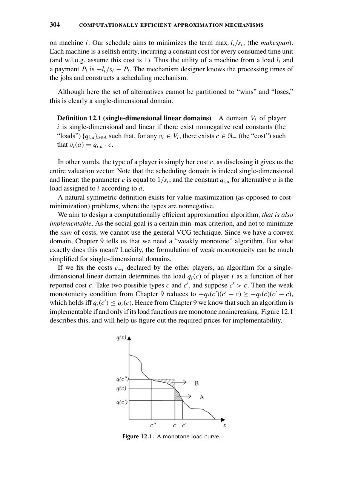

[Открыть страницу отдельно](../images/pages/p0325.jpg) · [Открыть страницу в PDF](../../materials/sources/Nisan-et-al-AGT-book.pdf#page=325)

**Definition 12.1 (single-dimensional linear domains)** — фрагмент оригинальной страницы:

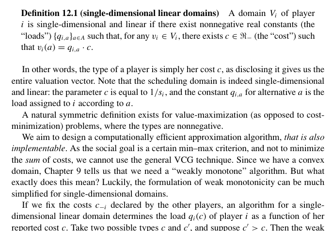

[Открыть фрагмент отдельно](../images/statements/p0325_definition_12-1_01.png)

**Figure 12.1. A monotone load curve.** — область рисунка или таблицы:

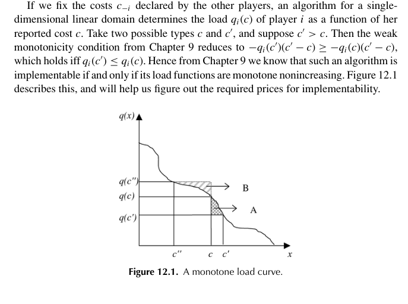

[Открыть фрагмент отдельно](../images/figures/p0325_figure_12-1_01.png)

Поисковый текст страницы (формулы сверяйте с изображением)

~~~~text
304
computationally efficient approximation mechanisms
on machine i. Our schedule aims to minimizes the term maxi li/si, (the makespan).
Each machine is a selfish entity, incurring a constant cost for every consumed time unit
(and w.l.o.g. assume this cost is 1). Thus the utility of a machine from a load li and
a payment Pi is −li/si −Pi. The mechanism designer knows the processing times of
the jobs and constructs a scheduling mechanism.
Although here the set of alternatives cannot be partitioned to “wins” and “loses,”
this is clearly a single-dimensional domain.
Definition 12.1 (single-dimensional linear domains)
A domain Vi of player
i is single-dimensional and linear if there exist nonnegative real constants (the
“loads”) {qi,a}a∈A such that, for any vi ∈Vi, there exists c ∈ℜ−(the “cost”) such
that vi(a) = qi,a · c.
In other words, the type of a player is simply her cost c, as disclosing it gives us the
entire valuation vector. Note that the scheduling domain is indeed single-dimensional
and linear: the parameter c is equal to 1/si, and the constant qi,a for alternative a is the
load assigned to i according to a.
A natural symmetric definition exists for value-maximization (as opposed to cost-
minimization) problems, where the types are nonnegative.
We aim to design a computationally efficient approximation algorithm, that is also
implementable. As the social goal is a certain min–max criterion, and not to minimize
the sum of costs, we cannot use the general VCG technique. Since we have a convex
domain, Chapter 9 tells us that we need a “weakly monotone” algorithm. But what
exactly does this mean? Luckily, the formulation of weak monotonicity can be much
simplified for single-dimensional domains.
If we fix the costs c−i declared by the other players, an algorithm for a single-
dimensional linear domain determines the load qi(c) of player i as a function of her
reported cost c. Take two possible types c and c′, and suppose c′ > c. Then the weak
monotonicity condition from Chapter 9 reduces to −qi(c′)(c′ −c) ≥−qi(c)(c′ −c),
which holds iff qi(c′) ≤qi(c). Hence from Chapter 9 we know that such an algorithm is
implementable if and only if its load functions are monotone nonincreasing. Figure 12.1
describes this, and will help us figure out the required prices for implementability.
Figure 12.1. A monotone load curve.
~~~~

### PDF стр. 326 · книжная стр. 305

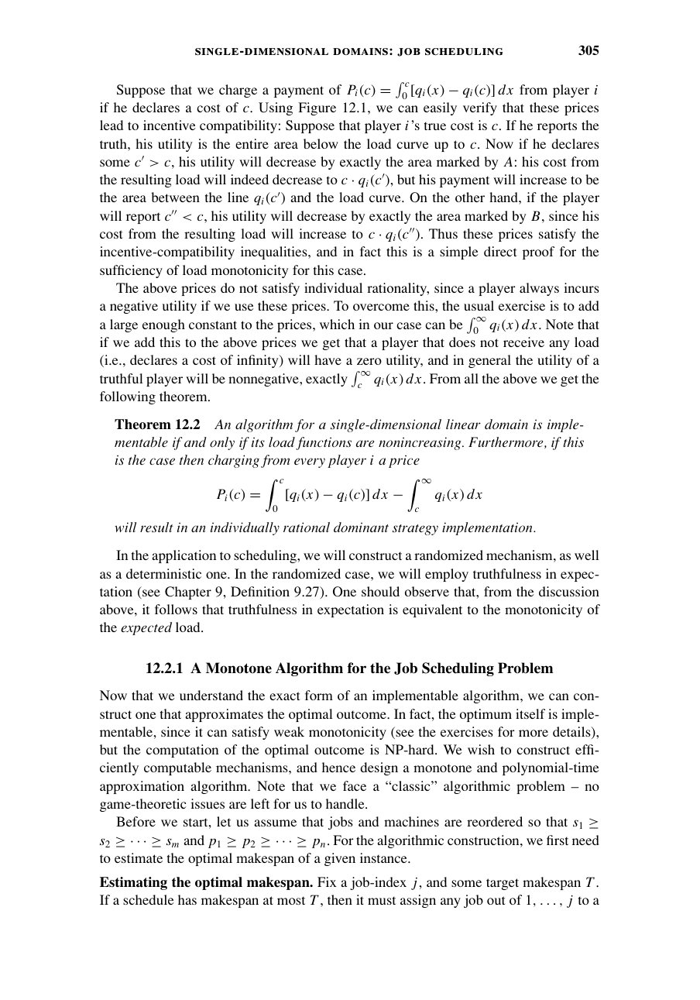

[Открыть страницу отдельно](../images/pages/p0326.jpg) · [Открыть страницу в PDF](../../materials/sources/Nisan-et-al-AGT-book.pdf#page=326)

**Theorem 12.2** — фрагмент оригинальной страницы:

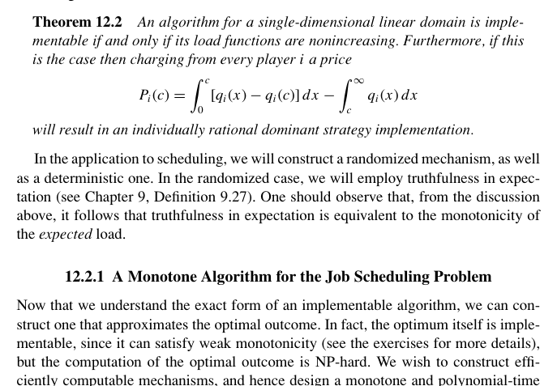

[Открыть фрагмент отдельно](../images/statements/p0326_theorem_12-2_01.png)

Поисковый текст страницы (формулы сверяйте с изображением)

~~~~text
single-dimensional domains: job scheduling
305
Suppose that we charge a payment of Pi(c) =
⟦U+0002; см. снимок страницы⟧ c
0 [qi(x) −qi(c)] dx from player i
if he declares a cost of c. Using Figure 12.1, we can easily verify that these prices
lead to incentive compatibility: Suppose that player i’s true cost is c. If he reports the
truth, his utility is the entire area below the load curve up to c. Now if he declares
some c′ > c, his utility will decrease by exactly the area marked by A: his cost from
the resulting load will indeed decrease to c · qi(c′), but his payment will increase to be
the area between the line qi(c′) and the load curve. On the other hand, if the player
will report c′′ < c, his utility will decrease by exactly the area marked by B, since his
cost from the resulting load will increase to c · qi(c′′). Thus these prices satisfy the
incentive-compatibility inequalities, and in fact this is a simple direct proof for the
sufficiency of load monotonicity for this case.
The above prices do not satisfy individual rationality, since a player always incurs
a negative utility if we use these prices. To overcome this, the usual exercise is to add
a large enough constant to the prices, which in our case can be
⟦U+0002; см. снимок страницы⟧ ∞
0 qi(x) dx. Note that
if we add this to the above prices we get that a player that does not receive any load
(i.e., declares a cost of infinity) will have a zero utility, and in general the utility of a
truthful player will be nonnegative, exactly
⟦U+0002; см. снимок страницы⟧ ∞
c
qi(x) dx. From all the above we get the
following theorem.
Theorem 12.2
An algorithm for a single-dimensional linear domain is imple-
mentable if and only if its load functions are nonincreasing. Furthermore, if this
is the case then charging from every player i a price
Pi(c) =
⟦U+0003; см. снимок страницы⟧ c
0
[qi(x) −qi(c)] dx −
⟦U+0003; см. снимок страницы⟧ ∞
c
qi(x) dx
will result in an individually rational dominant strategy implementation.
In the application to scheduling, we will construct a randomized mechanism, as well
as a deterministic one. In the randomized case, we will employ truthfulness in expec-
tation (see Chapter 9, Definition 9.27). One should observe that, from the discussion
above, it follows that truthfulness in expectation is equivalent to the monotonicity of
the expected load.
12.2.1 A Monotone Algorithm for the Job Scheduling Problem
Now that we understand the exact form of an implementable algorithm, we can con-
struct one that approximates the optimal outcome. In fact, the optimum itself is imple-
mentable, since it can satisfy weak monotonicity (see the exercises for more details),
but the computation of the optimal outcome is NP-hard. We wish to construct effi-
ciently computable mechanisms, and hence design a monotone and polynomial-time
approximation algorithm. Note that we face a “classic” algorithmic problem – no
game-theoretic issues are left for us to handle.
Before we start, let us assume that jobs and machines are reordered so that s1 ≥
s2 ≥· · · ≥sm and p1 ≥p2 ≥· · · ≥pn. For the algorithmic construction, we first need
to estimate the optimal makespan of a given instance.
Estimating the optimal makespan. Fix a job-index j, and some target makespan T .
If a schedule has makespan at most T , then it must assign any job out of 1, . . . , j to a
~~~~

### PDF стр. 327 · книжная стр. 306

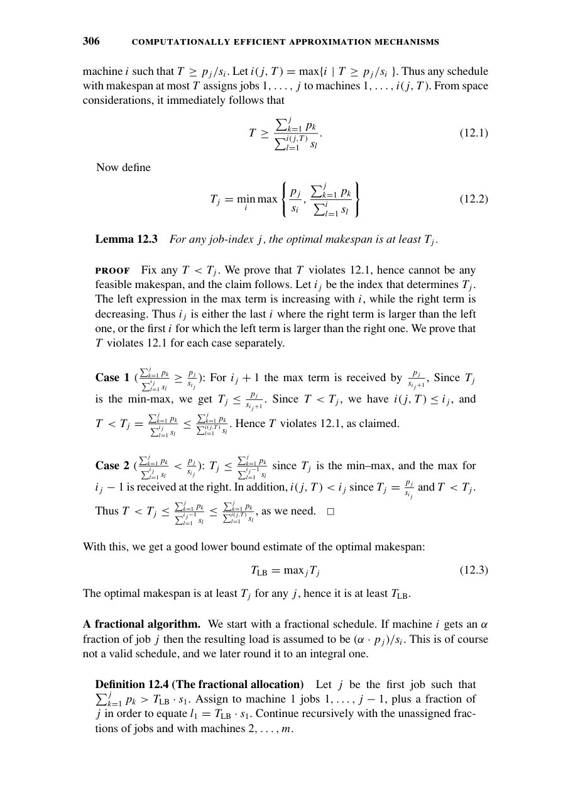

[Открыть страницу отдельно](../images/pages/p0327.jpg) · [Открыть страницу в PDF](../../materials/sources/Nisan-et-al-AGT-book.pdf#page=327)

**Lemma 12.3** — фрагмент оригинальной страницы:

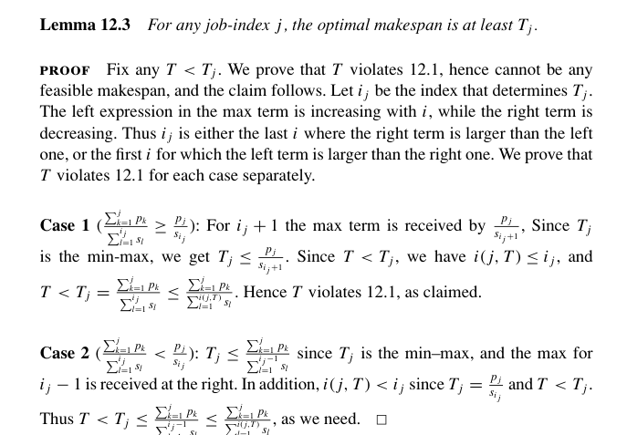

[Открыть фрагмент отдельно](../images/statements/p0327_lemma_12-3_01.png)

**Definition 12.4 (The fractional allocation)** — фрагмент оригинальной страницы:

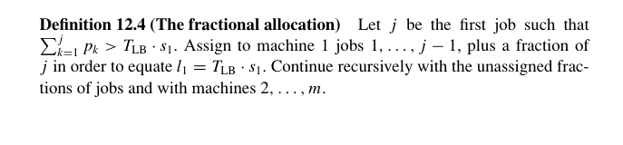

[Открыть фрагмент отдельно](../images/statements/p0327_definition_12-4_02.png)

Начало следующей страницы для проверки продолжения: 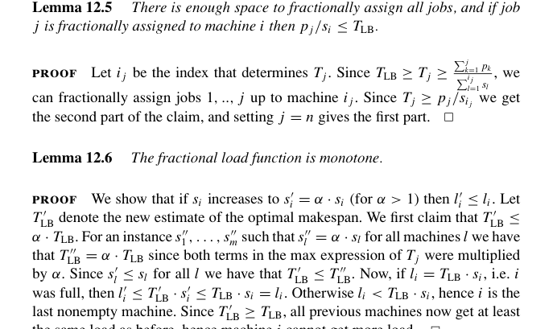

Поисковый текст страницы (формулы сверяйте с изображением)

~~~~text
306
computationally efficient approximation mechanisms
machine i such that T ≥pj/si. Let i(j, T ) = max{i | T ≥pj/si }. Thus any schedule
with makespan at most T assigns jobs 1, . . . , j to machines 1, . . . , i(j, T ). From space
considerations, it immediately follows that
T ≥
⟦U+0001; см. снимок страницы⟧j
k=1 pk
⟦U+0001; см. снимок страницы⟧i(j,T )
l=1
sl
.
(12.1)
Now define
Tj = min
i
max
⟦U+0004; см. снимок страницы⟧
pj
si
,
⟦U+0001; см. снимок страницы⟧j
k=1 pk
⟦U+0001; см. снимок страницы⟧i
l=1 sl
⟦U+0005; см. снимок страницы⟧
(12.2)
Lemma 12.3
For any job-index j, the optimal makespan is at least Tj.
proof
Fix any T < Tj. We prove that T violates 12.1, hence cannot be any
feasible makespan, and the claim follows. Let ij be the index that determines Tj.
The left expression in the max term is increasing with i, while the right term is
decreasing. Thus ij is either the last i where the right term is larger than the left
one, or the first i for which the left term is larger than the right one. We prove that
T violates 12.1 for each case separately.
Case 1 (
⟦U+0001; см. снимок страницы⟧j
k=1 pk
⟦U+0001; см. снимок страницы⟧ij
l=1 sl ≥pj
sij ): For ij + 1 the max term is received by
pj
sij +1 , Since Tj
is the min-max, we get Tj ≤
pj
sij +1 . Since T < Tj, we have i(j, T ) ≤ij, and
T < Tj =
⟦U+0001; см. снимок страницы⟧j
k=1 pk
⟦U+0001; см. снимок страницы⟧ij
l=1 sl ≤
⟦U+0001; см. снимок страницы⟧j
k=1 pk
⟦U+0001; см. снимок страницы⟧i(j,T )
l=1
sl . Hence T violates 12.1, as claimed.
Case 2 (
⟦U+0001; см. снимок страницы⟧j
k=1 pk
⟦U+0001; см. снимок страницы⟧ij
l=1 sl < pj
sij ): Tj ≤
⟦U+0001; см. снимок страницы⟧j
k=1 pk
⟦U+0001; см. снимок страницы⟧ij −1
l=1 sl since Tj is the min–max, and the max for
ij −1 is received at the right. In addition, i(j, T ) < ij since Tj = pj
sij and T < Tj.
Thus T < Tj ≤
⟦U+0001; см. снимок страницы⟧j
k=1 pk
⟦U+0001; см. снимок страницы⟧ij −1
l=1 sl ≤
⟦U+0001; см. снимок страницы⟧j
k=1 pk
⟦U+0001; см. снимок страницы⟧i(j,T )
l=1
sl , as we need.
With this, we get a good lower bound estimate of the optimal makespan:
TLB = maxjTj
(12.3)
The optimal makespan is at least Tj for any j, hence it is at least TLB.
A fractional algorithm. We start with a fractional schedule. If machine i gets an α
fraction of job j then the resulting load is assumed to be (α · pj)/si. This is of course
not a valid schedule, and we later round it to an integral one.
Definition 12.4 (The fractional allocation)
Let j be the first job such that
⟦U+0001; см. снимок страницы⟧j
k=1 pk > TLB · s1. Assign to machine 1 jobs 1, . . . , j −1, plus a fraction of
j in order to equate l1 = TLB · s1. Continue recursively with the unassigned frac-
tions of jobs and with machines 2, . . . , m.
~~~~

### PDF стр. 328 · книжная стр. 307

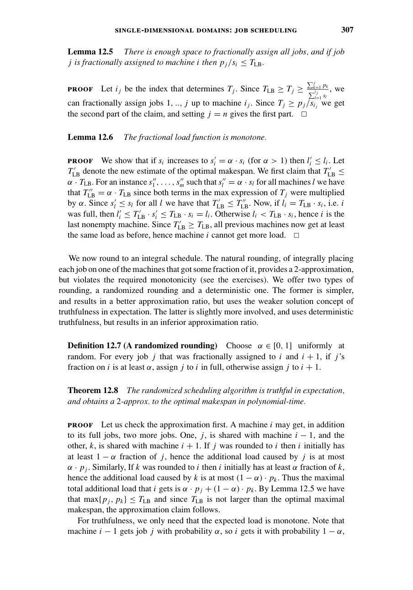

[Открыть страницу отдельно](../images/pages/p0328.jpg) · [Открыть страницу в PDF](../../materials/sources/Nisan-et-al-AGT-book.pdf#page=328)

**Lemma 12.5** — фрагмент оригинальной страницы:

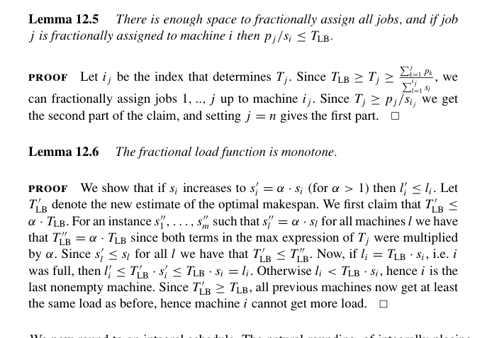

[Открыть фрагмент отдельно](../images/statements/p0328_lemma_12-5_01.png)

**Lemma 12.6** — фрагмент оригинальной страницы:

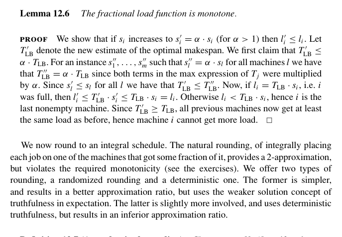

[Открыть фрагмент отдельно](../images/statements/p0328_lemma_12-6_02.png)

**Definition 12.7 (A randomized rounding)** — фрагмент оригинальной страницы:

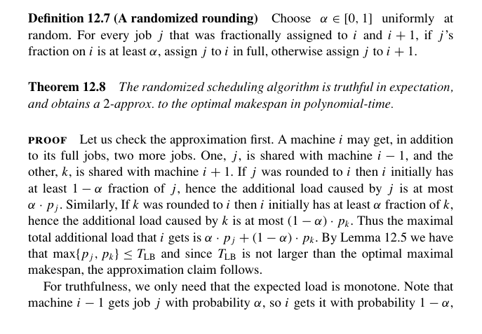

[Открыть фрагмент отдельно](../images/statements/p0328_definition_12-7_03.png)

**Theorem 12.8** — фрагмент оригинальной страницы:

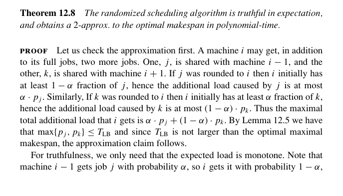

[Открыть фрагмент отдельно](../images/statements/p0328_theorem_12-8_04.png)

Поисковый текст страницы (формулы сверяйте с изображением)

~~~~text
single-dimensional domains: job scheduling
307
Lemma 12.5
There is enough space to fractionally assign all jobs, and if job
j is fractionally assigned to machine i then pj/si ≤TLB.
proof
Let ij be the index that determines Tj. Since TLB ≥Tj ≥
⟦U+0001; см. снимок страницы⟧j
k=1 pk
⟦U+0001; см. снимок страницы⟧ij
l=1 sl , we
can fractionally assign jobs 1, .., j up to machine ij. Since Tj ≥pj/sij we get
the second part of the claim, and setting j = n gives the first part.
Lemma 12.6
The fractional load function is monotone.
proof
We show that if si increases to s′
i = α · si (for α > 1) then l′
i ≤li. Let
T ′
LB denote the new estimate of the optimal makespan. We first claim that T ′
LB ≤
α · TLB. For an instance s′′
1, . . . , s′′
m such that s′′
l = α · sl for all machines l we have
that T ′′
LB = α · TLB since both terms in the max expression of Tj were multiplied
by α. Since s′
l ≤sl for all l we have that T ′
LB ≤T ′′
LB. Now, if li = TLB · si, i.e. i
was full, then l′
i ≤T ′
LB · s′
i ≤TLB · si = li. Otherwise li < TLB · si, hence i is the
last nonempty machine. Since T ′
LB ≥TLB, all previous machines now get at least
the same load as before, hence machine i cannot get more load.
We now round to an integral schedule. The natural rounding, of integrally placing
each job on one of the machines that got some fraction of it, provides a 2-approximation,
but violates the required monotonicity (see the exercises). We offer two types of
rounding, a randomized rounding and a deterministic one. The former is simpler,
and results in a better approximation ratio, but uses the weaker solution concept of
truthfulness in expectation. The latter is slightly more involved, and uses deterministic
truthfulness, but results in an inferior approximation ratio.
Definition 12.7 (A randomized rounding)
Choose α ∈[0, 1] uniformly at
random. For every job j that was fractionally assigned to i and i + 1, if j’s
fraction on i is at least α, assign j to i in full, otherwise assign j to i + 1.
Theorem 12.8
The randomized scheduling algorithm is truthful in expectation,
and obtains a 2-approx. to the optimal makespan in polynomial-time.
proof
Let us check the approximation first. A machine i may get, in addition
to its full jobs, two more jobs. One, j, is shared with machine i −1, and the
other, k, is shared with machine i + 1. If j was rounded to i then i initially has
at least 1 −α fraction of j, hence the additional load caused by j is at most
α · pj. Similarly, If k was rounded to i then i initially has at least α fraction of k,
hence the additional load caused by k is at most (1 −α) · pk. Thus the maximal
total additional load that i gets is α · pj + (1 −α) · pk. By Lemma 12.5 we have
that max{pj, pk} ≤TLB and since TLB is not larger than the optimal maximal
makespan, the approximation claim follows.
For truthfulness, we only need that the expected load is monotone. Note that
machine i −1 gets job j with probability α, so i gets it with probability 1 −α,
~~~~

### PDF стр. 329 · книжная стр. 308

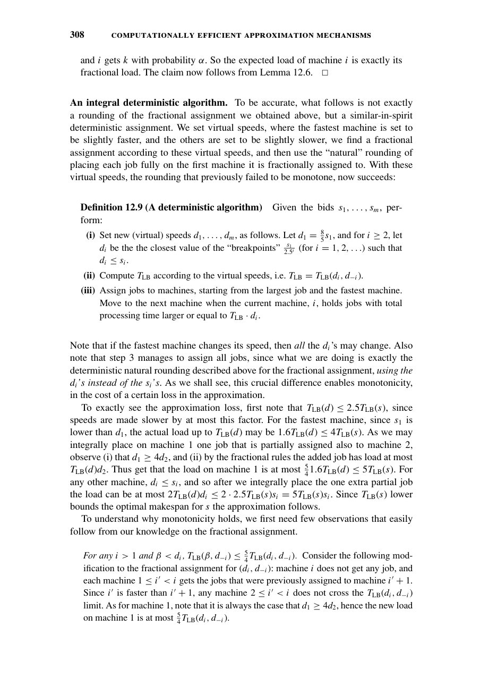

[Открыть страницу отдельно](../images/pages/p0329.jpg) · [Открыть страницу в PDF](../../materials/sources/Nisan-et-al-AGT-book.pdf#page=329)

**Definition 12.9 (A deterministic algorithm)** — фрагмент оригинальной страницы:

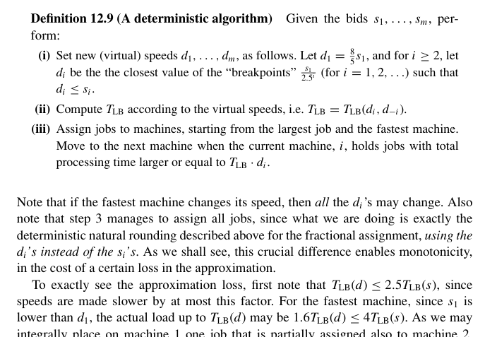

[Открыть фрагмент отдельно](../images/statements/p0329_definition_12-9_01.png)

Поисковый текст страницы (формулы сверяйте с изображением)

~~~~text
308
computationally efficient approximation mechanisms
and i gets k with probability α. So the expected load of machine i is exactly its
fractional load. The claim now follows from Lemma 12.6.
An integral deterministic algorithm. To be accurate, what follows is not exactly
a rounding of the fractional assignment we obtained above, but a similar-in-spirit
deterministic assignment. We set virtual speeds, where the fastest machine is set to
be slightly faster, and the others are set to be slightly slower, we find a fractional
assignment according to these virtual speeds, and then use the “natural” rounding of
placing each job fully on the first machine it is fractionally assigned to. With these
virtual speeds, the rounding that previously failed to be monotone, now succeeds:
Definition 12.9 (A deterministic algorithm)
Given the bids s1, . . . , sm, per-
form:
(i) Set new (virtual) speeds d1, . . . , dm, as follows. Let d1 = 8
5s1, and for i ≥2, let
di be the the closest value of the “breakpoints”
s1
2.5i (for i = 1, 2, . . .) such that
di ≤si.
(ii) Compute TLB according to the virtual speeds, i.e. TLB = TLB(di, d−i).
(iii) Assign jobs to machines, starting from the largest job and the fastest machine.
Move to the next machine when the current machine, i, holds jobs with total
processing time larger or equal to TLB · di.
Note that if the fastest machine changes its speed, then all the di’s may change. Also
note that step 3 manages to assign all jobs, since what we are doing is exactly the
deterministic natural rounding described above for the fractional assignment, using the
di’s instead of the si’s. As we shall see, this crucial difference enables monotonicity,
in the cost of a certain loss in the approximation.
To exactly see the approximation loss, first note that TLB(d) ≤2.5TLB(s), since
speeds are made slower by at most this factor. For the fastest machine, since s1 is
lower than d1, the actual load up to TLB(d) may be 1.6TLB(d) ≤4TLB(s). As we may
integrally place on machine 1 one job that is partially assigned also to machine 2,
observe (i) that d1 ≥4d2, and (ii) by the fractional rules the added job has load at most
TLB(d)d2. Thus get that the load on machine 1 is at most 5
41.6TLB(d) ≤5TLB(s). For
any other machine, di ≤si, and so after we integrally place the one extra partial job
the load can be at most 2TLB(d)di ≤2 · 2.5TLB(s)si = 5TLB(s)si. Since TLB(s) lower
bounds the optimal makespan for s the approximation follows.
To understand why monotonicity holds, we first need few observations that easily
follow from our knowledge on the fractional assignment.
For any i > 1 and β < di, TLB(β, d−i) ≤5
4TLB(di, d−i). Consider the following mod-
ification to the fractional assignment for (di, d−i): machine i does not get any job, and
each machine 1 ≤i′ < i gets the jobs that were previously assigned to machine i′ + 1.
Since i′ is faster than i′ + 1, any machine 2 ≤i′ < i does not cross the TLB(di, d−i)
limit. As for machine 1, note that it is always the case that d1 ≥4d2, hence the new load
on machine 1 is at most 5
4TLB(di, d−i).
~~~~

### PDF стр. 330 · книжная стр. 309

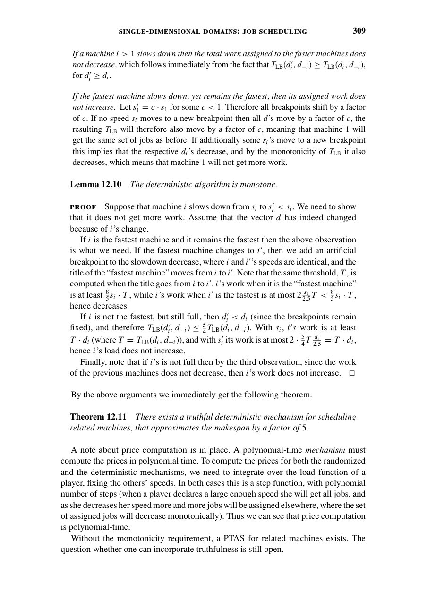

[Открыть страницу отдельно](../images/pages/p0330.jpg) · [Открыть страницу в PDF](../../materials/sources/Nisan-et-al-AGT-book.pdf#page=330)

**Lemma 12.10** — фрагмент оригинальной страницы:

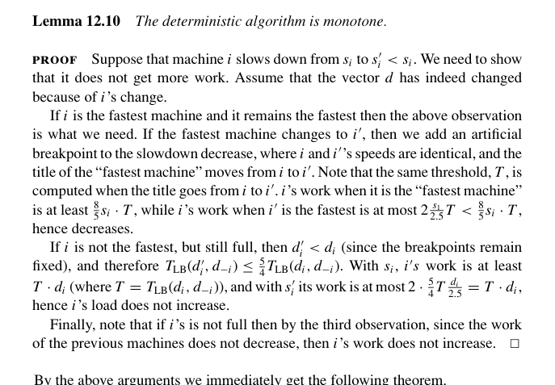

[Открыть фрагмент отдельно](../images/statements/p0330_lemma_12-10_01.png)

**Theorem 12.11** — фрагмент оригинальной страницы:

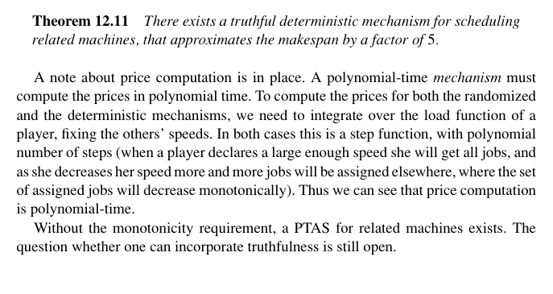

[Открыть фрагмент отдельно](../images/statements/p0330_theorem_12-11_02.png)

Поисковый текст страницы (формулы сверяйте с изображением)

~~~~text
single-dimensional domains: job scheduling
309
If a machine i > 1 slows down then the total work assigned to the faster machines does
not decrease, which follows immediately from the fact that TLB(d′
i, d−i) ≥TLB(di, d−i),
for d′
i ≥di.
If the fastest machine slows down, yet remains the fastest, then its assigned work does
not increase. Let s′
1 = c · s1 for some c < 1. Therefore all breakpoints shift by a factor
of c. If no speed si moves to a new breakpoint then all d’s move by a factor of c, the
resulting TLB will therefore also move by a factor of c, meaning that machine 1 will
get the same set of jobs as before. If additionally some si’s move to a new breakpoint
this implies that the respective di’s decrease, and by the monotonicity of TLB it also
decreases, which means that machine 1 will not get more work.
Lemma 12.10
The deterministic algorithm is monotone.
proof
Suppose that machine i slows down from si to s′
i < si. We need to show
that it does not get more work. Assume that the vector d has indeed changed
because of i’s change.
If i is the fastest machine and it remains the fastest then the above observation
is what we need. If the fastest machine changes to i′, then we add an artificial
breakpoint to the slowdown decrease, where i and i′’s speeds are identical, and the
title of the “fastest machine” moves from i to i′. Note that the same threshold, T , is
computed when the title goes from i to i′. i’s work when it is the “fastest machine”
is at least 8
5si · T , while i’s work when i′ is the fastest is at most 2 s1
2.5T < 8
5si · T ,
hence decreases.
If i is not the fastest, but still full, then d′
i < di (since the breakpoints remain
fixed), and therefore TLB(d′
i, d−i) ≤5
4TLB(di, d−i). With si, i′s work is at least
T · di (where T = TLB(di, d−i)), and with s′
i its work is at most 2 · 5
4T di
2.5 = T · di,
hence i’s load does not increase.
Finally, note that if i’s is not full then by the third observation, since the work
of the previous machines does not decrease, then i’s work does not increase.
By the above arguments we immediately get the following theorem.
Theorem 12.11
There exists a truthful deterministic mechanism for scheduling
related machines, that approximates the makespan by a factor of 5.
A note about price computation is in place. A polynomial-time mechanism must
compute the prices in polynomial time. To compute the prices for both the randomized
and the deterministic mechanisms, we need to integrate over the load function of a
player, fixing the others’ speeds. In both cases this is a step function, with polynomial
number of steps (when a player declares a large enough speed she will get all jobs, and
as she decreases her speed more and more jobs will be assigned elsewhere, where the set
of assigned jobs will decrease monotonically). Thus we can see that price computation
is polynomial-time.
Without the monotonicity requirement, a PTAS for related machines exists. The
question whether one can incorporate truthfulness is still open.
~~~~

### PDF стр. 331 · книжная стр. 310

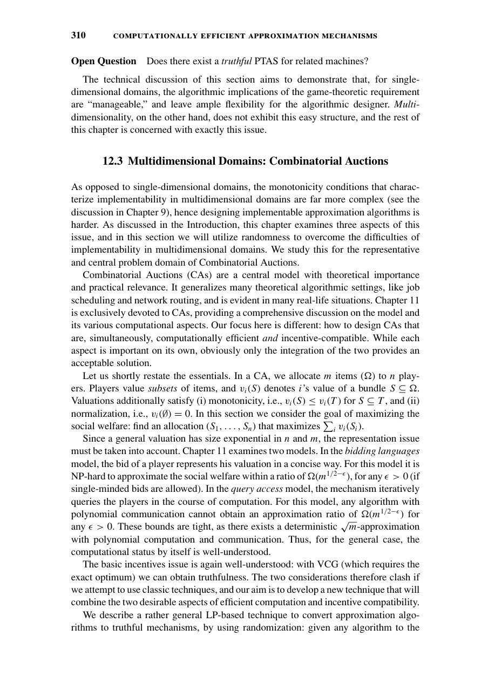

[Открыть страницу отдельно](../images/pages/p0331.jpg) · [Открыть страницу в PDF](../../materials/sources/Nisan-et-al-AGT-book.pdf#page=331)

Поисковый текст страницы (формулы сверяйте с изображением)

~~~~text
310
computationally efficient approximation mechanisms
Open Question
Does there exist a truthful PTAS for related machines?
The technical discussion of this section aims to demonstrate that, for single-
dimensional domains, the algorithmic implications of the game-theoretic requirement
are “manageable,” and leave ample flexibility for the algorithmic designer. Multi-
dimensionality, on the other hand, does not exhibit this easy structure, and the rest of
this chapter is concerned with exactly this issue.
12.3 Multidimensional Domains: Combinatorial Auctions
As opposed to single-dimensional domains, the monotonicity conditions that charac-
terize implementability in multidimensional domains are far more complex (see the
discussion in Chapter 9), hence designing implementable approximation algorithms is
harder. As discussed in the Introduction, this chapter examines three aspects of this
issue, and in this section we will utilize randomness to overcome the difficulties of
implementability in multidimensional domains. We study this for the representative
and central problem domain of Combinatorial Auctions.
Combinatorial Auctions (CAs) are a central model with theoretical importance
and practical relevance. It generalizes many theoretical algorithmic settings, like job
scheduling and network routing, and is evident in many real-life situations. Chapter 11
is exclusively devoted to CAs, providing a comprehensive discussion on the model and
its various computational aspects. Our focus here is different: how to design CAs that
are, simultaneously, computationally efficient and incentive-compatible. While each
aspect is important on its own, obviously only the integration of the two provides an
acceptable solution.
Let us shortly restate the essentials. In a CA, we allocate m items (⟦U+0003; см. снимок страницы⟧) to n play-
ers. Players value subsets of items, and vi(S) denotes i’s value of a bundle S ⊆⟦U+0003; см. снимок страницы⟧.
Valuations additionally satisfy (i) monotonicity, i.e., vi(S) ≤vi(T ) for S ⊆T , and (ii)
normalization, i.e., vi(∅) = 0. In this section we consider the goal of maximizing the
social welfare: find an allocation (S1, . . . , Sn) that maximizes ⟦U+0001; см. снимок страницы⟧
i vi(Si).
Since a general valuation has size exponential in n and m, the representation issue
must be taken into account. Chapter 11 examines two models. In the bidding languages
model, the bid of a player represents his valuation in a concise way. For this model it is
NP-hard to approximate the social welfare within a ratio of ⟦U+0003; см. снимок страницы⟧(m1/2−ϵ), for any ϵ > 0 (if
single-minded bids are allowed). In the query access model, the mechanism iteratively
queries the players in the course of computation. For this model, any algorithm with
polynomial communication cannot obtain an approximation ratio of ⟦U+0003; см. снимок страницы⟧(m1/2−ϵ) for
any ϵ > 0. These bounds are tight, as there exists a deterministic √m-approximation
with polynomial computation and communication. Thus, for the general case, the
computational status by itself is well-understood.
The basic incentives issue is again well-understood: with VCG (which requires the
exact optimum) we can obtain truthfulness. The two considerations therefore clash if
we attempt to use classic techniques, and our aim is to develop a new technique that will
combine the two desirable aspects of efficient computation and incentive compatibility.
We describe a rather general LP-based technique to convert approximation algo-
rithms to truthful mechanisms, by using randomization: given any algorithm to the
~~~~

### PDF стр. 332 · книжная стр. 311

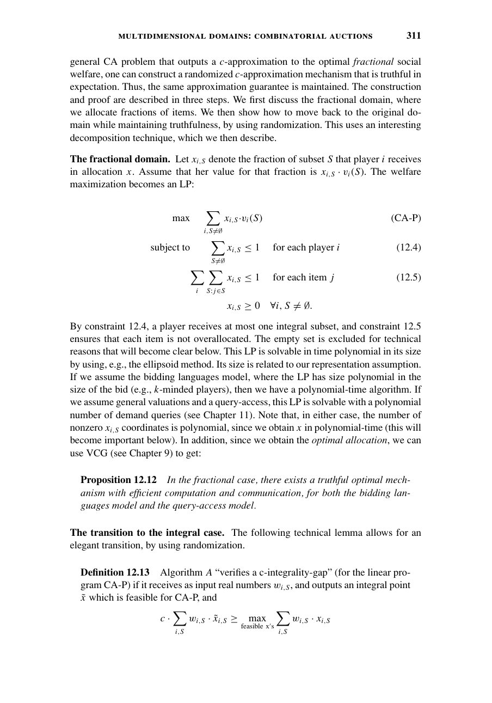

[Открыть страницу отдельно](../images/pages/p0332.jpg) · [Открыть страницу в PDF](../../materials/sources/Nisan-et-al-AGT-book.pdf#page=332)

**Proposition 12.12** — фрагмент оригинальной страницы:

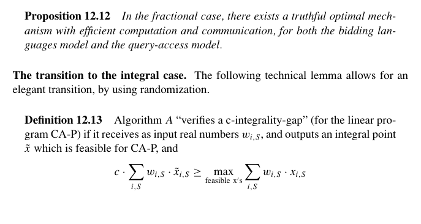

[Открыть фрагмент отдельно](../images/statements/p0332_proposition_12-12_01.png)

**Definition 12.13** — фрагмент оригинальной страницы:

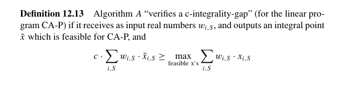

[Открыть фрагмент отдельно](../images/statements/p0332_definition_12-13_02.png)

Поисковый текст страницы (формулы сверяйте с изображением)

~~~~text
multidimensional domains: combinatorial auctions
311
general CA problem that outputs a c-approximation to the optimal fractional social
welfare, one can construct a randomized c-approximation mechanism that is truthful in
expectation. Thus, the same approximation guarantee is maintained. The construction
and proof are described in three steps. We first discuss the fractional domain, where
we allocate fractions of items. We then show how to move back to the original do-
main while maintaining truthfulness, by using randomization. This uses an interesting
decomposition technique, which we then describe.
The fractional domain. Let xi,S denote the fraction of subset S that player i receives
in allocation x. Assume that her value for that fraction is xi,S · vi(S). The welfare
maximization becomes an LP:
max
⟦U+0006; см. снимок страницы⟧
i,S̸=∅
xi,S·vi(S)
(CA-P)
subject to
⟦U+0006; см. снимок страницы⟧
S̸=∅
xi,S ≤1
for each player i
(12.4)
⟦U+0006; см. снимок страницы⟧
i
⟦U+0006; см. снимок страницы⟧
S:j∈S
xi,S ≤1
for each item j
(12.5)
xi,S ≥0
∀i, S̸ = ∅.
By constraint 12.4, a player receives at most one integral subset, and constraint 12.5
ensures that each item is not overallocated. The empty set is excluded for technical
reasons that will become clear below. This LP is solvable in time polynomial in its size
by using, e.g., the ellipsoid method. Its size is related to our representation assumption.
If we assume the bidding languages model, where the LP has size polynomial in the
size of the bid (e.g., k-minded players), then we have a polynomial-time algorithm. If
we assume general valuations and a query-access, this LP is solvable with a polynomial
number of demand queries (see Chapter 11). Note that, in either case, the number of
nonzero xi,S coordinates is polynomial, since we obtain x in polynomial-time (this will
become important below). In addition, since we obtain the optimal allocation, we can
use VCG (see Chapter 9) to get:
Proposition 12.12
In the fractional case, there exists a truthful optimal mech-
anism with efficient computation and communication, for both the bidding lan-
guages model and the query-access model.
The transition to the integral case. The following technical lemma allows for an
elegant transition, by using randomization.
Definition 12.13
Algorithm A “verifies a c-integrality-gap” (for the linear pro-
gram CA-P) if it receives as input real numbers wi,S, and outputs an integral point
˜x which is feasible for CA-P, and
c ·
⟦U+0006; см. снимок страницы⟧
i,S
wi,S · ˜xi,S ≥
max
feasible x′s
⟦U+0006; см. снимок страницы⟧
i,S
wi,S · xi,S
~~~~

### PDF стр. 333 · книжная стр. 312

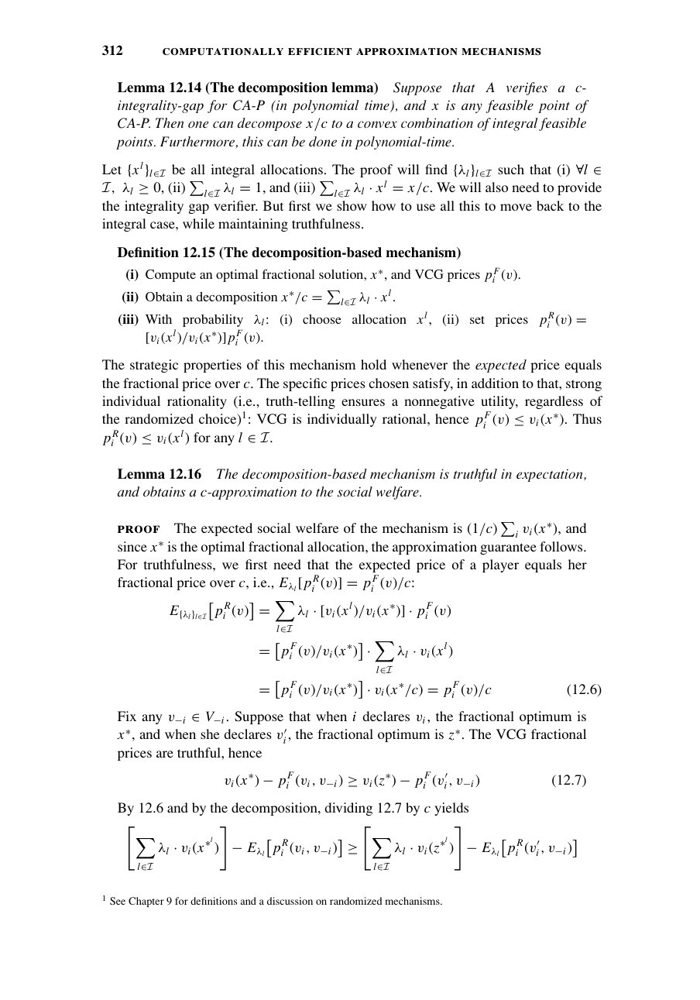

[Открыть страницу отдельно](../images/pages/p0333.jpg) · [Открыть страницу в PDF](../../materials/sources/Nisan-et-al-AGT-book.pdf#page=333)

**Lemma 12.14 (The decomposition lemma)** — фрагмент оригинальной страницы:

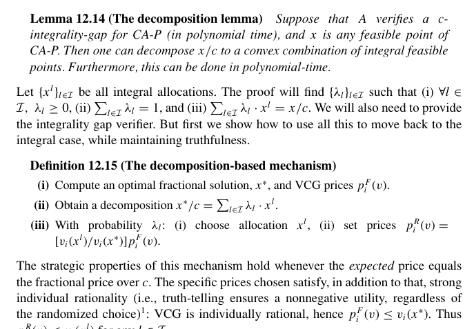

[Открыть фрагмент отдельно](../images/statements/p0333_lemma_12-14_01.png)

**Definition 12.15 (The decomposition-based mechanism)** — фрагмент оригинальной страницы:

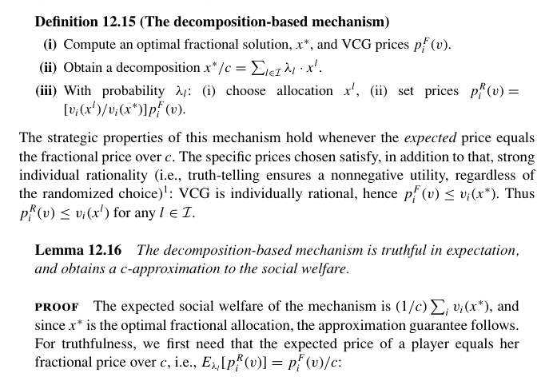

[Открыть фрагмент отдельно](../images/statements/p0333_definition_12-15_02.png)

**Lemma 12.16** — фрагмент оригинальной страницы:

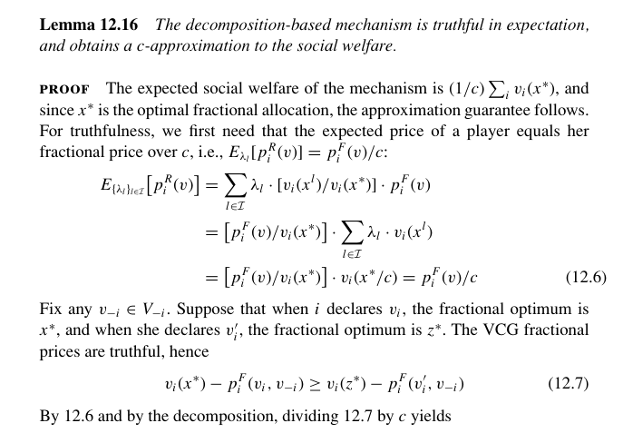

[Открыть фрагмент отдельно](../images/statements/p0333_lemma_12-16_03.png)

Поисковый текст страницы (формулы сверяйте с изображением)

~~~~text
312
computationally efficient approximation mechanisms
Lemma 12.14 (The decomposition lemma)
Suppose that A verifies a c-
integrality-gap for CA-P (in polynomial time), and x is any feasible point of
CA-P. Then one can decompose x/c to a convex combination of integral feasible
points. Furthermore, this can be done in polynomial-time.
Let {xl}l∈I be all integral allocations. The proof will find {λl}l∈I such that (i) ∀l ∈
I, λl ≥0, (ii) ⟦U+0001; см. снимок страницы⟧
l∈I λl = 1, and (iii) ⟦U+0001; см. снимок страницы⟧
l∈I λl · xl = x/c. We will also need to provide
the integrality gap verifier. But first we show how to use all this to move back to the
integral case, while maintaining truthfulness.
Definition 12.15 (The decomposition-based mechanism)
(i) Compute an optimal fractional solution, x∗, and VCG prices pF
i (v).
(ii) Obtain a decomposition x∗/c = ⟦U+0001; см. снимок страницы⟧
l∈I λl · xl.
(iii) With probability λl: (i) choose allocation xl, (ii) set prices pR
i (v) =
[vi(xl)/vi(x∗)]pF
i (v).
The strategic properties of this mechanism hold whenever the expected price equals
the fractional price over c. The specific prices chosen satisfy, in addition to that, strong
individual rationality (i.e., truth-telling ensures a nonnegative utility, regardless of
the randomized choice)1: VCG is individually rational, hence pF
i (v) ≤vi(x∗). Thus
pR
i (v) ≤vi(xl) for any l ∈I.
Lemma 12.16
The decomposition-based mechanism is truthful in expectation,
and obtains a c-approximation to the social welfare.
proof
The expected social welfare of the mechanism is (1/c) ⟦U+0001; см. снимок страницы⟧
i vi(x∗), and
since x∗is the optimal fractional allocation, the approximation guarantee follows.
For truthfulness, we first need that the expected price of a player equals her
fractional price over c, i.e., Eλl[pR
i (v)] = pF
i (v)/c:
E{λl}l∈I
⟦U+0007; см. снимок страницы⟧
pR
i (v)
⟦U+0008; см. снимок страницы⟧
=
⟦U+0006; см. снимок страницы⟧
l∈I
λl · [vi(xl)/vi(x∗)] · pF
i (v)
=
⟦U+0007; см. снимок страницы⟧
pF
i (v)/vi(x∗)
⟦U+0008; см. снимок страницы⟧
·
⟦U+0006; см. снимок страницы⟧
l∈I
λl · vi(xl)
=
⟦U+0007; см. снимок страницы⟧
pF
i (v)/vi(x∗)
⟦U+0008; см. снимок страницы⟧
· vi(x∗/c) = pF
i (v)/c
(12.6)
Fix any v−i ∈V−i. Suppose that when i declares vi, the fractional optimum is
x∗, and when she declares v′
i, the fractional optimum is z∗. The VCG fractional
prices are truthful, hence
vi(x∗) −pF
i (vi, v−i) ≥vi(z∗) −pF
i (v′
i, v−i)
(12.7)
By 12.6 and by the decomposition, dividing 12.7 by c yields
	⟦U+0006; см. снимок страницы⟧
l∈I
λl · vi(x∗l)

−Eλl
⟦U+0007; см. снимок страницы⟧
pR
i (vi, v−i)
⟦U+0008; см. снимок страницы⟧
≥
	⟦U+0006; см. снимок страницы⟧
l∈I
λl · vi(z∗l)

−Eλl
⟦U+0007; см. снимок страницы⟧
pR
i (v′
i, v−i)
⟦U+0008; см. снимок страницы⟧
1 See Chapter 9 for definitions and a discussion on randomized mechanisms.
~~~~

### PDF стр. 334 · книжная стр. 313

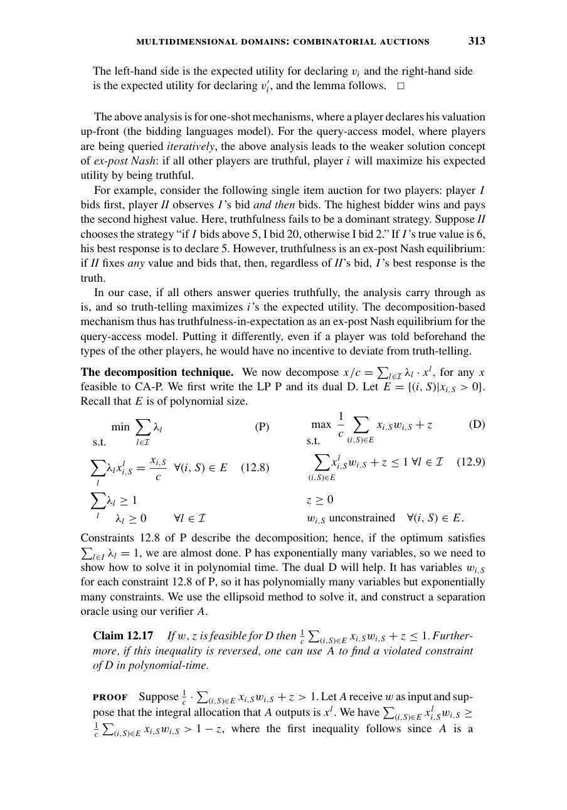

[Открыть страницу отдельно](../images/pages/p0334.jpg) · [Открыть страницу в PDF](../../materials/sources/Nisan-et-al-AGT-book.pdf#page=334)

**Claim 12.17** — фрагмент оригинальной страницы:

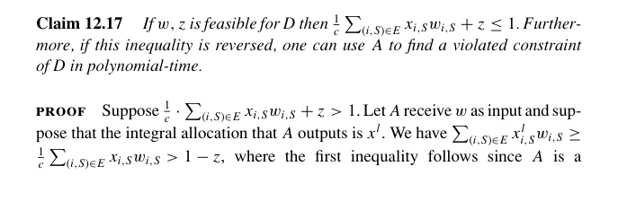

[Открыть фрагмент отдельно](../images/statements/p0334_claim_12-17_01.png)

Поисковый текст страницы (формулы сверяйте с изображением)

~~~~text
multidimensional domains: combinatorial auctions
313
The left-hand side is the expected utility for declaring vi and the right-hand side
is the expected utility for declaring v′
i, and the lemma follows.
The above analysis is for one-shot mechanisms, where a player declares his valuation
up-front (the bidding languages model). For the query-access model, where players
are being queried iteratively, the above analysis leads to the weaker solution concept
of ex-post Nash: if all other players are truthful, player i will maximize his expected
utility by being truthful.
For example, consider the following single item auction for two players: player I
bids first, player II observes I’s bid and then bids. The highest bidder wins and pays
the second highest value. Here, truthfulness fails to be a dominant strategy. Suppose II
chooses the strategy “if I bids above 5, I bid 20, otherwise I bid 2.” If I’s true value is 6,
his best response is to declare 5. However, truthfulness is an ex-post Nash equilibrium:
if II fixes any value and bids that, then, regardless of II’s bid, I’s best response is the
truth.
In our case, if all others answer queries truthfully, the analysis carry through as
is, and so truth-telling maximizes i’s the expected utility. The decomposition-based
mechanism thus has truthfulness-in-expectation as an ex-post Nash equilibrium for the
query-access model. Putting it differently, even if a player was told beforehand the
types of the other players, he would have no incentive to deviate from truth-telling.
The decomposition technique. We now decompose x/c = ⟦U+0001; см. снимок страницы⟧
l∈I λl · xl, for any x
feasible to CA-P. We first write the LP P and its dual D. Let E = {(i, S)|xi,S > 0}.
Recall that E is of polynomial size.
min
⟦U+0006; см. снимок страницы⟧
l∈I
λl
(P)
s.t.
⟦U+0006; см. снимок страницы⟧
l
λlxl
i,S = xi,S
c
∀(i, S) ∈E
(12.8)
⟦U+0006; см. снимок страницы⟧
l
λl ≥1
λl ≥0
∀l ∈I
max 1
c
⟦U+0006; см. снимок страницы⟧
(i,S)∈E
xi,Swi,S + z
(D)
s.t.
⟦U+0006; см. снимок страницы⟧
(i,S)∈E
xl
i,Swi,S + z ≤1 ∀l ∈I
(12.9)
z ≥0
wi,S unconstrained
∀(i, S) ∈E.
Constraints 12.8 of P describe the decomposition; hence, if the optimum satisfies
⟦U+0001; см. снимок страницы⟧
l∈I λl = 1, we are almost done. P has exponentially many variables, so we need to
show how to solve it in polynomial time. The dual D will help. It has variables wi,S
for each constraint 12.8 of P, so it has polynomially many variables but exponentially
many constraints. We use the ellipsoid method to solve it, and construct a separation
oracle using our verifier A.
Claim 12.17
If w, z is feasible for D then 1
c
⟦U+0001; см. снимок страницы⟧
(i,S)∈E xi,Swi,S + z ≤1. Further-
more, if this inequality is reversed, one can use A to find a violated constraint
of D in polynomial-time.
proof
Suppose 1
c · ⟦U+0001; см. снимок страницы⟧
(i,S)∈E xi,Swi,S + z > 1. Let A receive w as input and sup-
pose that the integral allocation that A outputs is xl. We have ⟦U+0001; см. снимок страницы⟧
(i,S)∈E xl
i,Swi,S ≥
1
c
⟦U+0001; см. снимок страницы⟧
(i,S)∈E xi,Swi,S > 1 −z, where the first inequality follows since A is a
~~~~

### PDF стр. 335 · книжная стр. 314

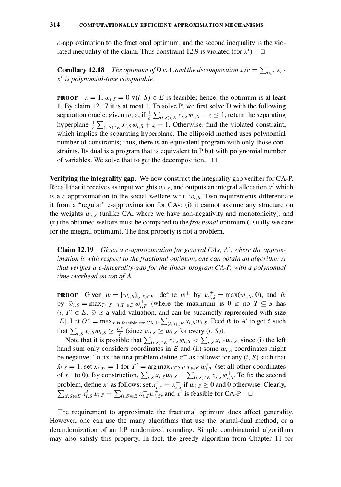

[Открыть страницу отдельно](../images/pages/p0335.jpg) · [Открыть страницу в PDF](../../materials/sources/Nisan-et-al-AGT-book.pdf#page=335)

**Corollary 12.18** — фрагмент оригинальной страницы:

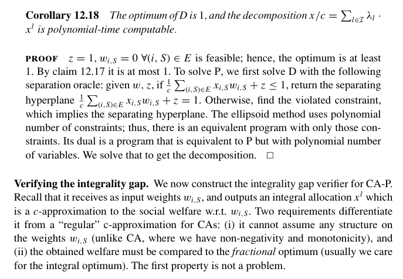

[Открыть фрагмент отдельно](../images/statements/p0335_corollary_12-18_01.png)

**Claim 12.19** — фрагмент оригинальной страницы:

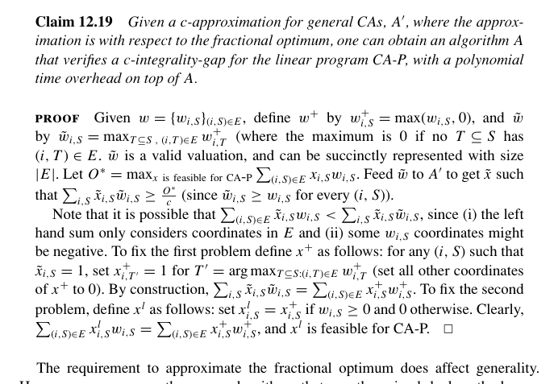

[Открыть фрагмент отдельно](../images/statements/p0335_claim_12-19_02.png)

Поисковый текст страницы (формулы сверяйте с изображением)

~~~~text
314
computationally efficient approximation mechanisms
c-approximation to the fractional optimum, and the second inequality is the vio-
lated inequality of the claim. Thus constraint 12.9 is violated (for xl).
Corollary 12.18
The optimum of D is 1, and the decomposition x/c = ⟦U+0001; см. снимок страницы⟧
l∈I λl ·
xl is polynomial-time computable.
proof
z = 1, wi,S = 0 ∀(i, S) ∈E is feasible; hence, the optimum is at least
1. By claim 12.17 it is at most 1. To solve P, we first solve D with the following
separation oracle: given w, z, if 1
c
⟦U+0001; см. снимок страницы⟧
(i,S)∈E xi,Swi,S + z ≤1, return the separating
hyperplane 1
c
⟦U+0001; см. снимок страницы⟧
(i,S)∈E xi,Swi,S + z = 1. Otherwise, find the violated constraint,
which implies the separating hyperplane. The ellipsoid method uses polynomial
number of constraints; thus, there is an equivalent program with only those con-
straints. Its dual is a program that is equivalent to P but with polynomial number
of variables. We solve that to get the decomposition.
Verifying the integrality gap. We now construct the integrality gap verifier for CA-P.
Recall that it receives as input weights wi,S, and outputs an integral allocation xl which
is a c-approximation to the social welfare w.r.t. wi,S. Two requirements differentiate
it from a “regular” c-approximation for CAs: (i) it cannot assume any structure on
the weights wi,S (unlike CA, where we have non-negativity and monotonicity), and
(ii) the obtained welfare must be compared to the fractional optimum (usually we care
for the integral optimum). The first property is not a problem.
Claim 12.19
Given a c-approximation for general CAs, A′, where the approx-
imation is with respect to the fractional optimum, one can obtain an algorithm A
that verifies a c-integrality-gap for the linear program CA-P, with a polynomial
time overhead on top of A.
proof
Given w = {wi,S}(i,S)∈E, define w+ by w+
i,S = max(wi,S, 0), and ˜w
by ˜wi,S = maxT ⊆S , (i,T )∈E w+
i,T (where the maximum is 0 if no T ⊆S has
(i, T ) ∈E. ˜w is a valid valuation, and can be succinctly represented with size
|E|. Let O∗= maxx is feasible for CA-P
⟦U+0001; см. снимок страницы⟧
(i,S)∈E xi,Swi,S. Feed ˜w to A′ to get ˜x such
that ⟦U+0001; см. снимок страницы⟧
i,S ˜xi,S ˜wi,S ≥O∗
c (since ˜wi,S ≥wi,S for every (i, S)).
Note that it is possible that ⟦U+0001; см. снимок страницы⟧
(i,S)∈E ˜xi,Swi,S < ⟦U+0001; см. снимок страницы⟧
i,S ˜xi,S ˜wi,S, since (i) the left
hand sum only considers coordinates in E and (ii) some wi,S coordinates might
be negative. To fix the first problem define x+ as follows: for any (i, S) such that
˜xi,S = 1, set x+
i,T ′ = 1 for T ′ = arg maxT ⊆S:(i,T )∈E w+
i,T (set all other coordinates
of x+ to 0). By construction, ⟦U+0001; см. снимок страницы⟧
i,S ˜xi,S ˜wi,S = ⟦U+0001; см. снимок страницы⟧
(i,S)∈E x+
i,Sw+
i,S. To fix the second
problem, define xl as follows: set xl
i,S = x+
i,S if wi,S ≥0 and 0 otherwise. Clearly,
⟦U+0001; см. снимок страницы⟧
(i,S)∈E xl
i,Swi,S = ⟦U+0001; см. снимок страницы⟧
(i,S)∈E x+
i,Sw+
i,S, and xl is feasible for CA-P.
The requirement to approximate the fractional optimum does affect generality.
However, one can use the many algorithms that use the primal-dual method, or a
derandomization of an LP randomized rounding. Simple combinatorial algorithms
may also satisfy this property. In fact, the greedy algorithm from Chapter 11 for
~~~~

### PDF стр. 336 · книжная стр. 315

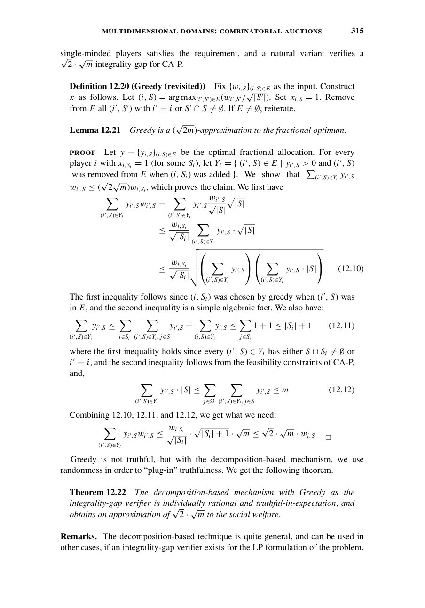

[Открыть страницу отдельно](../images/pages/p0336.jpg) · [Открыть страницу в PDF](../../materials/sources/Nisan-et-al-AGT-book.pdf#page=336)

**Definition 12.20 (Greedy (revisited))** — фрагмент оригинальной страницы:

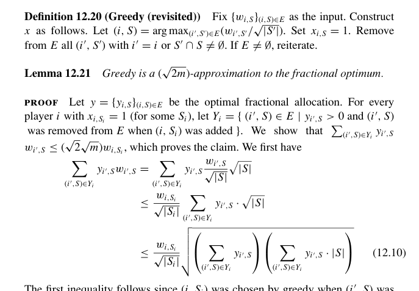

[Открыть фрагмент отдельно](../images/statements/p0336_definition_12-20_01.png)

**Lemma 12.21** — фрагмент оригинальной страницы:

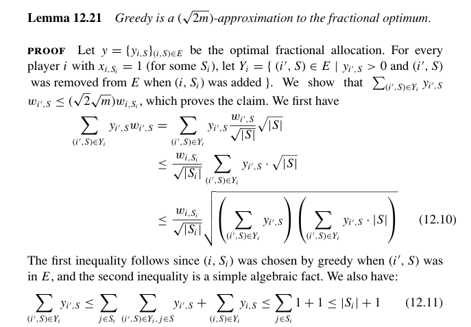

[Открыть фрагмент отдельно](../images/statements/p0336_lemma_12-21_02.png)

**Theorem 12.22** — фрагмент оригинальной страницы:

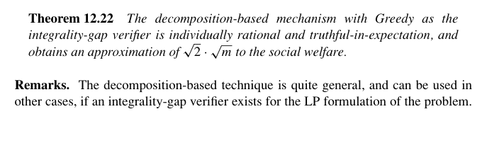

[Открыть фрагмент отдельно](../images/statements/p0336_theorem_12-22_03.png)

Поисковый текст страницы (формулы сверяйте с изображением)

~~~~text
multidimensional domains: combinatorial auctions
315
single-minded players satisfies the requirement, and a natural variant verifies a
√
2 · √m integrality-gap for CA-P.
Definition 12.20 (Greedy (revisited))
Fix {wi,S}(i,S)∈E as the input. Construct
x as follows. Let (i, S) = arg max(i′,S′)∈E(wi′,S′/√|S′|). Set xi,S = 1. Remove
from E all (i′, S′) with i′ = i or S′ ∩S̸ = ∅. If E̸ = ∅, reiterate.
Lemma 12.21
Greedy is a (
√
2m)-approximation to the fractional optimum.
proof
Let y = {yi,S}(i,S)∈E be the optimal fractional allocation. For every
player i with xi,Si = 1 (for some Si), let Yi = { (i′, S) ∈E | yi′,S > 0 and (i′, S)
was removed from E when (i, Si) was added }. We show that ⟦U+0001; см. снимок страницы⟧
(i′,S)∈Yi yi′,S
wi′,S ≤(
√
2√m)wi,Si, which proves the claim. We first have
⟦U+0006; см. снимок страницы⟧
(i′,S)∈Yi
yi′,Swi′,S =
⟦U+0006; см. снимок страницы⟧
(i′,S)∈Yi
yi′,S
wi′,S
√|S|
⟦U+000B; см. снимок страницы⟧
|S|
≤wi,Si
√|Si|
⟦U+0006; см. снимок страницы⟧
(i′,S)∈Yi
yi′,S ·
⟦U+000B; см. снимок страницы⟧
|S|
≤wi,Si
√|Si|
⟦U+000C; см. снимок страницы⟧
⟦U+000D; см. снимок страницы⟧
⟦U+000D; см. снимок страницы⟧
⟦U+000D; см. снимок страницы⟧
⟦U+000E; см. снимок страницы⟧
⎛
⎝⟦U+0006; см. снимок страницы⟧
(i′,S)∈Yi
yi′,S
⎞
⎠
⎛
⎝⟦U+0006; см. снимок страницы⟧
(i′,S)∈Yi
yi′,S · |S|
⎞
⎠
(12.10)
The first inequality follows since (i, Si) was chosen by greedy when (i′, S) was
in E, and the second inequality is a simple algebraic fact. We also have:
⟦U+0006; см. снимок страницы⟧
(i′,S)∈Yi
yi′,S ≤
⟦U+0006; см. снимок страницы⟧
j∈Si
⟦U+0006; см. снимок страницы⟧
(i′,S)∈Yi,j∈S
yi′,S +
⟦U+0006; см. снимок страницы⟧
(i,S)∈Yi
yi,S ≤
⟦U+0006; см. снимок страницы⟧
j∈Si
1 + 1 ≤|Si| + 1
(12.11)
where the first inequality holds since every (i′, S) ∈Yi has either S ∩Si̸ = ∅or
i′ = i, and the second inequality follows from the feasibility constraints of CA-P,
and,
⟦U+0006; см. снимок страницы⟧
(i′,S)∈Yi
yi′,S · |S| ≤
⟦U+0006; см. снимок страницы⟧
j∈⟦U+0003; см. снимок страницы⟧
⟦U+0006; см. снимок страницы⟧
(i′,S)∈Yi,j∈S
yi′,S ≤m
(12.12)
Combining 12.10, 12.11, and 12.12, we get what we need:
⟦U+0006; см. снимок страницы⟧
(i′,S)∈Yi
yi′,Swi′,S ≤wi,Si
√|Si| ·
⟦U+000B; см. снимок страницы⟧
|Si| + 1 · √m ≤
√
2 · √m · wi,Si
Greedy is not truthful, but with the decomposition-based mechanism, we use
randomness in order to “plug-in” truthfulness. We get the following theorem.
Theorem 12.22
The decomposition-based mechanism with Greedy as the
integrality-gap verifier is individually rational and truthful-in-expectation, and
obtains an approximation of
√
2 · √m to the social welfare.
Remarks. The decomposition-based technique is quite general, and can be used in
other cases, if an integrality-gap verifier exists for the LP formulation of the problem.
~~~~

### PDF стр. 337 · книжная стр. 316

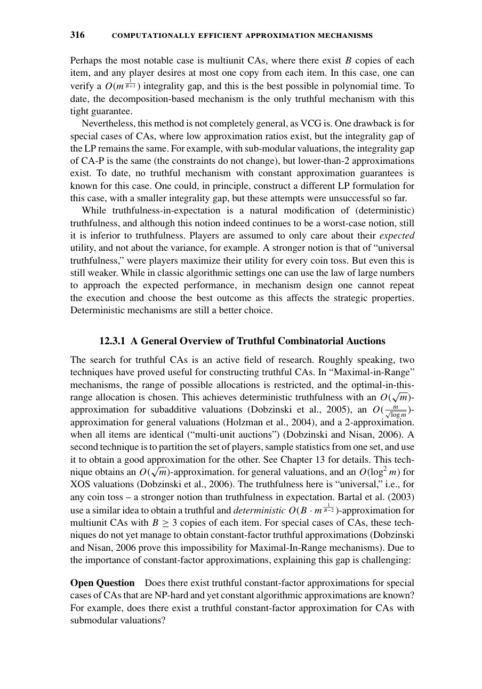

[Открыть страницу отдельно](../images/pages/p0337.jpg) · [Открыть страницу в PDF](../../materials/sources/Nisan-et-al-AGT-book.pdf#page=337)

Поисковый текст страницы (формулы сверяйте с изображением)

~~~~text
316
computationally efficient approximation mechanisms
Perhaps the most notable case is multiunit CAs, where there exist B copies of each
item, and any player desires at most one copy from each item. In this case, one can
verify a O(m
1
B+1 ) integrality gap, and this is the best possible in polynomial time. To
date, the decomposition-based mechanism is the only truthful mechanism with this
tight guarantee.
Nevertheless, this method is not completely general, as VCG is. One drawback is for
special cases of CAs, where low approximation ratios exist, but the integrality gap of
the LP remains the same. For example, with sub-modular valuations, the integrality gap
of CA-P is the same (the constraints do not change), but lower-than-2 approximations
exist. To date, no truthful mechanism with constant approximation guarantees is
known for this case. One could, in principle, construct a different LP formulation for
this case, with a smaller integrality gap, but these attempts were unsuccessful so far.
While truthfulness-in-expectation is a natural modification of (deterministic)
truthfulness, and although this notion indeed continues to be a worst-case notion, still
it is inferior to truthfulness. Players are assumed to only care about their expected
utility, and not about the variance, for example. A stronger notion is that of “universal
truthfulness,” were players maximize their utility for every coin toss. But even this is
still weaker. While in classic algorithmic settings one can use the law of large numbers
to approach the expected performance, in mechanism design one cannot repeat
the execution and choose the best outcome as this affects the strategic properties.
Deterministic mechanisms are still a better choice.
12.3.1 A General Overview of Truthful Combinatorial Auctions
The search for truthful CAs is an active field of research. Roughly speaking, two
techniques have proved useful for constructing truthful CAs. In “Maximal-in-Range”
mechanisms, the range of possible allocations is restricted, and the optimal-in-this-
range allocation is chosen. This achieves deterministic truthfulness with an O(√m)-
approximation for subadditive valuations (Dobzinski et al., 2005), an O(
m
√log m)-
approximation for general valuations (Holzman et al., 2004), and a 2-approximation.
when all items are identical (“multi-unit auctions”) (Dobzinski and Nisan, 2006). A
second technique is to partition the set of players, sample statistics from one set, and use
it to obtain a good approximation for the other. See Chapter 13 for details. This tech-
nique obtains an O(√m)-approximation. for general valuations, and an O(log2 m) for
XOS valuations (Dobzinski et al., 2006). The truthfulness here is “universal,” i.e., for
any coin toss – a stronger notion than truthfulness in expectation. Bartal et al. (2003)
use a similar idea to obtain a truthful and deterministic O(B · m
1
B−2 )-approximation for
multiunit CAs with B ≥3 copies of each item. For special cases of CAs, these tech-
niques do not yet manage to obtain constant-factor truthful approximations (Dobzinski
and Nisan, 2006 prove this impossibility for Maximal-In-Range mechanisms). Due to
the importance of constant-factor approximations, explaining this gap is challenging:
Open Question
Does there exist truthful constant-factor approximations for special
cases of CAs that are NP-hard and yet constant algorithmic approximations are known?
For example, does there exist a truthful constant-factor approximation for CAs with
submodular valuations?
~~~~

### PDF стр. 338 · книжная стр. 317

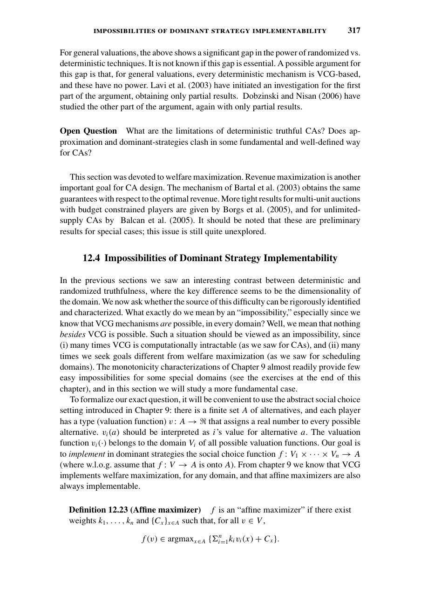

[Открыть страницу отдельно](../images/pages/p0338.jpg) · [Открыть страницу в PDF](../../materials/sources/Nisan-et-al-AGT-book.pdf#page=338)

**Definition 12.23 (Affine maximizer)** — фрагмент оригинальной страницы:

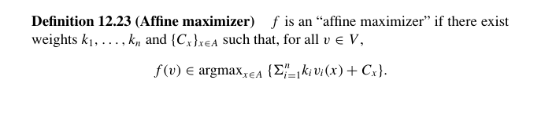

[Открыть фрагмент отдельно](../images/statements/p0338_definition_12-23_01.png)

Начало следующей страницы для проверки продолжения: 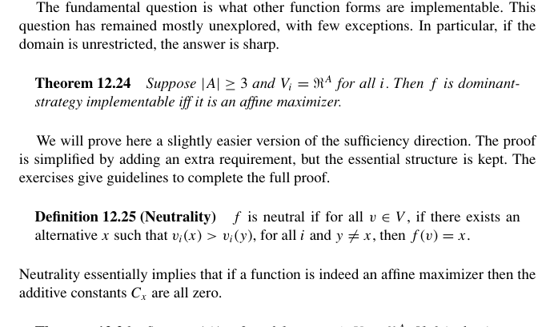

Поисковый текст страницы (формулы сверяйте с изображением)

~~~~text
impossibilities of dominant strategy implementability
317
For general valuations, the above shows a significant gap in the power of randomized vs.
deterministic techniques. It is not known if this gap is essential. A possible argument for
this gap is that, for general valuations, every deterministic mechanism is VCG-based,
and these have no power. Lavi et al. (2003) have initiated an investigation for the first
part of the argument, obtaining only partial results. Dobzinski and Nisan (2006) have
studied the other part of the argument, again with only partial results.
Open Question
What are the limitations of deterministic truthful CAs? Does ap-
proximation and dominant-strategies clash in some fundamental and well-defined way
for CAs?
This section was devoted to welfare maximization. Revenue maximization is another
important goal for CA design. The mechanism of Bartal et al. (2003) obtains the same
guarantees with respect to the optimal revenue. More tight results for multi-unit auctions
with budget constrained players are given by Borgs et al. (2005), and for unlimited-
supply CAs by Balcan et al. (2005). It should be noted that these are preliminary
results for special cases; this issue is still quite unexplored.
12.4 Impossibilities of Dominant Strategy Implementability
In the previous sections we saw an interesting contrast between deterministic and
randomized truthfulness, where the key difference seems to be the dimensionality of
the domain. We now ask whether the source of this difficulty can be rigorously identified
and characterized. What exactly do we mean by an “impossibility,” especially since we
know that VCG mechanisms are possible, in every domain? Well, we mean that nothing
besides VCG is possible. Such a situation should be viewed as an impossibility, since
(i) many times VCG is computationally intractable (as we saw for CAs), and (ii) many
times we seek goals different from welfare maximization (as we saw for scheduling
domains). The monotonicity characterizations of Chapter 9 almost readily provide few
easy impossibilities for some special domains (see the exercises at the end of this
chapter), and in this section we will study a more fundamental case.
To formalize our exact question, it will be convenient to use the abstract social choice
setting introduced in Chapter 9: there is a finite set A of alternatives, and each player
has a type (valuation function) v : A →ℜthat assigns a real number to every possible
alternative. vi(a) should be interpreted as i’s value for alternative a. The valuation
function vi(·) belongs to the domain Vi of all possible valuation functions. Our goal is
to implement in dominant strategies the social choice function f : V1 × · · · × Vn →A
(where w.l.o.g. assume that f : V →A is onto A). From chapter 9 we know that VCG
implements welfare maximization, for any domain, and that affine maximizers are also
always implementable.
Definition 12.23 (Affine maximizer)
f is an “affine maximizer” if there exist
weights k1, . . . , kn and {Cx}x∈A such that, for all v ∈V ,
f (v) ∈argmaxx∈A {⟦U+0006; см. снимок страницы⟧n
i=1kivi(x) + Cx}.
~~~~

### PDF стр. 339 · книжная стр. 318

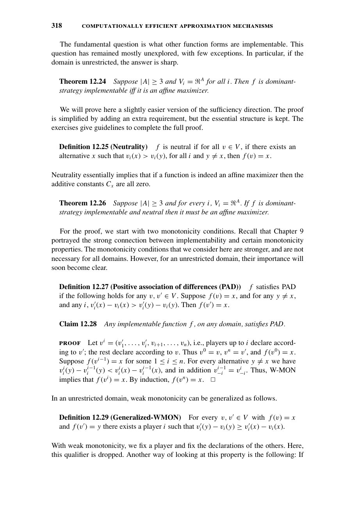

[Открыть страницу отдельно](../images/pages/p0339.jpg) · [Открыть страницу в PDF](../../materials/sources/Nisan-et-al-AGT-book.pdf#page=339)

**Theorem 12.24** — фрагмент оригинальной страницы:

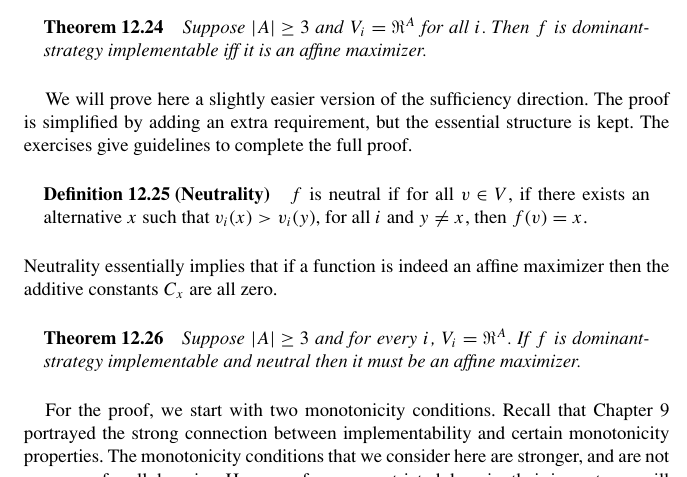

[Открыть фрагмент отдельно](../images/statements/p0339_theorem_12-24_01.png)

**Definition 12.25 (Neutrality)** — фрагмент оригинальной страницы:

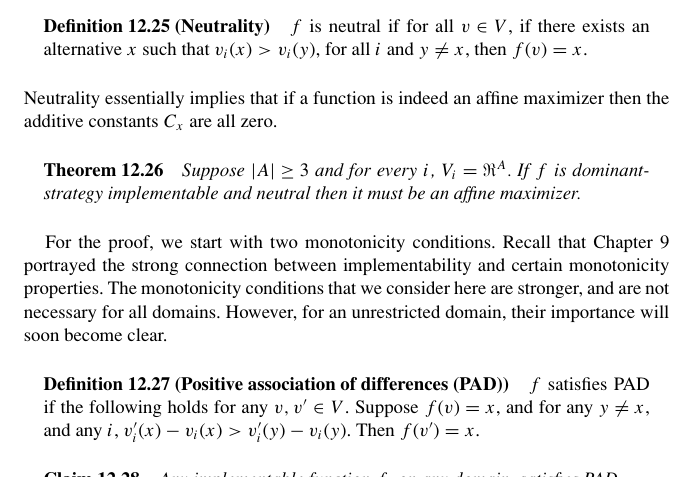

[Открыть фрагмент отдельно](../images/statements/p0339_definition_12-25_02.png)

**Theorem 12.26** — фрагмент оригинальной страницы:

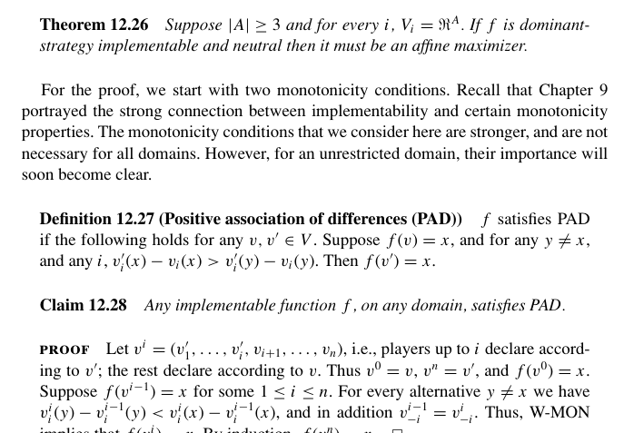

[Открыть фрагмент отдельно](../images/statements/p0339_theorem_12-26_03.png)

**Definition 12.27 (Positive association of differences (PAD))** — фрагмент оригинальной страницы:

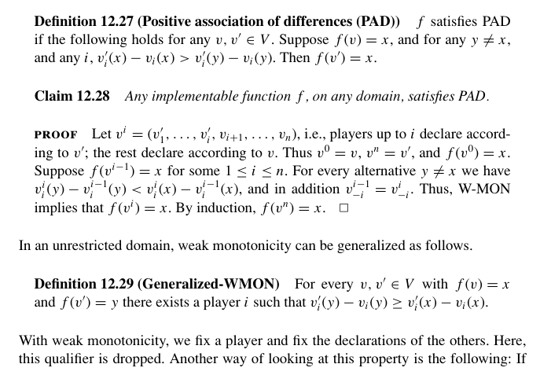

[Открыть фрагмент отдельно](../images/statements/p0339_definition_12-27_04.png)

**Claim 12.28** — фрагмент оригинальной страницы:

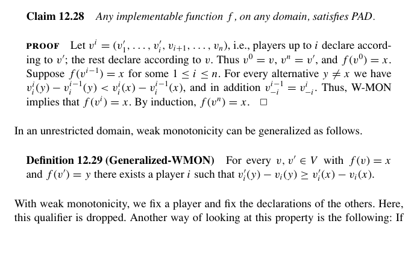

[Открыть фрагмент отдельно](../images/statements/p0339_claim_12-28_05.png)

**Definition 12.29 (Generalized-WMON)** — фрагмент оригинальной страницы:

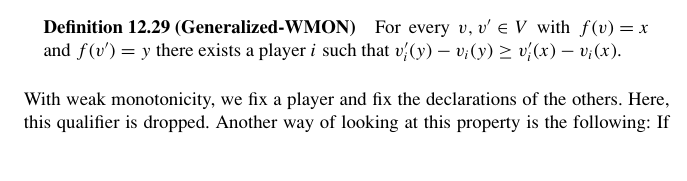

[Открыть фрагмент отдельно](../images/statements/p0339_definition_12-29_06.png)

Поисковый текст страницы (формулы сверяйте с изображением)

~~~~text
318
computationally efficient approximation mechanisms
The fundamental question is what other function forms are implementable. This
question has remained mostly unexplored, with few exceptions. In particular, if the
domain is unrestricted, the answer is sharp.
Theorem 12.24
Suppose |A| ≥3 and Vi = ℜA for all i. Then f is dominant-
strategy implementable iff it is an affine maximizer.
We will prove here a slightly easier version of the sufficiency direction. The proof
is simplified by adding an extra requirement, but the essential structure is kept. The
exercises give guidelines to complete the full proof.
Definition 12.25 (Neutrality)
f is neutral if for all v ∈V , if there exists an
alternative x such that vi(x) > vi(y), for all i and y̸ = x, then f (v) = x.
Neutrality essentially implies that if a function is indeed an affine maximizer then the
additive constants Cx are all zero.
Theorem 12.26
Suppose |A| ≥3 and for every i, Vi = ℜA. If f is dominant-
strategy implementable and neutral then it must be an affine maximizer.
For the proof, we start with two monotonicity conditions. Recall that Chapter 9
portrayed the strong connection between implementability and certain monotonicity
properties. The monotonicity conditions that we consider here are stronger, and are not
necessary for all domains. However, for an unrestricted domain, their importance will
soon become clear.
Definition 12.27 (Positive association of differences (PAD))
f satisfies PAD
if the following holds for any v, v′ ∈V . Suppose f (v) = x, and for any y̸ = x,
and any i, v′
i(x) −vi(x) > v′
i(y) −vi(y). Then f (v′) = x.
Claim 12.28
Any implementable function f , on any domain, satisfies PAD.
proof
Let vi = (v′
1, . . . , v′
i, vi+1, . . . , vn), i.e., players up to i declare accord-
ing to v′; the rest declare according to v. Thus v0 = v, vn = v′, and f (v0) = x.
Suppose f (vi−1) = x for some 1 ≤i ≤n. For every alternative y̸ = x we have
vi
i(y) −vi−1
i
(y) < vi
i(x) −vi−1
i
(x), and in addition vi−1
−i = vi
−i. Thus, W-MON
implies that f (vi) = x. By induction, f (vn) = x.
In an unrestricted domain, weak monotonicity can be generalized as follows.
Definition 12.29 (Generalized-WMON)
For every v, v′ ∈V with f (v) = x
and f (v′) = y there exists a player i such that v′
i(y) −vi(y) ≥v′
i(x) −vi(x).
With weak monotonicity, we fix a player and fix the declarations of the others. Here,
this qualifier is dropped. Another way of looking at this property is the following: If
~~~~

### PDF стр. 340 · книжная стр. 319

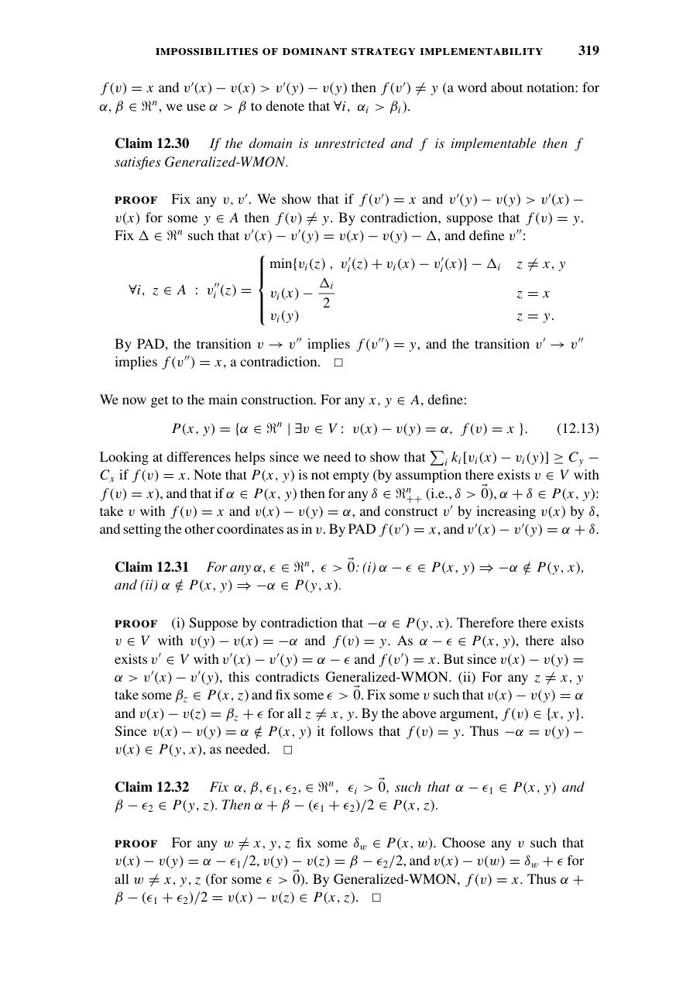

[Открыть страницу отдельно](../images/pages/p0340.jpg) · [Открыть страницу в PDF](../../materials/sources/Nisan-et-al-AGT-book.pdf#page=340)

**Claim 12.30** — фрагмент оригинальной страницы:

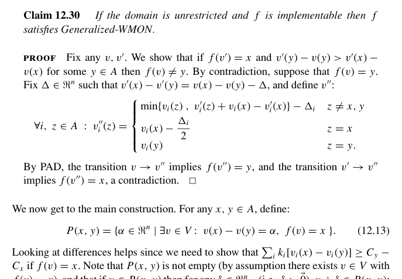

[Открыть фрагмент отдельно](../images/statements/p0340_claim_12-30_01.png)

**Claim 12.31** — фрагмент оригинальной страницы:

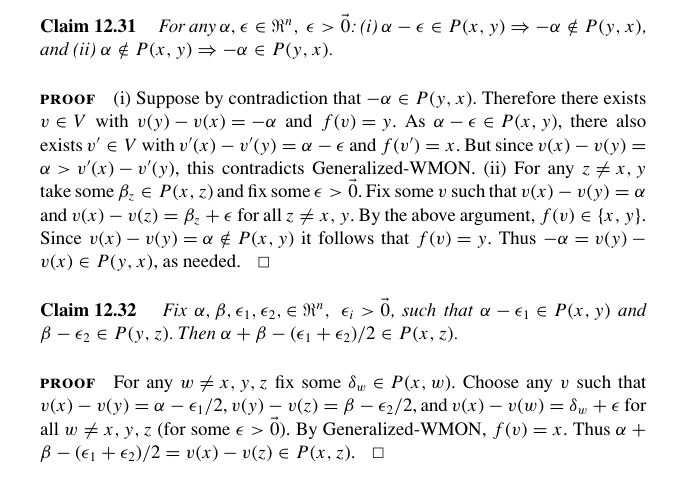

[Открыть фрагмент отдельно](../images/statements/p0340_claim_12-31_02.png)

**Claim 12.32** — фрагмент оригинальной страницы:

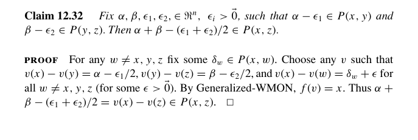

[Открыть фрагмент отдельно](../images/statements/p0340_claim_12-32_03.png)

Поисковый текст страницы (формулы сверяйте с изображением)

~~~~text
impossibilities of dominant strategy implementability
319
f (v) = x and v′(x) −v(x) > v′(y) −v(y) then f (v′)̸ = y (a word about notation: for
α, β ∈ℜn, we use α > β to denote that ∀i, αi > βi).
Claim 12.30
If the domain is unrestricted and f is implementable then f
satisfies Generalized-WMON.
proof
Fix any v, v′. We show that if f (v′) = x and v′(y) −v(y) > v′(x) −
v(x) for some y ∈A then f (v)̸ = y. By contradiction, suppose that f (v) = y.
Fix ⟦U+0007; см. снимок страницы⟧ ∈ℜn such that v′(x) −v′(y) = v(x) −v(y) −⟦U+0007; см. снимок страницы⟧, and define v′′:
∀i, z ∈A : v′′
i (z) =
⎧
⎪⎪⎨
⎪⎪⎩
min{vi(z) , v′
i(z) + vi(x) −v′
i(x)} −⟦U+0007; см. снимок страницы⟧i
z̸ = x, y
vi(x) −⟦U+0007; см. снимок страницы⟧i
2
z = x
vi(y)
z = y.
By PAD, the transition v →v′′ implies f (v′′) = y, and the transition v′ →v′′
implies f (v′′) = x, a contradiction.
We now get to the main construction. For any x, y ∈A, define:
P(x, y) = {α ∈ℜn | ∃v ∈V : v(x) −v(y) = α, f (v) = x }.
(12.13)
Looking at differences helps since we need to show that ⟦U+0001; см. снимок страницы⟧
i ki[vi(x) −vi(y)] ≥Cy −
Cx if f (v) = x. Note that P(x, y) is not empty (by assumption there exists v ∈V with
f (v) = x), and that if α ∈P(x, y) then for any δ ∈ℜn
++ (i.e., δ >⃗0), α + δ ∈P(x, y):
take v with f (v) = x and v(x) −v(y) = α, and construct v′ by increasing v(x) by δ,
and setting the other coordinates as in v. By PAD f (v′) = x, and v′(x) −v′(y) = α + δ.
Claim 12.31
For any α, ϵ ∈ℜn, ϵ >⃗0: (i) α −ϵ ∈P(x, y) ⇒−α /∈P(y, x),
and (ii) α /∈P(x, y) ⇒−α ∈P(y, x).
proof
(i) Suppose by contradiction that −α ∈P(y, x). Therefore there exists
v ∈V with v(y) −v(x) = −α and f (v) = y. As α −ϵ ∈P(x, y), there also
exists v′ ∈V with v′(x) −v′(y) = α −ϵ and f (v′) = x. But since v(x) −v(y) =
α > v′(x) −v′(y), this contradicts Generalized-WMON. (ii) For any z̸ = x, y
take some βz ∈P(x, z) and fix some ϵ >⃗0. Fix some v such that v(x) −v(y) = α
and v(x) −v(z) = βz + ϵ for all z̸ = x, y. By the above argument, f (v) ∈{x, y}.
Since v(x) −v(y) = α /∈P(x, y) it follows that f (v) = y. Thus −α = v(y) −
v(x) ∈P(y, x), as needed.
Claim 12.32
Fix α, β, ϵ1, ϵ2, ∈ℜn, ϵi >⃗0, such that α −ϵ1 ∈P(x, y) and
β −ϵ2 ∈P(y, z). Then α + β −(ϵ1 + ϵ2)/2 ∈P(x, z).
proof
For any w̸ = x, y, z fix some δw ∈P(x, w). Choose any v such that
v(x) −v(y) = α −ϵ1/2, v(y) −v(z) = β −ϵ2/2, and v(x) −v(w) = δw + ϵ for
all w̸ = x, y, z (for some ϵ >⃗0). By Generalized-WMON, f (v) = x. Thus α +
β −(ϵ1 + ϵ2)/2 = v(x) −v(z) ∈P(x, z).
~~~~

### PDF стр. 341 · книжная стр. 320

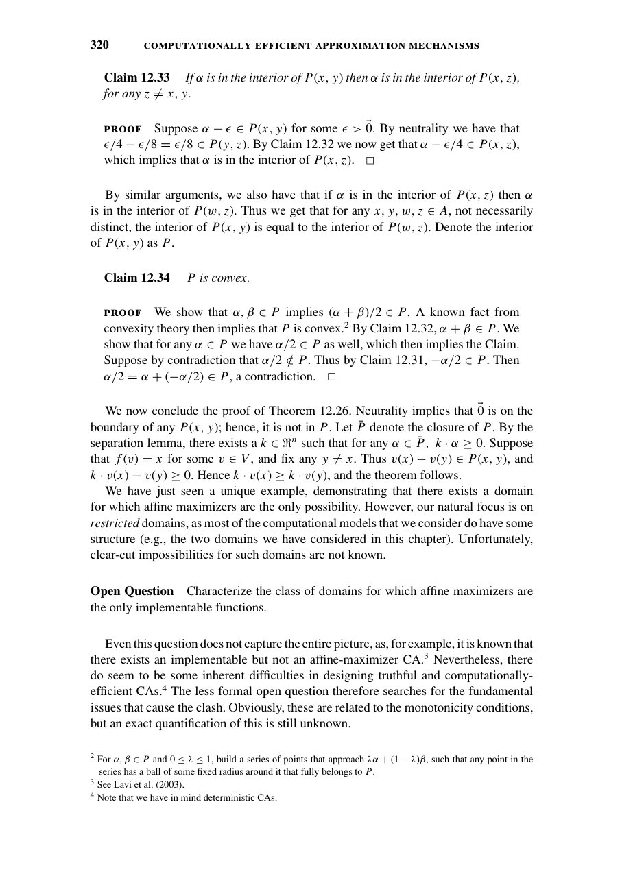

[Открыть страницу отдельно](../images/pages/p0341.jpg) · [Открыть страницу в PDF](../../materials/sources/Nisan-et-al-AGT-book.pdf#page=341)

**Claim 12.33** — фрагмент оригинальной страницы:

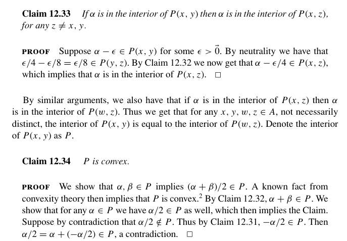

[Открыть фрагмент отдельно](../images/statements/p0341_claim_12-33_01.png)

**Claim 12.34** — фрагмент оригинальной страницы:

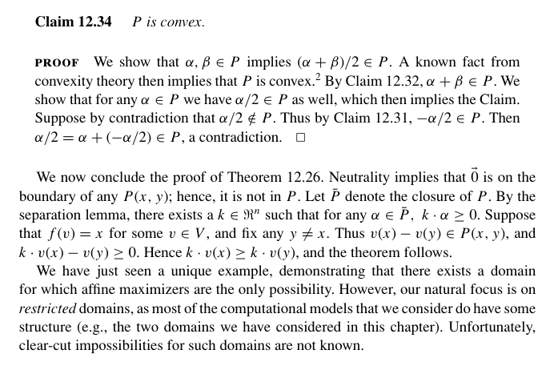

[Открыть фрагмент отдельно](../images/statements/p0341_claim_12-34_02.png)

Поисковый текст страницы (формулы сверяйте с изображением)

~~~~text
320
computationally efficient approximation mechanisms
Claim 12.33
If α is in the interior of P(x, y) then α is in the interior of P(x, z),
for any z̸ = x, y.
proof
Suppose α −ϵ ∈P(x, y) for some ϵ >⃗0. By neutrality we have that
ϵ/4 −ϵ/8 = ϵ/8 ∈P(y, z). By Claim 12.32 we now get that α −ϵ/4 ∈P(x, z),
which implies that α is in the interior of P(x, z).
By similar arguments, we also have that if α is in the interior of P(x, z) then α
is in the interior of P(w, z). Thus we get that for any x, y, w, z ∈A, not necessarily
distinct, the interior of P(x, y) is equal to the interior of P(w, z). Denote the interior
of P(x, y) as P.
Claim 12.34
P is convex.
proof
We show that α, β ∈P implies (α + β)/2 ∈P. A known fact from
convexity theory then implies that P is convex.2 By Claim 12.32, α + β ∈P. We
show that for any α ∈P we have α/2 ∈P as well, which then implies the Claim.
Suppose by contradiction that α/2 /∈P. Thus by Claim 12.31, −α/2 ∈P. Then
α/2 = α + (−α/2) ∈P, a contradiction.
We now conclude the proof of Theorem 12.26. Neutrality implies that⃗0 is on the
boundary of any P(x, y); hence, it is not in P. Let ¯P denote the closure of P. By the
separation lemma, there exists a k ∈ℜn such that for any α ∈¯P , k · α ≥0. Suppose
that f (v) = x for some v ∈V , and fix any y̸ = x. Thus v(x) −v(y) ∈P(x, y), and
k · v(x) −v(y) ≥0. Hence k · v(x) ≥k · v(y), and the theorem follows.
We have just seen a unique example, demonstrating that there exists a domain
for which affine maximizers are the only possibility. However, our natural focus is on
restricted domains, as most of the computational models that we consider do have some
structure (e.g., the two domains we have considered in this chapter). Unfortunately,
clear-cut impossibilities for such domains are not known.
Open Question
Characterize the class of domains for which affine maximizers are
the only implementable functions.
Even this question does not capture the entire picture, as, for example, it is known that
there exists an implementable but not an affine-maximizer CA.3 Nevertheless, there
do seem to be some inherent difficulties in designing truthful and computationally-
efficient CAs.4 The less formal open question therefore searches for the fundamental
issues that cause the clash. Obviously, these are related to the monotonicity conditions,
but an exact quantification of this is still unknown.
2 For α, β ∈P and 0 ≤λ ≤1, build a series of points that approach λα + (1 −λ)β, such that any point in the
series has a ball of some fixed radius around it that fully belongs to P .
3 See Lavi et al. (2003).
4 Note that we have in mind deterministic CAs.
~~~~

### PDF стр. 342 · книжная стр. 321

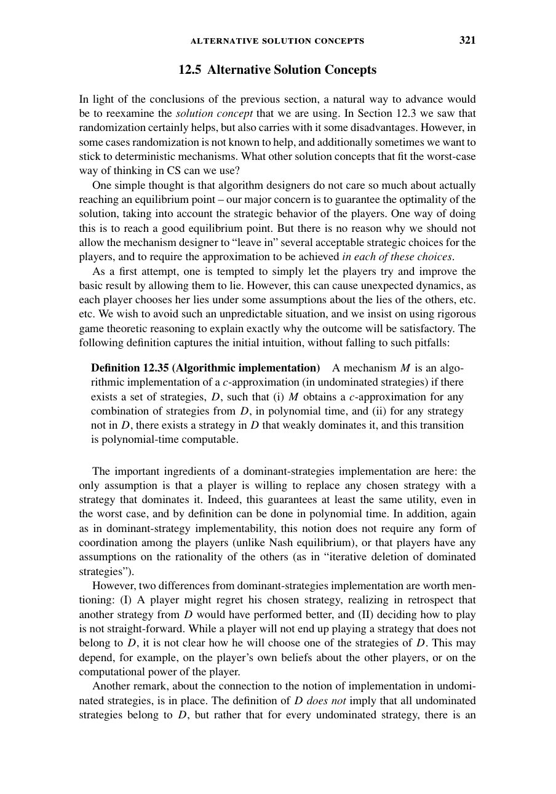

[Открыть страницу отдельно](../images/pages/p0342.jpg) · [Открыть страницу в PDF](../../materials/sources/Nisan-et-al-AGT-book.pdf#page=342)

**Definition 12.35 (Algorithmic implementation)** — фрагмент оригинальной страницы:

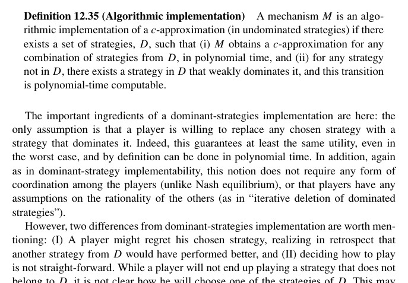

[Открыть фрагмент отдельно](../images/statements/p0342_definition_12-35_01.png)

Поисковый текст страницы (формулы сверяйте с изображением)

~~~~text
alternative solution concepts
321
12.5 Alternative Solution Concepts
In light of the conclusions of the previous section, a natural way to advance would
be to reexamine the solution concept that we are using. In Section 12.3 we saw that
randomization certainly helps, but also carries with it some disadvantages. However, in
some cases randomization is not known to help, and additionally sometimes we want to
stick to deterministic mechanisms. What other solution concepts that fit the worst-case
way of thinking in CS can we use?
One simple thought is that algorithm designers do not care so much about actually
reaching an equilibrium point – our major concern is to guarantee the optimality of the
solution, taking into account the strategic behavior of the players. One way of doing
this is to reach a good equilibrium point. But there is no reason why we should not
allow the mechanism designer to “leave in” several acceptable strategic choices for the
players, and to require the approximation to be achieved in each of these choices.
As a first attempt, one is tempted to simply let the players try and improve the
basic result by allowing them to lie. However, this can cause unexpected dynamics, as
each player chooses her lies under some assumptions about the lies of the others, etc.
etc. We wish to avoid such an unpredictable situation, and we insist on using rigorous
game theoretic reasoning to explain exactly why the outcome will be satisfactory. The
following definition captures the initial intuition, without falling to such pitfalls:
Definition 12.35 (Algorithmic implementation)
A mechanism M is an algo-
rithmic implementation of a c-approximation (in undominated strategies) if there
exists a set of strategies, D, such that (i) M obtains a c-approximation for any
combination of strategies from D, in polynomial time, and (ii) for any strategy
not in D, there exists a strategy in D that weakly dominates it, and this transition
is polynomial-time computable.
The important ingredients of a dominant-strategies implementation are here: the
only assumption is that a player is willing to replace any chosen strategy with a
strategy that dominates it. Indeed, this guarantees at least the same utility, even in
the worst case, and by definition can be done in polynomial time. In addition, again
as in dominant-strategy implementability, this notion does not require any form of
coordination among the players (unlike Nash equilibrium), or that players have any
assumptions on the rationality of the others (as in “iterative deletion of dominated
strategies”).
However, two differences from dominant-strategies implementation are worth men-
tioning: (I) A player might regret his chosen strategy, realizing in retrospect that
another strategy from D would have performed better, and (II) deciding how to play
is not straight-forward. While a player will not end up playing a strategy that does not
belong to D, it is not clear how he will choose one of the strategies of D. This may
depend, for example, on the player’s own beliefs about the other players, or on the
computational power of the player.
Another remark, about the connection to the notion of implementation in undomi-
nated strategies, is in place. The definition of D does not imply that all undominated
strategies belong to D, but rather that for every undominated strategy, there is an
~~~~

### PDF стр. 343 · книжная стр. 322

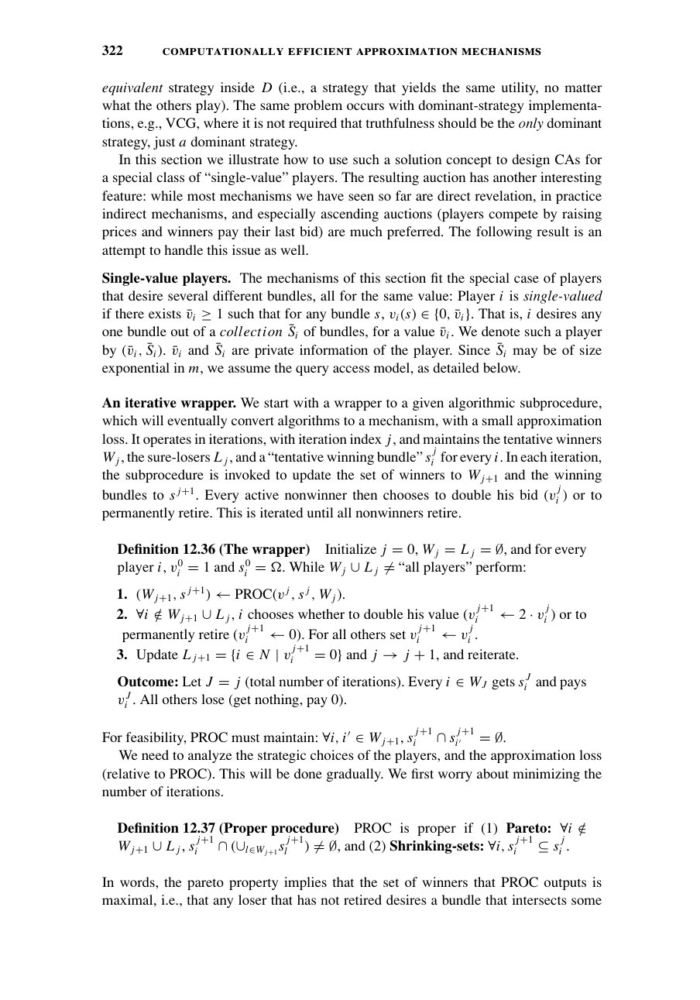

[Открыть страницу отдельно](../images/pages/p0343.jpg) · [Открыть страницу в PDF](../../materials/sources/Nisan-et-al-AGT-book.pdf#page=343)

**Definition 12.36 (The wrapper)** — фрагмент оригинальной страницы:

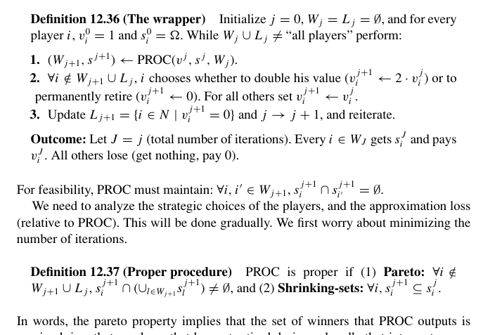

[Открыть фрагмент отдельно](../images/statements/p0343_definition_12-36_01.png)

**Definition 12.37 (Proper procedure)** — фрагмент оригинальной страницы:

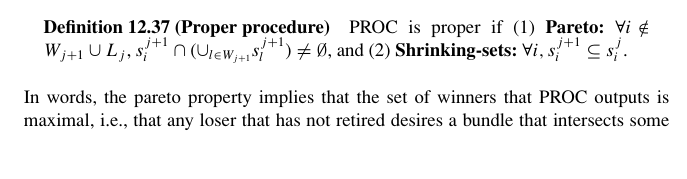

[Открыть фрагмент отдельно](../images/statements/p0343_definition_12-37_02.png)

Поисковый текст страницы (формулы сверяйте с изображением)

~~~~text
322
computationally efficient approximation mechanisms
equivalent strategy inside D (i.e., a strategy that yields the same utility, no matter
what the others play). The same problem occurs with dominant-strategy implementa-
tions, e.g., VCG, where it is not required that truthfulness should be the only dominant
strategy, just a dominant strategy.
In this section we illustrate how to use such a solution concept to design CAs for
a special class of “single-value” players. The resulting auction has another interesting
feature: while most mechanisms we have seen so far are direct revelation, in practice
indirect mechanisms, and especially ascending auctions (players compete by raising
prices and winners pay their last bid) are much preferred. The following result is an
attempt to handle this issue as well.
Single-value players. The mechanisms of this section fit the special case of players
that desire several different bundles, all for the same value: Player i is single-valued
if there exists ¯vi ≥1 such that for any bundle s, vi(s) ∈{0, ¯vi}. That is, i desires any
one bundle out of a collection ¯Si of bundles, for a value ¯vi. We denote such a player
by (¯vi, ¯Si). ¯vi and ¯Si are private information of the player. Since ¯Si may be of size
exponential in m, we assume the query access model, as detailed below.
An iterative wrapper. We start with a wrapper to a given algorithmic subprocedure,
which will eventually convert algorithms to a mechanism, with a small approximation
loss. It operates in iterations, with iteration index j, and maintains the tentative winners
Wj, the sure-losers Lj, and a “tentative winning bundle” sj
i for every i. In each iteration,
the subprocedure is invoked to update the set of winners to Wj+1 and the winning
bundles to sj+1. Every active nonwinner then chooses to double his bid (vj
i ) or to
permanently retire. This is iterated until all nonwinners retire.
Definition 12.36 (The wrapper)
Initialize j = 0, Wj = Lj = ∅, and for every
player i, v0
i = 1 and s0
i = ⟦U+0003; см. снимок страницы⟧. While Wj ∪Lj̸ = “all players” perform:
1. (Wj+1, sj+1) ←PROC(vj, sj, Wj).
2. ∀i /∈Wj+1 ∪Lj, i chooses whether to double his value (vj+1
i
←2 · vj
i ) or to
permanently retire (vj+1
i
←0). For all others set vj+1
i
←vj
i .
3. Update Lj+1 = {i ∈N | vj+1
i
= 0} and j →j + 1, and reiterate.
Outcome: Let J = j (total number of iterations). Every i ∈WJ gets sJ
i and pays
vJ
i . All others lose (get nothing, pay 0).
For feasibility, PROC must maintain: ∀i, i′ ∈Wj+1, sj+1
i
∩sj+1
i′
= ∅.
We need to analyze the strategic choices of the players, and the approximation loss
(relative to PROC). This will be done gradually. We first worry about minimizing the
number of iterations.
Definition 12.37 (Proper procedure)
PROC is proper if (1) Pareto: ∀i /∈
Wj+1 ∪Lj, sj+1
i
∩(∪l∈Wj+1sj+1
l
)̸ = ∅, and (2) Shrinking-sets: ∀i, sj+1
i
⊆sj
i .
In words, the pareto property implies that the set of winners that PROC outputs is
maximal, i.e., that any loser that has not retired desires a bundle that intersects some
~~~~

### PDF стр. 344 · книжная стр. 323

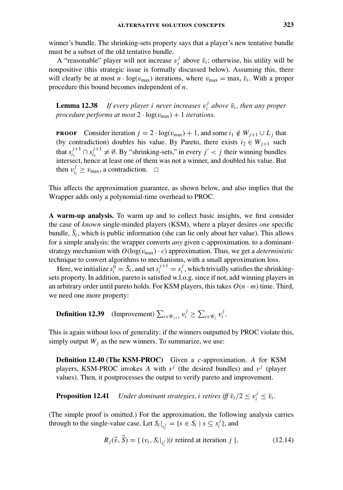

[Открыть страницу отдельно](../images/pages/p0344.jpg) · [Открыть страницу в PDF](../../materials/sources/Nisan-et-al-AGT-book.pdf#page=344)

**Lemma 12.38** — фрагмент оригинальной страницы:

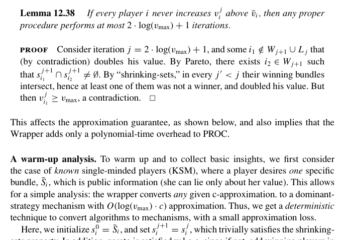

[Открыть фрагмент отдельно](../images/statements/p0344_lemma_12-38_01.png)

**Definition 12.39** — фрагмент оригинальной страницы:

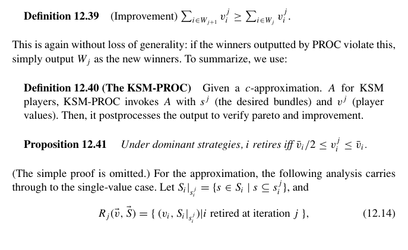

[Открыть фрагмент отдельно](../images/statements/p0344_definition_12-39_02.png)

**Definition 12.40 (The KSM-PROC)** — фрагмент оригинальной страницы:

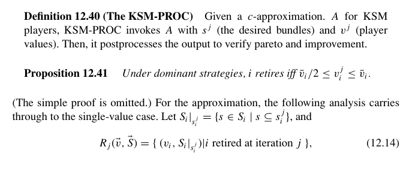

[Открыть фрагмент отдельно](../images/statements/p0344_definition_12-40_03.png)

**Proposition 12.41** — фрагмент оригинальной страницы:

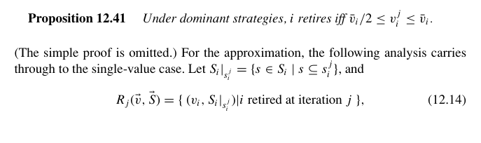

[Открыть фрагмент отдельно](../images/statements/p0344_proposition_12-41_04.png)

Поисковый текст страницы (формулы сверяйте с изображением)

~~~~text
alternative solution concepts
323
winner’s bundle. The shrinking-sets property says that a player’s new tentative bundle
must be a subset of the old tentative bundle.
A “reasonable” player will not increase vj
i above ¯vi; otherwise, his utility will be
nonpositive (this strategic issue is formally discussed below). Assuming this, there
will clearly be at most n · log(vmax) iterations, where vmax = maxi ¯vi. With a proper
procedure this bound becomes independent of n.
Lemma 12.38
If every player i never increases vj
i above ¯vi, then any proper
procedure performs at most 2 · log(vmax) + 1 iterations.
proof
Consider iteration j = 2 · log(vmax) + 1, and some i1 /∈Wj+1 ∪Lj that
(by contradiction) doubles his value. By Pareto, there exists i2 ∈Wj+1 such
that sj+1
i1
∩sj+1
i2̸
= ∅. By “shrinking-sets,” in every j ′ < j their winning bundles
intersect, hence at least one of them was not a winner, and doubled his value. But
then vj
i1 ≥vmax, a contradiction.
This affects the approximation guarantee, as shown below, and also implies that the
Wrapper adds only a polynomial-time overhead to PROC.
A warm-up analysis. To warm up and to collect basic insights, we first consider
the case of known single-minded players (KSM), where a player desires one specific
bundle, ¯Si, which is public information (she can lie only about her value). This allows
for a simple analysis: the wrapper converts any given c-approximation. to a dominant-
strategy mechanism with O(log(vmax) · c) approximation. Thus, we get a deterministic
technique to convert algorithms to mechanisms, with a small approximation loss.
Here, we initialize s0
i = ¯Si, and set sj+1
i
= sj
i , which trivially satisfies the shrinking-
sets property. In addition, pareto is satisfied w.l.o.g. since if not, add winning players in
an arbitrary order until pareto holds. For KSM players, this takes O(n · m) time. Third,
we need one more property:
Definition 12.39
(Improvement) ⟦U+0001; см. снимок страницы⟧
i∈Wj+1 vj
i ≥⟦U+0001; см. снимок страницы⟧
i∈Wj vj
i .
This is again without loss of generality: if the winners outputted by PROC violate this,
simply output Wj as the new winners. To summarize, we use:
Definition 12.40 (The KSM-PROC)
Given a c-approximation. A for KSM
players, KSM-PROC invokes A with sj (the desired bundles) and vj (player
values). Then, it postprocesses the output to verify pareto and improvement.
Proposition 12.41
Under dominant strategies, i retires iff ¯vi/2 ≤vj
i ≤¯vi.
(The simple proof is omitted.) For the approximation, the following analysis carries
through to the single-value case. Let Si|sj
i = {s ∈Si | s ⊆sj
i }, and
Rj(⃗v,⃗S) = { (vi, Si|sj
i )|i retired at iteration j },
(12.14)
~~~~

### PDF стр. 345 · книжная стр. 324

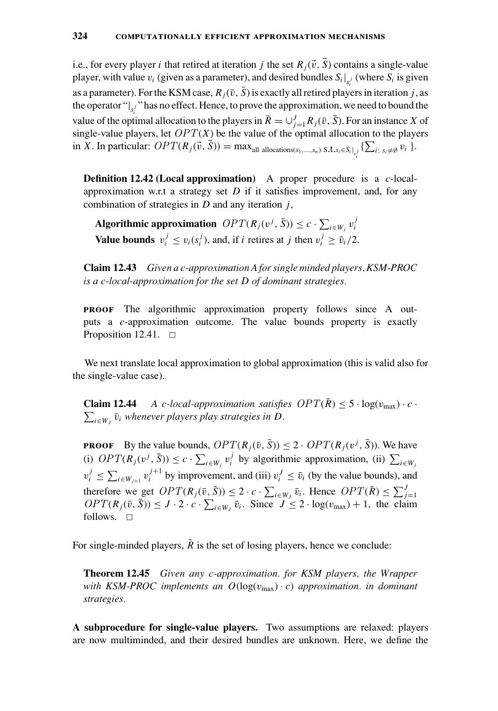

[Открыть страницу отдельно](../images/pages/p0345.jpg) · [Открыть страницу в PDF](../../materials/sources/Nisan-et-al-AGT-book.pdf#page=345)

**Definition 12.42 (Local approximation)** — фрагмент оригинальной страницы:

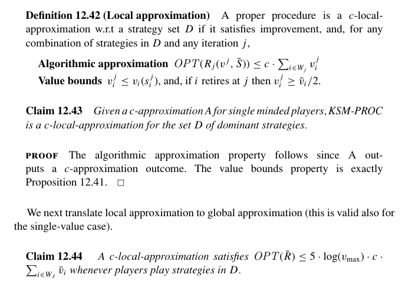

[Открыть фрагмент отдельно](../images/statements/p0345_definition_12-42_01.png)

**Claim 12.43** — фрагмент оригинальной страницы:

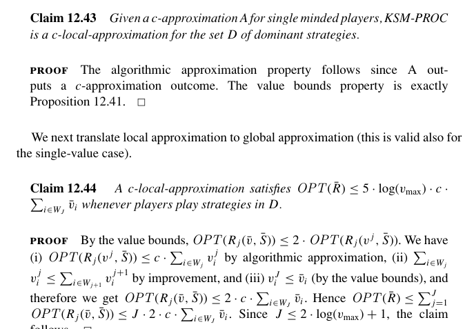

[Открыть фрагмент отдельно](../images/statements/p0345_claim_12-43_02.png)

**Claim 12.44** — фрагмент оригинальной страницы:

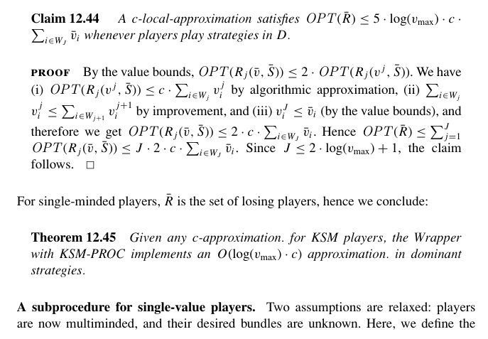

[Открыть фрагмент отдельно](../images/statements/p0345_claim_12-44_03.png)

**Theorem 12.45** — фрагмент оригинальной страницы:

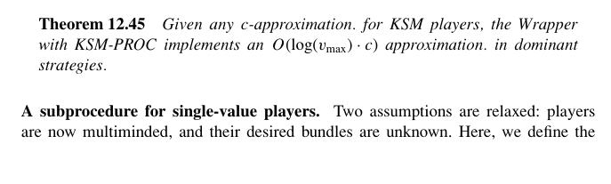

[Открыть фрагмент отдельно](../images/statements/p0345_theorem_12-45_04.png)

Поисковый текст страницы (формулы сверяйте с изображением)

~~~~text
324
computationally efficient approximation mechanisms
i.e., for every player i that retired at iteration j the set Rj(⃗v,⃗S) contains a single-value
player, with value vi (given as a parameter), and desired bundles Si|sj
i (where Si is given
as a parameter). For the KSM case, Rj(¯v, ¯S) is exactly all retired players in iteration j, as
the operator “|sj
i ” has no effect. Hence, to prove the approximation, we need to bound the
value of the optimal allocation to the players in ¯R = ∪J
j=1Rj(¯v, ¯S). For an instance X of
single-value players, let OPT(X) be the value of the optimal allocation to the players
in X. In particular: OPT(Rj(⃗v,⃗S)) = maxall allocations(s1,...,sn) s.t.si∈Si|sj
i
{⟦U+0001; см. снимок страницы⟧
i: si̸=∅vi }.
Definition 12.42 (Local approximation)
A proper procedure is a c-local-
approximation w.r.t a strategy set D if it satisfies improvement, and, for any
combination of strategies in D and any iteration j,
Algorithmic approximation OPT(Rj(vj, ¯S)) ≤c · ⟦U+0001; см. снимок страницы⟧
i∈Wj vj
i
Value bounds vj
i ≤vi(sj
i ), and, if i retires at j then vj
i ≥¯vi/2.
Claim 12.43
Given a c-approximation A for single minded players, KSM-PROC
is a c-local-approximation for the set D of dominant strategies.
proof
The algorithmic approximation property follows since A out-
puts a c-approximation outcome. The value bounds property is exactly
Proposition 12.41.
We next translate local approximation to global approximation (this is valid also for
the single-value case).
Claim 12.44
A c-local-approximation satisfies OPT( ¯R) ≤5 · log(vmax) · c ·
⟦U+0001; см. снимок страницы⟧
i∈WJ ¯vi whenever players play strategies in D.
proof
By the value bounds, OPT(Rj(¯v, ¯S)) ≤2 · OPT(Rj(vj, ¯S)). We have
(i) OPT(Rj(vj, ¯S)) ≤c · ⟦U+0001; см. снимок страницы⟧
i∈Wj vj
i by algorithmic approximation, (ii) ⟦U+0001; см. снимок страницы⟧
i∈Wj
vj
i ≤⟦U+0001; см. снимок страницы⟧
i∈Wj+1 vj+1
i
by improvement, and (iii) vJ
i ≤¯vi (by the value bounds), and
therefore we get OPT(Rj(¯v, ¯S)) ≤2 · c · ⟦U+0001; см. снимок страницы⟧
i∈WJ ¯vi. Hence OPT( ¯R) ≤⟦U+0001; см. снимок страницы⟧J
j=1
OPT(Rj(¯v, ¯S)) ≤J · 2 · c · ⟦U+0001; см. снимок страницы⟧
i∈WJ ¯vi. Since J ≤2 · log(vmax) + 1, the claim
follows.
For single-minded players, ¯R is the set of losing players, hence we conclude:
Theorem 12.45
Given any c-approximation. for KSM players, the Wrapper
with KSM-PROC implements an O(log(vmax) · c) approximation. in dominant
strategies.
A subprocedure for single-value players.
Two assumptions are relaxed: players
are now multiminded, and their desired bundles are unknown. Here, we define the
~~~~

### PDF стр. 346 · книжная стр. 325

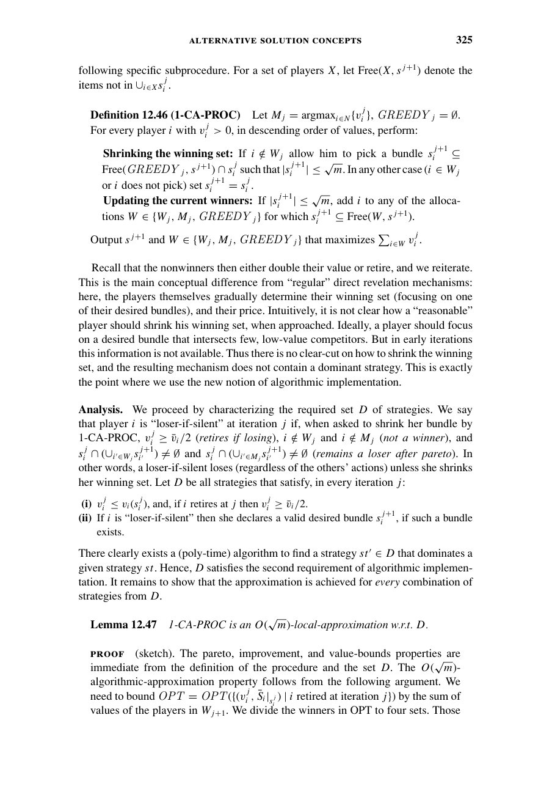

[Открыть страницу отдельно](../images/pages/p0346.jpg) · [Открыть страницу в PDF](../../materials/sources/Nisan-et-al-AGT-book.pdf#page=346)

**Definition 12.46 (1-CA-PROC)** — фрагмент оригинальной страницы:

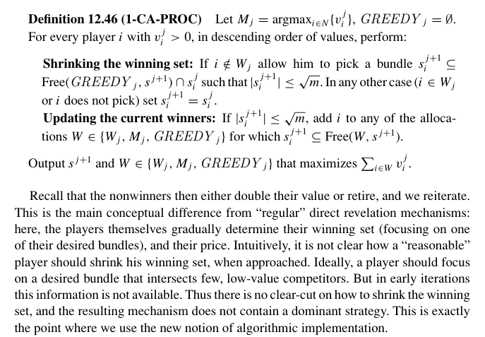

[Открыть фрагмент отдельно](../images/statements/p0346_definition_12-46_01.png)

**Lemma 12.47** — фрагмент оригинальной страницы:

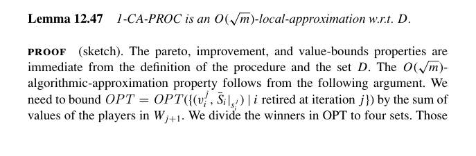

[Открыть фрагмент отдельно](../images/statements/p0346_lemma_12-47_02.png)

Поисковый текст страницы (формулы сверяйте с изображением)

~~~~text
alternative solution concepts
325
following specific subprocedure. For a set of players X, let Free(X, sj+1) denote the
items not in ∪i∈Xsj
i .
Definition 12.46 (1-CA-PROC)
Let Mj = argmaxi∈N{vj
i }, GREEDY j = ∅.
For every player i with vj
i > 0, in descending order of values, perform:
Shrinking the winning set: If i /∈Wj allow him to pick a bundle sj+1
i
⊆
Free(GREEDY j, sj+1) ∩sj
i such that |sj+1
i
| ≤√m. In any other case (i ∈Wj
or i does not pick) set sj+1
i
= sj
i .
Updating the current winners: If |sj+1
i
| ≤√m, add i to any of the alloca-
tions W ∈{Wj, Mj, GREEDY j} for which sj+1
i
⊆Free(W, sj+1).
Output sj+1 and W ∈{Wj, Mj, GREEDY j} that maximizes ⟦U+0001; см. снимок страницы⟧
i∈W vj
i .
Recall that the nonwinners then either double their value or retire, and we reiterate.
This is the main conceptual difference from “regular” direct revelation mechanisms:
here, the players themselves gradually determine their winning set (focusing on one
of their desired bundles), and their price. Intuitively, it is not clear how a “reasonable”
player should shrink his winning set, when approached. Ideally, a player should focus
on a desired bundle that intersects few, low-value competitors. But in early iterations
this information is not available. Thus there is no clear-cut on how to shrink the winning
set, and the resulting mechanism does not contain a dominant strategy. This is exactly
the point where we use the new notion of algorithmic implementation.
Analysis.
We proceed by characterizing the required set D of strategies. We say
that player i is “loser-if-silent” at iteration j if, when asked to shrink her bundle by
1-CA-PROC, vj
i ≥¯vi/2 (retires if losing), i /∈Wj and i /∈Mj (not a winner), and
sj
i ∩(∪i′∈Wjsj+1
i′
)̸ = ∅and sj
i ∩(∪i′∈Mj sj+1
i′
)̸ = ∅(remains a loser after pareto). In
other words, a loser-if-silent loses (regardless of the others’ actions) unless she shrinks
her winning set. Let D be all strategies that satisfy, in every iteration j:
(i) vj
i ≤vi(sj
i ), and, if i retires at j then vj
i ≥¯vi/2.
(ii) If i is “loser-if-silent” then she declares a valid desired bundle sj+1
i
, if such a bundle
exists.
There clearly exists a (poly-time) algorithm to find a strategy st′ ∈D that dominates a
given strategy st. Hence, D satisfies the second requirement of algorithmic implemen-
tation. It remains to show that the approximation is achieved for every combination of
strategies from D.
Lemma 12.47
1-CA-PROC is an O(√m)-local-approximation w.r.t. D.
proof
(sketch). The pareto, improvement, and value-bounds properties are
immediate from the definition of the procedure and the set D. The O(√m)-
algorithmic-approximation property follows from the following argument. We
need to bound OPT = OPT({(vj
i , ¯Si|sj
i ) | i retired at iteration j}) by the sum of
values of the players in Wj+1. We divide the winners in OPT to four sets. Those
~~~~

### PDF стр. 347 · книжная стр. 326

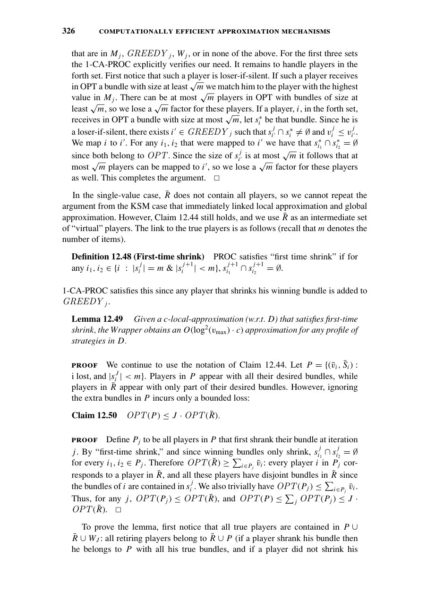

[Открыть страницу отдельно](../images/pages/p0347.jpg) · [Открыть страницу в PDF](../../materials/sources/Nisan-et-al-AGT-book.pdf#page=347)

**Definition 12.48 (First-time shrink)** — фрагмент оригинальной страницы:

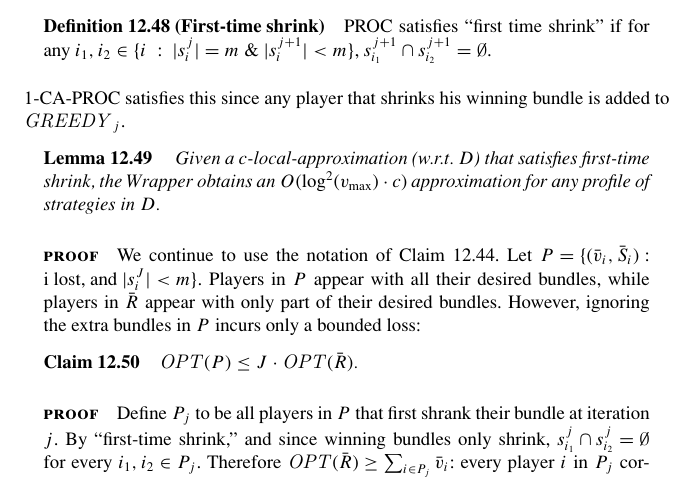

[Открыть фрагмент отдельно](../images/statements/p0347_definition_12-48_01.png)

**Lemma 12.49** — фрагмент оригинальной страницы:

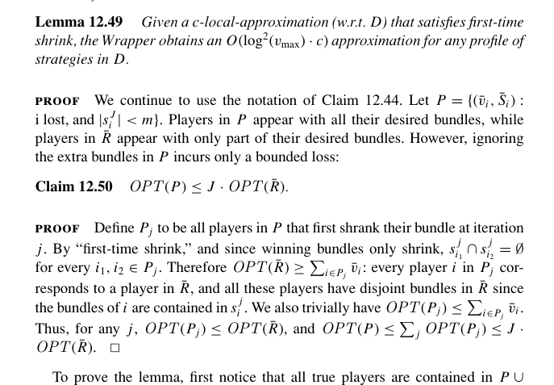

[Открыть фрагмент отдельно](../images/statements/p0347_lemma_12-49_02.png)

**Claim 12.50** — фрагмент оригинальной страницы:

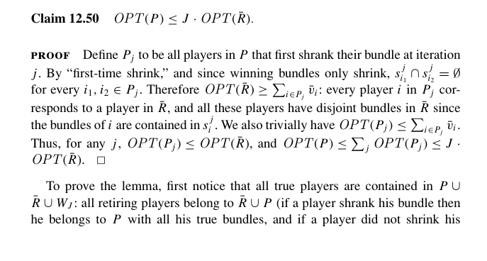

[Открыть фрагмент отдельно](../images/statements/p0347_claim_12-50_03.png)

Поисковый текст страницы (формулы сверяйте с изображением)

~~~~text
326
computationally efficient approximation mechanisms
that are in Mj, GREEDY j, Wj, or in none of the above. For the first three sets
the 1-CA-PROC explicitly verifies our need. It remains to handle players in the
forth set. First notice that such a player is loser-if-silent. If such a player receives
in OPT a bundle with size at least √m we match him to the player with the highest
value in Mj. There can be at most √m players in OPT with bundles of size at
least √m, so we lose a √m factor for these players. If a player, i, in the forth set,
receives in OPT a bundle with size at most √m, let s∗
i be that bundle. Since he is
a loser-if-silent, there exists i′ ∈GREEDY j such that sj
i′ ∩s∗
i̸ = ∅and vj
i ≤vj
i′.
We map i to i′. For any i1, i2 that were mapped to i′ we have that s∗
i1 ∩s∗
i2 = ∅
since both belong to OPT. Since the size of sj
i′ is at most √m it follows that at
most √m players can be mapped to i′, so we lose a √m factor for these players
as well. This completes the argument.
In the single-value case, ¯R does not contain all players, so we cannot repeat the
argument from the KSM case that immediately linked local approximation and global
approximation. However, Claim 12.44 still holds, and we use ¯R as an intermediate set
of “virtual” players. The link to the true players is as follows (recall that m denotes the
number of items).
Definition 12.48 (First-time shrink)
PROC satisfies “first time shrink” if for
any i1, i2 ∈{i : |sj
i | = m & |sj+1
i
| < m}, sj+1
i1
∩sj+1
i2
= ∅.
1-CA-PROC satisfies this since any player that shrinks his winning bundle is added to
GREEDY j.
Lemma 12.49
Given a c-local-approximation (w.r.t. D) that satisfies first-time
shrink, the Wrapper obtains an O(log2(vmax) · c) approximation for any profile of
strategies in D.
proof
We continue to use the notation of Claim 12.44. Let P = {(¯vi, ¯Si) :
i lost, and |sJ
i | < m}. Players in P appear with all their desired bundles, while
players in ¯R appear with only part of their desired bundles. However, ignoring
the extra bundles in P incurs only a bounded loss:
Claim 12.50
OPT(P) ≤J · OPT( ¯R).
proof
Define Pj to be all players in P that first shrank their bundle at iteration
j. By “first-time shrink,” and since winning bundles only shrink, sj
i1 ∩sj
i2 = ∅
for every i1, i2 ∈Pj. Therefore OPT( ¯R) ≥⟦U+0001; см. снимок страницы⟧
i∈Pj ¯vi: every player i in Pj cor-
responds to a player in ¯R, and all these players have disjoint bundles in ¯R since
the bundles of i are contained in sj
i . We also trivially have OPT(Pj) ≤⟦U+0001; см. снимок страницы⟧
i∈Pj ¯vi.
Thus, for any j, OPT(Pj) ≤OPT( ¯R), and OPT(P) ≤⟦U+0001; см. снимок страницы⟧
j OPT(Pj) ≤J ·
OPT( ¯R).
To prove the lemma, first notice that all true players are contained in P ∪
¯R ∪WJ: all retiring players belong to ¯R ∪P (if a player shrank his bundle then
he belongs to P with all his true bundles, and if a player did not shrink his
~~~~

### PDF стр. 348 · книжная стр. 327

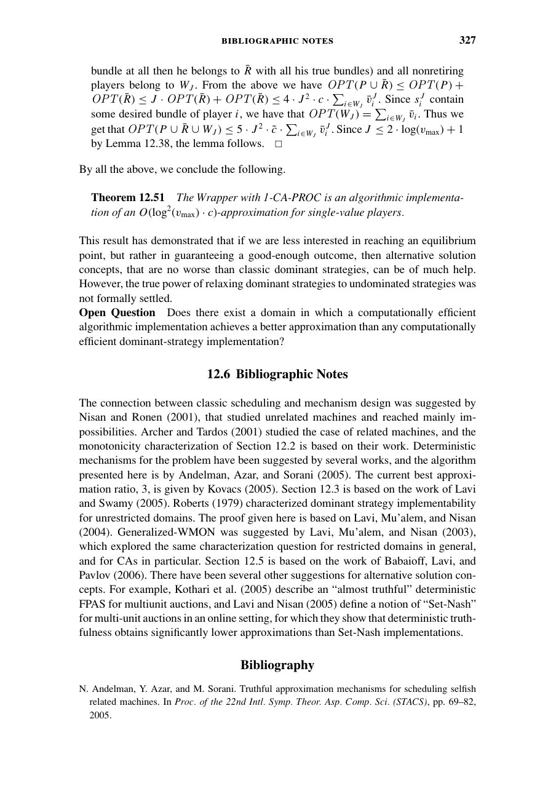

[Открыть страницу отдельно](../images/pages/p0348.jpg) · [Открыть страницу в PDF](../../materials/sources/Nisan-et-al-AGT-book.pdf#page=348)

**Theorem 12.51** — фрагмент оригинальной страницы:

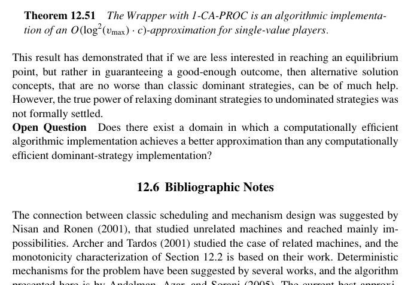

[Открыть фрагмент отдельно](../images/statements/p0348_theorem_12-51_01.png)

Поисковый текст страницы (формулы сверяйте с изображением)

~~~~text
bibliographic notes
327
bundle at all then he belongs to ¯R with all his true bundles) and all nonretiring
players belong to WJ. From the above we have OPT(P ∪¯R) ≤OPT(P) +
OPT( ¯R) ≤J · OPT( ¯R) + OPT( ¯R) ≤4 · J 2 · c · ⟦U+0001; см. снимок страницы⟧
i∈WJ ¯vJ
i . Since sJ
i contain
some desired bundle of player i, we have that OPT(WJ) = ⟦U+0001; см. снимок страницы⟧
i∈WJ ¯vi. Thus we
get that OPT(P ∪¯R ∪WJ) ≤5 · J 2 · ˜c · ⟦U+0001; см. снимок страницы⟧
i∈WJ ¯vJ
i . Since J ≤2 · log(vmax) + 1
by Lemma 12.38, the lemma follows.
By all the above, we conclude the following.
Theorem 12.51
The Wrapper with 1-CA-PROC is an algorithmic implementa-
tion of an O(log2(vmax) · c)-approximation for single-value players.
This result has demonstrated that if we are less interested in reaching an equilibrium
point, but rather in guaranteeing a good-enough outcome, then alternative solution
concepts, that are no worse than classic dominant strategies, can be of much help.
However, the true power of relaxing dominant strategies to undominated strategies was
not formally settled.
Open Question
Does there exist a domain in which a computationally efficient
algorithmic implementation achieves a better approximation than any computationally
efficient dominant-strategy implementation?
12.6 Bibliographic Notes
The connection between classic scheduling and mechanism design was suggested by
Nisan and Ronen (2001), that studied unrelated machines and reached mainly im-
possibilities. Archer and Tardos (2001) studied the case of related machines, and the
monotonicity characterization of Section 12.2 is based on their work. Deterministic
mechanisms for the problem have been suggested by several works, and the algorithm
presented here is by Andelman, Azar, and Sorani (2005). The current best approxi-
mation ratio, 3, is given by Kovacs (2005). Section 12.3 is based on the work of Lavi
and Swamy (2005). Roberts (1979) characterized dominant strategy implementability
for unrestricted domains. The proof given here is based on Lavi, Mu’alem, and Nisan
(2004). Generalized-WMON was suggested by Lavi, Mu’alem, and Nisan (2003),
which explored the same characterization question for restricted domains in general,
and for CAs in particular. Section 12.5 is based on the work of Babaioff, Lavi, and
Pavlov (2006). There have been several other suggestions for alternative solution con-
cepts. For example, Kothari et al. (2005) describe an “almost truthful” deterministic
FPAS for multiunit auctions, and Lavi and Nisan (2005) define a notion of “Set-Nash”
for multi-unit auctions in an online setting, for which they show that deterministic truth-
fulness obtains significantly lower approximations than Set-Nash implementations.
Bibliography
N. Andelman, Y. Azar, and M. Sorani. Truthful approximation mechanisms for scheduling selfish
related machines. In Proc. of the 22nd Intl. Symp. Theor. Asp. Comp. Sci. (STACS), pp. 69–82,
2005.
~~~~

### PDF стр. 349 · книжная стр. 328

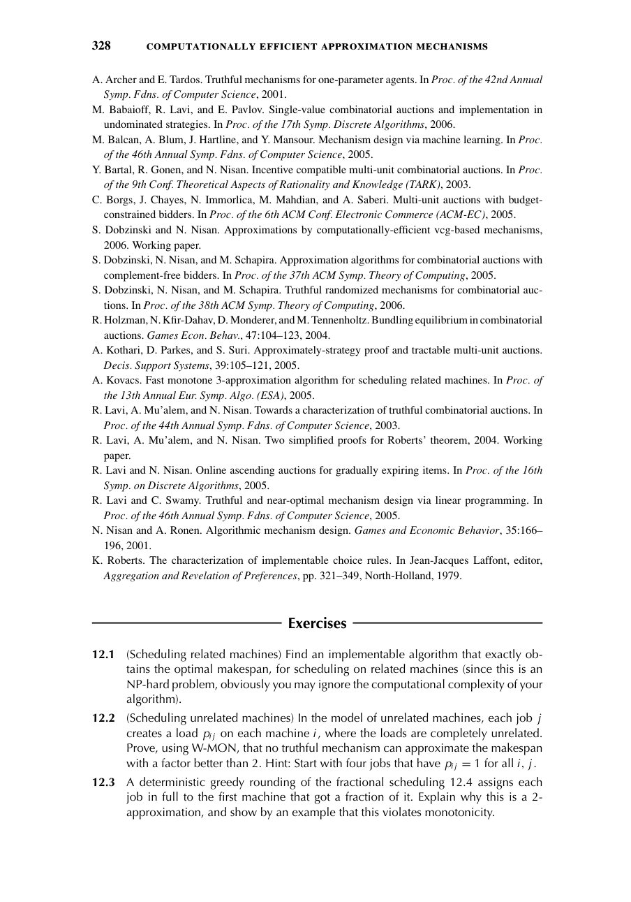

[Открыть страницу отдельно](../images/pages/p0349.jpg) · [Открыть страницу в PDF](../../materials/sources/Nisan-et-al-AGT-book.pdf#page=349)

Поисковый текст страницы (формулы сверяйте с изображением)

~~~~text
328
computationally efficient approximation mechanisms
A. Archer and E. Tardos. Truthful mechanisms for one-parameter agents. In Proc. of the 42nd Annual
Symp. Fdns. of Computer Science, 2001.
M. Babaioff, R. Lavi, and E. Pavlov. Single-value combinatorial auctions and implementation in
undominated strategies. In Proc. of the 17th Symp. Discrete Algorithms, 2006.
M. Balcan, A. Blum, J. Hartline, and Y. Mansour. Mechanism design via machine learning. In Proc.
of the 46th Annual Symp. Fdns. of Computer Science, 2005.
Y. Bartal, R. Gonen, and N. Nisan. Incentive compatible multi-unit combinatorial auctions. In Proc.
of the 9th Conf. Theoretical Aspects of Rationality and Knowledge (TARK), 2003.
C. Borgs, J. Chayes, N. Immorlica, M. Mahdian, and A. Saberi. Multi-unit auctions with budget-
constrained bidders. In Proc. of the 6th ACM Conf. Electronic Commerce (ACM-EC), 2005.
S. Dobzinski and N. Nisan. Approximations by computationally-efficient vcg-based mechanisms,
2006. Working paper.
S. Dobzinski, N. Nisan, and M. Schapira. Approximation algorithms for combinatorial auctions with
complement-free bidders. In Proc. of the 37th ACM Symp. Theory of Computing, 2005.
S. Dobzinski, N. Nisan, and M. Schapira. Truthful randomized mechanisms for combinatorial auc-
tions. In Proc. of the 38th ACM Symp. Theory of Computing, 2006.
R. Holzman, N. Kfir-Dahav, D. Monderer, and M. Tennenholtz. Bundling equilibrium in combinatorial
auctions. Games Econ. Behav., 47:104–123, 2004.
A. Kothari, D. Parkes, and S. Suri. Approximately-strategy proof and tractable multi-unit auctions.
Decis. Support Systems, 39:105–121, 2005.
A. Kovacs. Fast monotone 3-approximation algorithm for scheduling related machines. In Proc. of
the 13th Annual Eur. Symp. Algo. (ESA), 2005.
R. Lavi, A. Mu’alem, and N. Nisan. Towards a characterization of truthful combinatorial auctions. In
Proc. of the 44th Annual Symp. Fdns. of Computer Science, 2003.
R. Lavi, A. Mu’alem, and N. Nisan. Two simplified proofs for Roberts’ theorem, 2004. Working
paper.
R. Lavi and N. Nisan. Online ascending auctions for gradually expiring items. In Proc. of the 16th
Symp. on Discrete Algorithms, 2005.
R. Lavi and C. Swamy. Truthful and near-optimal mechanism design via linear programming. In
Proc. of the 46th Annual Symp. Fdns. of Computer Science, 2005.
N. Nisan and A. Ronen. Algorithmic mechanism design. Games and Economic Behavior, 35:166–
196, 2001.
K. Roberts. The characterization of implementable choice rules. In Jean-Jacques Laffont, editor,
Aggregation and Revelation of Preferences, pp. 321–349, North-Holland, 1979.
Exercises
12.1
(Scheduling related machines) Find an implementable algorithm that exactly ob-
tains the optimal makespan, for scheduling on related machines (since this is an
NP-hard problem, obviously you may ignore the computational complexity of your
algorithm).
12.2
(Scheduling unrelated machines) In the model of unrelated machines, each job j
creates a load pi j on each machine i, where the loads are completely unrelated.
Prove, using W-MON, that no truthful mechanism can approximate the makespan
with a factor better than 2. Hint: Start with four jobs that have pi j = 1 for all i, j.
12.3
A deterministic greedy rounding of the fractional scheduling 12.4 assigns each
job in full to the first machine that got a fraction of it. Explain why this is a 2-
approximation, and show by an example that this violates monotonicity.
~~~~

### PDF стр. 350 · книжная стр. 329

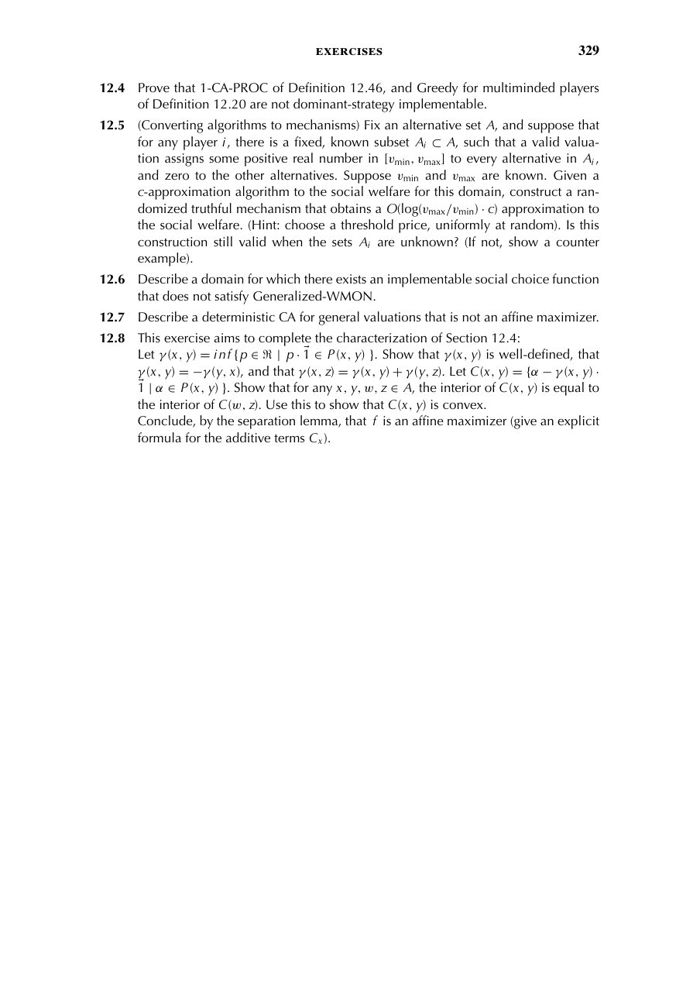

[Открыть страницу отдельно](../images/pages/p0350.jpg) · [Открыть страницу в PDF](../../materials/sources/Nisan-et-al-AGT-book.pdf#page=350)

Поисковый текст страницы (формулы сверяйте с изображением)

~~~~text
exercises
329
12.4
Prove that 1-CA-PROC of Definition 12.46, and Greedy for multiminded players
of Definition 12.20 are not dominant-strategy implementable.
12.5
(Converting algorithms to mechanisms) Fix an alternative set A, and suppose that
for any player i, there is a fixed, known subset Ai ⊂A, such that a valid valua-
tion assigns some positive real number in [vmin, vmax] to every alternative in Ai,
and zero to the other alternatives. Suppose vmin and vmax are known. Given a
c-approximation algorithm to the social welfare for this domain, construct a ran-
domized truthful mechanism that obtains a O(log(vmax/vmin) · c) approximation to
the social welfare. (Hint: choose a threshold price, uniformly at random). Is this
construction still valid when the sets Ai are unknown? (If not, show a counter
example).
12.6
Describe a domain for which there exists an implementable social choice function
that does not satisfy Generalized-WMON.
12.7
Describe a deterministic CA for general valuations that is not an affine maximizer.
12.8
This exercise aims to complete the characterization of Section 12.4:
Let γ (x, y) = inf {p ∈ℜ| p ·⃗1 ∈P(x, y) }. Show that γ (x, y) is well-defined, that
γ (x, y) = −γ (y, x), and that γ (x, z) = γ (x, y) + γ (y, z). Let C(x, y) = {α −γ (x, y) ·⃗
1 | α ∈P(x, y) }. Show that for any x, y, w, z ∈A, the interior of C(x, y) is equal to
the interior of C(w, z). Use this to show that C(x, y) is convex.
Conclude, by the separation lemma, that f is an affine maximizer (give an explicit
formula for the additive terms Cx).
~~~~

### PDF стр. 351 · книжная стр. 330

[Открыть страницу отдельно](../images/pages/p0351.jpg) · [Открыть страницу в PDF](../../materials/sources/Nisan-et-al-AGT-book.pdf#page=351)

Поисковый текст страницы (формулы сверяйте с изображением)

~~~~text
[На этой странице нет извлекаемого текстового слоя.]
~~~~

