# Глава 29. Computational Evolutionary Game Theory

**PDF-страницы:** 738–757. Изображения передают исходную страницу; извлечённый текст ниже нужен для поиска.

### Разделы

- [29.1 Evolutionary Game Theory](#pdf-page-0738) — PDF стр. 738
- [29.1.1 The Classical Model of Evolutionary Game Theory](#pdf-page-0739) — PDF стр. 739
- [29.2 The Computational Complexity](#pdf-page-0741) — PDF стр. 741
- [29.3 Evolutionary Dynamics Applied to Selfish Routing](#pdf-page-0744) — PDF стр. 744
- [29.3.1 The Selfish Routing Model with Imitative Dynamics](#pdf-page-0744) — PDF стр. 744
- [29.3.2 Convergence to Nash Flow](#pdf-page-0746) — PDF стр. 746
- [29.3.3 Convergence to Approximate Equilibrium](#pdf-page-0747) — PDF стр. 747
- [29.4 Evolutionary Game Theory over Graphs](#pdf-page-0749) — PDF стр. 749
- [29.4.1 Random Graphs, Adversarial Mutations](#pdf-page-0751) — PDF стр. 751
- [29.5 Future Work](#pdf-page-0754) — PDF стр. 754
- [29.6 Notes](#pdf-page-0754) — PDF стр. 754
[К содержанию](../README.md) · [К полному файлу](../00_full_book.md)

### PDF стр. 738 · книжная стр. 717

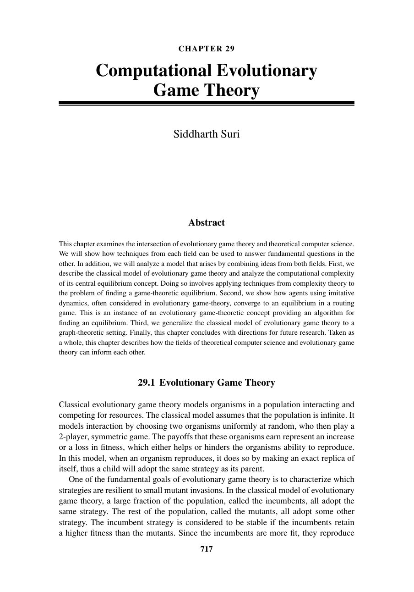

[Открыть страницу отдельно](../images/pages/p0738.jpg) · [Открыть страницу в PDF](../../materials/sources/Nisan-et-al-AGT-book.pdf#page=738)

Поисковый текст страницы (формулы сверяйте с изображением)

~~~~text
CHAPTER 29
Computational Evolutionary
Game Theory
Siddharth Suri
Abstract
This chapter examines the intersection of evolutionary game theory and theoretical computer science.
We will show how techniques from each field can be used to answer fundamental questions in the
other. In addition, we will analyze a model that arises by combining ideas from both fields. First, we
describe the classical model of evolutionary game theory and analyze the computational complexity
of its central equilibrium concept. Doing so involves applying techniques from complexity theory to
the problem of finding a game-theoretic equilibrium. Second, we show how agents using imitative
dynamics, often considered in evolutionary game-theory, converge to an equilibrium in a routing
game. This is an instance of an evolutionary game-theoretic concept providing an algorithm for
finding an equilibrium. Third, we generalize the classical model of evolutionary game theory to a
graph-theoretic setting. Finally, this chapter concludes with directions for future research. Taken as
a whole, this chapter describes how the fields of theoretical computer science and evolutionary game
theory can inform each other.
29.1 Evolutionary Game Theory
Classical evolutionary game theory models organisms in a population interacting and
competing for resources. The classical model assumes that the population is infinite. It
models interaction by choosing two organisms uniformly at random, who then play a
2-player, symmetric game. The payoffs that these organisms earn represent an increase
or a loss in fitness, which either helps or hinders the organisms ability to reproduce.
In this model, when an organism reproduces, it does so by making an exact replica of
itself, thus a child will adopt the same strategy as its parent.
One of the fundamental goals of evolutionary game theory is to characterize which
strategies are resilient to small mutant invasions. In the classical model of evolutionary
game theory, a large fraction of the population, called the incumbents, all adopt the
same strategy. The rest of the population, called the mutants, all adopt some other
strategy. The incumbent strategy is considered to be stable if the incumbents retain
a higher fitness than the mutants. Since the incumbents are more fit, they reproduce
717
~~~~

### PDF стр. 739 · книжная стр. 718

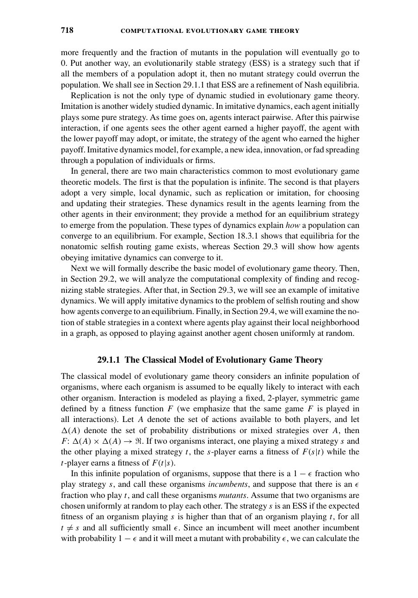

[Открыть страницу отдельно](../images/pages/p0739.jpg) · [Открыть страницу в PDF](../../materials/sources/Nisan-et-al-AGT-book.pdf#page=739)

Поисковый текст страницы (формулы сверяйте с изображением)

~~~~text
718
computational evolutionary game theory
more frequently and the fraction of mutants in the population will eventually go to
0. Put another way, an evolutionarily stable strategy (ESS) is a strategy such that if
all the members of a population adopt it, then no mutant strategy could overrun the
population. We shall see in Section 29.1.1 that ESS are a refinement of Nash equilibria.
Replication is not the only type of dynamic studied in evolutionary game theory.
Imitation is another widely studied dynamic. In imitative dynamics, each agent initially
plays some pure strategy. As time goes on, agents interact pairwise. After this pairwise
interaction, if one agents sees the other agent earned a higher payoff, the agent with
the lower payoff may adopt, or imitate, the strategy of the agent who earned the higher
payoff. Imitative dynamics model, for example, a new idea, innovation, or fad spreading
through a population of individuals or firms.
In general, there are two main characteristics common to most evolutionary game
theoretic models. The first is that the population is infinite. The second is that players
adopt a very simple, local dynamic, such as replication or imitation, for choosing
and updating their strategies. These dynamics result in the agents learning from the
other agents in their environment; they provide a method for an equilibrium strategy
to emerge from the population. These types of dynamics explain how a population can
converge to an equilibrium. For example, Section 18.3.1 shows that equilibria for the
nonatomic selfish routing game exists, whereas Section 29.3 will show how agents
obeying imitative dynamics can converge to it.
Next we will formally describe the basic model of evolutionary game theory. Then,
in Section 29.2, we will analyze the computational complexity of finding and recog-
nizing stable strategies. After that, in Section 29.3, we will see an example of imitative
dynamics. We will apply imitative dynamics to the problem of selfish routing and show
how agents converge to an equilibrium. Finally, in Section 29.4, we will examine the no-
tion of stable strategies in a context where agents play against their local neighborhood
in a graph, as opposed to playing against another agent chosen uniformly at random.
29.1.1 The Classical Model of Evolutionary Game Theory
The classical model of evolutionary game theory considers an infinite population of
organisms, where each organism is assumed to be equally likely to interact with each
other organism. Interaction is modeled as playing a fixed, 2-player, symmetric game
defined by a fitness function F (we emphasize that the same game F is played in
all interactions). Let A denote the set of actions available to both players, and let
⟦U+0001; см. снимок страницы⟧(A) denote the set of probability distributions or mixed strategies over A, then
F: ⟦U+0001; см. снимок страницы⟧(A) × ⟦U+0001; см. снимок страницы⟧(A) →ℜ. If two organisms interact, one playing a mixed strategy s and
the other playing a mixed strategy t, the s-player earns a fitness of F(s|t) while the
t-player earns a fitness of F(t|s).
In this infinite population of organisms, suppose that there is a 1 −ϵ fraction who
play strategy s, and call these organisms incumbents, and suppose that there is an ϵ
fraction who play t, and call these organisms mutants. Assume that two organisms are
chosen uniformly at random to play each other. The strategy s is an ESS if the expected
fitness of an organism playing s is higher than that of an organism playing t, for all
t̸ = s and all sufficiently small ϵ. Since an incumbent will meet another incumbent
with probability 1 −ϵ and it will meet a mutant with probability ϵ, we can calculate the
~~~~

### PDF стр. 740 · книжная стр. 719

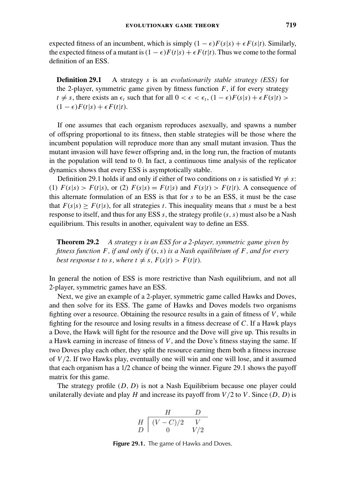

[Открыть страницу отдельно](../images/pages/p0740.jpg) · [Открыть страницу в PDF](../../materials/sources/Nisan-et-al-AGT-book.pdf#page=740)

**Definition 29.1** — фрагмент оригинальной страницы:

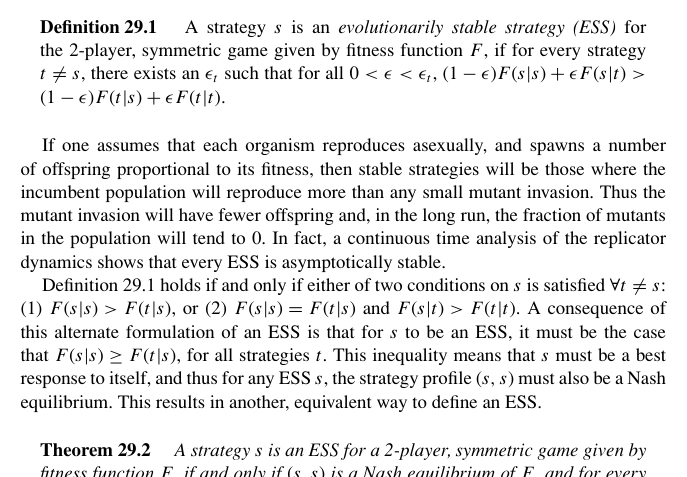

[Открыть фрагмент отдельно](../images/statements/p0740_definition_29-1_01.png)

**Theorem 29.2** — фрагмент оригинальной страницы:

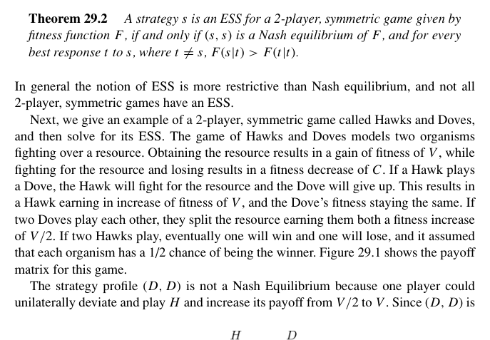

[Открыть фрагмент отдельно](../images/statements/p0740_theorem_29-2_02.png)

**Figure 29.1. The game of Hawks and Doves.** — область рисунка или таблицы:

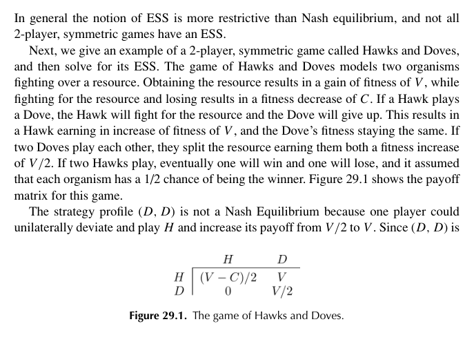

[Открыть фрагмент отдельно](../images/figures/p0740_figure_29-1_01.png)

Поисковый текст страницы (формулы сверяйте с изображением)

~~~~text
evolutionary game theory
719
expected fitness of an incumbent, which is simply (1 −ϵ)F(s|s) + ϵF(s|t). Similarly,
the expected fitness of a mutant is (1 −ϵ)F(t|s) + ϵF(t|t). Thus we come to the formal
definition of an ESS.
Definition 29.1
A strategy s is an evolutionarily stable strategy (ESS) for
the 2-player, symmetric game given by fitness function F, if for every strategy
t̸ = s, there exists an ϵt such that for all 0 < ϵ < ϵt, (1 −ϵ)F(s|s) + ϵF(s|t) >
(1 −ϵ)F(t|s) + ϵF(t|t).
If one assumes that each organism reproduces asexually, and spawns a number
of offspring proportional to its fitness, then stable strategies will be those where the
incumbent population will reproduce more than any small mutant invasion. Thus the
mutant invasion will have fewer offspring and, in the long run, the fraction of mutants
in the population will tend to 0. In fact, a continuous time analysis of the replicator
dynamics shows that every ESS is asymptotically stable.
Definition 29.1 holds if and only if either of two conditions on s is satisfied ∀t̸ = s:
(1) F(s|s) > F(t|s), or (2) F(s|s) = F(t|s) and F(s|t) > F(t|t). A consequence of
this alternate formulation of an ESS is that for s to be an ESS, it must be the case
that F(s|s) ≥F(t|s), for all strategies t. This inequality means that s must be a best
response to itself, and thus for any ESS s, the strategy profile (s, s) must also be a Nash
equilibrium. This results in another, equivalent way to define an ESS.
Theorem 29.2
A strategy s is an ESS for a 2-player, symmetric game given by
fitness function F, if and only if (s, s) is a Nash equilibrium of F, and for every
best response t to s, where t̸ = s, F(s|t) > F(t|t).
In general the notion of ESS is more restrictive than Nash equilibrium, and not all
2-player, symmetric games have an ESS.
Next, we give an example of a 2-player, symmetric game called Hawks and Doves,
and then solve for its ESS. The game of Hawks and Doves models two organisms
fighting over a resource. Obtaining the resource results in a gain of fitness of V , while
fighting for the resource and losing results in a fitness decrease of C. If a Hawk plays
a Dove, the Hawk will fight for the resource and the Dove will give up. This results in
a Hawk earning in increase of fitness of V , and the Dove’s fitness staying the same. If
two Doves play each other, they split the resource earning them both a fitness increase
of V/2. If two Hawks play, eventually one will win and one will lose, and it assumed
that each organism has a 1/2 chance of being the winner. Figure 29.1 shows the payoff
matrix for this game.
The strategy profile (D, D) is not a Nash Equilibrium because one player could
unilaterally deviate and play H and increase its payoff from V/2 to V . Since (D, D) is
Figure 29.1. The game of Hawks and Doves.
~~~~

### PDF стр. 741 · книжная стр. 720

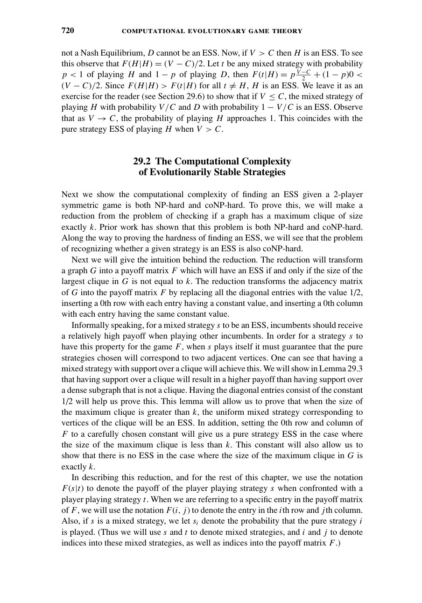

[Открыть страницу отдельно](../images/pages/p0741.jpg) · [Открыть страницу в PDF](../../materials/sources/Nisan-et-al-AGT-book.pdf#page=741)

Поисковый текст страницы (формулы сверяйте с изображением)

~~~~text
720
computational evolutionary game theory
not a Nash Equilibrium, D cannot be an ESS. Now, if V > C then H is an ESS. To see
this observe that F(H|H) = (V −C)/2. Let t be any mixed strategy with probability
p < 1 of playing H and 1 −p of playing D, then F(t|H) = p V −C
2
+ (1 −p)0 <
(V −C)/2. Since F(H|H) > F(t|H) for all t̸ = H, H is an ESS. We leave it as an
exercise for the reader (see Section 29.6) to show that if V ≤C, the mixed strategy of
playing H with probability V/C and D with probability 1 −V/C is an ESS. Observe
that as V →C, the probability of playing H approaches 1. This coincides with the
pure strategy ESS of playing H when V > C.
29.2 The Computational Complexity
of Evolutionarily Stable Strategies
Next we show the computational complexity of finding an ESS given a 2-player
symmetric game is both NP-hard and coNP-hard. To prove this, we will make a
reduction from the problem of checking if a graph has a maximum clique of size
exactly k. Prior work has shown that this problem is both NP-hard and coNP-hard.
Along the way to proving the hardness of finding an ESS, we will see that the problem
of recognizing whether a given strategy is an ESS is also coNP-hard.
Next we will give the intuition behind the reduction. The reduction will transform
a graph G into a payoff matrix F which will have an ESS if and only if the size of the
largest clique in G is not equal to k. The reduction transforms the adjacency matrix
of G into the payoff matrix F by replacing all the diagonal entries with the value 1/2,
inserting a 0th row with each entry having a constant value, and inserting a 0th column
with each entry having the same constant value.
Informally speaking, for a mixed strategy s to be an ESS, incumbents should receive
a relatively high payoff when playing other incumbents. In order for a strategy s to
have this property for the game F, when s plays itself it must guarantee that the pure
strategies chosen will correspond to two adjacent vertices. One can see that having a
mixed strategy with support over a clique will achieve this. We will show in Lemma 29.3
that having support over a clique will result in a higher payoff than having support over
a dense subgraph that is not a clique. Having the diagonal entries consist of the constant
1/2 will help us prove this. This lemma will allow us to prove that when the size of
the maximum clique is greater than k, the uniform mixed strategy corresponding to
vertices of the clique will be an ESS. In addition, setting the 0th row and column of
F to a carefully chosen constant will give us a pure strategy ESS in the case where
the size of the maximum clique is less than k. This constant will also allow us to
show that there is no ESS in the case where the size of the maximum clique in G is
exactly k.
In describing this reduction, and for the rest of this chapter, we use the notation
F(s|t) to denote the payoff of the player playing strategy s when confronted with a
player playing strategy t. When we are referring to a specific entry in the payoff matrix
of F, we will use the notation F(i, j) to denote the entry in the ith row and jth column.
Also, if s is a mixed strategy, we let si denote the probability that the pure strategy i
is played. (Thus we will use s and t to denote mixed strategies, and i and j to denote
indices into these mixed strategies, as well as indices into the payoff matrix F.)
~~~~

### PDF стр. 742 · книжная стр. 721

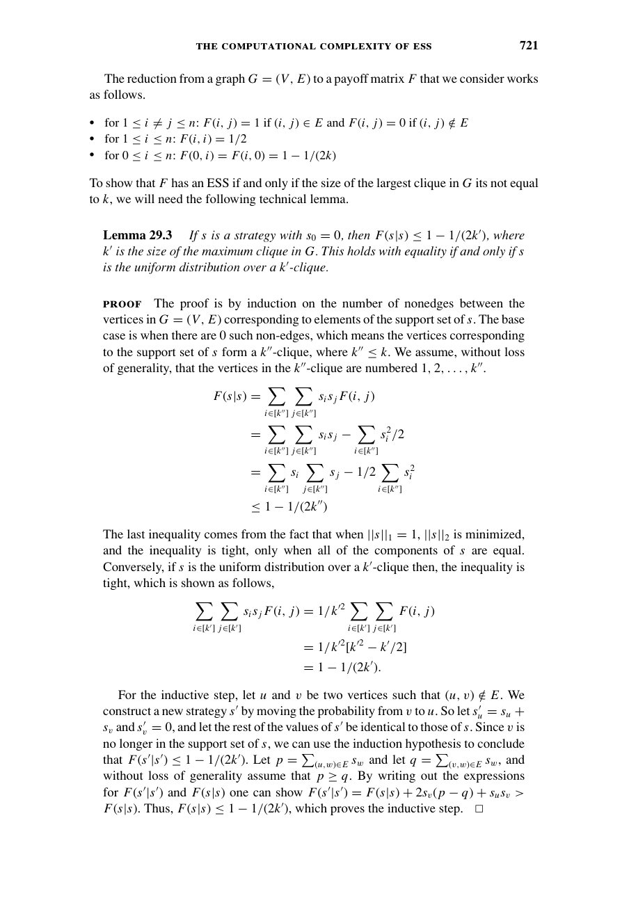

[Открыть страницу отдельно](../images/pages/p0742.jpg) · [Открыть страницу в PDF](../../materials/sources/Nisan-et-al-AGT-book.pdf#page=742)

**Lemma 29.3** — фрагмент оригинальной страницы:

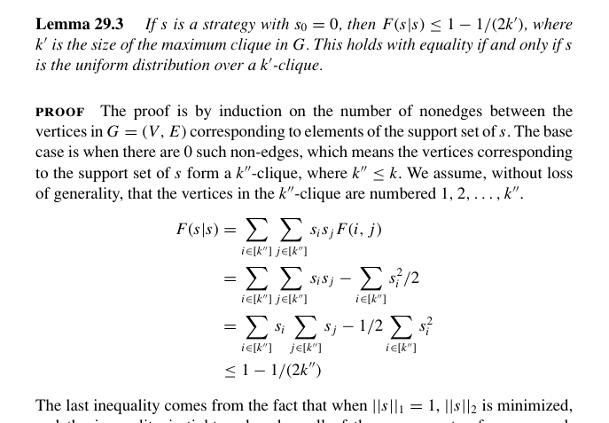

[Открыть фрагмент отдельно](../images/statements/p0742_lemma_29-3_01.png)

Поисковый текст страницы (формулы сверяйте с изображением)

~~~~text
the computational complexity of ess
721
The reduction from a graph G = (V, E) to a payoff matrix F that we consider works
as follows.
r for 1 ≤i̸ = j ≤n: F(i, j) = 1 if (i, j) ∈E and F(i, j) = 0 if (i, j) /∈E
r for 1 ≤i ≤n: F(i, i) = 1/2
r for 0 ≤i ≤n: F(0, i) = F(i, 0) = 1 −1/(2k)
To show that F has an ESS if and only if the size of the largest clique in G its not equal
to k, we will need the following technical lemma.
Lemma 29.3
If s is a strategy with s0 = 0, then F(s|s) ≤1 −1/(2k′), where
k′ is the size of the maximum clique in G. This holds with equality if and only if s
is the uniform distribution over a k′-clique.
proof
The proof is by induction on the number of nonedges between the
vertices in G = (V, E) corresponding to elements of the support set of s. The base
case is when there are 0 such non-edges, which means the vertices corresponding
to the support set of s form a k′′-clique, where k′′ ≤k. We assume, without loss
of generality, that the vertices in the k′′-clique are numbered 1, 2, . . . , k′′.
F(s|s) =
⟦U+0001; см. снимок страницы⟧
i∈[k′′]
⟦U+0001; см. снимок страницы⟧
j∈[k′′]
sisjF(i, j)
=
⟦U+0001; см. снимок страницы⟧
i∈[k′′]
⟦U+0001; см. снимок страницы⟧
j∈[k′′]
sisj −
⟦U+0001; см. снимок страницы⟧
i∈[k′′]
s2
i /2
=
⟦U+0001; см. снимок страницы⟧
i∈[k′′]
si
⟦U+0001; см. снимок страницы⟧
j∈[k′′]
sj −1/2
⟦U+0001; см. снимок страницы⟧
i∈[k′′]
s2
i
≤1 −1/(2k′′)
The last inequality comes from the fact that when ||s||1 = 1, ||s||2 is minimized,
and the inequality is tight, only when all of the components of s are equal.
Conversely, if s is the uniform distribution over a k′-clique then, the inequality is
tight, which is shown as follows,
⟦U+0001; см. снимок страницы⟧
i∈[k′]
⟦U+0001; см. снимок страницы⟧
j∈[k′]
sisjF(i, j) = 1/k′2 ⟦U+0001; см. снимок страницы⟧
i∈[k′]
⟦U+0001; см. снимок страницы⟧
j∈[k′]
F(i, j)
= 1/k′2[k′2 −k′/2]
= 1 −1/(2k′).
For the inductive step, let u and v be two vertices such that (u, v) /∈E. We
construct a new strategy s′ by moving the probability from v to u. So let s′
u = su +
sv and s′
v = 0, and let the rest of the values of s′ be identical to those of s. Since v is
no longer in the support set of s, we can use the induction hypothesis to conclude
that F(s′|s′) ≤1 −1/(2k′). Let p = ⟦U+0002; см. снимок страницы⟧
(u,w)∈E sw and let q = ⟦U+0002; см. снимок страницы⟧
(v,w)∈E sw, and
without loss of generality assume that p ≥q. By writing out the expressions
for F(s′|s′) and F(s|s) one can show F(s′|s′) = F(s|s) + 2sv(p −q) + susv >
F(s|s). Thus, F(s|s) ≤1 −1/(2k′), which proves the inductive step.
~~~~

### PDF стр. 743 · книжная стр. 722

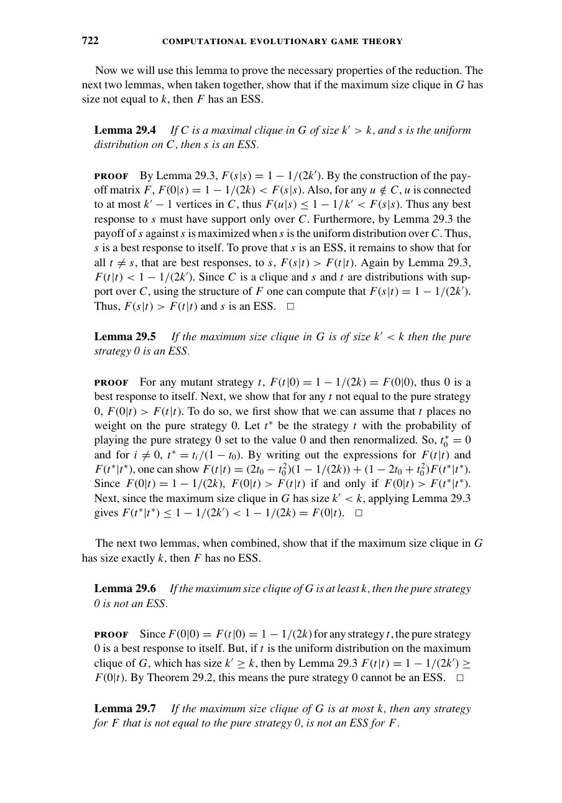

[Открыть страницу отдельно](../images/pages/p0743.jpg) · [Открыть страницу в PDF](../../materials/sources/Nisan-et-al-AGT-book.pdf#page=743)

**Lemma 29.4** — фрагмент оригинальной страницы:

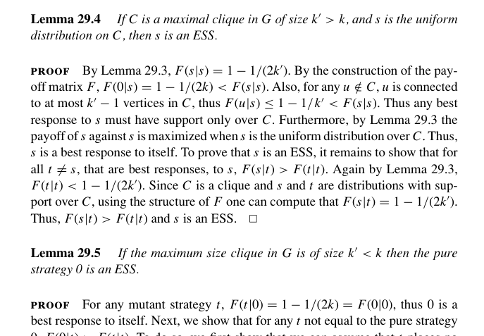

[Открыть фрагмент отдельно](../images/statements/p0743_lemma_29-4_01.png)

**Lemma 29.5** — фрагмент оригинальной страницы:

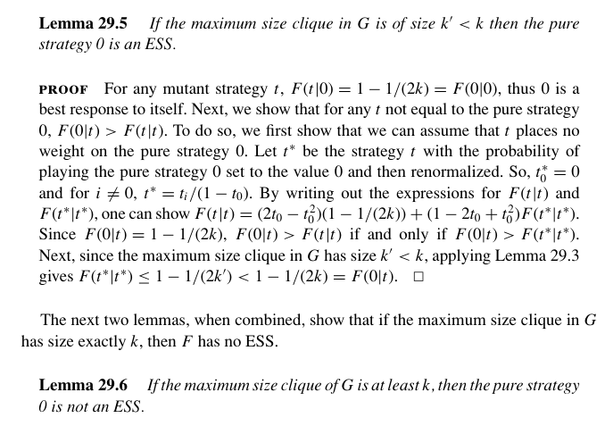

[Открыть фрагмент отдельно](../images/statements/p0743_lemma_29-5_02.png)

**Lemma 29.6** — фрагмент оригинальной страницы:

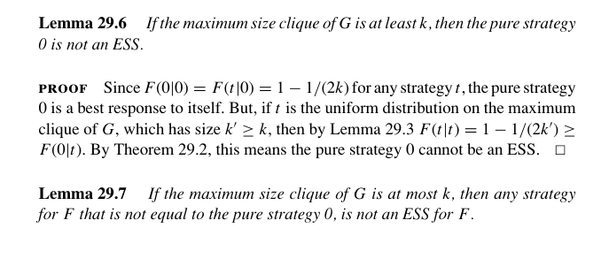

[Открыть фрагмент отдельно](../images/statements/p0743_lemma_29-6_03.png)

**Lemma 29.7** — фрагмент оригинальной страницы:

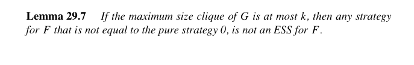

[Открыть фрагмент отдельно](../images/statements/p0743_lemma_29-7_04.png)

Начало следующей страницы для проверки продолжения: 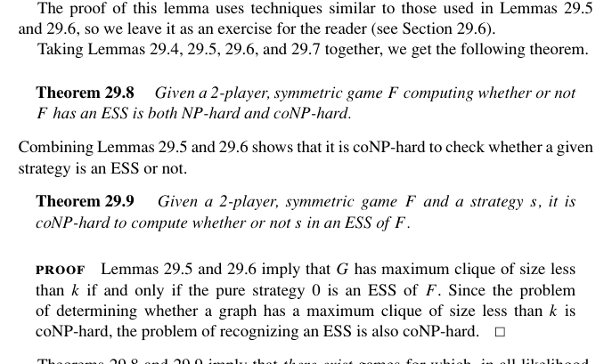

Поисковый текст страницы (формулы сверяйте с изображением)

~~~~text
722
computational evolutionary game theory
Now we will use this lemma to prove the necessary properties of the reduction. The
next two lemmas, when taken together, show that if the maximum size clique in G has
size not equal to k, then F has an ESS.
Lemma 29.4
If C is a maximal clique in G of size k′ > k, and s is the uniform
distribution on C, then s is an ESS.
proof
By Lemma 29.3, F(s|s) = 1 −1/(2k′). By the construction of the pay-
off matrix F, F(0|s) = 1 −1/(2k) < F(s|s). Also, for any u /∈C, u is connected
to at most k′ −1 vertices in C, thus F(u|s) ≤1 −1/k′ < F(s|s). Thus any best
response to s must have support only over C. Furthermore, by Lemma 29.3 the
payoff of s against s is maximized when s is the uniform distribution over C. Thus,
s is a best response to itself. To prove that s is an ESS, it remains to show that for
all t̸ = s, that are best responses, to s, F(s|t) > F(t|t). Again by Lemma 29.3,
F(t|t) < 1 −1/(2k′). Since C is a clique and s and t are distributions with sup-
port over C, using the structure of F one can compute that F(s|t) = 1 −1/(2k′).
Thus, F(s|t) > F(t|t) and s is an ESS.
Lemma 29.5
If the maximum size clique in G is of size k′ < k then the pure
strategy 0 is an ESS.
proof
For any mutant strategy t, F(t|0) = 1 −1/(2k) = F(0|0), thus 0 is a
best response to itself. Next, we show that for any t not equal to the pure strategy
0, F(0|t) > F(t|t). To do so, we first show that we can assume that t places no
weight on the pure strategy 0. Let t∗be the strategy t with the probability of
playing the pure strategy 0 set to the value 0 and then renormalized. So, t∗
0 = 0
and for i̸ = 0, t∗= ti/(1 −t0). By writing out the expressions for F(t|t) and
F(t∗|t∗), one can show F(t|t) = (2t0 −t2
0)(1 −1/(2k)) + (1 −2t0 + t2
0)F(t∗|t∗).
Since F(0|t) = 1 −1/(2k), F(0|t) > F(t|t) if and only if F(0|t) > F(t∗|t∗).
Next, since the maximum size clique in G has size k′ < k, applying Lemma 29.3
gives F(t∗|t∗) ≤1 −1/(2k′) < 1 −1/(2k) = F(0|t).
The next two lemmas, when combined, show that if the maximum size clique in G
has size exactly k, then F has no ESS.
Lemma 29.6
If the maximum size clique of G is at least k, then the pure strategy
0 is not an ESS.
proof
Since F(0|0) = F(t|0) = 1 −1/(2k) for any strategy t, the pure strategy
0 is a best response to itself. But, if t is the uniform distribution on the maximum
clique of G, which has size k′ ≥k, then by Lemma 29.3 F(t|t) = 1 −1/(2k′) ≥
F(0|t). By Theorem 29.2, this means the pure strategy 0 cannot be an ESS.
Lemma 29.7
If the maximum size clique of G is at most k, then any strategy
for F that is not equal to the pure strategy 0, is not an ESS for F.
~~~~

### PDF стр. 744 · книжная стр. 723

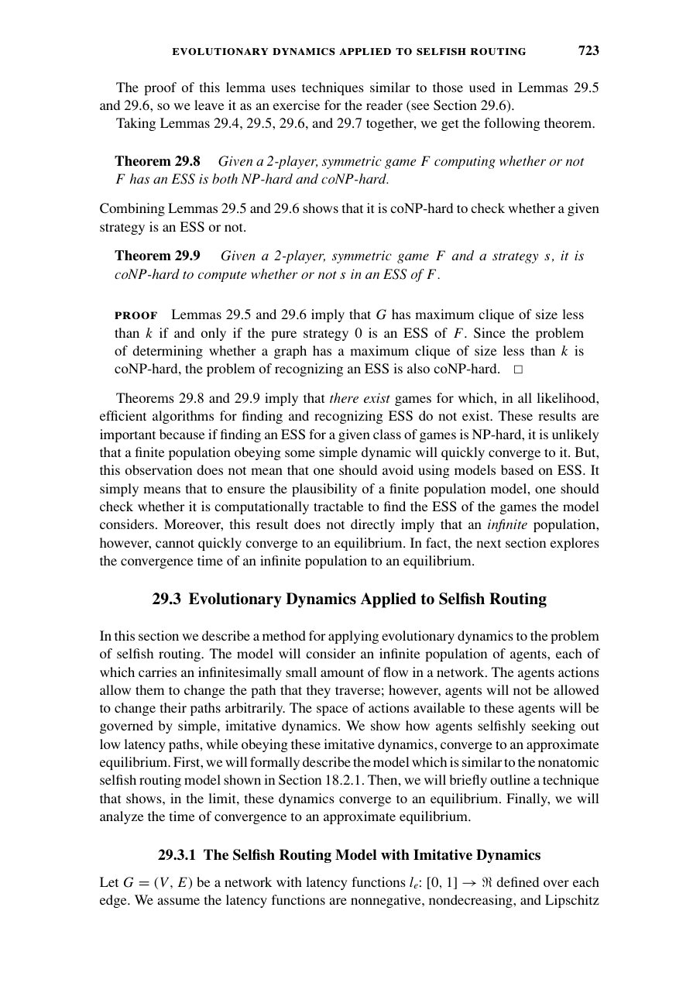

[Открыть страницу отдельно](../images/pages/p0744.jpg) · [Открыть страницу в PDF](../../materials/sources/Nisan-et-al-AGT-book.pdf#page=744)

**Theorem 29.8** — фрагмент оригинальной страницы:

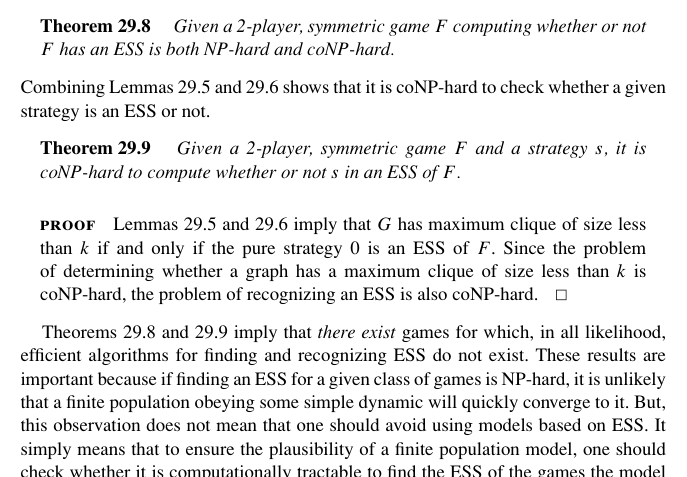

[Открыть фрагмент отдельно](../images/statements/p0744_theorem_29-8_01.png)

**Theorem 29.9** — фрагмент оригинальной страницы:

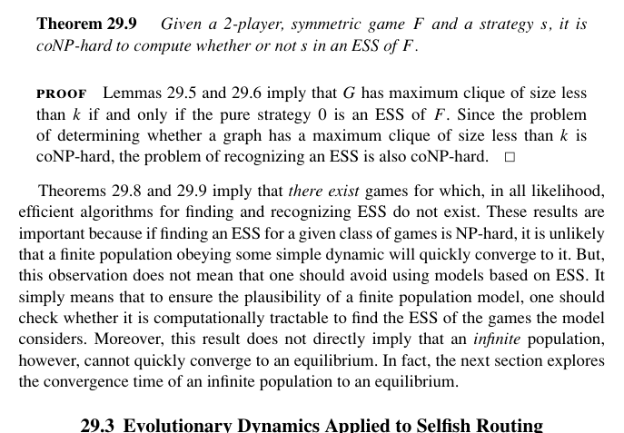

[Открыть фрагмент отдельно](../images/statements/p0744_theorem_29-9_02.png)

Поисковый текст страницы (формулы сверяйте с изображением)

~~~~text
evolutionary dynamics applied to selfish routing
723
The proof of this lemma uses techniques similar to those used in Lemmas 29.5
and 29.6, so we leave it as an exercise for the reader (see Section 29.6).
Taking Lemmas 29.4, 29.5, 29.6, and 29.7 together, we get the following theorem.
Theorem 29.8
Given a 2-player, symmetric game F computing whether or not
F has an ESS is both NP-hard and coNP-hard.
Combining Lemmas 29.5 and 29.6 shows that it is coNP-hard to check whether a given
strategy is an ESS or not.
Theorem 29.9
Given a 2-player, symmetric game F and a strategy s, it is
coNP-hard to compute whether or not s in an ESS of F.
proof
Lemmas 29.5 and 29.6 imply that G has maximum clique of size less
than k if and only if the pure strategy 0 is an ESS of F. Since the problem
of determining whether a graph has a maximum clique of size less than k is
coNP-hard, the problem of recognizing an ESS is also coNP-hard.
Theorems 29.8 and 29.9 imply that there exist games for which, in all likelihood,
efficient algorithms for finding and recognizing ESS do not exist. These results are
important because if finding an ESS for a given class of games is NP-hard, it is unlikely
that a finite population obeying some simple dynamic will quickly converge to it. But,
this observation does not mean that one should avoid using models based on ESS. It
simply means that to ensure the plausibility of a finite population model, one should
check whether it is computationally tractable to find the ESS of the games the model
considers. Moreover, this result does not directly imply that an infinite population,
however, cannot quickly converge to an equilibrium. In fact, the next section explores
the convergence time of an infinite population to an equilibrium.
29.3 Evolutionary Dynamics Applied to Selfish Routing
In this section we describe a method for applying evolutionary dynamics to the problem
of selfish routing. The model will consider an infinite population of agents, each of
which carries an infinitesimally small amount of flow in a network. The agents actions
allow them to change the path that they traverse; however, agents will not be allowed
to change their paths arbitrarily. The space of actions available to these agents will be
governed by simple, imitative dynamics. We show how agents selfishly seeking out
low latency paths, while obeying these imitative dynamics, converge to an approximate
equilibrium. First, we will formally describe the model which is similar to the nonatomic
selfish routing model shown in Section 18.2.1. Then, we will briefly outline a technique
that shows, in the limit, these dynamics converge to an equilibrium. Finally, we will
analyze the time of convergence to an approximate equilibrium.
29.3.1 The Selfish Routing Model with Imitative Dynamics
Let G = (V, E) be a network with latency functions le: [0, 1] →ℜdefined over each
edge. We assume the latency functions are nonnegative, nondecreasing, and Lipschitz
~~~~

### PDF стр. 745 · книжная стр. 724

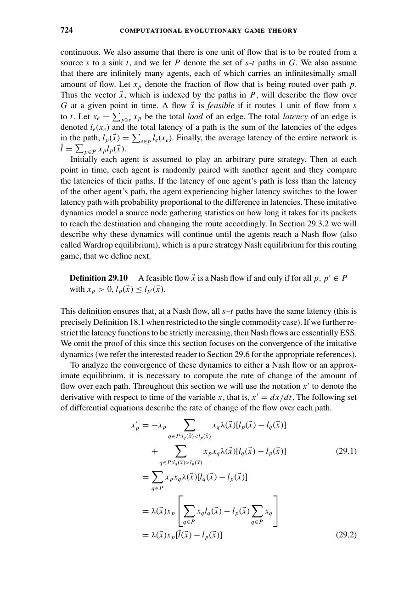

[Открыть страницу отдельно](../images/pages/p0745.jpg) · [Открыть страницу в PDF](../../materials/sources/Nisan-et-al-AGT-book.pdf#page=745)

**Definition 29.10** — фрагмент оригинальной страницы:

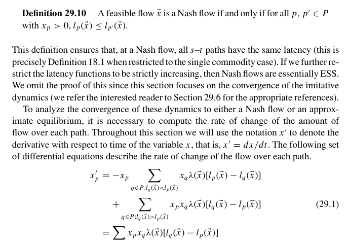

[Открыть фрагмент отдельно](../images/statements/p0745_definition_29-10_01.png)

Поисковый текст страницы (формулы сверяйте с изображением)

~~~~text
724
computational evolutionary game theory
continuous. We also assume that there is one unit of flow that is to be routed from a
source s to a sink t, and we let P denote the set of s-t paths in G. We also assume
that there are infinitely many agents, each of which carries an infinitesimally small
amount of flow. Let xp denote the fraction of flow that is being routed over path p.
Thus the vector⃗x, which is indexed by the paths in P, will describe the flow over
G at a given point in time. A flow⃗x is feasible if it routes 1 unit of flow from s
to t. Let xe = ⟦U+0002; см. снимок страницы⟧
p∋e xp be the total load of an edge. The total latency of an edge is
denoted le(xe) and the total latency of a path is the sum of the latencies of the edges
in the path, lp(⃗x) = ⟦U+0002; см. снимок страницы⟧
e∈p le(xe). Finally, the average latency of the entire network is
¯l = ⟦U+0002; см. снимок страницы⟧
p∈P xplp(⃗x).
Initially each agent is assumed to play an arbitrary pure strategy. Then at each
point in time, each agent is randomly paired with another agent and they compare
the latencies of their paths. If the latency of one agent’s path is less than the latency
of the other agent’s path, the agent experiencing higher latency switches to the lower
latency path with probability proportional to the difference in latencies. These imitative
dynamics model a source node gathering statistics on how long it takes for its packets
to reach the destination and changing the route accordingly. In Section 29.3.2 we will
describe why these dynamics will continue until the agents reach a Nash flow (also
called Wardrop equilibrium), which is a pure strategy Nash equilibrium for this routing
game, that we define next.
Definition 29.10
A feasible flow⃗x is a Nash flow if and only if for all p, p′ ∈P
with xp > 0, lp(⃗x) ≤lp′(⃗x).
This definition ensures that, at a Nash flow, all s–t paths have the same latency (this is
precisely Definition 18.1 when restricted to the single commodity case). If we further re-
strict the latency functions to be strictly increasing, then Nash flows are essentially ESS.
We omit the proof of this since this section focuses on the convergence of the imitative
dynamics (we refer the interested reader to Section 29.6 for the appropriate references).
To analyze the convergence of these dynamics to either a Nash flow or an approx-
imate equilibrium, it is necessary to compute the rate of change of the amount of
flow over each path. Throughout this section we will use the notation x′ to denote the
derivative with respect to time of the variable x, that is, x′ = dx/dt. The following set
of differential equations describe the rate of change of the flow over each path.
x′
p = −xp
⟦U+0001; см. снимок страницы⟧
q∈P:lq(⃗x)<lp(⃗x)
xqλ(⃗x)[lp(⃗x) −lq(⃗x)]
+
⟦U+0001; см. снимок страницы⟧
q∈P:lq(⃗x)>lp(⃗x)
xpxqλ(⃗x)[lq(⃗x) −lp(⃗x)]
(29.1)
=
⟦U+0001; см. снимок страницы⟧
q∈P
xpxqλ(⃗x)[lq(⃗x) −lp(⃗x)]
= λ(⃗x)xp
⎡
⎣⟦U+0001; см. снимок страницы⟧
q∈P
xqlq(⃗x) −lp(⃗x)
⟦U+0001; см. снимок страницы⟧
q∈P
xq
⎤
⎦
= λ(⃗x)xp[¯l(⃗x) −lp(⃗x)]
(29.2)
~~~~

### PDF стр. 746 · книжная стр. 725

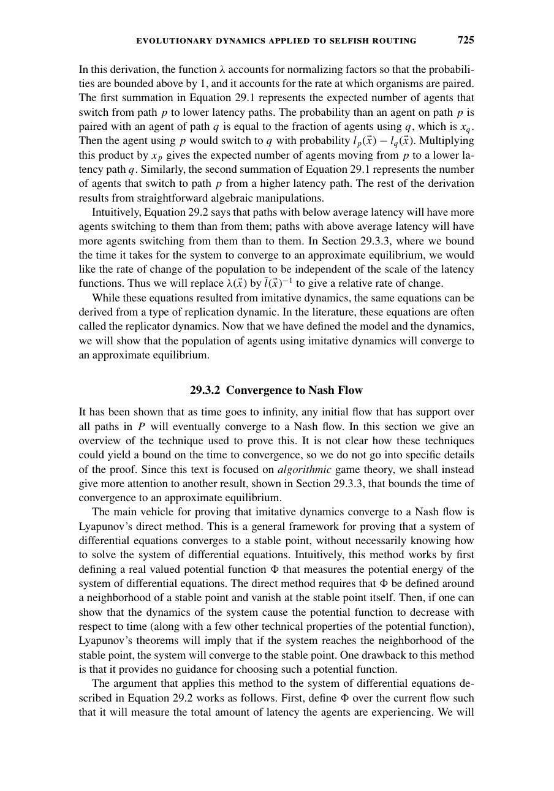

[Открыть страницу отдельно](../images/pages/p0746.jpg) · [Открыть страницу в PDF](../../materials/sources/Nisan-et-al-AGT-book.pdf#page=746)

Поисковый текст страницы (формулы сверяйте с изображением)

~~~~text
evolutionary dynamics applied to selfish routing
725
In this derivation, the function λ accounts for normalizing factors so that the probabili-
ties are bounded above by 1, and it accounts for the rate at which organisms are paired.
The first summation in Equation 29.1 represents the expected number of agents that
switch from path p to lower latency paths. The probability than an agent on path p is
paired with an agent of path q is equal to the fraction of agents using q, which is xq.
Then the agent using p would switch to q with probability lp(⃗x) −lq(⃗x). Multiplying
this product by xp gives the expected number of agents moving from p to a lower la-
tency path q. Similarly, the second summation of Equation 29.1 represents the number
of agents that switch to path p from a higher latency path. The rest of the derivation
results from straightforward algebraic manipulations.
Intuitively, Equation 29.2 says that paths with below average latency will have more
agents switching to them than from them; paths with above average latency will have
more agents switching from them than to them. In Section 29.3.3, where we bound
the time it takes for the system to converge to an approximate equilibrium, we would
like the rate of change of the population to be independent of the scale of the latency
functions. Thus we will replace λ(⃗x) by ¯l(⃗x)−1 to give a relative rate of change.
While these equations resulted from imitative dynamics, the same equations can be
derived from a type of replication dynamic. In the literature, these equations are often
called the replicator dynamics. Now that we have defined the model and the dynamics,
we will show that the population of agents using imitative dynamics will converge to
an approximate equilibrium.
29.3.2 Convergence to Nash Flow
It has been shown that as time goes to infinity, any initial flow that has support over
all paths in P will eventually converge to a Nash flow. In this section we give an
overview of the technique used to prove this. It is not clear how these techniques
could yield a bound on the time to convergence, so we do not go into specific details
of the proof. Since this text is focused on algorithmic game theory, we shall instead
give more attention to another result, shown in Section 29.3.3, that bounds the time of
convergence to an approximate equilibrium.
The main vehicle for proving that imitative dynamics converge to a Nash flow is
Lyapunov’s direct method. This is a general framework for proving that a system of
differential equations converges to a stable point, without necessarily knowing how
to solve the system of differential equations. Intuitively, this method works by first
defining a real valued potential function ⟦U+0004; см. снимок страницы⟧ that measures the potential energy of the
system of differential equations. The direct method requires that ⟦U+0004; см. снимок страницы⟧ be defined around
a neighborhood of a stable point and vanish at the stable point itself. Then, if one can
show that the dynamics of the system cause the potential function to decrease with
respect to time (along with a few other technical properties of the potential function),
Lyapunov’s theorems will imply that if the system reaches the neighborhood of the
stable point, the system will converge to the stable point. One drawback to this method
is that it provides no guidance for choosing such a potential function.
The argument that applies this method to the system of differential equations de-
scribed in Equation 29.2 works as follows. First, define ⟦U+0004; см. снимок страницы⟧ over the current flow such
that it will measure the total amount of latency the agents are experiencing. We will
~~~~

### PDF стр. 747 · книжная стр. 726

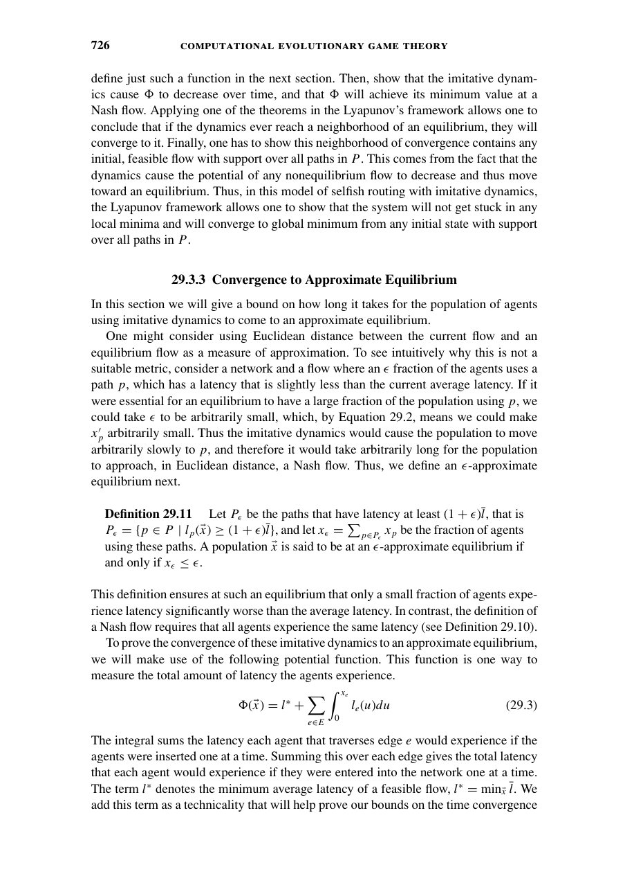

[Открыть страницу отдельно](../images/pages/p0747.jpg) · [Открыть страницу в PDF](../../materials/sources/Nisan-et-al-AGT-book.pdf#page=747)

**Definition 29.11** — фрагмент оригинальной страницы:

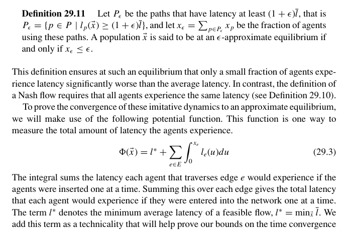

[Открыть фрагмент отдельно](../images/statements/p0747_definition_29-11_01.png)

Поисковый текст страницы (формулы сверяйте с изображением)

~~~~text
726
computational evolutionary game theory
define just such a function in the next section. Then, show that the imitative dynam-
ics cause ⟦U+0004; см. снимок страницы⟧ to decrease over time, and that ⟦U+0004; см. снимок страницы⟧ will achieve its minimum value at a
Nash flow. Applying one of the theorems in the Lyapunov’s framework allows one to
conclude that if the dynamics ever reach a neighborhood of an equilibrium, they will
converge to it. Finally, one has to show this neighborhood of convergence contains any
initial, feasible flow with support over all paths in P. This comes from the fact that the
dynamics cause the potential of any nonequilibrium flow to decrease and thus move
toward an equilibrium. Thus, in this model of selfish routing with imitative dynamics,
the Lyapunov framework allows one to show that the system will not get stuck in any
local minima and will converge to global minimum from any initial state with support
over all paths in P.
29.3.3 Convergence to Approximate Equilibrium
In this section we will give a bound on how long it takes for the population of agents
using imitative dynamics to come to an approximate equilibrium.
One might consider using Euclidean distance between the current flow and an
equilibrium flow as a measure of approximation. To see intuitively why this is not a
suitable metric, consider a network and a flow where an ϵ fraction of the agents uses a
path p, which has a latency that is slightly less than the current average latency. If it
were essential for an equilibrium to have a large fraction of the population using p, we
could take ϵ to be arbitrarily small, which, by Equation 29.2, means we could make
x′
p arbitrarily small. Thus the imitative dynamics would cause the population to move
arbitrarily slowly to p, and therefore it would take arbitrarily long for the population
to approach, in Euclidean distance, a Nash flow. Thus, we define an ϵ-approximate
equilibrium next.
Definition 29.11
Let Pϵ be the paths that have latency at least (1 + ϵ)¯l, that is
Pϵ = {p ∈P | lp(⃗x) ≥(1 + ϵ)¯l}, and let xϵ = ⟦U+0002; см. снимок страницы⟧
p∈Pϵ xp be the fraction of agents
using these paths. A population⃗x is said to be at an ϵ-approximate equilibrium if
and only if xϵ ≤ϵ.
This definition ensures at such an equilibrium that only a small fraction of agents expe-
rience latency significantly worse than the average latency. In contrast, the definition of
a Nash flow requires that all agents experience the same latency (see Definition 29.10).
To prove the convergence of these imitative dynamics to an approximate equilibrium,
we will make use of the following potential function. This function is one way to
measure the total amount of latency the agents experience.
⟦U+0004; см. снимок страницы⟧(⃗x) = l∗+
⟦U+0001; см. снимок страницы⟧
e∈E
⟦U+0007; см. снимок страницы⟧ xe
0
le(u)du
(29.3)
The integral sums the latency each agent that traverses edge e would experience if the
agents were inserted one at a time. Summing this over each edge gives the total latency
that each agent would experience if they were entered into the network one at a time.
The term l∗denotes the minimum average latency of a feasible flow, l∗= min⃗x ¯l. We
add this term as a technicality that will help prove our bounds on the time convergence
~~~~

### PDF стр. 748 · книжная стр. 727

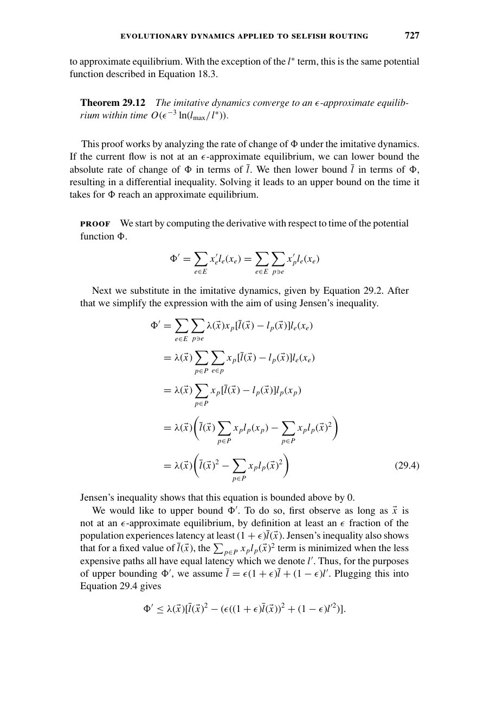

[Открыть страницу отдельно](../images/pages/p0748.jpg) · [Открыть страницу в PDF](../../materials/sources/Nisan-et-al-AGT-book.pdf#page=748)

**Theorem 29.12** — фрагмент оригинальной страницы:

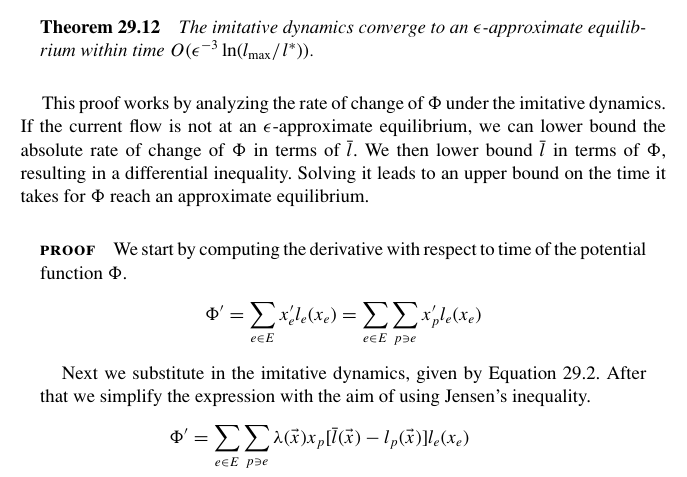

[Открыть фрагмент отдельно](../images/statements/p0748_theorem_29-12_01.png)

Поисковый текст страницы (формулы сверяйте с изображением)

~~~~text
evolutionary dynamics applied to selfish routing
727
to approximate equilibrium. With the exception of the l∗term, this is the same potential
function described in Equation 18.3.
Theorem 29.12
The imitative dynamics converge to an ϵ-approximate equilib-
rium within time O(ϵ−3 ln(lmax/l∗)).
This proof works by analyzing the rate of change of ⟦U+0004; см. снимок страницы⟧ under the imitative dynamics.
If the current flow is not at an ϵ-approximate equilibrium, we can lower bound the
absolute rate of change of ⟦U+0004; см. снимок страницы⟧ in terms of ¯l. We then lower bound ¯l in terms of ⟦U+0004; см. снимок страницы⟧,
resulting in a differential inequality. Solving it leads to an upper bound on the time it
takes for ⟦U+0004; см. снимок страницы⟧ reach an approximate equilibrium.
proof
We start by computing the derivative with respect to time of the potential
function ⟦U+0004; см. снимок страницы⟧.
⟦U+0004; см. снимок страницы⟧′ =
⟦U+0001; см. снимок страницы⟧
e∈E
x′
ele(xe) =
⟦U+0001; см. снимок страницы⟧
e∈E
⟦U+0001; см. снимок страницы⟧
p∋e
x′
ple(xe)
Next we substitute in the imitative dynamics, given by Equation 29.2. After
that we simplify the expression with the aim of using Jensen’s inequality.
⟦U+0004; см. снимок страницы⟧′ =
⟦U+0001; см. снимок страницы⟧
e∈E
⟦U+0001; см. снимок страницы⟧
p∋e
λ(⃗x)xp[¯l(⃗x) −lp(⃗x)]le(xe)
= λ(⃗x)
⟦U+0001; см. снимок страницы⟧
p∈P
⟦U+0001; см. снимок страницы⟧
e∈p
xp[¯l(⃗x) −lp(⃗x)]le(xe)
= λ(⃗x)
⟦U+0001; см. снимок страницы⟧
p∈P
xp[¯l(⃗x) −lp(⃗x)]lp(xp)
= λ(⃗x)
⟦U+0008; см. снимок страницы⟧
¯l(⃗x)
⟦U+0001; см. снимок страницы⟧
p∈P
xplp(xp) −
⟦U+0001; см. снимок страницы⟧
p∈P
xplp(⃗x)2

= λ(⃗x)
⟦U+0008; см. снимок страницы⟧
¯l(⃗x)2 −
⟦U+0001; см. снимок страницы⟧
p∈P
xplp(⃗x)2

(29.4)
Jensen’s inequality shows that this equation is bounded above by 0.
We would like to upper bound ⟦U+0004; см. снимок страницы⟧′. To do so, first observe as long as⃗x is
not at an ϵ-approximate equilibrium, by definition at least an ϵ fraction of the
population experiences latency at least (1 + ϵ)¯l(⃗x). Jensen’s inequality also shows
that for a fixed value of ¯l(⃗x), the ⟦U+0002; см. снимок страницы⟧
p∈P xplp(⃗x)2 term is minimized when the less
expensive paths all have equal latency which we denote l′. Thus, for the purposes
of upper bounding ⟦U+0004; см. снимок страницы⟧′, we assume ¯l = ϵ(1 + ϵ)¯l + (1 −ϵ)l′. Plugging this into
Equation 29.4 gives
⟦U+0004; см. снимок страницы⟧′ ≤λ(⃗x)[¯l(⃗x)2 −(ϵ((1 + ϵ)¯l(⃗x))2 + (1 −ϵ)l′2)].
~~~~

### PDF стр. 749 · книжная стр. 728

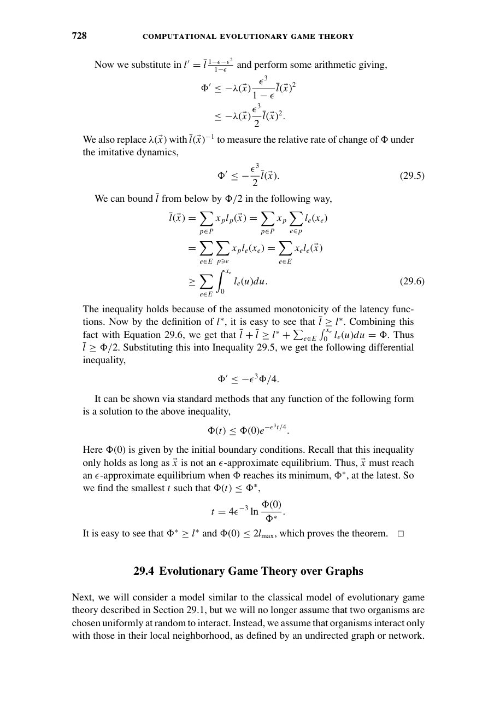

[Открыть страницу отдельно](../images/pages/p0749.jpg) · [Открыть страницу в PDF](../../materials/sources/Nisan-et-al-AGT-book.pdf#page=749)

Поисковый текст страницы (формулы сверяйте с изображением)

~~~~text
728
computational evolutionary game theory
Now we substitute in l′ = ¯l 1−ϵ−ϵ2
1−ϵ
and perform some arithmetic giving,
⟦U+0004; см. снимок страницы⟧′ ≤−λ(⃗x) ϵ3
1 −ϵ
¯l(⃗x)2
≤−λ(⃗x)ϵ3
2
¯l(⃗x)2.
We also replace λ(⃗x) with ¯l(⃗x)−1 to measure the relative rate of change of ⟦U+0004; см. снимок страницы⟧ under
the imitative dynamics,
⟦U+0004; см. снимок страницы⟧′ ≤−ϵ3
2
¯l(⃗x).
(29.5)
We can bound ¯l from below by ⟦U+0004; см. снимок страницы⟧/2 in the following way,
¯l(⃗x) =
⟦U+0001; см. снимок страницы⟧
p∈P
xplp(⃗x) =
⟦U+0001; см. снимок страницы⟧
p∈P
xp
⟦U+0001; см. снимок страницы⟧
e∈p
le(xe)
=
⟦U+0001; см. снимок страницы⟧
e∈E
⟦U+0001; см. снимок страницы⟧
p∋e
xple(xe) =
⟦U+0001; см. снимок страницы⟧
e∈E
xele(⃗x)
≥
⟦U+0001; см. снимок страницы⟧
e∈E
⟦U+0007; см. снимок страницы⟧ xe
0
le(u)du.
(29.6)
The inequality holds because of the assumed monotonicity of the latency func-
tions. Now by the definition of l∗, it is easy to see that ¯l ≥l∗. Combining this
fact with Equation 29.6, we get that ¯l + ¯l ≥l∗+ ⟦U+0002; см. снимок страницы⟧
e∈E

 xe
0 le(u)du = ⟦U+0004; см. снимок страницы⟧. Thus
¯l ≥⟦U+0004; см. снимок страницы⟧/2. Substituting this into Inequality 29.5, we get the following differential
inequality,
⟦U+0004; см. снимок страницы⟧′ ≤−ϵ3⟦U+0004; см. снимок страницы⟧/4.
It can be shown via standard methods that any function of the following form
is a solution to the above inequality,
⟦U+0004; см. снимок страницы⟧(t) ≤⟦U+0004; см. снимок страницы⟧(0)e−ϵ3t/4.
Here ⟦U+0004; см. снимок страницы⟧(0) is given by the initial boundary conditions. Recall that this inequality
only holds as long as⃗x is not an ϵ-approximate equilibrium. Thus,⃗x must reach
an ϵ-approximate equilibrium when ⟦U+0004; см. снимок страницы⟧ reaches its minimum, ⟦U+0004; см. снимок страницы⟧∗, at the latest. So
we find the smallest t such that ⟦U+0004; см. снимок страницы⟧(t) ≤⟦U+0004; см. снимок страницы⟧∗,
t = 4ϵ−3 ln ⟦U+0004; см. снимок страницы⟧(0)
⟦U+0004; см. снимок страницы⟧∗.
It is easy to see that ⟦U+0004; см. снимок страницы⟧∗≥l∗and ⟦U+0004; см. снимок страницы⟧(0) ≤2lmax, which proves the theorem.
29.4 Evolutionary Game Theory over Graphs
Next, we will consider a model similar to the classical model of evolutionary game
theory described in Section 29.1, but we will no longer assume that two organisms are
chosen uniformly at random to interact. Instead, we assume that organisms interact only
with those in their local neighborhood, as defined by an undirected graph or network.
~~~~

### PDF стр. 750 · книжная стр. 729

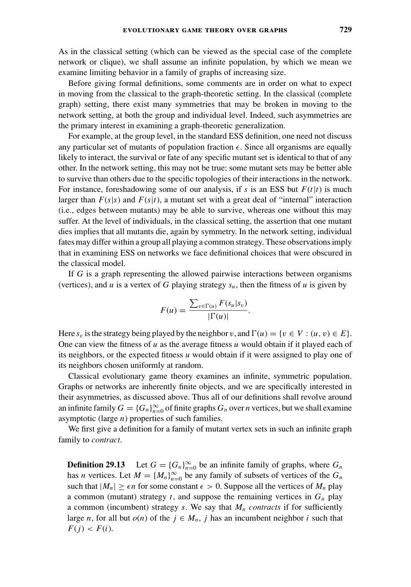

[Открыть страницу отдельно](../images/pages/p0750.jpg) · [Открыть страницу в PDF](../../materials/sources/Nisan-et-al-AGT-book.pdf#page=750)

**Definition 29.13** — фрагмент оригинальной страницы:

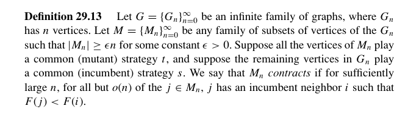

[Открыть фрагмент отдельно](../images/statements/p0750_definition_29-13_01.png)

Поисковый текст страницы (формулы сверяйте с изображением)

~~~~text
evolutionary game theory over graphs
729
As in the classical setting (which can be viewed as the special case of the complete
network or clique), we shall assume an infinite population, by which we mean we
examine limiting behavior in a family of graphs of increasing size.
Before giving formal definitions, some comments are in order on what to expect
in moving from the classical to the graph-theoretic setting. In the classical (complete
graph) setting, there exist many symmetries that may be broken in moving to the
network setting, at both the group and individual level. Indeed, such asymmetries are
the primary interest in examining a graph-theoretic generalization.
For example, at the group level, in the standard ESS definition, one need not discuss
any particular set of mutants of population fraction ϵ. Since all organisms are equally
likely to interact, the survival or fate of any specific mutant set is identical to that of any
other. In the network setting, this may not be true: some mutant sets may be better able
to survive than others due to the specific topologies of their interactions in the network.
For instance, foreshadowing some of our analysis, if s is an ESS but F(t|t) is much
larger than F(s|s) and F(s|t), a mutant set with a great deal of “internal” interaction
(i.e., edges between mutants) may be able to survive, whereas one without this may
suffer. At the level of individuals, in the classical setting, the assertion that one mutant
dies implies that all mutants die, again by symmetry. In the network setting, individual
fates may differ within a group all playing a common strategy. These observations imply
that in examining ESS on networks we face definitional choices that were obscured in
the classical model.
If G is a graph representing the allowed pairwise interactions between organisms
(vertices), and u is a vertex of G playing strategy su, then the fitness of u is given by
F(u) =
⟦U+0002; см. снимок страницы⟧
v∈⟦U+0005; см. снимок страницы⟧(u) F(su|sv)
|⟦U+0005; см. снимок страницы⟧(u)|
.
Here sv is the strategy being played by the neighbor v, and ⟦U+0005; см. снимок страницы⟧(u) = {v ∈V : (u, v) ∈E}.
One can view the fitness of u as the average fitness u would obtain if it played each of
its neighbors, or the expected fitness u would obtain if it were assigned to play one of
its neighbors chosen uniformly at random.
Classical evolutionary game theory examines an infinite, symmetric population.
Graphs or networks are inherently finite objects, and we are specifically interested in
their asymmetries, as discussed above. Thus all of our definitions shall revolve around
an infinite family G = {Gn}∞
n=0 of finite graphs Gn over n vertices, but we shall examine
asymptotic (large n) properties of such families.
We first give a definition for a family of mutant vertex sets in such an infinite graph
family to contract.
Definition 29.13
Let G = {Gn}∞
n=0 be an infinite family of graphs, where Gn
has n vertices. Let M = {Mn}∞
n=0 be any family of subsets of vertices of the Gn
such that |Mn| ≥ϵn for some constant ϵ > 0. Suppose all the vertices of Mn play
a common (mutant) strategy t, and suppose the remaining vertices in Gn play
a common (incumbent) strategy s. We say that Mn contracts if for sufficiently
large n, for all but o(n) of the j ∈Mn, j has an incumbent neighbor i such that
F(j) < F(i).
~~~~

### PDF стр. 751 · книжная стр. 730

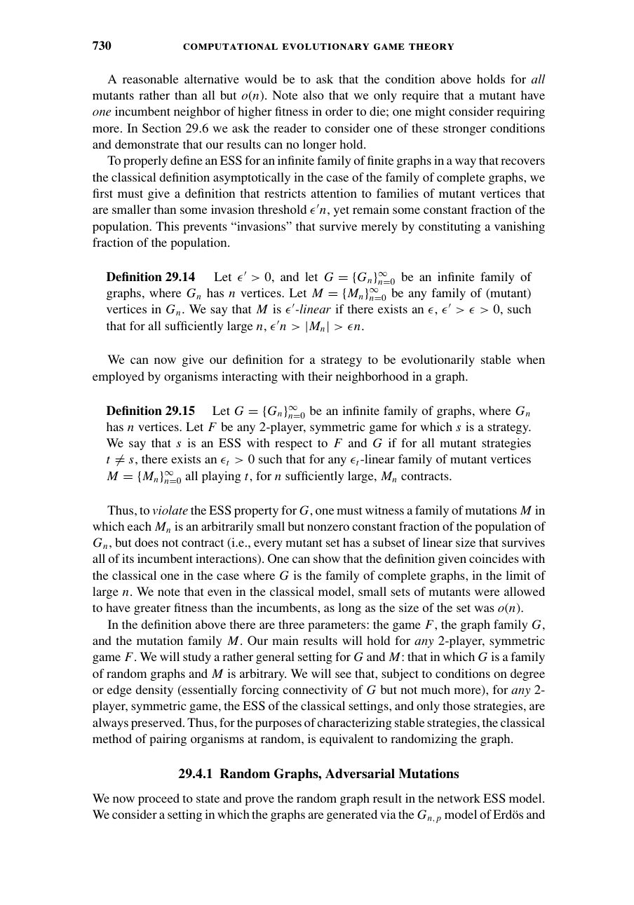

[Открыть страницу отдельно](../images/pages/p0751.jpg) · [Открыть страницу в PDF](../../materials/sources/Nisan-et-al-AGT-book.pdf#page=751)

**Definition 29.14** — фрагмент оригинальной страницы:

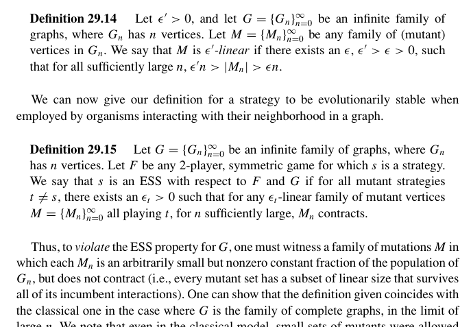

[Открыть фрагмент отдельно](../images/statements/p0751_definition_29-14_01.png)

**Definition 29.15** — фрагмент оригинальной страницы:

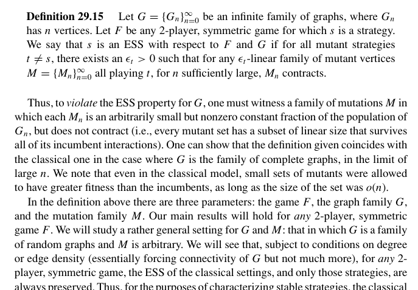

[Открыть фрагмент отдельно](../images/statements/p0751_definition_29-15_02.png)

Поисковый текст страницы (формулы сверяйте с изображением)

~~~~text
730
computational evolutionary game theory
A reasonable alternative would be to ask that the condition above holds for all
mutants rather than all but o(n). Note also that we only require that a mutant have
one incumbent neighbor of higher fitness in order to die; one might consider requiring
more. In Section 29.6 we ask the reader to consider one of these stronger conditions
and demonstrate that our results can no longer hold.
To properly define an ESS for an infinite family of finite graphs in a way that recovers
the classical definition asymptotically in the case of the family of complete graphs, we
first must give a definition that restricts attention to families of mutant vertices that
are smaller than some invasion threshold ϵ′n, yet remain some constant fraction of the
population. This prevents “invasions” that survive merely by constituting a vanishing
fraction of the population.
Definition 29.14
Let ϵ′ > 0, and let G = {Gn}∞
n=0 be an infinite family of
graphs, where Gn has n vertices. Let M = {Mn}∞
n=0 be any family of (mutant)
vertices in Gn. We say that M is ϵ′-linear if there exists an ϵ, ϵ′ > ϵ > 0, such
that for all sufficiently large n, ϵ′n > |Mn| > ϵn.
We can now give our definition for a strategy to be evolutionarily stable when
employed by organisms interacting with their neighborhood in a graph.
Definition 29.15
Let G = {Gn}∞
n=0 be an infinite family of graphs, where Gn
has n vertices. Let F be any 2-player, symmetric game for which s is a strategy.
We say that s is an ESS with respect to F and G if for all mutant strategies
t̸ = s, there exists an ϵt > 0 such that for any ϵt-linear family of mutant vertices
M = {Mn}∞
n=0 all playing t, for n sufficiently large, Mn contracts.
Thus, to violate the ESS property for G, one must witness a family of mutations M in
which each Mn is an arbitrarily small but nonzero constant fraction of the population of
Gn, but does not contract (i.e., every mutant set has a subset of linear size that survives
all of its incumbent interactions). One can show that the definition given coincides with
the classical one in the case where G is the family of complete graphs, in the limit of
large n. We note that even in the classical model, small sets of mutants were allowed
to have greater fitness than the incumbents, as long as the size of the set was o(n).
In the definition above there are three parameters: the game F, the graph family G,
and the mutation family M. Our main results will hold for any 2-player, symmetric
game F. We will study a rather general setting for G and M: that in which G is a family
of random graphs and M is arbitrary. We will see that, subject to conditions on degree
or edge density (essentially forcing connectivity of G but not much more), for any 2-
player, symmetric game, the ESS of the classical settings, and only those strategies, are
always preserved. Thus, for the purposes of characterizing stable strategies, the classical
method of pairing organisms at random, is equivalent to randomizing the graph.
29.4.1 Random Graphs, Adversarial Mutations
We now proceed to state and prove the random graph result in the network ESS model.
We consider a setting in which the graphs are generated via the Gn,p model of Erd¨os and
~~~~

### PDF стр. 752 · книжная стр. 731

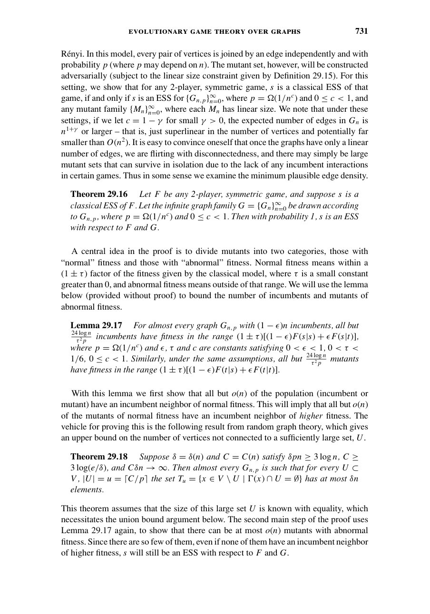

[Открыть страницу отдельно](../images/pages/p0752.jpg) · [Открыть страницу в PDF](../../materials/sources/Nisan-et-al-AGT-book.pdf#page=752)

**Theorem 29.16** — фрагмент оригинальной страницы:

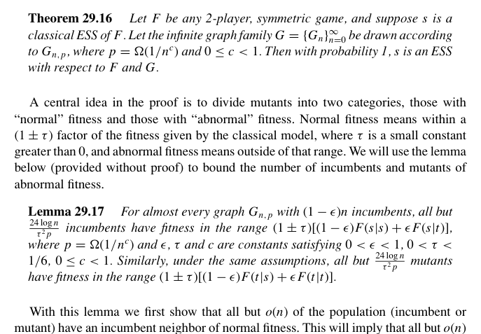

[Открыть фрагмент отдельно](../images/statements/p0752_theorem_29-16_01.png)

**Lemma 29.17** — фрагмент оригинальной страницы:

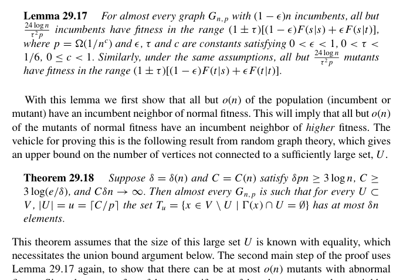

[Открыть фрагмент отдельно](../images/statements/p0752_lemma_29-17_02.png)

**Theorem 29.18** — фрагмент оригинальной страницы:

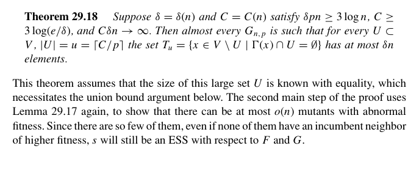

[Открыть фрагмент отдельно](../images/statements/p0752_theorem_29-18_03.png)

Поисковый текст страницы (формулы сверяйте с изображением)

~~~~text
evolutionary game theory over graphs
731
R´enyi. In this model, every pair of vertices is joined by an edge independently and with
probability p (where p may depend on n). The mutant set, however, will be constructed
adversarially (subject to the linear size constraint given by Definition 29.15). For this
setting, we show that for any 2-player, symmetric game, s is a classical ESS of that
game, if and only if s is an ESS for {Gn,p}∞
n=0, where p = ⟦U+0006; см. снимок страницы⟧(1/nc) and 0 ≤c < 1, and
any mutant family {Mn}∞
n=0, where each Mn has linear size. We note that under these
settings, if we let c = 1 −γ for small γ > 0, the expected number of edges in Gn is
n1+γ or larger – that is, just superlinear in the number of vertices and potentially far
smaller than O(n2). It is easy to convince oneself that once the graphs have only a linear
number of edges, we are flirting with disconnectedness, and there may simply be large
mutant sets that can survive in isolation due to the lack of any incumbent interactions
in certain games. Thus in some sense we examine the minimum plausible edge density.
Theorem 29.16
Let F be any 2-player, symmetric game, and suppose s is a
classical ESS of F. Let the infinite graph family G = {Gn}∞
n=0 be drawn according
to Gn,p, where p = ⟦U+0006; см. снимок страницы⟧(1/nc) and 0 ≤c < 1. Then with probability 1, s is an ESS
with respect to F and G.
A central idea in the proof is to divide mutants into two categories, those with
“normal” fitness and those with “abnormal” fitness. Normal fitness means within a
(1 ± τ) factor of the fitness given by the classical model, where τ is a small constant
greater than 0, and abnormal fitness means outside of that range. We will use the lemma
below (provided without proof) to bound the number of incumbents and mutants of
abnormal fitness.
Lemma 29.17
For almost every graph Gn,p with (1 −ϵ)n incumbents, all but
24 log n
τ 2p
incumbents have fitness in the range (1 ± τ)[(1 −ϵ)F(s|s) + ϵF(s|t)],
where p = ⟦U+0006; см. снимок страницы⟧(1/nc) and ϵ, τ and c are constants satisfying 0 < ϵ < 1, 0 < τ <
1/6, 0 ≤c < 1. Similarly, under the same assumptions, all but 24 log n
τ 2p
mutants
have fitness in the range (1 ± τ)[(1 −ϵ)F(t|s) + ϵF(t|t)].
With this lemma we first show that all but o(n) of the population (incumbent or
mutant) have an incumbent neighbor of normal fitness. This will imply that all but o(n)
of the mutants of normal fitness have an incumbent neighbor of higher fitness. The
vehicle for proving this is the following result from random graph theory, which gives
an upper bound on the number of vertices not connected to a sufficiently large set, U.
Theorem 29.18
Suppose δ = δ(n) and C = C(n) satisfy δpn ≥3 log n, C ≥
3 log(e/δ), and Cδn →∞. Then almost every Gn,p is such that for every U ⊂
V , |U| = u = ⌈C/p⌉the set Tu = {x ∈V \ U | ⟦U+0005; см. снимок страницы⟧(x) ∩U = ∅} has at most δn
elements.
This theorem assumes that the size of this large set U is known with equality, which
necessitates the union bound argument below. The second main step of the proof uses
Lemma 29.17 again, to show that there can be at most o(n) mutants with abnormal
fitness. Since there are so few of them, even if none of them have an incumbent neighbor
of higher fitness, s will still be an ESS with respect to F and G.
~~~~

### PDF стр. 753 · книжная стр. 732

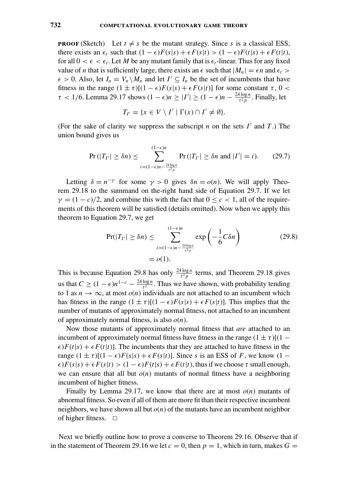

[Открыть страницу отдельно](../images/pages/p0753.jpg) · [Открыть страницу в PDF](../../materials/sources/Nisan-et-al-AGT-book.pdf#page=753)

Поисковый текст страницы (формулы сверяйте с изображением)

~~~~text
732
computational evolutionary game theory
proof (Sketch)
Let t̸ = s be the mutant strategy. Since s is a classical ESS,
there exists an ϵt such that (1 −ϵ)F(s|s) + ϵF(s|t) > (1 −ϵ)F(t|s) + ϵF(t|t),
for all 0 < ϵ < ϵt. Let M be any mutant family that is ϵt-linear. Thus for any fixed
value of n that is sufficiently large, there exists an ϵ such that |Mn| = ϵn and ϵt >
ϵ > 0. Also, let In = Vn\Mn and let I ′ ⊆In be the set of incumbents that have
fitness in the range (1 ± τ)[(1 −ϵ)F(s|s) + ϵF(s|t)] for some constant τ, 0 <
τ < 1/6. Lemma 29.17 shows (1 −ϵ)n ≥|I ′| ≥(1 −ϵ)n −24 log n
τ 2p . Finally, let
TI ′ = {x ∈V \ I ′ | ⟦U+0005; см. снимок страницы⟧(x) ∩I ′̸ = ∅}.
(For the sake of clarity we suppress the subscript n on the sets I ′ and T .) The
union bound gives us
Pr (|TI ′| ≥δn) ≤
(1−ϵ)n
⟦U+0001; см. снимок страницы⟧
i=(1−ϵ)n−24 log n
τ2p
Pr (|TI ′| ≥δn and |I ′| = i).
(29.7)
Letting δ = n−γ for some γ > 0 gives δn = o(n). We will apply Theo-
rem 29.18 to the summand on the-right hand side of Equation 29.7. If we let
γ = (1 −c)/2, and combine this with the fact that 0 ≤c < 1, all of the require-
ments of this theorem will be satisfied (details omitted). Now when we apply this
theorem to Equation 29.7, we get
Pr(|TI ′| ≥δn) ≤
(1−ϵ)n
⟦U+0001; см. снимок страницы⟧
i=(1−ϵ)n−24 log n
τ2p
exp
⟦U+0008; см. снимок страницы⟧
−1
6Cδn

(29.8)
= o(1).
This is because Equation 29.8 has only 24 log n
τ 2p
terms, and Theorem 29.18 gives
us that C ≥(1 −ϵ)n1−c −24 log n
τ 2
. Thus we have shown, with probability tending
to 1 as n →∞, at most o(n) individuals are not attached to an incumbent which
has fitness in the range (1 ± τ)[(1 −ϵ)F(s|s) + ϵF(s|t)]. This implies that the
number of mutants of approximately normal fitness, not attached to an incumbent
of approximately normal fitness, is also o(n).
Now those mutants of approximately normal fitness that are attached to an
incumbent of approximately normal fitness have fitness in the range (1 ± τ)[(1 −
ϵ)F(t|s) + ϵF(t|t)]. The incumbents that they are attached to have fitness in the
range (1 ± τ)[(1 −ϵ)F(s|s) + ϵF(s|t)]. Since s is an ESS of F, we know (1 −
ϵ)F(s|s) + ϵF(s|t) > (1 −ϵ)F(t|s) + ϵF(t|t), thus if we choose τ small enough,
we can ensure that all but o(n) mutants of normal fitness have a neighboring
incumbent of higher fitness.
Finally by Lemma 29.17, we know that there are at most o(n) mutants of
abnormal fitness. So even if all of them are more fit than their respective incumbent
neighbors, we have shown all but o(n) of the mutants have an incumbent neighbor
of higher fitness.
Next we briefly outline how to prove a converse to Theorem 29.16. Observe that if
in the statement of Theorem 29.16 we let c = 0, then p = 1, which in turn, makes G =
~~~~

### PDF стр. 754 · книжная стр. 733

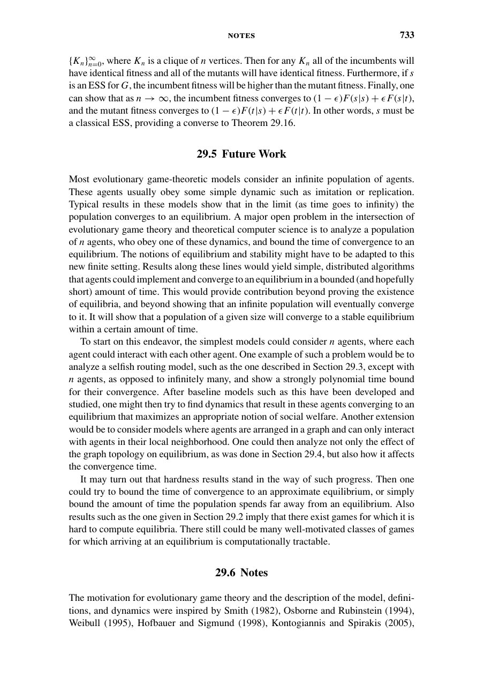

[Открыть страницу отдельно](../images/pages/p0754.jpg) · [Открыть страницу в PDF](../../materials/sources/Nisan-et-al-AGT-book.pdf#page=754)

Поисковый текст страницы (формулы сверяйте с изображением)

~~~~text
notes
733
{Kn}∞
n=0, where Kn is a clique of n vertices. Then for any Kn all of the incumbents will
have identical fitness and all of the mutants will have identical fitness. Furthermore, if s
is an ESS for G, the incumbent fitness will be higher than the mutant fitness. Finally, one
can show that as n →∞, the incumbent fitness converges to (1 −ϵ)F(s|s) + ϵF(s|t),
and the mutant fitness converges to (1 −ϵ)F(t|s) + ϵF(t|t). In other words, s must be
a classical ESS, providing a converse to Theorem 29.16.
29.5 Future Work
Most evolutionary game-theoretic models consider an infinite population of agents.
These agents usually obey some simple dynamic such as imitation or replication.
Typical results in these models show that in the limit (as time goes to infinity) the
population converges to an equilibrium. A major open problem in the intersection of
evolutionary game theory and theoretical computer science is to analyze a population
of n agents, who obey one of these dynamics, and bound the time of convergence to an
equilibrium. The notions of equilibrium and stability might have to be adapted to this
new finite setting. Results along these lines would yield simple, distributed algorithms
that agents could implement and converge to an equilibrium in a bounded (and hopefully
short) amount of time. This would provide contribution beyond proving the existence
of equilibria, and beyond showing that an infinite population will eventually converge
to it. It will show that a population of a given size will converge to a stable equilibrium
within a certain amount of time.
To start on this endeavor, the simplest models could consider n agents, where each
agent could interact with each other agent. One example of such a problem would be to
analyze a selfish routing model, such as the one described in Section 29.3, except with
n agents, as opposed to infinitely many, and show a strongly polynomial time bound
for their convergence. After baseline models such as this have been developed and
studied, one might then try to find dynamics that result in these agents converging to an
equilibrium that maximizes an appropriate notion of social welfare. Another extension
would be to consider models where agents are arranged in a graph and can only interact
with agents in their local neighborhood. One could then analyze not only the effect of
the graph topology on equilibrium, as was done in Section 29.4, but also how it affects
the convergence time.
It may turn out that hardness results stand in the way of such progress. Then one
could try to bound the time of convergence to an approximate equilibrium, or simply
bound the amount of time the population spends far away from an equilibrium. Also
results such as the one given in Section 29.2 imply that there exist games for which it is
hard to compute equilibria. There still could be many well-motivated classes of games
for which arriving at an equilibrium is computationally tractable.
29.6 Notes
The motivation for evolutionary game theory and the description of the model, defini-
tions, and dynamics were inspired by Smith (1982), Osborne and Rubinstein (1994),
Weibull (1995), Hofbauer and Sigmund (1998), Kontogiannis and Spirakis (2005),
~~~~

### PDF стр. 755 · книжная стр. 734

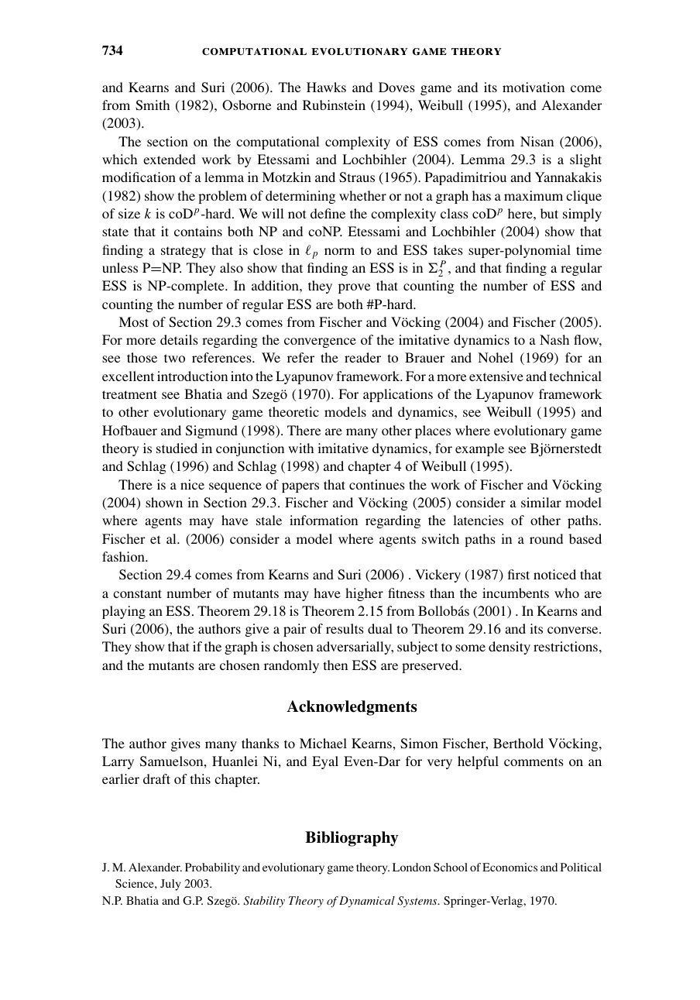

[Открыть страницу отдельно](../images/pages/p0755.jpg) · [Открыть страницу в PDF](../../materials/sources/Nisan-et-al-AGT-book.pdf#page=755)

Поисковый текст страницы (формулы сверяйте с изображением)

~~~~text
734
computational evolutionary game theory
and Kearns and Suri (2006). The Hawks and Doves game and its motivation come
from Smith (1982), Osborne and Rubinstein (1994), Weibull (1995), and Alexander
(2003).
The section on the computational complexity of ESS comes from Nisan (2006),
which extended work by Etessami and Lochbihler (2004). Lemma 29.3 is a slight
modification of a lemma in Motzkin and Straus (1965). Papadimitriou and Yannakakis
(1982) show the problem of determining whether or not a graph has a maximum clique
of size k is coDp-hard. We will not define the complexity class coDp here, but simply
state that it contains both NP and coNP. Etessami and Lochbihler (2004) show that
finding a strategy that is close in ℓp norm to and ESS takes super-polynomial time
unless P=NP. They also show that finding an ESS is in ⟦U+000B; см. снимок страницы⟧P
2 , and that finding a regular
ESS is NP-complete. In addition, they prove that counting the number of ESS and
counting the number of regular ESS are both #P-hard.
Most of Section 29.3 comes from Fischer and V¨ocking (2004) and Fischer (2005).
For more details regarding the convergence of the imitative dynamics to a Nash flow,
see those two references. We refer the reader to Brauer and Nohel (1969) for an
excellent introduction into the Lyapunov framework. For a more extensive and technical
treatment see Bhatia and Szeg¨o (1970). For applications of the Lyapunov framework
to other evolutionary game theoretic models and dynamics, see Weibull (1995) and
Hofbauer and Sigmund (1998). There are many other places where evolutionary game
theory is studied in conjunction with imitative dynamics, for example see Bj¨ornerstedt
and Schlag (1996) and Schlag (1998) and chapter 4 of Weibull (1995).
There is a nice sequence of papers that continues the work of Fischer and V¨ocking
(2004) shown in Section 29.3. Fischer and V¨ocking (2005) consider a similar model
where agents may have stale information regarding the latencies of other paths.
Fischer et al. (2006) consider a model where agents switch paths in a round based
fashion.
Section 29.4 comes from Kearns and Suri (2006) . Vickery (1987) first noticed that
a constant number of mutants may have higher fitness than the incumbents who are
playing an ESS. Theorem 29.18 is Theorem 2.15 from Bollob´as (2001) . In Kearns and
Suri (2006), the authors give a pair of results dual to Theorem 29.16 and its converse.
They show that if the graph is chosen adversarially, subject to some density restrictions,
and the mutants are chosen randomly then ESS are preserved.
Acknowledgments
The author gives many thanks to Michael Kearns, Simon Fischer, Berthold V¨ocking,
Larry Samuelson, Huanlei Ni, and Eyal Even-Dar for very helpful comments on an
earlier draft of this chapter.
Bibliography
J. M. Alexander. Probability and evolutionary game theory. London School of Economics and Political
Science, July 2003.
N.P. Bhatia and G.P. Szeg¨o. Stability Theory of Dynamical Systems. Springer-Verlag, 1970.
~~~~

### PDF стр. 756 · книжная стр. 735

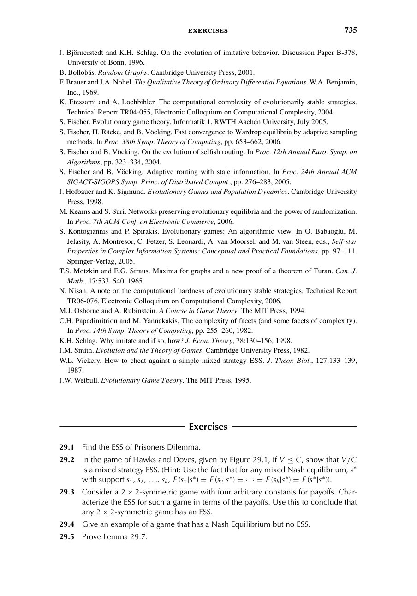

[Открыть страницу отдельно](../images/pages/p0756.jpg) · [Открыть страницу в PDF](../../materials/sources/Nisan-et-al-AGT-book.pdf#page=756)

Поисковый текст страницы (формулы сверяйте с изображением)

~~~~text
exercises
735
J. Bj¨ornerstedt and K.H. Schlag. On the evolution of imitative behavior. Discussion Paper B-378,
University of Bonn, 1996.
B. Bollob´as. Random Graphs. Cambridge University Press, 2001.
F. Brauer and J.A. Nohel. The Qualitative Theory of Ordinary Differential Equations. W.A. Benjamin,
Inc., 1969.
K. Etessami and A. Lochbihler. The computational complexity of evolutionarily stable strategies.
Technical Report TR04-055, Electronic Colloquium on Computational Complexity, 2004.
S. Fischer. Evolutionary game theory. Informatik 1, RWTH Aachen University, July 2005.
S. Fischer, H. R¨acke, and B. V¨ocking. Fast convergence to Wardrop equilibria by adaptive sampling
methods. In Proc. 38th Symp. Theory of Computing, pp. 653–662, 2006.
S. Fischer and B. V¨ocking. On the evolution of selfish routing. In Proc. 12th Annual Euro. Symp. on
Algorithms, pp. 323–334, 2004.
S. Fischer and B. V¨ocking. Adaptive routing with stale information. In Proc. 24th Annual ACM
SIGACT-SIGOPS Symp. Princ. of Distributed Comput., pp. 276–283, 2005.
J. Hofbauer and K. Sigmund. Evolutionary Games and Population Dynamics. Cambridge University
Press, 1998.
M. Kearns and S. Suri. Networks preserving evolutionary equilibria and the power of randomization.
In Proc. 7th ACM Conf. on Electronic Commerce, 2006.
S. Kontogiannis and P. Spirakis. Evolutionary games: An algorithmic view. In O. Babaoglu, M.
Jelasity, A. Montresor, C. Fetzer, S. Leonardi, A. van Moorsel, and M. van Steen, eds., Self-star
Properties in Complex Information Systems: Conceptual and Practical Foundations, pp. 97–111.
Springer-Verlag, 2005.
T.S. Motzkin and E.G. Straus. Maxima for graphs and a new proof of a theorem of Turan. Can. J.
Math., 17:533–540, 1965.
N. Nisan. A note on the computational hardness of evolutionary stable strategies. Technical Report
TR06-076, Electronic Colloquium on Computational Complexity, 2006.
M.J. Osborne and A. Rubinstein. A Course in Game Theory. The MIT Press, 1994.
C.H. Papadimitriou and M. Yannakakis. The complexity of facets (and some facets of complexity).
In Proc. 14th Symp. Theory of Computing, pp. 255–260, 1982.
K.H. Schlag. Why imitate and if so, how? J. Econ. Theory, 78:130–156, 1998.
J.M. Smith. Evolution and the Theory of Games. Cambridge University Press, 1982.
W.L. Vickery. How to cheat against a simple mixed strategy ESS. J. Theor. Biol., 127:133–139,
1987.
J.W. Weibull. Evolutionary Game Theory. The MIT Press, 1995.
Exercises
29.1
Find the ESS of Prisoners Dilemma.
29.2
In the game of Hawks and Doves, given by Figure 29.1, if V ≤C, show that V/C
is a mixed strategy ESS. (Hint: Use the fact that for any mixed Nash equilibrium, s∗
with support s1, s2, . . ., sk, F (s1|s∗) = F (s2|s∗) = · · · = F (sk|s∗) = F (s∗|s∗)).
29.3
Consider a 2 × 2-symmetric game with four arbitrary constants for payoffs. Char-
acterize the ESS for such a game in terms of the payoffs. Use this to conclude that
any 2 × 2-symmetric game has an ESS.
29.4
Give an example of a game that has a Nash Equilibrium but no ESS.
29.5
Prove Lemma 29.7.
~~~~

### PDF стр. 757 · книжная стр. 736

[Открыть страницу отдельно](../images/pages/p0757.jpg) · [Открыть страницу в PDF](../../materials/sources/Nisan-et-al-AGT-book.pdf#page=757)

Поисковый текст страницы (формулы сверяйте с изображением)

~~~~text
736
computational evolutionary game theory
29.6
Show that ⟦U+0002; см. снимок страницы⟧
p∈P x′
p = 0, where x′
p is defined by Equation 29.2. Using this, conclude
that if, in the selfish routing model of Section 29.3, the imitative dynamics initially
start with a feasible flow, then for all time the flow remains feasible.
29.7
Show that there exists a game such that with high probability for a family of random
graphs with p = ⟦U+0001; см. снимок страницы⟧(1/nc) and 0 ≤c < 1, an adversary can construct a mutant set
such that there will exist at least one mutant with higher fitness than all of its
incumbent neighbors.
~~~~

