# Предметный указатель

**PDF-страницы:** 758–775. Изображения передают исходную страницу; извлечённый текст ниже нужен для поиска.
[К содержанию](../README.md) · [К полному файлу](../00_full_book.md)

### PDF стр. 758 · книжная стр. 737

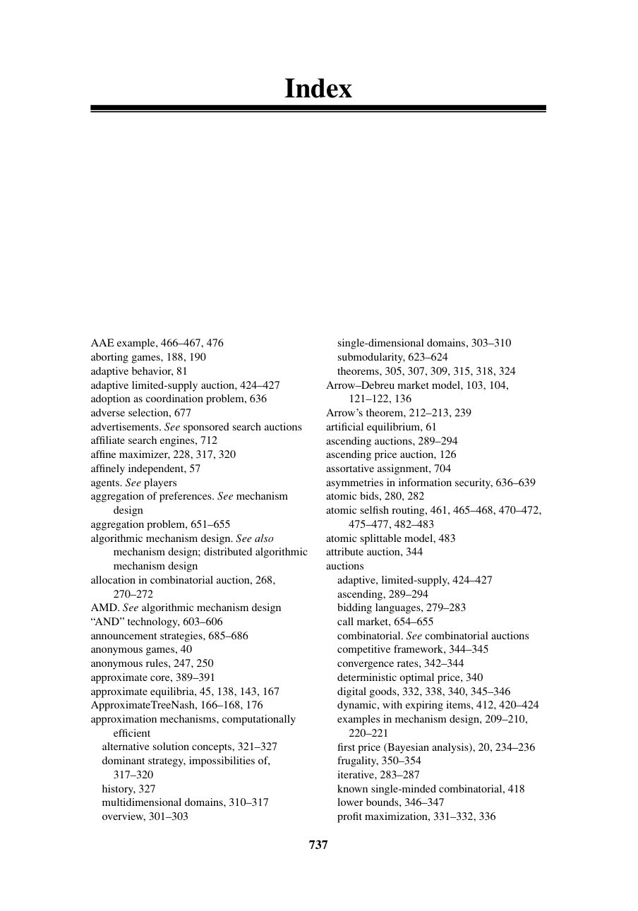

[Открыть страницу отдельно](../images/pages/p0758.jpg) · [Открыть страницу в PDF](../../materials/sources/Nisan-et-al-AGT-book.pdf#page=758)

Поисковый текст страницы (формулы сверяйте с изображением)

~~~~text
Index
AAE example, 466–467, 476
aborting games, 188, 190
adaptive behavior, 81
adaptive limited-supply auction, 424–427
adoption as coordination problem, 636
adverse selection, 677
advertisements. See sponsored search auctions
affiliate search engines, 712
affine maximizer, 228, 317, 320
affinely independent, 57
agents. See players
aggregation of preferences. See mechanism
design
aggregation problem, 651–655
algorithmic mechanism design. See also
mechanism design; distributed algorithmic
mechanism design
allocation in combinatorial auction, 268,
270–272
AMD. See algorithmic mechanism design
“AND” technology, 603–606
announcement strategies, 685–686
anonymous games, 40
anonymous rules, 247, 250
approximate core, 389–391
approximate equilibria, 45, 138, 143, 167
ApproximateTreeNash, 166–168, 176
approximation mechanisms, computationally
efficient
alternative solution concepts, 321–327
dominant strategy, impossibilities of,
317–320
history, 327
multidimensional domains, 310–317
overview, 301–303
single-dimensional domains, 303–310
submodularity, 623–624
theorems, 305, 307, 309, 315, 318, 324
Arrow–Debreu market model, 103, 104,
121–122, 136
Arrow’s theorem, 212–213, 239
artificial equilibrium, 61
ascending auctions, 289–294
ascending price auction, 126
assortative assignment, 704
asymmetries in information security, 636–639
atomic bids, 280, 282
atomic selfish routing, 461, 465–468, 470–472,
475–477, 482–483
atomic splittable model, 483
attribute auction, 344
auctions
adaptive, limited-supply, 424–427
ascending, 289–294
bidding languages, 279–283
call market, 654–655
combinatorial. See combinatorial auctions
competitive framework, 344–345
convergence rates, 342–344
deterministic optimal price, 340
digital goods, 332, 338, 340, 345–346
dynamic, with expiring items, 412, 420–424
examples in mechanism design, 209–210,
220–221
first price (Bayesian analysis), 20, 234–236
frugality, 350–354
iterative, 283–287
known single-minded combinatorial, 418
lower bounds, 346–347
profit maximization, 331–332, 336
737
~~~~

### PDF стр. 759 · книжная стр. 738

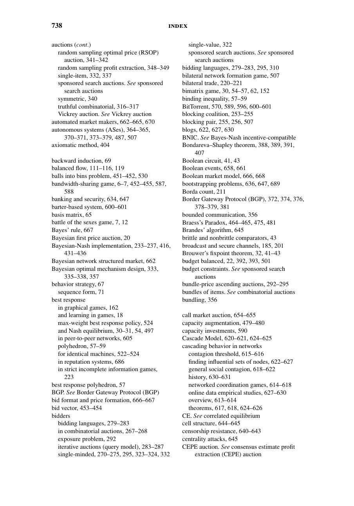

[Открыть страницу отдельно](../images/pages/p0759.jpg) · [Открыть страницу в PDF](../../materials/sources/Nisan-et-al-AGT-book.pdf#page=759)

Поисковый текст страницы (формулы сверяйте с изображением)

~~~~text
738
index
auctions (cont.)
random sampling optimal price (RSOP)
auction, 341–342
random sampling profit extraction, 348–349
single-item, 332, 337
sponsored search auctions. See sponsored
search auctions
symmetric, 340
truthful combinatorial, 316–317
Vickrey auction. See Vickrey auction
automated market makers, 662–665, 670
autonomous systems (ASes), 364–365,
370–371, 373–379, 487, 507
axiomatic method, 404
backward induction, 69
balanced flow, 111–116, 119
balls into bins problem, 451–452, 530
bandwidth-sharing game, 6–7, 452–455, 587,
588
banking and security, 634, 647
barter-based system, 600–601
basis matrix, 65
battle of the sexes game, 7, 12
Bayes’ rule, 667
Bayesian first price auction, 20
Bayesian-Nash implementation, 233–237, 416,
431–436
Bayesian network structured market, 662
Bayesian optimal mechanism design, 333,
335–338, 357
behavior strategy, 67
sequence form, 71
best response
in graphical games, 162
and learning in games, 18
max-weight best response policy, 524
and Nash equilibrium, 30–31, 54, 497
in peer-to-peer networks, 605
polyhedron, 57–59
for identical machines, 522–524
in reputation systems, 686
in strict incomplete information games,
223
best response polyhedron, 57
BGP. See Border Gateway Protocol (BGP)
bid format and price formation, 666–667
bid vector, 453–454
bidders
bidding languages, 279–283
in combinatorial auctions, 267–268
exposure problem, 292
iterative auctions (query model), 283–287
single-minded, 270–275, 295, 323–324, 332
single-value, 322
sponsored search auctions. See sponsored
search auctions
bidding languages, 279–283, 295, 310
bilateral network formation game, 507
bilateral trade, 220–221
bimatrix game, 30, 54–57, 62, 152
binding inequality, 57–59
BitTorrent, 570, 589, 596, 600–601
blocking coalition, 253–255
blocking pair, 255, 256, 507
blogs, 622, 627, 630
BNIC. See Bayes-Nash incentive-compatible
Bondareva–Shapley theorem, 388, 389, 391,
407
Boolean circuit, 41, 43
Boolean events, 658, 661
Boolean market model, 666, 668
bootstrapping problems, 636, 647, 689
Borda count, 211
Border Gateway Protocol (BGP), 372, 374, 376,
378–379, 381
bounded communication, 356
Braess’s Paradox, 464–465, 475, 481
Brandes’ algorithm, 645
brittle and nonbrittle comparators, 43
broadcast and secure channels, 185, 201
Brouwer’s fixpoint theorem, 32, 41–43
budget balanced, 22, 392, 393, 501
budget constraints. See sponsored search
auctions
bundle-price ascending auctions, 292–295
bundles of items. See combinatorial auctions
bundling, 356
call market auction, 654–655
capacity augmentation, 479–480
capacity investments, 590
Cascade Model, 620–621, 624–625
cascading behavior in networks
contagion threshold, 615–616
finding influential sets of nodes, 622–627
general social contagion, 618–622
history, 630–631
networked coordination games, 614–618
online data empirical studies, 627–630
overview, 613–614
theorems, 617, 618, 624–626
CE. See correlated equilibrium
cell structure, 644–645
censorship resistance, 640–643
centrality attacks, 645
CEPE auction. See consensus estimate profit
extraction (CEPE) auction
~~~~

### PDF стр. 760 · книжная стр. 739

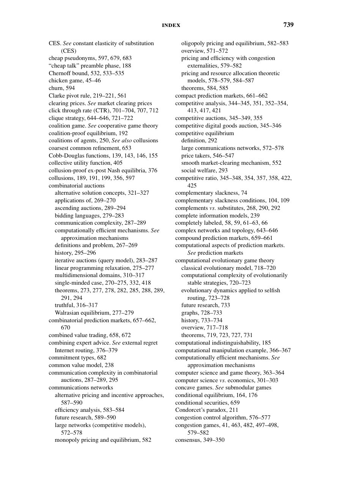

[Открыть страницу отдельно](../images/pages/p0760.jpg) · [Открыть страницу в PDF](../../materials/sources/Nisan-et-al-AGT-book.pdf#page=760)

Поисковый текст страницы (формулы сверяйте с изображением)

~~~~text
index
739
CES. See constant elasticity of substitution
(CES)
cheap pseudonyms, 597, 679, 683
“cheap talk” preamble phase, 188
Chernoff bound, 532, 533–535
chicken game, 45–46
churn, 594
Clarke pivot rule, 219–221, 561
clearing prices. See market clearing prices
click through rate (CTR), 701–704, 707, 712
clique strategy, 644–646, 721–722
coalition game. See cooperative game theory
coalition-proof equilibrium, 192
coalitions of agents, 250, See also collusions
coarsest common refinement, 653
Cobb-Douglas functions, 139, 143, 146, 155
collective utility function, 405
collusion-proof ex-post Nash equilibria, 376
collusions, 189, 191, 199, 356, 597
combinatorial auctions
alternative solution concepts, 321–327
applications of, 269–270
ascending auctions, 289–294
bidding languages, 279–283
communication complexity, 287–289
computationally efficient mechanisms. See
approximation mechanisms
definitions and problem, 267–269
history, 295–296
iterative auctions (query model), 283–287
linear programming relaxation, 275–277
multidimensional domains, 310–317
single-minded case, 270–275, 332, 418
theorems, 273, 277, 278, 282, 285, 288, 289,
291, 294
truthful, 316–317
Walrasian equilibrium, 277–279
combinatorial prediction markets, 657–662,
670
combined value trading, 658, 672
combining expert advice. See external regret
Internet routing, 376–379
commitment types, 682
common value model, 238
communication complexity in combinatorial
auctions, 287–289, 295
communications networks
alternative pricing and incentive approaches,
587–590
efficiency analysis, 583–584
future research, 589–590
large networks (competitive models),
572–578
monopoly pricing and equilibrium, 582
oligopoly pricing and equilibrium, 582–583
overview, 571–572
pricing and efficiency with congestion
externalities, 579–582
pricing and resource allocation theoretic
models, 578–579, 584–587
theorems, 584, 585
compact prediction markets, 661–662
competitive analysis, 344–345, 351, 352–354,
413, 417, 421
competitive auctions, 345–349, 355
competitive digital goods auction, 345–346
competitive equilibrium
definition, 292
large communications networks, 572–578
price takers, 546–547
smooth market-clearing mechanism, 552
social welfare, 293
competitive ratio, 345–348, 354, 357, 358, 422,
425
complementary slackness, 74
complementary slackness conditions, 104, 109
complements vs. substitutes, 268, 290, 292
complete information models, 239
completely labeled, 58, 59, 61–63, 66
complex networks and topology, 643–646
compound prediction markets, 659–661
computational aspects of prediction markets.
See prediction markets
computational evolutionary game theory
classical evolutionary model, 718–720
computational complexity of evolutionarily
stable strategies, 720–723
evolutionary dynamics applied to selfish
routing, 723–728
future research, 733
graphs, 728–733
history, 733–734
overview, 717–718
theorems, 719, 723, 727, 731
computational indistinguishability, 185
computational manipulation example, 366–367
computationally efficient mechanisms. See
approximation mechanisms
computer science and game theory, 363–364
computer science vs. economics, 301–303
concave games. See submodular games
conditional equilibrium, 164, 176
conditional securities, 659
Condorcet’s paradox, 211
congestion control algorithm, 576–577
congestion games, 41, 463, 482, 497–498,
579–582
consensus, 349–350
~~~~

### PDF стр. 761 · книжная стр. 740

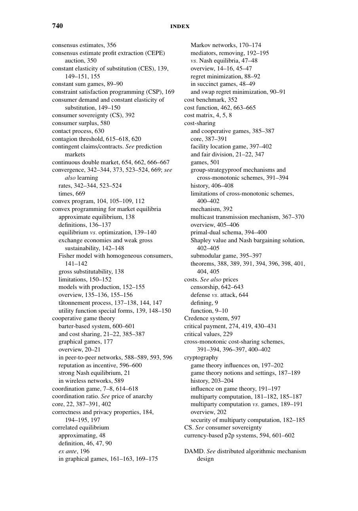

[Открыть страницу отдельно](../images/pages/p0761.jpg) · [Открыть страницу в PDF](../../materials/sources/Nisan-et-al-AGT-book.pdf#page=761)

Поисковый текст страницы (формулы сверяйте с изображением)

~~~~text
740
index
consensus estimates, 356
consensus estimate profit extraction (CEPE)
auction, 350
constant elasticity of substitution (CES), 139,
149–151, 155
constant sum games, 89–90
constraint satisfaction programming (CSP), 169
consumer demand and constant elasticity of
substitution, 149–150
consumer sovereignty (CS), 392
consumer surplus, 580
contact process, 630
contagion threshold, 615–618, 620
contingent claims/contracts. See prediction
markets
continuous double market, 654, 662, 666–667
convergence, 342–344, 373, 523–524, 669; see
also learning
rates, 342–344, 523–524
times, 669
convex program, 104, 105–109, 112
convex programming for market equilibria
approximate equilibrium, 138
definitions, 136–137
equilibrium vs. optimization, 139–140
exchange economies and weak gross
sustainability, 142–148
Fisher model with homogeneous consumers,
141–142
gross substitutability, 138
limitations, 150–152
models with production, 152–155
overview, 135–136, 155–156
tˆatonnement process, 137–138, 144, 147
utility function special forms, 139, 148–150
cooperative game theory
barter-based system, 600–601
and cost sharing, 21–22, 385–387
graphical games, 177
overview, 20–21
in peer-to-peer networks, 588–589, 593, 596
reputation as incentive, 596–600
strong Nash equilibrium, 21
in wireless networks, 589
coordination game, 7–8, 614–618
coordination ratio. See price of anarchy
core, 22, 387–391, 402
correctness and privacy properties, 184,
194–195, 197
correlated equilibrium
approximating, 48
definition, 46, 47, 90
ex ante, 196
in graphical games, 161–163, 169–175
Markov networks, 170–174
mediators, removing, 192–195
vs. Nash equilibria, 47–48
overview, 14–16, 45–47
regret minimization, 88–92
in succinct games, 48–49
and swap regret minimization, 90–91
cost benchmark, 352
cost function, 462, 663–665
cost matrix, 4, 5, 8
cost-sharing
and cooperative games, 385–387
core, 387–391
facility location game, 397–402
and fair division, 21–22, 347
games, 501
group-strategyproof mechanisms and
cross-monotonic schemes, 391–394
history, 406–408
limitations of cross-monotonic schemes,
400–402
mechanism, 392
multicast transmission mechanism, 367–370
overview, 405–406
primal-dual schema, 394–400
Shapley value and Nash bargaining solution,
402–405
submodular game, 395–397
theorems, 388, 389, 391, 394, 396, 398, 401,
404, 405
costs. See also prices
censorship, 642–643
defense vs. attack, 644
defining, 9
function, 9–10
Credence system, 597
critical payment, 274, 419, 430–431
critical values, 229
cross-monotonic cost-sharing schemes,
391–394, 396–397, 400–402
cryptography
game theory influences on, 197–202
game theory notions and settings, 187–189
history, 203–204
influence on game theory, 191–197
multiparty computation, 181–182, 185–187
multiparty computation vs. games, 189–191
overview, 202
security of multiparty computation, 182–185
CS. See consumer sovereignty
currency-based p2p systems, 594, 601–602
DAMD. See distributed algorithmic mechanism
design
~~~~

### PDF стр. 762 · книжная стр. 741

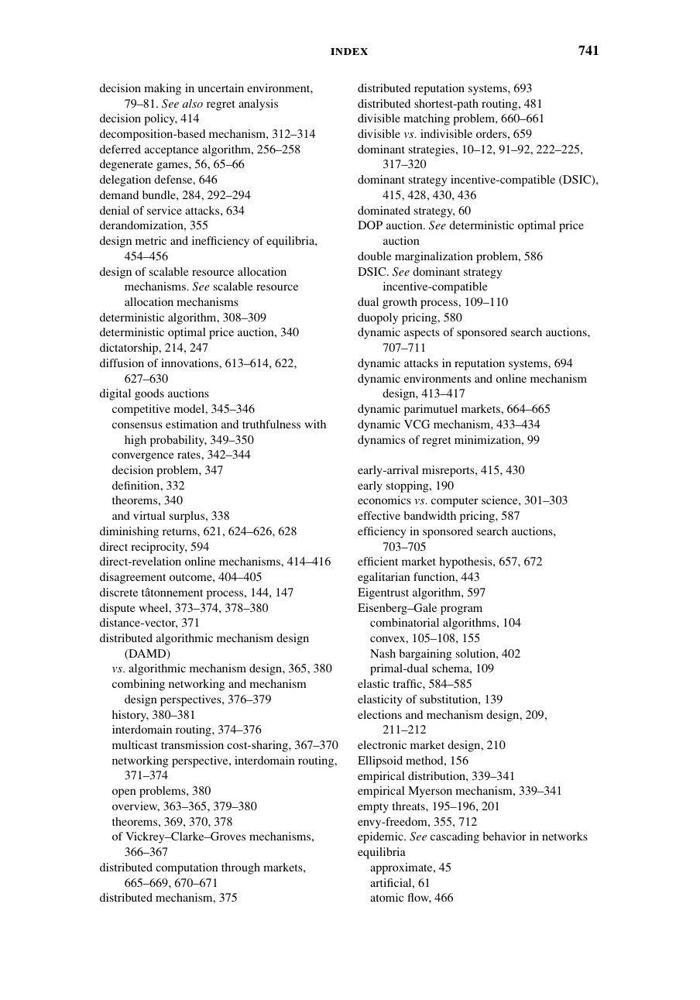

[Открыть страницу отдельно](../images/pages/p0762.jpg) · [Открыть страницу в PDF](../../materials/sources/Nisan-et-al-AGT-book.pdf#page=762)

Поисковый текст страницы (формулы сверяйте с изображением)

~~~~text
index
741
decision making in uncertain environment,
79–81. See also regret analysis
decision policy, 414
decomposition-based mechanism, 312–314
deferred acceptance algorithm, 256–258
degenerate games, 56, 65–66
delegation defense, 646
demand bundle, 284, 292–294
denial of service attacks, 634
derandomization, 355
design metric and inefficiency of equilibria,
454–456
design of scalable resource allocation
mechanisms. See scalable resource
allocation mechanisms
deterministic algorithm, 308–309
deterministic optimal price auction, 340
dictatorship, 214, 247
diffusion of innovations, 613–614, 622,
627–630
digital goods auctions
competitive model, 345–346
consensus estimation and truthfulness with
high probability, 349–350
convergence rates, 342–344
decision problem, 347
definition, 332
theorems, 340
and virtual surplus, 338
diminishing returns, 621, 624–626, 628
direct reciprocity, 594
direct-revelation online mechanisms, 414–416
disagreement outcome, 404–405
discrete tˆatonnement process, 144, 147
dispute wheel, 373–374, 378–380
distance-vector, 371
distributed algorithmic mechanism design
(DAMD)
vs. algorithmic mechanism design, 365, 380
combining networking and mechanism
design perspectives, 376–379
history, 380–381
interdomain routing, 374–376
multicast transmission cost-sharing, 367–370
networking perspective, interdomain routing,
371–374
open problems, 380
overview, 363–365, 379–380
theorems, 369, 370, 378
of Vickrey–Clarke–Groves mechanisms,
366–367
distributed computation through markets,
665–669, 670–671
distributed mechanism, 375
distributed reputation systems, 693
distributed shortest-path routing, 481
divisible matching problem, 660–661
divisible vs. indivisible orders, 659
dominant strategies, 10–12, 91–92, 222–225,
317–320
dominant strategy incentive-compatible (DSIC),
415, 428, 430, 436
dominated strategy, 60
DOP auction. See deterministic optimal price
auction
double marginalization problem, 586
DSIC. See dominant strategy
incentive-compatible
dual growth process, 109–110
duopoly pricing, 580
dynamic aspects of sponsored search auctions,
707–711
dynamic attacks in reputation systems, 694
dynamic environments and online mechanism
design, 413–417
dynamic parimutuel markets, 664–665
dynamic VCG mechanism, 433–434
dynamics of regret minimization, 99
early-arrival misreports, 415, 430
early stopping, 190
economics vs. computer science, 301–303
effective bandwidth pricing, 587
efficiency in sponsored search auctions,
703–705
efficient market hypothesis, 657, 672
egalitarian function, 443
Eigentrust algorithm, 597
Eisenberg–Gale program
combinatorial algorithms, 104
convex, 105–108, 155
Nash bargaining solution, 402
primal-dual schema, 109
elastic traffic, 584–585
elasticity of substitution, 139
elections and mechanism design, 209,
211–212
electronic market design, 210
Ellipsoid method, 156
empirical distribution, 339–341
empirical Myerson mechanism, 339–341
empty threats, 195–196, 201
envy-freedom, 355, 712
epidemic. See cascading behavior in networks
equilibria
approximate, 45
artificial, 61
atomic flow, 466
~~~~

### PDF стр. 763 · книжная стр. 742

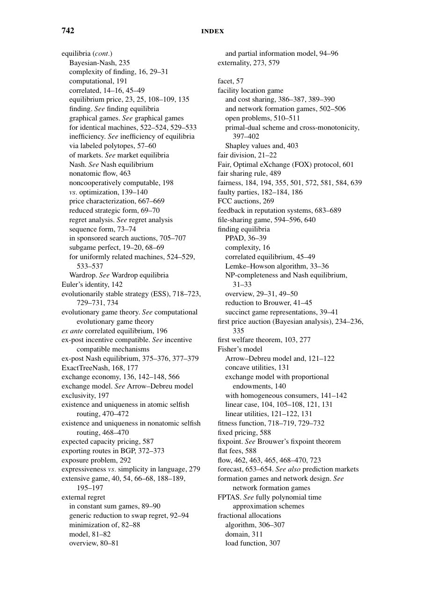

[Открыть страницу отдельно](../images/pages/p0763.jpg) · [Открыть страницу в PDF](../../materials/sources/Nisan-et-al-AGT-book.pdf#page=763)

Поисковый текст страницы (формулы сверяйте с изображением)

~~~~text
742
index
equilibria (cont.)
Bayesian-Nash, 235
complexity of finding, 16, 29–31
computational, 191
correlated, 14–16, 45–49
equilibrium price, 23, 25, 108–109, 135
finding. See finding equilibria
graphical games. See graphical games
for identical machines, 522–524, 529–533
inefficiency. See inefficiency of equilibria
via labeled polytopes, 57–60
of markets. See market equilibria
Nash. See Nash equilibrium
nonatomic flow, 463
noncooperatively computable, 198
vs. optimization, 139–140
price characterization, 667–669
reduced strategic form, 69–70
regret analysis. See regret analysis
sequence form, 73–74
in sponsored search auctions, 705–707
subgame perfect, 19–20, 68–69
for uniformly related machines, 524–529,
533–537
Wardrop. See Wardrop equilibria
Euler’s identity, 142
evolutionarily stable strategy (ESS), 718–723,
729–731, 734
evolutionary game theory. See computational
evolutionary game theory
ex ante correlated equilibrium, 196
ex-post incentive compatible. See incentive
compatible mechanisms
ex-post Nash equilibrium, 375–376, 377–379
ExactTreeNash, 168, 177
exchange economy, 136, 142–148, 566
exchange model. See Arrow–Debreu model
exclusivity, 197
existence and uniqueness in atomic selfish
routing, 470–472
existence and uniqueness in nonatomic selfish
routing, 468–470
expected capacity pricing, 587
exporting routes in BGP, 372–373
exposure problem, 292
expressiveness vs. simplicity in language, 279
extensive game, 40, 54, 66–68, 188–189,
195–197
external regret
in constant sum games, 89–90
generic reduction to swap regret, 92–94
minimization of, 82–88
model, 81–82
overview, 80–81
and partial information model, 94–96
externality, 273, 579
facet, 57
facility location game
and cost sharing, 386–387, 389–390
and network formation games, 502–506
open problems, 510–511
primal-dual scheme and cross-monotonicity,
397–402
Shapley values and, 403
fair division, 21–22
Fair, Optimal eXchange (FOX) protocol, 601
fair sharing rule, 489
fairness, 184, 194, 355, 501, 572, 581, 584, 639
faulty parties, 182–184, 186
FCC auctions, 269
feedback in reputation systems, 683–689
file-sharing game, 594–596, 640
finding equilibria
PPAD, 36–39
complexity, 16
correlated equilibrium, 45–49
Lemke–Howson algorithm, 33–36
NP-completeness and Nash equilibrium,
31–33
overview, 29–31, 49–50
reduction to Brouwer, 41–45
succinct game representations, 39–41
first price auction (Bayesian analysis), 234–236,
335
first welfare theorem, 103, 277
Fisher’s model
Arrow–Debreu model and, 121–122
concave utilities, 131
exchange model with proportional
endowments, 140
with homogeneous consumers, 141–142
linear case, 104, 105–108, 121, 131
linear utilities, 121–122, 131
fitness function, 718–719, 729–732
fixed pricing, 588
fixpoint. See Brouwer’s fixpoint theorem
flat fees, 588
flow, 462, 463, 465, 468–470, 723
forecast, 653–654. See also prediction markets
formation games and network design. See
network formation games
FPTAS. See fully polynomial time
approximation schemes
fractional allocations
algorithm, 306–307
domain, 311
load function, 307
~~~~

### PDF стр. 764 · книжная стр. 743

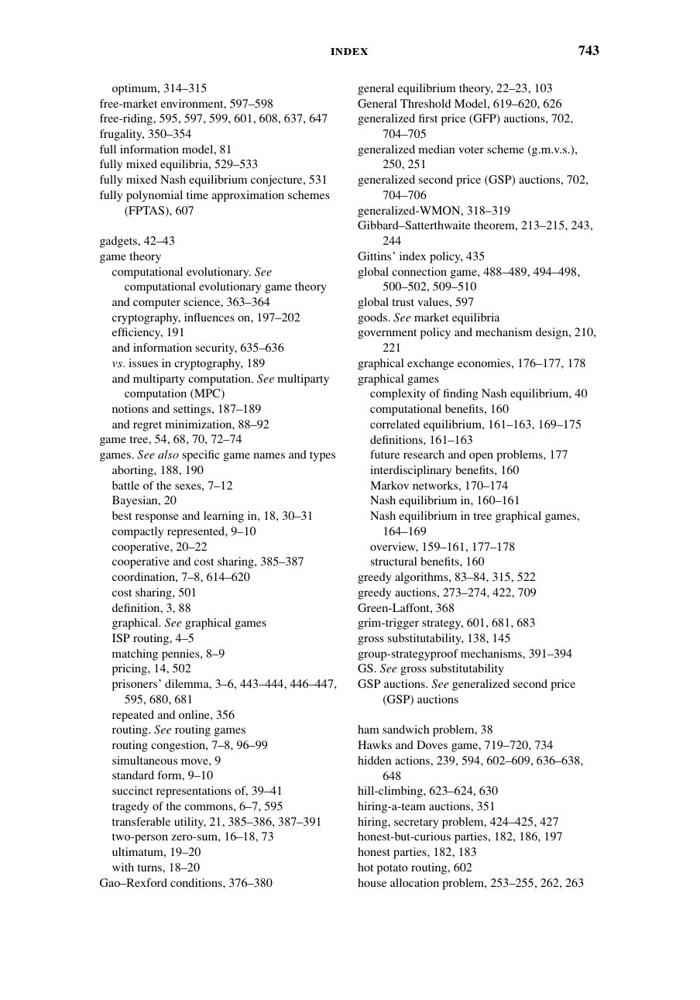

[Открыть страницу отдельно](../images/pages/p0764.jpg) · [Открыть страницу в PDF](../../materials/sources/Nisan-et-al-AGT-book.pdf#page=764)

Поисковый текст страницы (формулы сверяйте с изображением)

~~~~text
index
743
optimum, 314–315
free-market environment, 597–598
free-riding, 595, 597, 599, 601, 608, 637, 647
frugality, 350–354
full information model, 81
fully mixed equilibria, 529–533
fully mixed Nash equilibrium conjecture, 531
fully polynomial time approximation schemes
(FPTAS), 607
gadgets, 42–43
game theory
computational evolutionary. See
computational evolutionary game theory
and computer science, 363–364
cryptography, influences on, 197–202
efficiency, 191
and information security, 635–636
vs. issues in cryptography, 189
and multiparty computation. See multiparty
computation (MPC)
notions and settings, 187–189
and regret minimization, 88–92
game tree, 54, 68, 70, 72–74
games. See also specific game names and types
aborting, 188, 190
battle of the sexes, 7–12
Bayesian, 20
best response and learning in, 18, 30–31
compactly represented, 9–10
cooperative, 20–22
cooperative and cost sharing, 385–387
coordination, 7–8, 614–620
cost sharing, 501
definition, 3, 88
graphical. See graphical games
ISP routing, 4–5
matching pennies, 8–9
pricing, 14, 502
prisoners’ dilemma, 3–6, 443–444, 446–447,
595, 680, 681
repeated and online, 356
routing. See routing games
routing congestion, 7–8, 96–99
simultaneous move, 9
standard form, 9–10
succinct representations of, 39–41
tragedy of the commons, 6–7, 595
transferable utility, 21, 385–386, 387–391
two-person zero-sum, 16–18, 73
ultimatum, 19–20
with turns, 18–20
Gao–Rexford conditions, 376–380
general equilibrium theory, 22–23, 103
General Threshold Model, 619–620, 626
generalized first price (GFP) auctions, 702,
704–705
generalized median voter scheme (g.m.v.s.),
250, 251
generalized second price (GSP) auctions, 702,
704–706
generalized-WMON, 318–319
Gibbard–Satterthwaite theorem, 213–215, 243,
244
Gittins’ index policy, 435
global connection game, 488–489, 494–498,
500–502, 509–510
global trust values, 597
goods. See market equilibria
government policy and mechanism design, 210,
221
graphical exchange economies, 176–177, 178
graphical games
complexity of finding Nash equilibrium, 40
computational benefits, 160
correlated equilibrium, 161–163, 169–175
definitions, 161–163
future research and open problems, 177
interdisciplinary benefits, 160
Markov networks, 170–174
Nash equilibrium in, 160–161
Nash equilibrium in tree graphical games,
164–169
overview, 159–161, 177–178
structural benefits, 160
greedy algorithms, 83–84, 315, 522
greedy auctions, 273–274, 422, 709
Green-Laffont, 368
grim-trigger strategy, 601, 681, 683
gross substitutability, 138, 145
group-strategyproof mechanisms, 391–394
GS. See gross substitutability
GSP auctions. See generalized second price
(GSP) auctions
ham sandwich problem, 38
Hawks and Doves game, 719–720, 734
hidden actions, 239, 594, 602–609, 636–638,
648
hill-climbing, 623–624, 630
hiring-a-team auctions, 351
hiring, secretary problem, 424–425, 427
honest-but-curious parties, 182, 186, 197
honest parties, 182, 183
hot potato routing, 602
house allocation problem, 253–255, 262, 263
~~~~

### PDF стр. 765 · книжная стр. 744

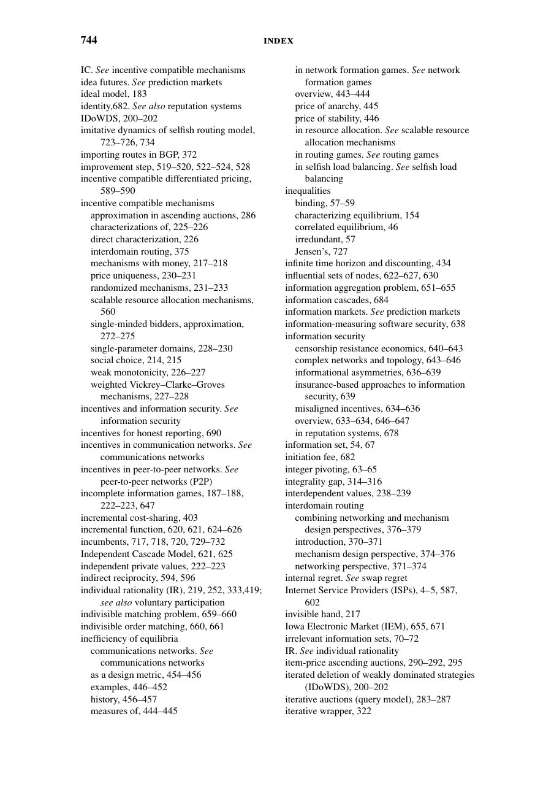

[Открыть страницу отдельно](../images/pages/p0765.jpg) · [Открыть страницу в PDF](../../materials/sources/Nisan-et-al-AGT-book.pdf#page=765)

Поисковый текст страницы (формулы сверяйте с изображением)

~~~~text
744
index
IC. See incentive compatible mechanisms
idea futures. See prediction markets
ideal model, 183
identity,682. See also reputation systems
IDoWDS, 200–202
imitative dynamics of selfish routing model,
723–726, 734
importing routes in BGP, 372
improvement step, 519–520, 522–524, 528
incentive compatible differentiated pricing,
589–590
incentive compatible mechanisms
approximation in ascending auctions, 286
characterizations of, 225–226
direct characterization, 226
interdomain routing, 375
mechanisms with money, 217–218
price uniqueness, 230–231
randomized mechanisms, 231–233
scalable resource allocation mechanisms,
560
single-minded bidders, approximation,
272–275
single-parameter domains, 228–230
social choice, 214, 215
weak monotonicity, 226–227
weighted Vickrey–Clarke–Groves
mechanisms, 227–228
incentives and information security. See
information security
incentives for honest reporting, 690
incentives in communication networks. See
communications networks
incentives in peer-to-peer networks. See
peer-to-peer networks (P2P)
incomplete information games, 187–188,
222–223, 647
incremental cost-sharing, 403
incremental function, 620, 621, 624–626
incumbents, 717, 718, 720, 729–732
Independent Cascade Model, 621, 625
independent private values, 222–223
indirect reciprocity, 594, 596
individual rationality (IR), 219, 252, 333,419;
see also voluntary participation
indivisible matching problem, 659–660
indivisible order matching, 660, 661
inefficiency of equilibria
communications networks. See
communications networks
as a design metric, 454–456
examples, 446–452
history, 456–457
measures of, 444–445
in network formation games. See network
formation games
overview, 443–444
price of anarchy, 445
price of stability, 446
in resource allocation. See scalable resource
allocation mechanisms
in routing games. See routing games
in selfish load balancing. See selfish load
balancing
inequalities
binding, 57–59
characterizing equilibrium, 154
correlated equilibrium, 46
irredundant, 57
Jensen’s, 727
infinite time horizon and discounting, 434
influential sets of nodes, 622–627, 630
information aggregation problem, 651–655
information cascades, 684
information markets. See prediction markets
information-measuring software security, 638
information security
censorship resistance economics, 640–643
complex networks and topology, 643–646
informational asymmetries, 636–639
insurance-based approaches to information
security, 639
misaligned incentives, 634–636
overview, 633–634, 646–647
in reputation systems, 678
information set, 54, 67
initiation fee, 682
integer pivoting, 63–65
integrality gap, 314–316
interdependent values, 238–239
interdomain routing
combining networking and mechanism
design perspectives, 376–379
introduction, 370–371
mechanism design perspective, 374–376
networking perspective, 371–374
internal regret. See swap regret
Internet Service Providers (ISPs), 4–5, 587,
602
invisible hand, 217
Iowa Electronic Market (IEM), 655, 671
irrelevant information sets, 70–72
IR. See individual rationality
item-price ascending auctions, 290–292, 295
iterated deletion of weakly dominated strategies
(IDoWDS), 200–202
iterative auctions (query model), 283–287
iterative wrapper, 322
~~~~

### PDF стр. 766 · книжная стр. 745

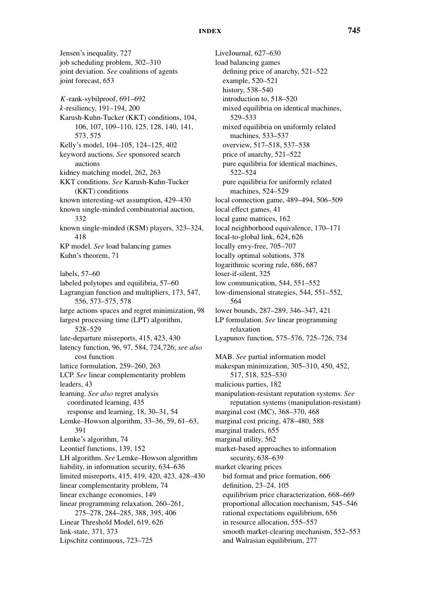

[Открыть страницу отдельно](../images/pages/p0766.jpg) · [Открыть страницу в PDF](../../materials/sources/Nisan-et-al-AGT-book.pdf#page=766)

Поисковый текст страницы (формулы сверяйте с изображением)

~~~~text
index
745
Jensen’s inequality, 727
job scheduling problem, 302–310
joint deviation. See coalitions of agents
joint forecast, 653
K-rank-sybilproof, 691–692
k-resiliency, 191–194, 200
Karush-Kuhn-Tucker (KKT) conditions, 104,
106, 107, 109–110, 125, 128, 140, 141,
573, 575
Kelly’s model, 104–105, 124–125, 402
keyword auctions. See sponsored search
auctions
kidney matching model, 262, 263
KKT conditions. See Karush-Kuhn-Tucker
(KKT) conditions
known interesting-set assumption, 429–430
known single-minded combinatorial auction,
332
known single-minded (KSM) players, 323–324,
418
KP model. See load balancing games
Kuhn’s theorem, 71
labels, 57–60
labeled polytopes and equilibria, 57–60
Lagrangian function and multipliers, 173, 547,
556, 573–575, 578
large actions spaces and regret minimization, 98
largest processing time (LPT) algorithm,
528–529
late-departure misreports, 415, 423, 430
latency function, 96, 97, 584, 724,726; see also
cost function
lattice formulation, 259–260, 263
LCP. See linear complementarity problem
leaders, 43
learning. See also regret analysis
coordinated learning, 435
response and learning, 18, 30–31, 54
Lemke–Howson algorithm, 33–36, 59, 61–63,
391
Lemke’s algorithm, 74
Leontief functions, 139, 152
LH algorithm. See Lemke–Howson algorithm
liability, in information security, 634–636
limited misreports, 415, 419, 420, 423, 428–430
linear complementarity problem, 74
linear exchange economies, 149
linear programming relaxation, 260–261,
275–278, 284–285, 388, 395, 406
Linear Threshold Model, 619, 626
link-state, 371, 373
Lipschitz continuous, 723–725
LiveJournal, 627–630
load balancing games
defining price of anarchy, 521–522
example, 520–521
history, 538–540
introduction to, 518–520
mixed equilibria on identical machines,
529–533
mixed equilibria on uniformly related
machines, 533–537
overview, 517–518, 537–538
price of anarchy, 521–522
pure equilibria for identical machines,
522–524
pure equilibria for uniformly related
machines, 524–529
local connection game, 489–494, 506–509
local effect games, 41
local game matrices, 162
local neighborhood equivalence, 170–171
local-to-global link, 624, 626
locally envy-free, 705–707
locally optimal solutions, 378
logarithmic scoring rule, 686, 687
loser-if-silent, 325
low communication, 544, 551–552
low-dimensional strategies, 544, 551–552,
564
lower bounds, 287–289, 346–347, 421
LP formulation. See linear programming
relaxation
Lyapunov function, 575–576, 725–726, 734
MAB. See partial information model
makespan minimization, 305–310, 450, 452,
517, 518, 525–530
malicious parties, 182
manipulation-resistant reputation systems. See
reputation systems (manipulation-resistant)
marginal cost (MC), 368–370, 468
marginal cost pricing, 478–480, 588
marginal traders, 655
marginal utility, 562
market-based approaches to information
security, 638–639
market clearing prices
bid format and price formation, 666
definition, 23–24, 105
equilibrium price characterization, 668–669
proportional allocation mechanism, 545–546
rational expectations equilibrium, 656
in resource allocation, 555–557
smooth market-clearing mechanism, 552–553
and Walrasian equilibrium, 277
~~~~

### PDF стр. 767 · книжная стр. 746

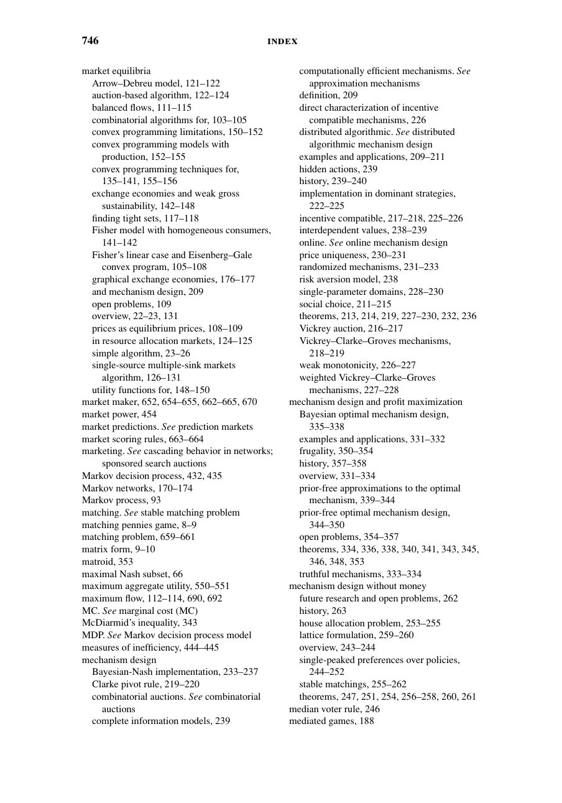

[Открыть страницу отдельно](../images/pages/p0767.jpg) · [Открыть страницу в PDF](../../materials/sources/Nisan-et-al-AGT-book.pdf#page=767)

Поисковый текст страницы (формулы сверяйте с изображением)

~~~~text
746
index
market equilibria
Arrow–Debreu model, 121–122
auction-based algorithm, 122–124
balanced flows, 111–115
combinatorial algorithms for, 103–105
convex programming limitations, 150–152
convex programming models with
production, 152–155
convex programming techniques for,
135–141, 155–156
exchange economies and weak gross
sustainability, 142–148
finding tight sets, 117–118
Fisher model with homogeneous consumers,
141–142
Fisher’s linear case and Eisenberg–Gale
convex program, 105–108
graphical exchange economies, 176–177
and mechanism design, 209
open problems, 109
overview, 22–23, 131
prices as equilibrium prices, 108–109
in resource allocation markets, 124–125
simple algorithm, 23–26
single-source multiple-sink markets
algorithm, 126–131
utility functions for, 148–150
market maker, 652, 654–655, 662–665, 670
market power, 454
market predictions. See prediction markets
market scoring rules, 663–664
marketing. See cascading behavior in networks;
sponsored search auctions
Markov decision process, 432, 435
Markov networks, 170–174
Markov process, 93
matching. See stable matching problem
matching pennies game, 8–9
matching problem, 659–661
matrix form, 9–10
matroid, 353
maximal Nash subset, 66
maximum aggregate utility, 550–551
maximum flow, 112–114, 690, 692
MC. See marginal cost (MC)
McDiarmid’s inequality, 343
MDP. See Markov decision process model
measures of inefficiency, 444–445
mechanism design
Bayesian-Nash implementation, 233–237
Clarke pivot rule, 219–220
combinatorial auctions. See combinatorial
auctions
complete information models, 239
computationally efficient mechanisms. See
approximation mechanisms
definition, 209
direct characterization of incentive
compatible mechanisms, 226
distributed algorithmic. See distributed
algorithmic mechanism design
examples and applications, 209–211
hidden actions, 239
history, 239–240
implementation in dominant strategies,
222–225
incentive compatible, 217–218, 225–226
interdependent values, 238–239
online. See online mechanism design
price uniqueness, 230–231
randomized mechanisms, 231–233
risk aversion model, 238
single-parameter domains, 228–230
social choice, 211–215
theorems, 213, 214, 219, 227–230, 232, 236
Vickrey auction, 216–217
Vickrey–Clarke–Groves mechanisms,
218–219
weak monotonicity, 226–227
weighted Vickrey–Clarke–Groves
mechanisms, 227–228
mechanism design and profit maximization
Bayesian optimal mechanism design,
335–338
examples and applications, 331–332
frugality, 350–354
history, 357–358
overview, 331–334
prior-free approximations to the optimal
mechanism, 339–344
prior-free optimal mechanism design,
344–350
open problems, 354–357
theorems, 334, 336, 338, 340, 341, 343, 345,
346, 348, 353
truthful mechanisms, 333–334
mechanism design without money
future research and open problems, 262
history, 263
house allocation problem, 253–255
lattice formulation, 259–260
overview, 243–244
single-peaked preferences over policies,
244–252
stable matchings, 255–262
theorems, 247, 251, 254, 256–258, 260, 261
median voter rule, 246
mediated games, 188
~~~~

### PDF стр. 768 · книжная стр. 747

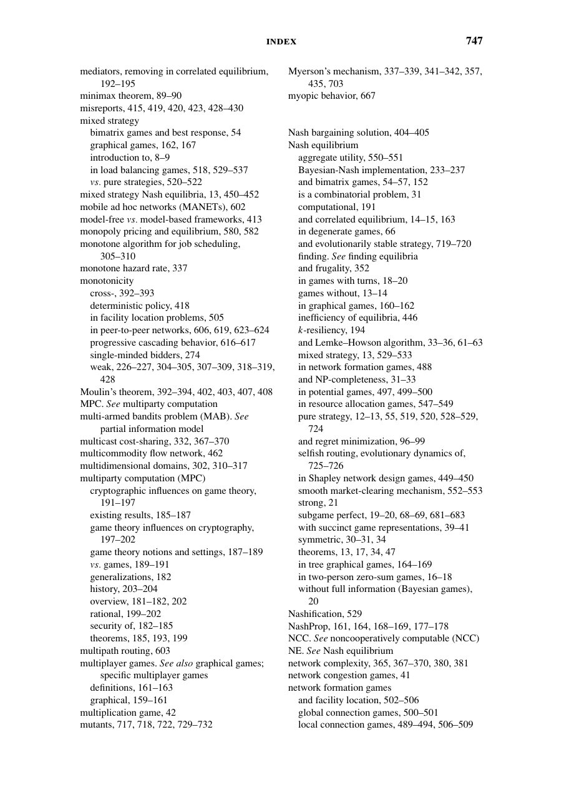

[Открыть страницу отдельно](../images/pages/p0768.jpg) · [Открыть страницу в PDF](../../materials/sources/Nisan-et-al-AGT-book.pdf#page=768)

Поисковый текст страницы (формулы сверяйте с изображением)

~~~~text
index
747
mediators, removing in correlated equilibrium,
192–195
minimax theorem, 89–90
misreports, 415, 419, 420, 423, 428–430
mixed strategy
bimatrix games and best response, 54
graphical games, 162, 167
introduction to, 8–9
in load balancing games, 518, 529–537
vs. pure strategies, 520–522
mixed strategy Nash equilibria, 13, 450–452
mobile ad hoc networks (MANETs), 602
model-free vs. model-based frameworks, 413
monopoly pricing and equilibrium, 580, 582
monotone algorithm for job scheduling,
305–310
monotone hazard rate, 337
monotonicity
cross-, 392–393
deterministic policy, 418
in facility location problems, 505
in peer-to-peer networks, 606, 619, 623–624
progressive cascading behavior, 616–617
single-minded bidders, 274
weak, 226–227, 304–305, 307–309, 318–319,
428
Moulin’s theorem, 392–394, 402, 403, 407, 408
MPC. See multiparty computation
multi-armed bandits problem (MAB). See
partial information model
multicast cost-sharing, 332, 367–370
multicommodity flow network, 462
multidimensional domains, 302, 310–317
multiparty computation (MPC)
cryptographic influences on game theory,
191–197
existing results, 185–187
game theory influences on cryptography,
197–202
game theory notions and settings, 187–189
vs. games, 189–191
generalizations, 182
history, 203–204
overview, 181–182, 202
rational, 199–202
security of, 182–185
theorems, 185, 193, 199
multipath routing, 603
multiplayer games. See also graphical games;
specific multiplayer games
definitions, 161–163
graphical, 159–161
multiplication game, 42
mutants, 717, 718, 722, 729–732
Myerson’s mechanism, 337–339, 341–342, 357,
435, 703
myopic behavior, 667
Nash bargaining solution, 404–405
Nash equilibrium
aggregate utility, 550–551
Bayesian-Nash implementation, 233–237
and bimatrix games, 54–57, 152
is a combinatorial problem, 31
computational, 191
and correlated equilibrium, 14–15, 163
in degenerate games, 66
and evolutionarily stable strategy, 719–720
finding. See finding equilibria
and frugality, 352
in games with turns, 18–20
games without, 13–14
in graphical games, 160–162
inefficiency of equilibria, 446
k-resiliency, 194
and Lemke–Howson algorithm, 33–36, 61–63
mixed strategy, 13, 529–533
in network formation games, 488
and NP-completeness, 31–33
in potential games, 497, 499–500
in resource allocation games, 547–549
pure strategy, 12–13, 55, 519, 520, 528–529,
724
and regret minimization, 96–99
selfish routing, evolutionary dynamics of,
725–726
in Shapley network design games, 449–450
smooth market-clearing mechanism, 552–553
strong, 21
subgame perfect, 19–20, 68–69, 681–683
with succinct game representations, 39–41
symmetric, 30–31, 34
theorems, 13, 17, 34, 47
in tree graphical games, 164–169
in two-person zero-sum games, 16–18
without full information (Bayesian games),
20
Nashification, 529
NashProp, 161, 164, 168–169, 177–178
NCC. See noncooperatively computable (NCC)
NE. See Nash equilibrium
network complexity, 365, 367–370, 380, 381
network congestion games, 41
network formation games
and facility location, 502–506
global connection games, 500–501
local connection games, 489–494, 506–509
~~~~

### PDF стр. 769 · книжная стр. 748

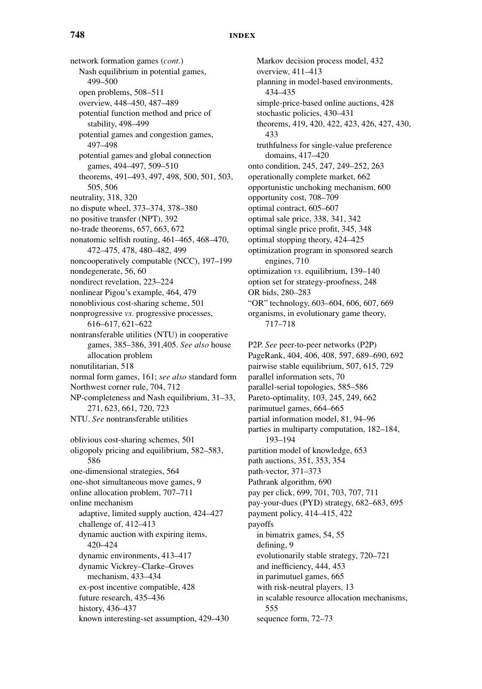

[Открыть страницу отдельно](../images/pages/p0769.jpg) · [Открыть страницу в PDF](../../materials/sources/Nisan-et-al-AGT-book.pdf#page=769)

Поисковый текст страницы (формулы сверяйте с изображением)

~~~~text
748
index
network formation games (cont.)
Nash equilibrium in potential games,
499–500
open problems, 508–511
overview, 448–450, 487–489
potential function method and price of
stability, 498–499
potential games and congestion games,
497–498
potential games and global connection
games, 494–497, 509–510
theorems, 491–493, 497, 498, 500, 501, 503,
505, 506
neutrality, 318, 320
no dispute wheel, 373–374, 378–380
no positive transfer (NPT), 392
no-trade theorems, 657, 663, 672
nonatomic selfish routing, 461–465, 468–470,
472–475, 478, 480–482, 499
noncooperatively computable (NCC), 197–199
nondegenerate, 56, 60
nondirect revelation, 223–224
nonlinear Pigou’s example, 464, 479
nonoblivious cost-sharing scheme, 501
nonprogressive vs. progressive processes,
616–617, 621–622
nontransferable utilities (NTU) in cooperative
games, 385–386, 391,405. See also house
allocation problem
nonutilitarian, 518
normal form games, 161; see also standard form
Northwest corner rule, 704, 712
NP-completeness and Nash equilibrium, 31–33,
271, 623, 661, 720, 723
NTU. See nontransferable utilities
oblivious cost-sharing schemes, 501
oligopoly pricing and equilibrium, 582–583,
586
one-dimensional strategies, 564
one-shot simultaneous move games, 9
online allocation problem, 707–711
online mechanism
adaptive, limited supply auction, 424–427
challenge of, 412–413
dynamic auction with expiring items,
420–424
dynamic environments, 413–417
dynamic Vickrey–Clarke–Groves
mechanism, 433–434
ex-post incentive compatible, 428
future research, 435–436
history, 436–437
known interesting-set assumption, 429–430
Markov decision process model, 432
overview, 411–413
planning in model-based environments,
434–435
simple-price-based online auctions, 428
stochastic policies, 430–431
theorems, 419, 420, 422, 423, 426, 427, 430,
433
truthfulness for single-value preference
domains, 417–420
onto condition, 245, 247, 249–252, 263
operationally complete market, 662
opportunistic unchoking mechanism, 600
opportunity cost, 708–709
optimal contract, 605–607
optimal sale price, 338, 341, 342
optimal single price profit, 345, 348
optimal stopping theory, 424–425
optimization program in sponsored search
engines, 710
optimization vs. equilibrium, 139–140
option set for strategy-proofness, 248
OR bids, 280–283
“OR” technology, 603–604, 606, 607, 669
organisms, in evolutionary game theory,
717–718
P2P. See peer-to-peer networks (P2P)
PageRank, 404, 406, 408, 597, 689–690, 692
pairwise stable equilibrium, 507, 615, 729
parallel information sets, 70
parallel-serial topologies, 585–586
Pareto-optimality, 103, 245, 249, 662
parimutuel games, 664–665
partial information model, 81, 94–96
parties in multiparty computation, 182–184,
193–194
partition model of knowledge, 653
path auctions, 351, 353, 354
path-vector, 371–373
Pathrank algorithm, 690
pay per click, 699, 701, 703, 707, 711
pay-your-dues (PYD) strategy, 682–683, 695
payment policy, 414–415, 422
payoffs
in bimatrix games, 54, 55
defining, 9
evolutionarily stable strategy, 720–721
and inefficiency, 444, 453
in parimutuel games, 665
with risk-neutral players, 13
in scalable resource allocation mechanisms,
555
sequence form, 72–73
~~~~

### PDF стр. 770 · книжная стр. 749

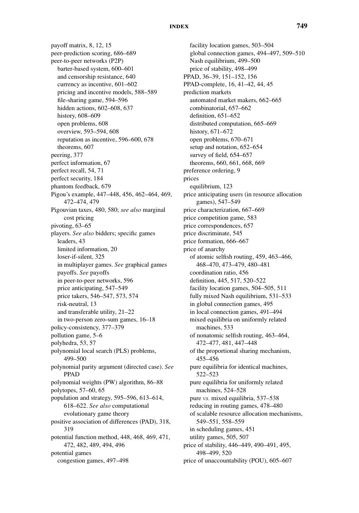

[Открыть страницу отдельно](../images/pages/p0770.jpg) · [Открыть страницу в PDF](../../materials/sources/Nisan-et-al-AGT-book.pdf#page=770)

Поисковый текст страницы (формулы сверяйте с изображением)

~~~~text
index
749
payoff matrix, 8, 12, 15
peer-prediction scoring, 686–689
peer-to-peer networks (P2P)
barter-based system, 600–601
and censorship resistance, 640
currency as incentive, 601–602
pricing and incentive models, 588–589
file-sharing game, 594–596
hidden actions, 602–608, 637
history, 608–609
open problems, 608
overview, 593–594, 608
reputation as incentive, 596–600, 678
theorems, 607
peering, 377
perfect information, 67
perfect recall, 54, 71
perfect security, 184
phantom feedback, 679
Pigou’s example, 447–448, 456, 462–464, 469,
472–474, 479
Pigouvian taxes, 480, 580; see also marginal
cost pricing
pivoting, 63–65
players. See also bidders; specific games
leaders, 43
limited information, 20
loser-if-silent, 325
in multiplayer games. See graphical games
payoffs. See payoffs
in peer-to-peer networks, 596
price anticipating, 547–549
price takers, 546–547, 573, 574
risk-neutral, 13
and transferable utility, 21–22
in two-person zero-sum games, 16–18
policy-consistency, 377–379
pollution game, 5–6
polyhedra, 53, 57
polynomial local search (PLS) problems,
499–500
polynomial parity argument (directed case). See
PPAD
polynomial weights (PW) algorithm, 86–88
polytopes, 57–60, 65
population and strategy, 595–596, 613–614,
618–622. See also computational
evolutionary game theory
positive association of differences (PAD), 318,
319
potential function method, 448, 468, 469, 471,
472, 482, 489, 494, 496
potential games
congestion games, 497–498
facility location games, 503–504
global connection games, 494–497, 509–510
Nash equilibrium, 499–500
price of stability, 498–499
PPAD, 36–39, 151–152, 156
PPAD-complete, 16, 41–42, 44, 45
prediction markets
automated market makers, 662–665
combinatorial, 657–662
definition, 651–652
distributed computation, 665–669
history, 671–672
open problems, 670–671
setup and notation, 652–654
survey of field, 654–657
theorems, 660, 661, 668, 669
preference ordering, 9
prices
equilibrium, 123
price anticipating users (in resource allocation
games), 547–549
price characterization, 667–669
price competition game, 583
price correspondences, 657
price discriminate, 545
price formation, 666–667
price of anarchy
of atomic selfish routing, 459, 463–466,
468–470, 473–479, 480–481
coordination ratio, 456
definition, 445, 517, 520–522
facility location games, 504–505, 511
fully mixed Nash equilibrium, 531–533
in global connection games, 495
in local connection games, 491–494
mixed equilibria on uniformly related
machines, 533
of nonatomic selfish routing, 463–464,
472–477, 481, 447–448
of the proportional sharing mechanism,
455–456
pure equilibria for identical machines,
522–523
pure equilibria for uniformly related
machines, 524–528
pure vs. mixed equilibria, 537–538
reducing in routing games, 478–480
of scalable resource allocation mechanisms,
549–551, 558–559
in scheduling games, 451
utility games, 505, 507
price of stability, 446–449, 490–491, 495,
498–499, 520
price of unaccountability (POU), 605–607
~~~~

### PDF стр. 771 · книжная стр. 750

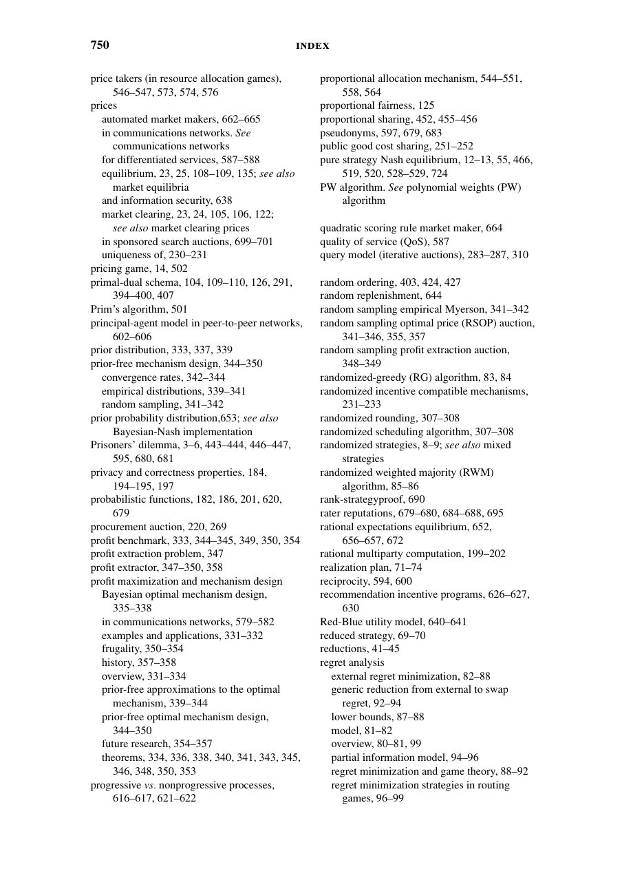

[Открыть страницу отдельно](../images/pages/p0771.jpg) · [Открыть страницу в PDF](../../materials/sources/Nisan-et-al-AGT-book.pdf#page=771)

Поисковый текст страницы (формулы сверяйте с изображением)

~~~~text
750
index
price takers (in resource allocation games),
546–547, 573, 574, 576
prices
automated market makers, 662–665
in communications networks. See
communications networks
for differentiated services, 587–588
equilibrium, 23, 25, 108–109, 135; see also
market equilibria
and information security, 638
market clearing, 23, 24, 105, 106, 122;
see also market clearing prices
in sponsored search auctions, 699–701
uniqueness of, 230–231
pricing game, 14, 502
primal-dual schema, 104, 109–110, 126, 291,
394–400, 407
Prim’s algorithm, 501
principal-agent model in peer-to-peer networks,
602–606
prior distribution, 333, 337, 339
prior-free mechanism design, 344–350
convergence rates, 342–344
empirical distributions, 339–341
random sampling, 341–342
prior probability distribution,653; see also
Bayesian-Nash implementation
Prisoners’ dilemma, 3–6, 443–444, 446–447,
595, 680, 681
privacy and correctness properties, 184,
194–195, 197
probabilistic functions, 182, 186, 201, 620,
679
procurement auction, 220, 269
profit benchmark, 333, 344–345, 349, 350, 354
profit extraction problem, 347
profit extractor, 347–350, 358
profit maximization and mechanism design
Bayesian optimal mechanism design,
335–338
in communications networks, 579–582
examples and applications, 331–332
frugality, 350–354
history, 357–358
overview, 331–334
prior-free approximations to the optimal
mechanism, 339–344
prior-free optimal mechanism design,
344–350
future research, 354–357
theorems, 334, 336, 338, 340, 341, 343, 345,
346, 348, 350, 353
progressive vs. nonprogressive processes,
616–617, 621–622
proportional allocation mechanism, 544–551,
558, 564
proportional fairness, 125
proportional sharing, 452, 455–456
pseudonyms, 597, 679, 683
public good cost sharing, 251–252
pure strategy Nash equilibrium, 12–13, 55, 466,
519, 520, 528–529, 724
PW algorithm. See polynomial weights (PW)
algorithm
quadratic scoring rule market maker, 664
quality of service (QoS), 587
query model (iterative auctions), 283–287, 310
random ordering, 403, 424, 427
random replenishment, 644
random sampling empirical Myerson, 341–342
random sampling optimal price (RSOP) auction,
341–346, 355, 357
random sampling profit extraction auction,
348–349
randomized-greedy (RG) algorithm, 83, 84
randomized incentive compatible mechanisms,
231–233
randomized rounding, 307–308
randomized scheduling algorithm, 307–308
randomized strategies, 8–9; see also mixed
strategies
randomized weighted majority (RWM)
algorithm, 85–86
rank-strategyproof, 690
rater reputations, 679–680, 684–688, 695
rational expectations equilibrium, 652,
656–657, 672
rational multiparty computation, 199–202
realization plan, 71–74
reciprocity, 594, 600
recommendation incentive programs, 626–627,
630
Red-Blue utility model, 640–641
reduced strategy, 69–70
reductions, 41–45
regret analysis
external regret minimization, 82–88
generic reduction from external to swap
regret, 92–94
lower bounds, 87–88
model, 81–82
overview, 80–81, 99
partial information model, 94–96
regret minimization and game theory, 88–92
regret minimization strategies in routing
games, 96–99
~~~~

### PDF стр. 772 · книжная стр. 751

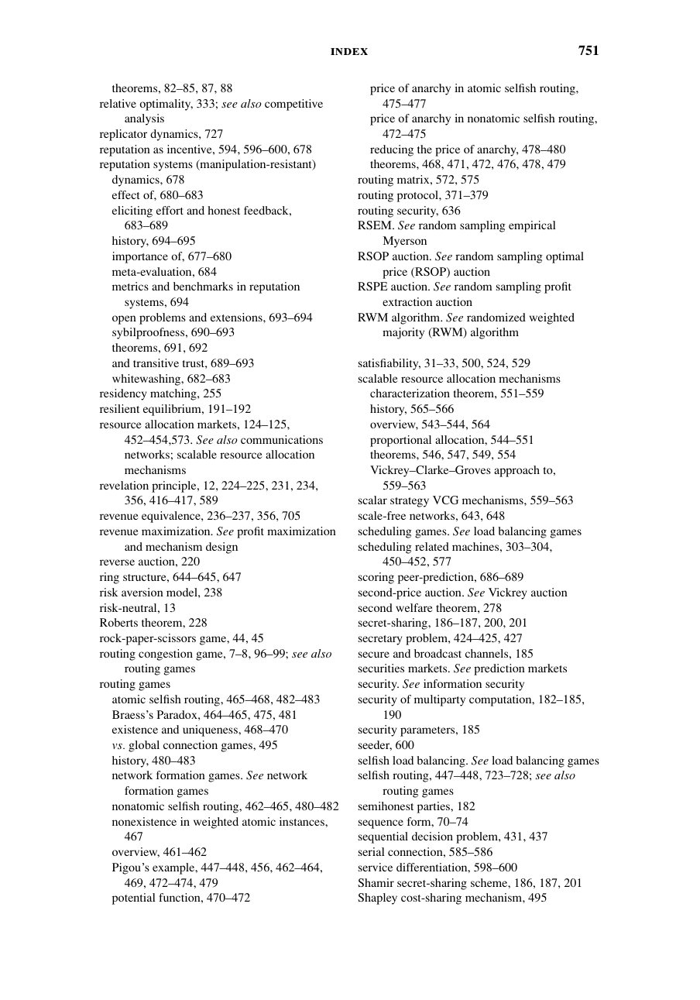

[Открыть страницу отдельно](../images/pages/p0772.jpg) · [Открыть страницу в PDF](../../materials/sources/Nisan-et-al-AGT-book.pdf#page=772)

Поисковый текст страницы (формулы сверяйте с изображением)

~~~~text
index
751
theorems, 82–85, 87, 88
relative optimality, 333; see also competitive
analysis
replicator dynamics, 727
reputation as incentive, 594, 596–600, 678
reputation systems (manipulation-resistant)
dynamics, 678
effect of, 680–683
eliciting effort and honest feedback,
683–689
history, 694–695
importance of, 677–680
meta-evaluation, 684
metrics and benchmarks in reputation
systems, 694
open problems and extensions, 693–694
sybilproofness, 690–693
theorems, 691, 692
and transitive trust, 689–693
whitewashing, 682–683
residency matching, 255
resilient equilibrium, 191–192
resource allocation markets, 124–125,
452–454,573. See also communications
networks; scalable resource allocation
mechanisms
revelation principle, 12, 224–225, 231, 234,
356, 416–417, 589
revenue equivalence, 236–237, 356, 705
revenue maximization. See profit maximization
and mechanism design
reverse auction, 220
ring structure, 644–645, 647
risk aversion model, 238
risk-neutral, 13
Roberts theorem, 228
rock-paper-scissors game, 44, 45
routing congestion game, 7–8, 96–99; see also
routing games
routing games
atomic selfish routing, 465–468, 482–483
Braess’s Paradox, 464–465, 475, 481
existence and uniqueness, 468–470
vs. global connection games, 495
history, 480–483
network formation games. See network
formation games
nonatomic selfish routing, 462–465, 480–482
nonexistence in weighted atomic instances,
467
overview, 461–462
Pigou’s example, 447–448, 456, 462–464,
469, 472–474, 479
potential function, 470–472
price of anarchy in atomic selfish routing,
475–477
price of anarchy in nonatomic selfish routing,
472–475
reducing the price of anarchy, 478–480
theorems, 468, 471, 472, 476, 478, 479
routing matrix, 572, 575
routing protocol, 371–379
routing security, 636
RSEM. See random sampling empirical
Myerson
RSOP auction. See random sampling optimal
price (RSOP) auction
RSPE auction. See random sampling profit
extraction auction
RWM algorithm. See randomized weighted
majority (RWM) algorithm
satisfiability, 31–33, 500, 524, 529
scalable resource allocation mechanisms
characterization theorem, 551–559
history, 565–566
overview, 543–544, 564
proportional allocation, 544–551
theorems, 546, 547, 549, 554
Vickrey–Clarke–Groves approach to,
559–563
scalar strategy VCG mechanisms, 559–563
scale-free networks, 643, 648
scheduling games. See load balancing games
scheduling related machines, 303–304,
450–452, 577
scoring peer-prediction, 686–689
second-price auction. See Vickrey auction
second welfare theorem, 278
secret-sharing, 186–187, 200, 201
secretary problem, 424–425, 427
secure and broadcast channels, 185
securities markets. See prediction markets
security. See information security
security of multiparty computation, 182–185,
190
security parameters, 185
seeder, 600
selfish load balancing. See load balancing games
selfish routing, 447–448, 723–728; see also
routing games
semihonest parties, 182
sequence form, 70–74
sequential decision problem, 431, 437
serial connection, 585–586
service differentiation, 598–600
Shamir secret-sharing scheme, 186, 187, 201
Shapley cost-sharing mechanism, 495
~~~~

### PDF стр. 773 · книжная стр. 752

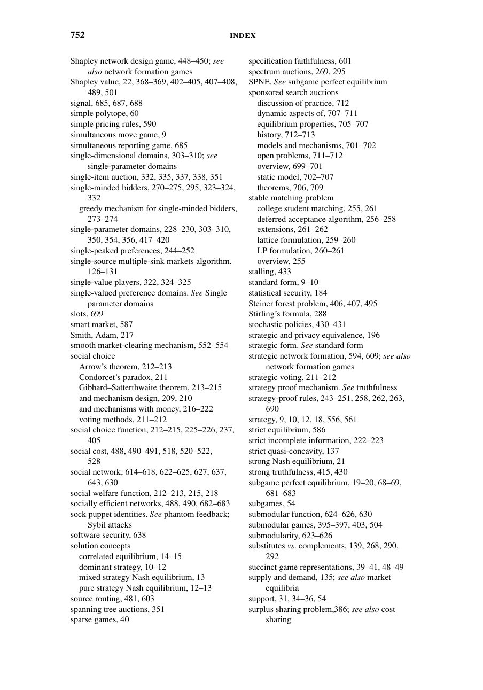

[Открыть страницу отдельно](../images/pages/p0773.jpg) · [Открыть страницу в PDF](../../materials/sources/Nisan-et-al-AGT-book.pdf#page=773)

Поисковый текст страницы (формулы сверяйте с изображением)

~~~~text
752
index
Shapley network design game, 448–450; see
also network formation games
Shapley value, 22, 368–369, 402–405, 407–408,
489, 501
signal, 685, 687, 688
simple polytope, 60
simple pricing rules, 590
simultaneous move game, 9
simultaneous reporting game, 685
single-dimensional domains, 303–310; see
single-parameter domains
single-item auction, 332, 335, 337, 338, 351
single-minded bidders, 270–275, 295, 323–324,
332
greedy mechanism for single-minded bidders,
273–274
single-parameter domains, 228–230, 303–310,
350, 354, 356, 417–420
single-peaked preferences, 244–252
single-source multiple-sink markets algorithm,
126–131
single-value players, 322, 324–325
single-valued preference domains. See Single
parameter domains
slots, 699
smart market, 587
Smith, Adam, 217
smooth market-clearing mechanism, 552–554
social choice
Arrow’s theorem, 212–213
Condorcet’s paradox, 211
Gibbard–Satterthwaite theorem, 213–215
and mechanism design, 209, 210
and mechanisms with money, 216–222
voting methods, 211–212
social choice function, 212–215, 225–226, 237,
405
social cost, 488, 490–491, 518, 520–522,
528
social network, 614–618, 622–625, 627, 637,
643, 630
social welfare function, 212–213, 215, 218
socially efficient networks, 488, 490, 682–683
sock puppet identities. See phantom feedback;
Sybil attacks
software security, 638
solution concepts
correlated equilibrium, 14–15
dominant strategy, 10–12
mixed strategy Nash equilibrium, 13
pure strategy Nash equilibrium, 12–13
source routing, 481, 603
spanning tree auctions, 351
sparse games, 40
specification faithfulness, 601
spectrum auctions, 269, 295
SPNE. See subgame perfect equilibrium
sponsored search auctions
discussion of practice, 712
dynamic aspects of, 707–711
equilibrium properties, 705–707
history, 712–713
models and mechanisms, 701–702
open problems, 711–712
overview, 699–701
static model, 702–707
theorems, 706, 709
stable matching problem
college student matching, 255, 261
deferred acceptance algorithm, 256–258
extensions, 261–262
lattice formulation, 259–260
LP formulation, 260–261
overview, 255
stalling, 433
standard form, 9–10
statistical security, 184
Steiner forest problem, 406, 407, 495
Stirling’s formula, 288
stochastic policies, 430–431
strategic and privacy equivalence, 196
strategic form. See standard form
strategic network formation, 594, 609; see also
network formation games
strategic voting, 211–212
strategy proof mechanism. See truthfulness
strategy-proof rules, 243–251, 258, 262, 263,
690
strategy, 9, 10, 12, 18, 556, 561
strict equilibrium, 586
strict incomplete information, 222–223
strict quasi-concavity, 137
strong Nash equilibrium, 21
strong truthfulness, 415, 430
subgame perfect equilibrium, 19–20, 68–69,
681–683
subgames, 54
submodular function, 624–626, 630
submodular games, 395–397, 403, 504
submodularity, 623–626
substitutes vs. complements, 139, 268, 290,
292
succinct game representations, 39–41, 48–49
supply and demand, 135; see also market
equilibria
support, 31, 34–36, 54
surplus sharing problem,386; see also cost
sharing
~~~~

### PDF стр. 774 · книжная стр. 753

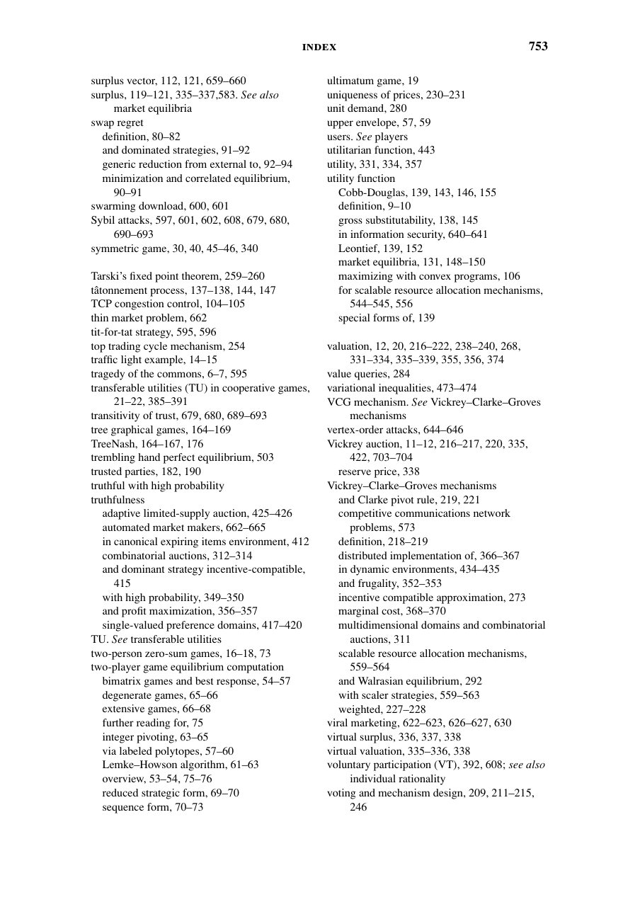

[Открыть страницу отдельно](../images/pages/p0774.jpg) · [Открыть страницу в PDF](../../materials/sources/Nisan-et-al-AGT-book.pdf#page=774)

Поисковый текст страницы (формулы сверяйте с изображением)

~~~~text
index
753
surplus vector, 112, 121, 659–660
surplus, 119–121, 335–337,583. See also
market equilibria
swap regret
definition, 80–82
and dominated strategies, 91–92
generic reduction from external to, 92–94
minimization and correlated equilibrium,
90–91
swarming download, 600, 601
Sybil attacks, 597, 601, 602, 608, 679, 680,
690–693
symmetric game, 30, 40, 45–46, 340
Tarski’s fixed point theorem, 259–260
tˆatonnement process, 137–138, 144, 147
TCP congestion control, 104–105
thin market problem, 662
tit-for-tat strategy, 595, 596
top trading cycle mechanism, 254
traffic light example, 14–15
tragedy of the commons, 6–7, 595
transferable utilities (TU) in cooperative games,
21–22, 385–391
transitivity of trust, 679, 680, 689–693
tree graphical games, 164–169
TreeNash, 164–167, 176
trembling hand perfect equilibrium, 503
trusted parties, 182, 190
truthful with high probability
truthfulness
adaptive limited-supply auction, 425–426
automated market makers, 662–665
in canonical expiring items environment, 412
combinatorial auctions, 312–314
and dominant strategy incentive-compatible,
415
with high probability, 349–350
and profit maximization, 356–357
single-valued preference domains, 417–420
TU. See transferable utilities
two-person zero-sum games, 16–18, 73
two-player game equilibrium computation
bimatrix games and best response, 54–57
degenerate games, 65–66
extensive games, 66–68
further reading for, 75
integer pivoting, 63–65
via labeled polytopes, 57–60
Lemke–Howson algorithm, 61–63
overview, 53–54, 75–76
reduced strategic form, 69–70
sequence form, 70–73
ultimatum game, 19
uniqueness of prices, 230–231
unit demand, 280
upper envelope, 57, 59
users. See players
utilitarian function, 443
utility, 331, 334, 357
utility function
Cobb-Douglas, 139, 143, 146, 155
definition, 9–10
gross substitutability, 138, 145
in information security, 640–641
Leontief, 139, 152
market equilibria, 131, 148–150
maximizing with convex programs, 106
for scalable resource allocation mechanisms,
544–545, 556
special forms of, 139
valuation, 12, 20, 216–222, 238–240, 268,
331–334, 335–339, 355, 356, 374
value queries, 284
variational inequalities, 473–474
VCG mechanism. See Vickrey–Clarke–Groves
mechanisms
vertex-order attacks, 644–646
Vickrey auction, 11–12, 216–217, 220, 335,
422, 703–704
reserve price, 338
Vickrey–Clarke–Groves mechanisms
and Clarke pivot rule, 219, 221
competitive communications network
problems, 573
definition, 218–219
distributed implementation of, 366–367
in dynamic environments, 434–435
and frugality, 352–353
incentive compatible approximation, 273
marginal cost, 368–370
multidimensional domains and combinatorial
auctions, 311
scalable resource allocation mechanisms,
559–564
and Walrasian equilibrium, 292
with scaler strategies, 559–563
weighted, 227–228
viral marketing, 622–623, 626–627, 630
virtual surplus, 336, 337, 338
virtual valuation, 335–336, 338
voluntary participation (VT), 392, 608; see also
individual rationality
voting and mechanism design, 209, 211–215,
246
~~~~

### PDF стр. 775 · книжная стр. 754

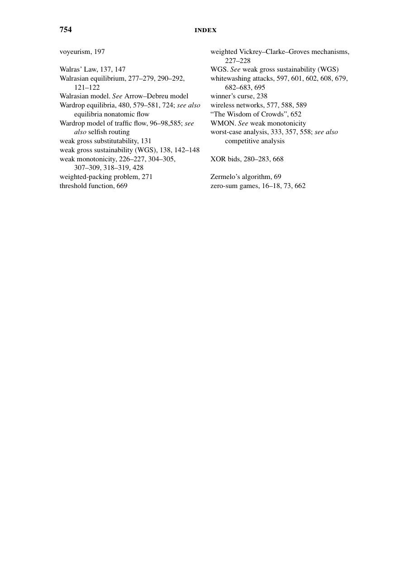

[Открыть страницу отдельно](../images/pages/p0775.jpg) · [Открыть страницу в PDF](../../materials/sources/Nisan-et-al-AGT-book.pdf#page=775)

Поисковый текст страницы (формулы сверяйте с изображением)

~~~~text
754
index
voyeurism, 197
Walras’ Law, 137, 147
Walrasian equilibrium, 277–279, 290–292,
121–122
Walrasian model. See Arrow–Debreu model
Wardrop equilibria, 480, 579–581, 724; see also
equilibria nonatomic flow
Wardrop model of traffic flow, 96–98,585; see
also selfish routing
weak gross substitutability, 131
weak gross sustainability (WGS), 138, 142–148
weak monotonicity, 226–227, 304–305,
307–309, 318–319, 428
weighted-packing problem, 271
threshold function, 669
weighted Vickrey–Clarke–Groves mechanisms,
227–228
WGS. See weak gross sustainability (WGS)
whitewashing attacks, 597, 601, 602, 608, 679,
682–683, 695
winner’s curse, 238
wireless networks, 577, 588, 589
“The Wisdom of Crowds”, 652
WMON. See weak monotonicity
worst-case analysis, 333, 357, 558; see also
competitive analysis
XOR bids, 280–283, 668
Zermelo’s algorithm, 69
zero-sum games, 16–18, 73, 662
~~~~

