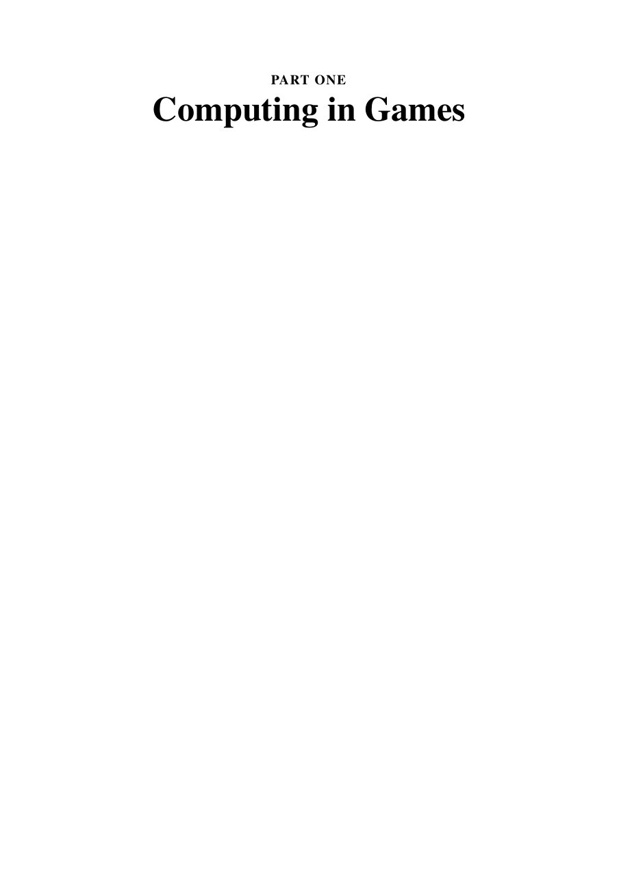

# Часть 1. Computing in Games

**PDF-страницы:** 22–23. Изображения передают исходную страницу; извлечённый текст ниже нужен для поиска.
[К содержанию](../README.md) · [К полному файлу](../00_full_book.md)

### PDF стр. 22 · книжная стр. 1

[Открыть страницу отдельно](../images/pages/p0022.jpg) · [Открыть страницу в PDF](../../materials/sources/Nisan-et-al-AGT-book.pdf#page=22)

Поисковый текст страницы (формулы сверяйте с изображением)

~~~~text
PART ONE
Computing in Games
~~~~

### PDF стр. 23 · книжная стр. 2

[Открыть страницу отдельно](../images/pages/p0023.jpg) · [Открыть страницу в PDF](../../materials/sources/Nisan-et-al-AGT-book.pdf#page=23)

Поисковый текст страницы (формулы сверяйте с изображением)

~~~~text
[На этой странице нет извлекаемого текстового слоя.]
~~~~

