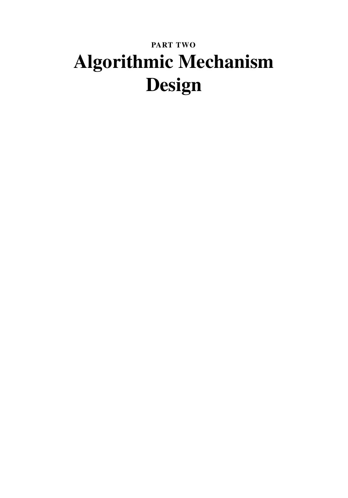

# Часть 2. Algorithmic Mechanism Design

**PDF-страницы:** 228–229. Изображения передают исходную страницу; извлечённый текст ниже нужен для поиска.
[К содержанию](../README.md) · [К полному файлу](../00_full_book.md)

### PDF стр. 228 · книжная стр. 207

[Открыть страницу отдельно](../images/pages/p0228.jpg) · [Открыть страницу в PDF](../../materials/sources/Nisan-et-al-AGT-book.pdf#page=228)

Поисковый текст страницы (формулы сверяйте с изображением)

~~~~text
PART TWO
Algorithmic Mechanism
Design
~~~~

### PDF стр. 229 · книжная стр. 208

[Открыть страницу отдельно](../images/pages/p0229.jpg) · [Открыть страницу в PDF](../../materials/sources/Nisan-et-al-AGT-book.pdf#page=229)

Поисковый текст страницы (формулы сверяйте с изображением)

~~~~text
[На этой странице нет извлекаемого текстового слоя.]
~~~~

