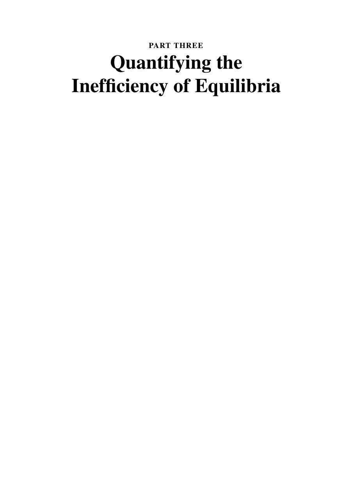

# Часть 3. Quantifying the Inefficiency of Equilibria

**PDF-страницы:** 462–463. Изображения передают исходную страницу; извлечённый текст ниже нужен для поиска.
[К содержанию](../README.md) · [К полному файлу](../00_full_book.md)

### PDF стр. 462 · книжная стр. 441

[Открыть страницу отдельно](../images/pages/p0462.jpg) · [Открыть страницу в PDF](../../materials/sources/Nisan-et-al-AGT-book.pdf#page=462)

Поисковый текст страницы (формулы сверяйте с изображением)

~~~~text
PART THREE
Quantifying the
Inefficiency of Equilibria
~~~~

### PDF стр. 463 · книжная стр. 442

[Открыть страницу отдельно](../images/pages/p0463.jpg) · [Открыть страницу в PDF](../../materials/sources/Nisan-et-al-AGT-book.pdf#page=463)

Поисковый текст страницы (формулы сверяйте с изображением)

~~~~text
[На этой странице нет извлекаемого текстового слоя.]
~~~~

